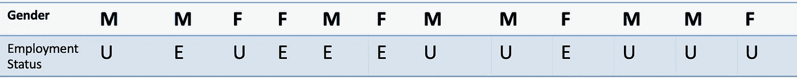
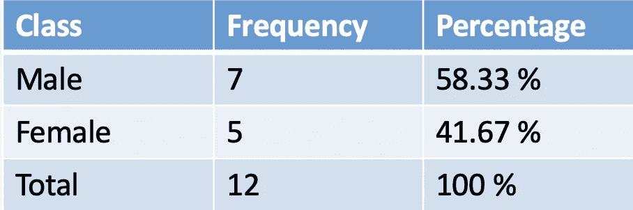
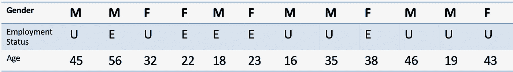
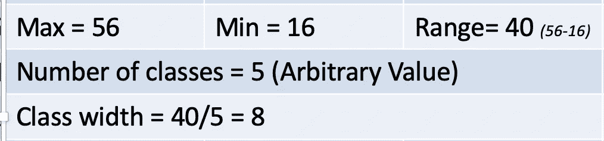
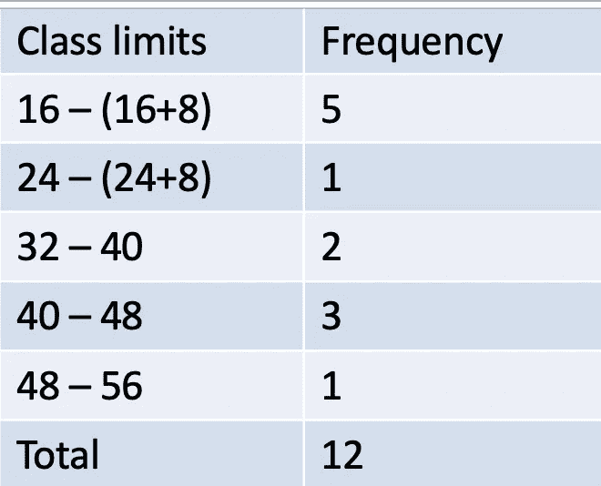
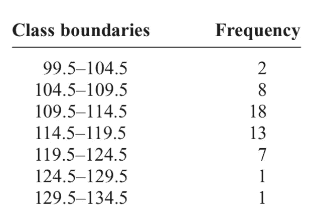
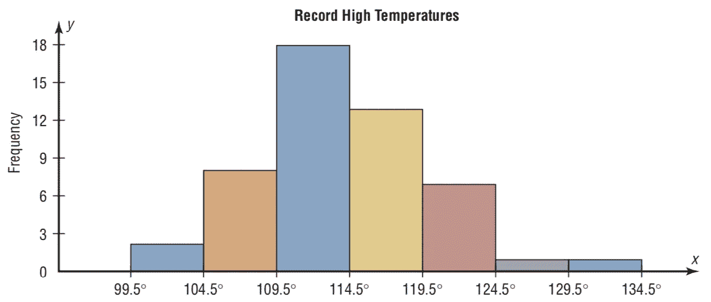
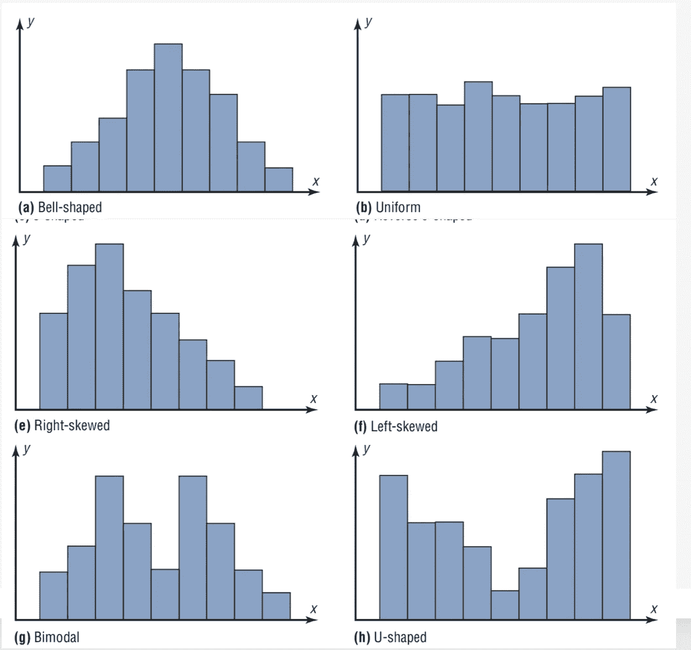

# 统计—深度探讨—第二部分

> 原文：<https://medium.com/analytics-vidhya/statistics-deep-dive-part2-bf8029b4bc6e?source=collection_archive---------22----------------------->

***在这一部分我们将把目光投向***
1。识别数据类型
2。分类和数字数据的频率分布
3。直方图
4。直方图的类型

> [链接到第 1 部分](/@pavan.ebbadi/statistics-deep-dive-part1-b2c537a16b34)
> [链接到第 3 部分](/@pavan.ebbadi/statistics-deep-dive-part3-8f16ddb56242)

将类型与数据相关联是一件小事，但却是统计学中一项非常重要的技能。
您可以盲目地假设任何数字属性是连续的，而文本数据是分类的，但是如果没有正确的数据知识，这有时会出错。
**例如:**竞赛中参赛者的奖金——不同年份的竞赛之间奖金的范围可能有所不同，但参赛者的排名(序数)是比将奖金作为连续变量更准确的衡量方式。

**频率分布**是使用类别和频率以表格形式组织原始数据。

1.  分类频率分布
2.  分组频率分布

**分类频率分布**用于可归入特定类别的数据，如名义或序数级数据。例如，政治归属、宗教归属或主要研究领域等数据将使用分类频率分布。
下面是对某大学 12 名学生的性别失业调查

男-男，女-女，失业，电子就业

百分比= f/N，其中 f 是频率，N 是总数据

**当我们有大范围的数值数据时，使用分组频率分布**。数据被分组为宽度超过 1 个单位的类。最小值和最大值充当边界。在上面的调查中，如果人们的年龄与就业状况一起被记录下来

让我们来计算最大、最小、范围——然后我们将决定我们想要把年龄分成多少个等级。

使用上面计算的类别宽度，从下限到上限创建 5 个类别，如下所示。

在我们进入直方图之前，我想强调几件事。
**类别界限**:这是为了让我们决定我们想要为上述每个类别界限包括什么样的界限，例如:16–32 类别界限实际上可用于记录在***15.5–32.5***
**开放式分布**之间的所有年龄:这在有异常值或您对特定范围的值感兴趣时使用。如果在上面的调查中有一个人的年龄是 100 岁，5 个班级的班级宽度将使分布看起来是偏斜的。那样的话最好最后一个班是***【48 及以上】*** 。

# **直方图**

**直方图**是一个图表，通过使用不同高度的连续垂直条(除非类的频率为 0)来表示类的频率，从而显示数据。

直方图表示 50 个州中每个州的最高记录温度数据(参见 Example 2–2)。

频率是根据等宽等级计算的

每个类别在 X 轴上以相同的宽度表示，频率在 Y 轴上捕捉。

# **直方图形状**

1.  **钟形**-有一个单峰，两端逐渐变细。
    例如:任何没有异常值的正态分布，其值趋向于特定汽车每加仑汽油行驶的平均英里数。
2.  **均匀** -基本上是平的或长方形的。
    例如:直方图中捕捉到的任何完美的线性趋势都会产生统一的直方图。
3.  **右偏** -当分布的峰值在左边，数据值向右逐渐变细时，称分布为*正偏或右偏。*
4.  **左偏** -当数据值向右聚集并向左逐渐变细时，分布被称为*负偏或左偏。*
5.  **双峰**——当一个分布有两个高度相同的峰时，称之为*双峰。*
6.  **U 形** -峰值出现在分布的最小值和最大值附近，较少出现在中值附近。

除了此处显示的形状之外，分布还可以有其他形状；但是，这些是您在分析数据时会遇到的一些更常见的问题。

> **参考:初等统计学—布鲁曼**