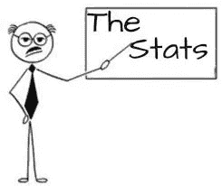
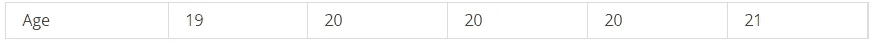

# 统计学-寻找平均值-何时均值和中位数

> 原文：<https://medium.com/analytics-vidhya/statistics-finding-an-average-when-to-mean-and-median-20a1382e8be9?source=collection_archive---------18----------------------->

**数据科学**是做出一些**假设**和做出**决策**的过程，对于做出这样的决策，**统计**起着至关重要的作用。

从**的统计数据中，**我们可以理解一些叫做**的意思，中位数**和**的模式，“我知道你在学生时代可能听过”..**因为我们在统计学中有很多概念，这些 **3M** 是深入研究的基本步骤。理解这些 **3M** 将有助于你更好地学习数据。

这些 **3M** 来自“**普通**家族”..而在统计中，选择任何一个平均值都是非常重要的。要找到一个平均值，将数据集按升序和降序排列，本文考虑按升序排列。让我们来举个例子，

**的意思是**

统计学中的常用词之一，用符号 **𝜇** 表示，用公式**(σx)/n .** 表示我们有一个数据如下:

**问题 1:**

**我今年 20 岁，我愿意参加任何有同龄学生的艺术班**..

班上的学生年龄越大

它是从数据集派生出来的

如果您在直方图中绘制数据，数据将如下所示。直方图将帮助您了解数据是如何分布的:

现在根据公式，**σx =(加所有年龄即 x) = > (19+20+20+20+21)，**然后除以 **n 即 5，**所以我们的 **𝜇是 20。所以这个班的平均年龄是 20 岁，如果你在 20 岁左右，你可以加入这个班。**

**“成功我们已经学会了均值**”
让我们看看均值 **𝜇** 是否能帮助我们在各种类型/情况的数据集里找到平均值？

**问题二** :
杰里米 40 岁，他想加入艺术班，想和同龄人打成一片。

艺术类数据集的平均值是 38，所以加入该类将是完美的。但是杰里米很不高兴，因为他最后和年轻的学生和年老的老师在一起。让我们看一次数据集。

这里出了什么问题，让我们用直方图绘制数据

你在这里发现的，
数据集有离群值，因为数据集同样包含大师的年龄，所以在这种情况下，均值不会帮助我们找到平均值。

我们的均值是 **38，**向右拉或者**向右斜**，有异常值的数据集称为**斜。** 如果异常值在左侧，那么**表示**将向左移动，即“**向左侧**倾斜”，如下所示

**为什么不是指**？如果**的意思是**是 **38** ，那么我们可以理解为数据集中的最高数据数是 38 左右，这是一个错误的结论。因此，在找到平均值之前，需要在直方图中绘制数据以找到形状。

那么卑鄙的是误导我们的数据，所以应该有人在那里帮我们找到平均值，英雄来了"**中位数**"

**中位数**

中位数是数据集的中间数，即如果数据有 **N 个**数，且 **N 个**为**奇数**，则**中位数**为 **(N+1)/2** 。
如果 **N** 是**偶数**，那么位置 **N/2** 和 **(N/2)+1** 的数据的平均值将是中间值。

(即) **M1 = N/2，M2 = (N/2)+1，**
那么 **M(中位数)**就会是 **M = (M1+M2)/2**

根据我们的数据

这里 N 是 14，是偶数。我们的平均值是 38，我们发现数据向右倾斜了。
所以会有两个中间位置，14/2 =7 和(14/2)/2 = 8。
第 7 和第 8 个数据的平均值，(20+20)/2 = 20。我们的中位数是 20。

如果 N 是奇数，去掉第 14 个数据，那么我们的中位数将是 20，应用公式 N/2 中的

如果数据向右倾斜，则平均值高于中位数。如果数据向左倾斜，则平均值低于中位数。

**成功了！我们已经了解了什么是中位数，以及何时可以使用中位数**”

现在又多了一个普通的查找器，叫做“**模式**”，但是在我们的数据科学中，你不会经常用到。所以如果有人感兴趣，请留下评论。我也会就此写一篇文章。

参考资料——第一本统计书籍——每位统计学家都必须阅读，每本花费 425.00 印度卢比

我的另一篇文章链接:

[**medium.com/@mohanraj.raja.ai**](mailto:medium.com/@mohanraj.raja.ai)**/https-medium-com-Mohan Raj-Raja-ai-intro-to-statistical-learning-ex1–15640235 bf8**