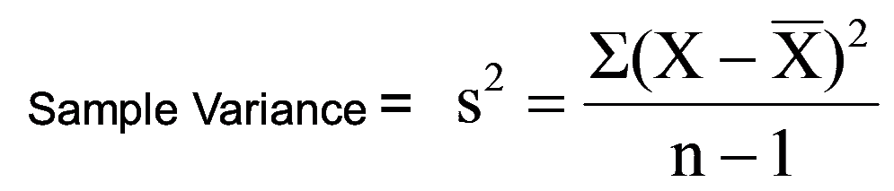
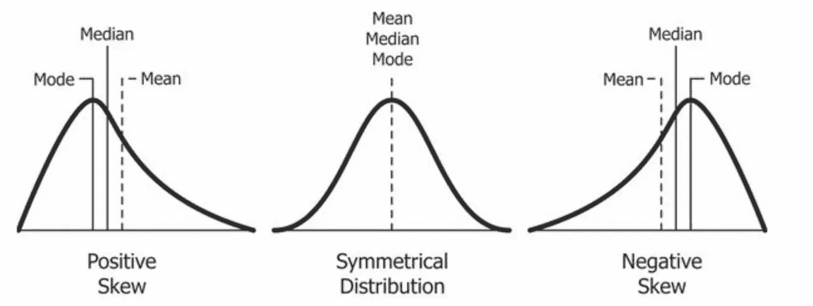

# 数据科学统计学

> 原文：<https://medium.com/analytics-vidhya/statistics-for-data-science-f6ca0e0ee30f?source=collection_archive---------12----------------------->

## 数据科学中所有重要的统计学概念

## 1.变量:它是存储值的占位符。

## 2.随机变量:它是变量的随机集合。

它有两种类型:

A.*数值变量*:数值可以是有限或无限区间内的任意值(如身高、体重、体温、血糖等)

数值变量进一步分为两部分:

A.1 .连续(浮点数) :连续变量是一个有小数值的变量。例如:5.6，7.8，0.001，846.245

A.2 .离散(整数) :离散数是基本计数数。例如:0，1，2，3，4，5，6

B.*分类变量*:分类变量是一个变量，它可以取一个有限的、通常是固定的可能值(如种族、性别、年龄组)

分类变量进一步分为两部分:

B.1 .标称:标称变量没有顺序。

B.2 .序数:序数变量是一个分类变量，其可能值是有序的(例如教育水平(“高中”、“学士”、“硕士”、“博士”))

# 随机变量结论:

随机变量

**3。集中趋势的测量:**

A.均值:它是一个数字集合的总和除以该集合中的数字个数

平均值=收集数量的总和/总收集量

B.中位数:一个排序数字列表的“中间”(当有两个中间数字时，我们对它们进行平均)。

C.众数:一组数据值的众数是最常出现的值。

**注意:均值、中值、众数有助于处理缺失值。**

**4。范围:**范围是最低值和最高值之差。例如:在{4，6，9，3，7}中，最小值是 3，最大值是 9。因此范围是 93 = 6。

意思是

中位数与众数和范围

**5。总体、样本、总体均值、样本均值:**

总体:总体是一组相似的项目或事件。

样本:从总体中收集的少量项目。

*我们用来执行 ML 模型的每个数据集都是一个数据样本。*

*人口与样本用例:选举的投票后调查。*

总体均值:总体均值是一个群体特征的平均值。

样本平均值:样本平均值是指样本数据的平均值。

人口与样本

总体平均值与样本平均值

**6。差异:**

方差:它是随机变量与其均值的方差的期望值。通俗地说，它衡量一组数字偏离平均值的程度。

**7。离差的标准偏差和度量:**

标准差(SD)是最常用的离差度量。它是关于平均值的数据分布的测量值。SD 是平均值的偏差平方和除以观察次数的平方根。

标准差是一组值的变化量或离差的度量。低标准偏差表示这些值倾向于接近集合的平均值，而高标准偏差表示这些值分布在更大的范围内。

标准偏差

**8。高斯/正态分布:**

正态分布，也称为高斯分布，是一种关于平均值对称的概率分布，表明接近平均值的数据比远离**平均值**的数据出现得更频繁。在图表形式中，正态分布将显示为钟形曲线。

*高斯分布到标准正态分布(均值=0，标准差= 1)[(x-均值)/标准差=(z-得分)]。*

高斯/正态分布

**9。标准正态分布:**

标准正态分布是均值为零、标准差为 1 的正态分布。

*经验公式:
68.2%位于第一标准差
95.4%位于第一标准差
99.7%位于第一标准差*

标准正态分布

**10。z 分数:**

z 得分的值告诉您距离平均值有多少标准差。如果 z 值等于 0，则表示该值在平均值上。正的 z 分数表示原始分数高于平均分数。例如，如果 z 得分等于+1，则它比平均值高 1 个标准差。

z 分数

**10。概率密度函数:**

概率密度函数或连续随机变量的密度是这样一种函数，其在样本空间中任何给定样本处的值可以被解释为提供随机变量的值等于该样本的相对可能性。

概率密度函数

**11。累积分布函数:**

实值随机变量的累积分布函数( **CDF** )是取值小于或等于的概率。

累积分布函数

12。假设检验:

统计学中的假设检验是一种对调查或实验的结果进行检验的方法，以确定是否有有意义的结果。你基本上是通过计算你的结果偶然发生的几率来测试你的结果是否有效。如果你的结果可能是偶然发生的，那么这个实验是不可重复的，因此用处不大。

假设检验

13。核密度估计(KDE) :

核密度估计(KDE)是一种估计随机变量概率密度函数的非参数方法。

核密度估计与直方图密切相关，但是可以通过使用合适的核来赋予诸如平滑度或连续性之类的属性。

核密度估计量

**14。中心极限定理:**

中心极限定理指出，如果你有一个均值为μ、标准差为σ的总体，并从替换总体中抽取足够大的随机样本，那么样本均值的分布将近似为正态分布。

中心极限定理告诉我们，无论总体的分布是什么样的，随着样本量(N)的增加，抽样分布的形状都将接近正态。

中心极限定理

**15。偏斜度:**

偏斜度是指一组数据中对称钟形曲线或正态分布的扭曲或不对称。如果曲线向左或向右移动，就称之为偏斜。偏斜度可以量化为给定分布偏离正态分布的程度。

歪斜

**16。协方差:**

协方差是两个随机变量的联合可变性的度量。如果一个变量的较大值主要对应于另一个变量的较大值，并且较小值也是如此，则协方差为正。

协方差只告诉量级。

协方差公式

正、负和零协方差

17。皮尔逊相关协方差:

皮尔逊相关系数(r)是两个变量之间关联强度的**量度。**

皮尔逊相关系数有助于特征选择。
皮尔逊相关系数位于 b/w -1 到 1 之间。

皮尔逊相关系数告诉大小和方向。

皮尔逊相关协方差

皮尔逊相关系数公式

**18。斯皮尔曼等级相关性:**

它评估两个变量之间的关系在多大程度上可以使用单调函数(有序集合之间的函数，保持或颠倒给定的顺序)来描述。).

Spearman 的等级相关系数甚至可以告诉非线性数据和异常值的大小和方向。

*斯皮尔曼秩相关公式*

SPEARMAN 秩相关公式

*没有异常值时结果相同*

没有异常值时，结果相同

*SPEARMAN 在异常值中给出更好的结果*

SPEARMAN 在异常值中给出更好的结果

*正斯皮尔曼相关*

正 SPEARMAN 相关

*负斯皮尔曼关联*

负 SPEARMAN 相关

19。Q-Q 图:

Q–Q(分位数-分位数)**图**是一个概率图，是一种通过绘制两个概率分布的分位数来比较它们的图形方法。

Q–Q 图用于比较分布的形状，提供了两种分布中位置、比例和偏斜度等属性相似或不同的图形视图。

**20。切比雪夫不等式:**

切比雪夫不等式保证，对于一大类概率分布，不超过某个分数的值可以超过平均值的某个距离。

具体来说，不超过 1/ *k* 2 的分布值可以偏离平均值超过 *k* 个标准偏差(或者等价地，至少 1 1/*k*2 的分布值在平均值的 *k* 个标准偏差内)

切比雪夫不等式公式

**21。二项分布:**

二项式分布可以简单地认为是重复多次的实验或调查中成功或失败结果的概率。二项式是一种有两种可能结果的分布类型(前缀“bi”表示两个或两次)。例如，掷硬币只有两种可能的结果:正面或反面，而参加测试可能有两种可能的结果:通过或失败。

*二项式分布还必须满足以下三个标准:*

A.观察或试验的次数是固定的。

B.每个观察或试验都是独立的。

C.从一次试验到另一次试验，成功的概率是完全一样的。

**现实生活中的例子:**

如果推出一种新药来治病，要么治好了病(成功了)，要么没治好病(失败了)。如果你买彩票，你要么会赢，要么不会。基本上，你能想到的任何只能是成功或失败的事情，都可以用二项分布来表示。

二项式分布公式

n 代表实验运行的次数，p 代表一个特定结果的概率。

**22。伯努利分布:**

伯努利分布是伯努利试验的离散概率分布，伯努利试验是只有两种结果(通常称为“成功”或“失败”)的随机实验。例如，抛硬币时获得正面(成功)的概率是 0.5。“失败”的概率是 1 — P (1 减去成功的概率，掷硬币也等于 0.5)。这是 n = 1 的二项式分布的特殊情况。换句话说，它是一个二项分布，只有一次尝试(例如，一次抛硬币)。

23。对数正态分布:

对数正态分布是对数呈正态分布的随机变量的连续概率分布。因此，如果随机变量 X 是对数正态分布，那么 Y = ln(X)具有正态分布。

对数正态分布

对数正态在分析股票价格时非常有用。只要假设所用的生长因子是正态分布的。

因此，对数正态分布曲线可以用来帮助更好地确定股票在一段时间内预期实现的复合回报。请注意，由于随机变量的低均值和高方差，对数正态分布是正偏的，具有长右尾。

**24。幂定律:**

幂定律(也称为比例定律)指出，一个量的相对变化会导致另一个量成比例的相对变化。法律在起作用的最简单的例子是正方形；如果你把一条边的长度增加一倍(比如说，从 2 英寸增加到 4 英寸)，那么面积就会增加四倍(从 4 平方英寸增加到 16 平方英寸)。

幂定律

**25。BOX-COX 变换:**

Box Cox 变换是非正态因变量到正态形状的变换。正态性是许多统计技术的一个重要假设；如果您的数据不正常，应用 Box-Cox 意味着您能够运行更多的测试。

**26。泊松分布:**

**泊松分布是给定时间段内事件发生次数的离散概率分布，给定该时间段内事件发生的平均次数。**

例如:某快餐店平均每分钟有 3 名顾客来到免下车通道。然而，这只是一个平均值。实际金额可能会有所不同。

泊松分布

**27。非高斯分布:**

尽管正态分布在统计学中占据中心位置，但许多过程遵循非正态分布。这可能是由于数据自然遵循特定类型的非正态分布(例如，细菌生长自然遵循指数分布)。在其他情况下，您的数据收集方法或其他方法可能有问题。

## 非正态分布的类型

1.  [贝塔分布。](https://www.statisticshowto.com/beta-distribution/)
2.  [指数分布](https://www.statisticshowto.com/exponential-distribution/)。
3.  [伽玛分布](https://www.statisticshowto.com/gamma-distribution/)。
4.  [逆伽马分布](https://www.statisticshowto.com/inverse-gamma-distribution/)。
5.  [对数正态分布](https://www.statisticshowto.com/lognormal-distribution/)。
6.  [物流配送。](https://www.statisticshowto.com/logistic-distribution/)
7.  [麦克斯韦-玻尔兹曼分布。](https://www.statisticshowto.com/maxwell-boltzmann-distribution/)
8.  [泊松分布](https://www.statisticshowto.com/poisson-distribution/)。
9.  [偏态分布。](https://www.statisticshowto.com/probability-and-statistics/skewed-distribution/)
10.  [对称分布。](https://www.statisticshowto.com/symmetric-distribution-2/)
11.  [均匀分布。](https://www.statisticshowto.com/uniform-distribution/)
12.  [单峰分布。](https://www.statisticshowto.com/unimodal-distribution-2/)
13.  [威布尔分布](https://www.statisticshowto.com/weibull-distribution/)。

非正态分布的原因:

1.  极端值
2.  在您的数据中可以组合多个分布。
3.  数据不足。
4.  数据可能被不适当地绘制成图表。

## 处理非正态分布

您有几个选项来处理您的非正常数据。包括单样本 Z 检验、T 检验和方差分析在内的许多检验都假设正态性。如果您的样本量足够大(通常超过 20 个项目)，您仍然可以运行这些测试。您还可以选择使用函数来转换数据，强制其符合正常模型。但是，如果您有一个非常小的样本，一个有偏差的样本或者一个自然地适合另一种分布类型的样本，您可能想要运行一个非参数测试。非参数检验不假设数据符合特定的分布类型。非参数检验包括 Wilcoxon 符号秩检验、Mann-Whitney U 检验和 Kruskal-Wallis 检验。

***参考文献:***

1.  谷歌搜索
2.  谷歌图片
3.  维基百科（开放式百科全书）
4.  一些统计网站