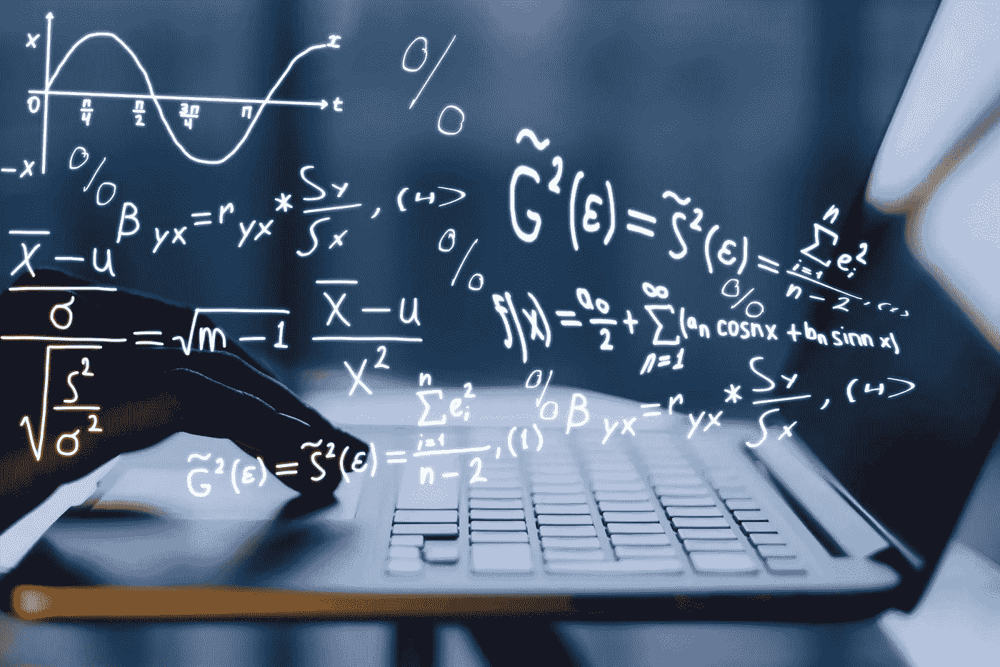

# 数据科学统计学第 1 部分:集中趋势在数据分析中的应用。

> 原文：<https://medium.com/analytics-vidhya/statistics-for-data-science-part-1-use-of-central-tendency-for-data-analysis-d37cff35c9ea?source=collection_archive---------3----------------------->

## 解释最常见的中心方法的工作原理，如均值、中值、众数，以及它如何帮助处理我们的数据。

正如我们所知，处理我们的数据有几个步骤，如数据提取，数据清理，处理丢失的数据…