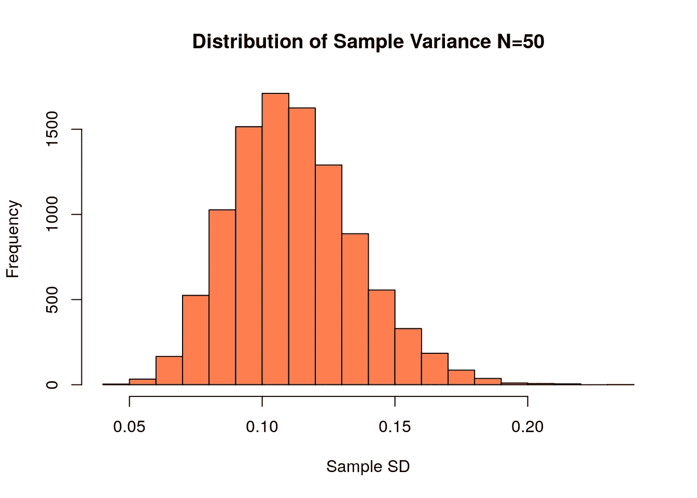
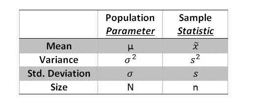

# 数据科学统计学第 2 部分:了解总体方差与样本方差

> 原文：<https://medium.com/analytics-vidhya/statistics-for-data-science-part-2-understanding-population-variance-vs-sample-variance-c20eb5470d6b?source=collection_archive---------11----------------------->

在本文中，您将了解总体方差和样本方差的用途，以及它们如何用于分析我们的数据集。

在理解了我上一篇文章中的 [**集中趋势**](/analytics-vidhya/statistics-for-data-science-part-1-use-of-central-tendency-for-data-analysis-d37cff35c9ea?source=friends_link&sk=4fff868170527d9b5c1a77da207dde74) 方法后，我发现了均值、中值和众数。让我们来理解另一个概念，以理解数据科学和机器学习背后的统计学。在本文中，我们将讨论总体方差、样本方差和标准差。

# **什么是总体和样本？**

组合在一个数据集中的所有值统称为总体，它可以解释为某个特定观测值中的所有值，不会遗漏任何值。另一方面，**样本**是总体的**部分，描述总体的特征(如均值或标准差)。样本的大小可以小于总体的 1%、10%或 60%，但绝不会是总体。**

# 什么是方差？

方差是一个数值，它显示了一组数据中的各个数字围绕平均值分布的范围，因此描述了数据集中每个值与平均值的差异。因此，如果数据集中的方差为零，我们可以说其中的所有值都是相同的。方差越大，说明分布偏离均值的程度越大，方差越小，说明分布偏离均值的程度越小，但方差不能为负。

# 什么是人口方差？

总体方差表示为σ平方(σ**2)。它有助于我们说明数据点在特定人群中是如何分布的。人口变量的公式如下所示，其中 N 是人口规模，x *i* 是数据点。μ是总体平均值。

对于相同的数据集，总体方差为零，如果向其添加常数值，总体方差将保持不变。

# 什么是样本方差？

样本方差的计算方式与总体方差相同，也用 s 平方(s**2)表示，不同之处在于，为了计算样本方差，我们仅使用总体数据集中的一些样本数据值。计算样本方差时，N 是样本点的数量(上式中 N 代表人口规模)。

# 什么是标准差？

标准差是一个非常重要的术语，在统计学和比较数据值与数据平均值方面有很大的用途。标准差可以描述为测量数据集相对于其平均值的离差的统计技术；它可以通过计算方差的平方根来计算。如果数据点与平均值相差很大，则称其偏差较大。

标准差非常重要，因为如果数据集是正态分布或高斯分布，它有助于我们测量数据点出现的概率。

