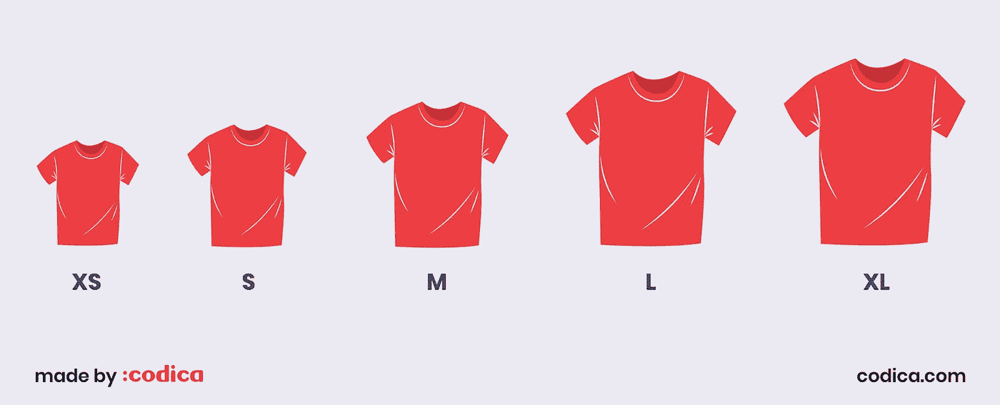
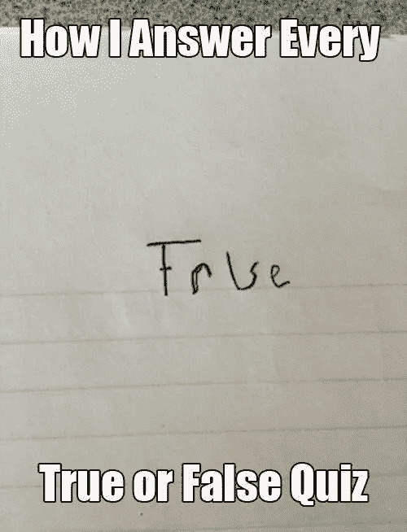
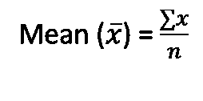
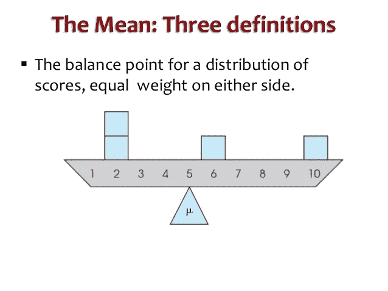
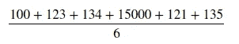
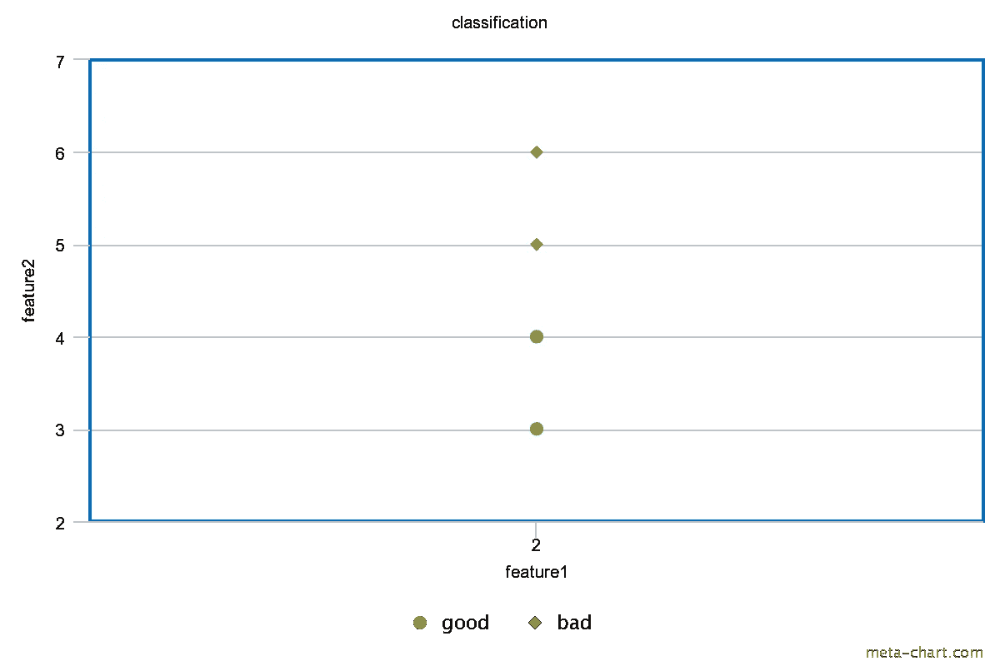
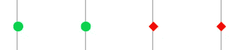
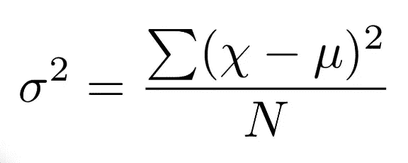
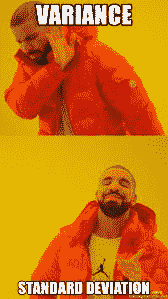
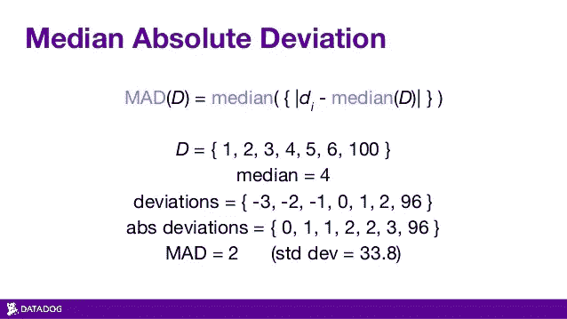

# 机器学习数据分析的统计学。

> 原文：<https://medium.com/analytics-vidhya/statistics-for-machine-learning-data-analysis-d01a17f850ce?source=collection_archive---------21----------------------->

摘自 [ISLR](http://faculty.marshall.usc.edu/gareth-james/ISL/Noah.jpg)

***我上次讲过均值、中位数、方差。当你教假设检验的时候叫醒我。***

统计学在机器学习的数据分析中非常重要。他们是了解我们数据的第一批联系人。我们可以提出从基本概念到高级概念的问题。

示例问题:

1.  一个机器学习问题的类分布是怎样的？
2.  一个特性或变量的最小值和最大值是多少？
3.  某个功能的有无可变性？
4.  这个特性对于预测机器学习模型的结果有用吗？
5.  某个特征是否存在异常点？
6.  亚马逊送货时间的第 90 百分位是多少？
7.  这两个变量是否相互独立？
8.  **以及基于问题陈述的更多问题。**

在本文中，我主要关注任何机器学习项目的初始步骤，它有许多名称，如数据分析或探索性数据分析等。我们对同一个过程有不同的名字，因为他们是来自纯统计背景的人，很少有人从事物理工作，很少有人来自电子背景。许多机器学习的美妙之处在于，许多核心思想来自不同的领域。例如，有一个称为 ROC 的指标，它是在第二次世界大战期间开发的，我们目前正在使用它来评估模型性能。

# 为什么要了解变量的数据类型？

如果你知道特征的数据类型，那么我们对特定特征的分析就变得容易了。例如，你知道一个变量是分类的，那么你的分析就变得非常简单，这意味着你有一个工具包来对它进行数据分析。简单地说，数据类型让我们知道要执行的数据分析的类型。

例如，如果一个特征是分类的，那么我们使用条形图来查看该特征的每个值的频率，并且可以看到该特征采用了哪些不同的值以及这些值的分布情况。

另一个例子是，如果特征是离散的，那么我们可以知道条形图没有用，因为离散特征可以取无限可能的值，在条形图中绘制所有这些值不会给我们提供任何见解。我们使用直方图或概率密度函数，而不是柱状图，从中我们可以获得关于该特征的更多信息。

我希望您现在已经了解了要素的数据类型，现在让我们看看数据分析中有哪些不同的数据类型。

# 数据类型:

***连续:***

这个特征可以取无限可能的值。连续特征变量的一个例子是人的身高(英寸)和物品的重量等等。

*该特征将只取几个值。每个数据点可以包含这些值中的任何一个值。例如，天气特征可以为每个数据点取以下值之一。*

*在分类中我们有两个数据，即**名义上的或普通的。***

***名义含义**特性的值没有顺序，它们都是相同的。简单地说，任何天气事件都比其他事件重要。*

**

*摘自[迪潘然(DJ)萨卡尔](https://towardsdatascience.com/@dipanzan.sarkar?source=post_page-----f54324193e63----------------------)*

***序数含义**特征值中存在特殊的顺序。*

**

*摘自[codica.com](https://codica-images-staging.s3.eu-central-1.amazonaws.com/c33fa14a02624274ac1b338131afaa50.jpg)*

***二进制值:***

*有一些特征只能取两个可能的值，如真或假、0 /1 和是或否。*

***例如**:*

**

*通过[推特](https://pbs.twimg.com/media/Bk9zPC3CQAA-Ci_.jpg)拍摄*

***样题:***

*   *你在手机上玩游戏吗？*
*   *你喜欢看书吗？*

# *描述特征的单一值？*

*如果我给你一堆值，并要求你给我一个描述特征值的值，你会怎么做？*

**

*摘自[northeastern.edu](https://www.northeastern.edu/graduate/blog/wp-content/uploads/2019/03/Screen-Shot-2019-03-13-at-12.06.25-PM.png)*

*你能给我一个描述美国不同城市工资的数字吗？*

***以下是可能的答案，给一个单一的描述***

*   ***该工资的最小**值。*
*   ***该工资的最大**值。*
*   ***最高** - **最低**工资。*
*   ***工资的平均**值。*
*   ***工资的中位数**值。*

***最小值**:*

*你可以给出最小值，它会告诉我们最小值，但不会告诉我们太多数据。它将只讨论特性的一个实例，而不讨论总体。*

*你可以说在所有城市中，迈阿密的工资最低，但这并不能说明整个人口的情况。它特别提到了迈阿密。*

***最大值**:*

*你可以给出最大值，它会告诉我们最大值，但不会告诉我们太多数据。它也只讨论了特性的一个实例，而没有讨论总体。*

*你可以说在所有城市中，旧金山有最低工资，但这并不能说明所有人的情况。它特别提到了旧金山，而不是所有的城市。*

***最大值** — **最小值(范围):***

*上面的值说明了数据中的方差。*

*如果这个值很低，那么我们可以说数据中没有太大的变化。*

*如果该值较高，则数据中存在大量差异，也有可能出现更高的差异。*

***平均值(均值):***

*这个值将告诉我们，平均而言，美国的工资是 96k 美元，这个值适用于所有人。*

*为了从数学上定义平均值，*

***所有值的总和除以值的个数。***

**

*摘自[谷歌](http://www.ihatepsm.com/sites/default/files/blog/mean%20ungrouped%20data.png)*

**

*摘自[谷歌](https://image.slidesharecdn.com/chapter3overview-130128011131-phpapp01/95/central-tendency-overview-6-638.jpg?cb=1359335555)*

****你可以把中庸看作一个平衡点。这样，当你把一个支点放在中间时，这些点就会处于平衡位置，如图所示。****

***中值:***

*我们也可以给出所有工资的中间值。中值无非是按排序顺序排列后给出中间值。*

*示例:*

*   *20，10，30 的中位数是多少？*

****第一步是按照升序排序，数字会按照 10，20，30 的顺序排列，中间值就是我们的中位数。所以这里 20 是中间值。****

*   *40，20，30，10 的中位数是多少？*

****显而易见的第一步是对数字进行排序，排序后的顺序是 10，20，30，40。在上面的例子中，有奇数个数据点，所以选择中间的数字在上面的例子中是可行的，但是这里我们有偶数个数据点，所以我们必须选择两个中间的数字，并找到它们的平均值，这就是我们的数据集的中值。****

****排序顺序:10、20、30、40****

****中位数是平均值(20，30) = (20 + 30) / 2 = 50/2 =25****

***重要提示:***

*该中值比平均值更稳健，因为平均值对异常值敏感，而中值对异常值不敏感。让我们用一个例子来探讨这个概念。*

****例如，我们有 6 个分别带有值的观测值，****

****100，123，134，15000，121，135。****

*这意味着，*

**

*平均值是 2603*

*上述平均值为 2603，但如果你观察数据点，那么 15000 可能是一个异常值，在计算平均值时，极端数据值也包括在计算中。正因为如此，我们的手段很高。*

***现在，计算数据集**的中值，*

*   *按升序对值进行排序:100、121、123、134、135、15000*
*   *求中间值:mean(123，134 ) : **128.5***

****中值为 128.5，所以如果我们仔细观察，中值并没有考虑极值，因为我们的中值与所有数据点都非常匹配。****

*   *我们的中值只有在一半的数据点改变时才会改变。*

****从上面所有的数据中，只有均值&中值是考虑了每个数据点的特征值。但是请注意，平均值对异常值敏感，中位数对异常值不敏感。****

# ***数据可变性的估计:***

**可变性是对数据值是紧密绑定还是分散的一种*度量。大部分数据分析都围绕可变性展开。*

*示例:*

*   ****如果特征没有可变性，那么它对预测结果就没有用处。****

**

*从上图中，我们得到一个任务，用两个特征，即特征 1 和特征 2，将给定的记录分类为好或坏。我们可以用一条线清楚地分隔数据点。如果您观察清楚，即使我们有两个特征，特征 1 中也没有可变性，这意味着所有记录的值都是相同的，即使我们删除该特征，我们仍然可以对数据点进行分类。*

*在去除特征 1 之后，我们仍然能够很好地对数据进行分类。*

**

*通过移除特征 2 并旋转我们的数据，我们就能完美地进行分类。我们在这里所做的就是移除没有任何可变性的特征 1。*

****差异:****

*平均值的偏差平方和除以 *n* ，其中 *n* 是数据值的数量。*

*根据偏离平均值的程度计算的方差。公式本身是一个自我探索。看一下方差的公式就很容易理解了。*

**

*方差公式*

*   ****求数据 4，4，4 的方差？****

*这里的方差是 0，因为所有的数字都是相同的，数据没有可变性。*

***标准差:***

**

*取自热图生成器*

*它是方差的平方根。这里的“标准”是“标准化”的意思，意味着标准差和均值是相同的单位，与方差不同。*

***中位数绝对偏差:***

*我们之前看到，平均值对异常值很敏感，因此方差取决于平均值，因此方差和标准差都会受到异常值的影响。*

*在方差中，我们实际上是在计算有多少数据点偏离了平均值。如果数据集中有任何异常值，那么均值和方差都会受到它们的影响。所以为了避免这种情况，我们会有一个**中位数绝对偏差**。*

****注意:我们已经看到了即使数据中有异常值，中位数是如何工作的。****

**

*摘自[谷歌](https://image.slidesharecdn.com/pydatanyc2015-151119175854-lva1-app6891/95/pydata-nyc-2015-automatically-detecting-outliers-with-datadog-23-638.jpg?cb=1448291978)*

*感谢阅读。我希望你喜欢阅读。下一篇文章将讨论四分位距(IQR)和箱线图。*

**

*摘自[makememe.com](https://media.makeameme.org/created/see-you-soon-5c4085.jpg)*