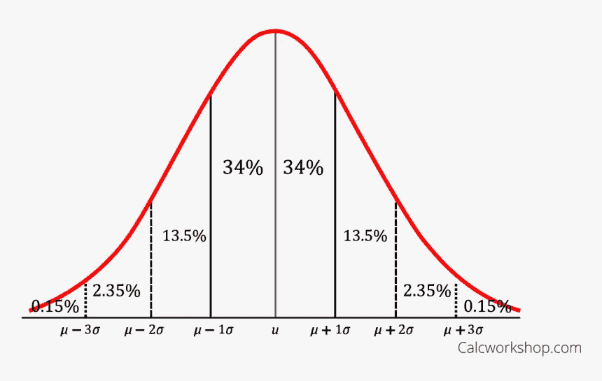
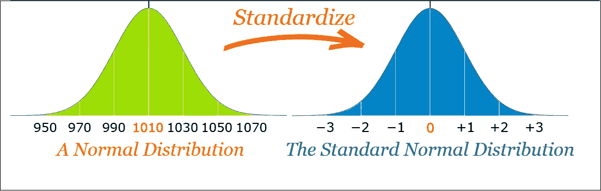
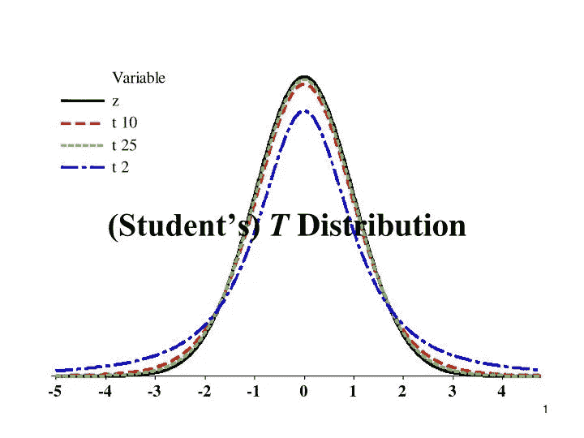
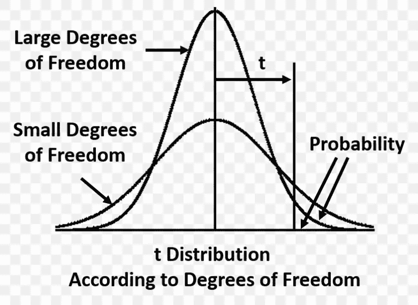

# 统计:高斯分布& Z 分布& T 分布

> 原文：<https://medium.com/analytics-vidhya/statistics-gaussian-distribution-z-distribution-t-distribution-d01659a3580a?source=collection_archive---------16----------------------->

图片:尼日利亚之声

# **概述:**

机器学习中使用各种分布类型来描述数据在总体或数据集样本中的分布。在机器学习中，它用于可视化数据分布和数据集中的离群点检测。

## **话题覆盖**

1.  **高斯分布**
2.  **Z 分布**
3.  **T 型分布**

## **正态分布或高斯分布或钟形曲线:**

由 Carl Friedrich Gauss 发现，高斯分布也称为正态分布，是一种钟形曲线，显示了总体数据值的分布。这用于检查数据的偏差和偏斜度。

**高斯分布遵循经验法则:**

1.这是一条对称曲线，其中 50%的数据位于平均值的左侧，50%的数据位于平均值的右侧。

2.其中均值=中值=众数相同。

3.68%的数据位于一个标准偏差内

95%的数据位于两个标准偏差内

99.7%的数据位于 3 个标准偏差内

**正态分布示例:**

1.  人民的高度
2.  血压
3.  测试的分数

图片:kindpng

## **标准正态分布或 Z 分布:**

使用 Z 分数(标准分数)可以将正态分布转换为标准正态分布。

标准正态分布/ Z 分布的平均值为 0，标准差等于 1

Z-Score 表示我们的数据点距离平均值有多少标准差。Z-Score 将使数据单元更少。

图片:ThoughCo

图片:MathisFun

## **T 分布:**

这也称为学生 t 分布。t 分布是连续概率分布家族中的任何成员，当在样本量较小的情况下估计正态分布总体的均值时会出现(n < 30) and population standard deviation is not known.

A specific T-distribution depends on a parameter known as the degree of freedom(DOF)

DOF refer to the number of independent pieces of information that goes into the computation of standard deviation of sample(s)

As the DOF increases,the difference between the T-Distribution and the Standard Normal Distribution become smaller and smaller.

For more that 100 DOF ,the standard normal distribution (Z) provides a good approximation to the T-value

image:SlideServe

image:FAVPNG.com

**结论**:每个分布在机器学习中都起着重要作用。理解这些概念是必须的。

希望你喜欢我的文章。请鼓掌👏(50 次)激励我继续写下去。

想要连接:

链接进来:[https://www.linkedin.com/in/anjani-kumar-9b969a39/](https://www.linkedin.com/in/anjani-kumar-9b969a39/)

如果你喜欢我在 Medium 上的帖子，并希望我继续做这项工作，请考虑在**上支持我**