# 统计:平均值/中值/众数/方差/标准差

> 原文：<https://medium.com/analytics-vidhya/statistics-mean-median-mode-variance-standard-deviation-47fab926465a?source=collection_archive---------0----------------------->

图片:卡迪夫大学

**概述:**

均值/中值/众数/方差/标准差都是数据科学中使用的非常基本但非常重要的统计学概念。几乎所有的机器学习算法都在数据预处理步骤中使用这些概念。这些概念是描述统计学的一部分，我们基本上用来描述和理解机器学习特征的数据

**的意思是:**

平均值也称为数据集中所有数字的平均值，通过以下公式计算。

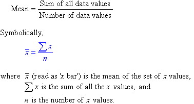

比方说，我们有以下高度的人。

高度=[168170150160182140175191152150]

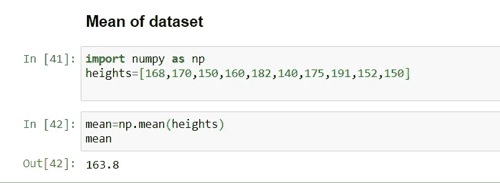

**中位数:**

中位数是有序数据集中的中间值。

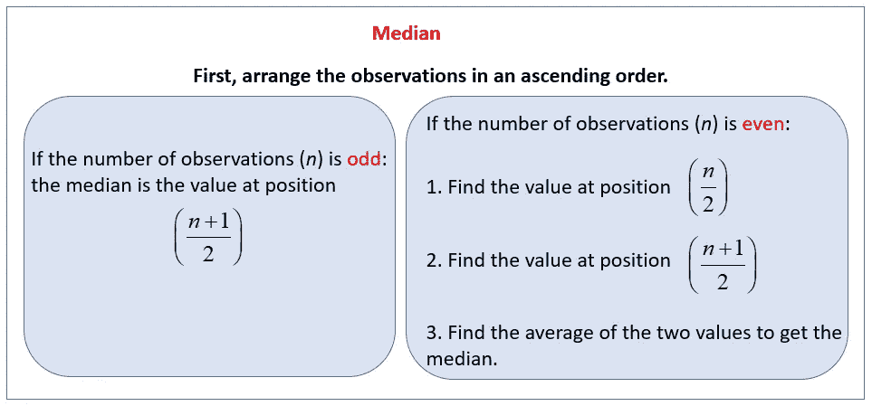

图片:来源未知

按升序排列数据，然后找到中间值。

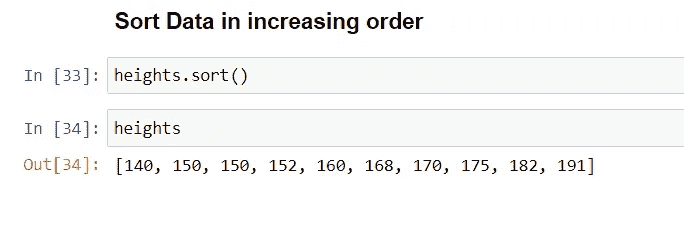

如果数据集中有偶数个值，那么中位数就是中间两个数的和除以 2

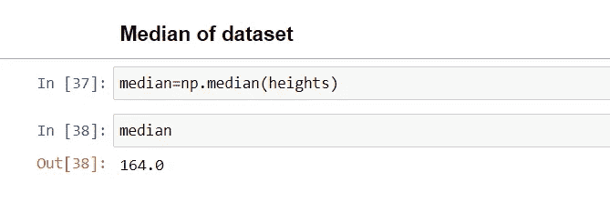

在我们的数据集中有奇数，如下图所示，我们有 9 个高度，中间值将是第 5 个数值。

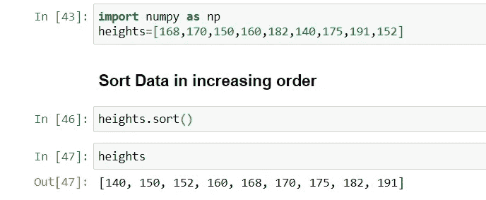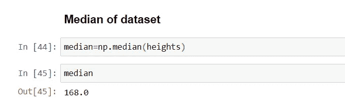

**模式:**

众数是数据集中出现频率最高的数字。这里 150 出现了两次，所以这是我们的模式。

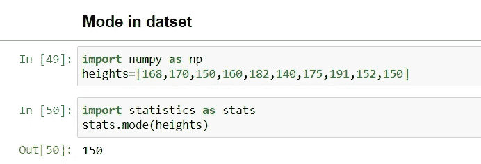

**方差:**

方差是描述观察值相对于算术平均值的可变性的数值，用σ-平方(σ2)表示

方差衡量群体中的个体在数据集中相对于平均值的分散程度。

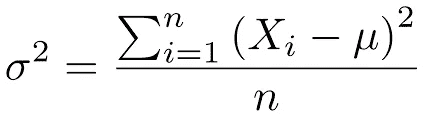

图片:[地学中的数据分析](http://strata.uga.edu/8370/index.html)

在哪里

Xi:数据集中的元素

穆:人口是什么意思

= [人口平均数](https://www.google.com/search?sxsrf=ALeKk01Xep1wN5s8k6zttsrM8iSxc3DJxQ:1590843384306&q=Mean&stick=H4sIAAAAAAAAAOPgE-LQz9U3MCs3MlICs0zKCky0tLKTrfRTU0qTE0sy8_P00_KLcktzEq2gtEJmbmJ6qkJiXnF5atEjRmNugZc_7glLaU1ac_IaowoXV3BGfrlrXklmSaWQGBcblMUjxcUFt4BnESuLb2piHgBE6iKyfwAAAA&sa=X&ved=2ahUKEwiWhsK20dvpAhWCY80KHawnBxsQ24YFMAF6BAgEEAI&sxsrf=ALeKk01Xep1wN5s8k6zttsrM8iSxc3DJxQ:1590843384306)

步骤 1:这个公式表示从数据集(总体)中取出每个元素，并从数据集的平均值中减去。稍后对所有值求和。

第二步:取第一步的和，除以元素总数。

上面公式中的平方将抵消负号(-)的影响

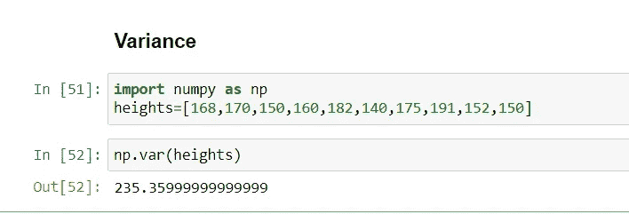

**标准偏差:**

它是数据集内观察值相对于平均值的离差的度量。它是方差的平方根，用适马(σ)表示。

标准差与数据集中的值以相同的单位表示，因此它衡量数据集的观察值与其平均值的差异程度。

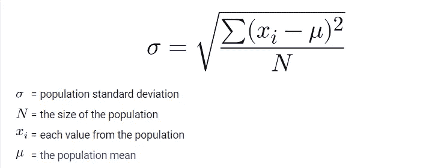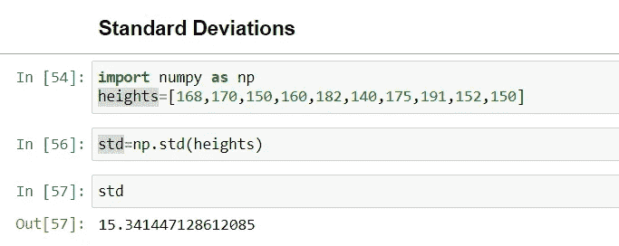

**结论**:均值/中值/众数/方差/标准差是统计学中简单却非常重要的概念，大家都应该知道。希望你喜欢我的文章。请鼓掌👏(50 次)激励我继续写下去。

想要连接:

链接地:【https://www.linkedin.com/in/anjani-kumar-9b969a39/ 

如果你喜欢我在 Medium 上的帖子，并希望我继续做这项工作，请考虑在[上支持我](https://www.patreon.com/anjanikumar)