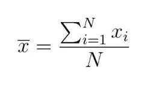
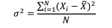
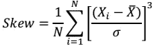
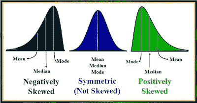
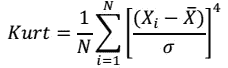

# 统计—分布的矩

> 原文：<https://medium.com/analytics-vidhya/statistics-moments-of-a-distribution-1bcfc4cbbd48?source=collection_archive---------0----------------------->

> 统计学中的矩通常用来描述分布的特征。

> **1 矩:**中心位置的度量
> 
> **二阶矩:**离差的度量
> 
> **3 矩:**不对称的度量
> 
> **4 矩:**峰值的度量

> **一阶矩均值**

```
Measure the location of the central point.
```



> **二阶矩-标准差(SD，σ(适马)):**

```
Measure the spread of values in the distribution OR how far from the normal.
```



**σ = (Variance)^.5**

```
**Small SD** : Numbers are close to mean
**High SD**  : Numbers are spread out**For normal distribution:**
Within 1 SD: 68.27% values lie
Within 2 SD: 95.45% values lie
Within 3 SD: 99.73% values lie**Advantages over Mean Absolute Deviation(MAD):** 1\. Mathematical properties- Continuous, differentiable.
2\. SD of a sample is more consistent estimate for a population- When drawing repeated samples from a normally distributed population, the standard deviations of samples are less spread out as compare to mean absolute deviations.
```

> **三阶矩-偏斜度**

```
Measure the symmetry in the distribution.
```



```
Skewness=0 **[Normal Distribution, Symmetric]****Other Formulas:** 1\. Skewness = (Mean-Mode)/SD
2\. Skewness = 3*(Mean-Median)/SD
(Mode = 3*Median-2*Mean)**Transformations** (to make the distribution normal)**:**
a. Positively skewed (right): Square root, log, inverse
b. Negatively skewed (left) : Reflect and square[sqrt(constant-x)],
reflect and log, reflect and inverse
```



> **四阶矩-峰度:**

```
Measure the amount in the tails.
```



```
Kurtosis=3 **[Normal Distribution]** Kurtosis<3 [Lighter tails]
Kurtosis>3 [Heavier tails]**Other Formulas:**
*Excess Kurtosis = Kurtosis - 3***Understanding:** Kurtosis is the average of the standardized data raised to fourth power. Any standardized values less than |1| (i.e. data within one standard deviation of the mean) will contribute petty to kurtosis.
The standardized values that will contribute immensely are the outliers.
High Kurtosis alerts about attendance of outliers.
```


**分布的超额峰度**【拉普拉斯(D)双指数；双曲正切；后勤学；(N)正式；osine(W)igner 半圆；统一的]

## 参考资料:

> **标准差和方差:【https://www.mathsisfun.com/data/standard-deviation.html】T22**
> 
> **均值偏离的优点:**[http://www.leeds.ac.uk/educol/documents/00003759.htm](http://www.leeds.ac.uk/educol/documents/00003759.htm)

## **WhatsApp 聊天📱—分析🔍，可视化📊**

[](/analytics-vidhya/whatsapp-chat-analyze-visualize-68e4d30be729) [## WhatsApp 聊天📱—分析🔍，可视化📊

### WhatsApp 是当今世界上最受欢迎的即时通讯应用，在全球拥有超过 2B 的用户。超过 65B…

medium.com](/analytics-vidhya/whatsapp-chat-analyze-visualize-68e4d30be729)