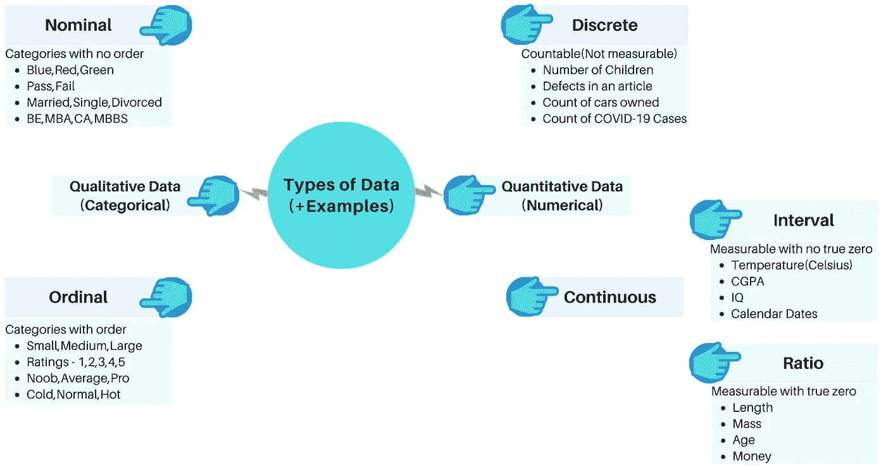
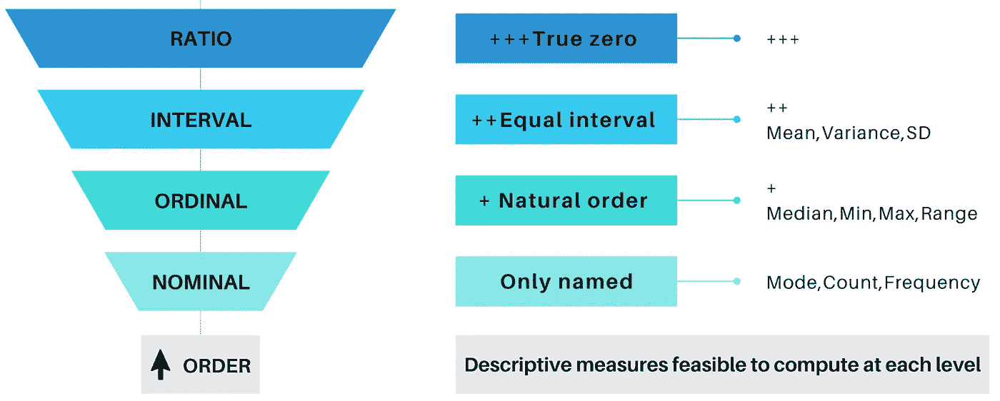

# 每个数据科学爱好者都应该知道的统计概述和数据类型

> 原文：<https://medium.com/analytics-vidhya/statistics-overview-and-data-types-every-data-science-enthusiast-should-know-e37be2e03e8e?source=collection_archive---------15----------------------->

统计基础知识在数据科学领域一直非常重要，并将继续如此。此外，如果有人想深入研究机器学习、深度学习和人工智能等未来的热门话题，坚实的统计学基础是必不可少的。对统计学一知半解不仅有害，而且其应用更糟糕——是一场“灾难”。请关注我即将发布的博客，在这里，我们将通过质疑过多的统计方法的必要性，并用相关的例子来证明，在这个学习的旅程中缓慢而稳步地前进。

> 让我们从统计概述开始这一旅程

统计学的两个分支:

1.描述统计学

2.推断统计学

# **描述性统计:**

统计学的这一分支使我们能够以有意义的方式描述数据的简明摘要，从而获得一目了然的洞察力。为了研究任何给定的数据集，可以考虑像集中趋势(均值/中值/众数)这样的 1 位数汇总，或者包含分布(范围/方差/标准差)和集中趋势的 2 位数汇总，或者包括集中趋势(中值)、第 1 个四分位数、第 3 个四分位数、下限和上限的 5 位数汇总—(箱线图)。此外，在描述性统计的范围内，还存在更多需要了解的统计指标，如变异系数、协方差、分位数、偏斜度、峰度等。这将在以后的博客中详细讨论。

# **推断统计:**

统计学的这一分支完全是关于从派生的样本数据中对总体进行估计。关于总体的结论是基于已建立的中心极限定理，这将在本书后面详细讨论。假设检验是推理统计的一个重要工具，用于接受/拒绝一个陈述的信念，基于变量的类型和范围，有许多方式/方法来进行相同的测试。我们在推理统计学中得到的每一个结果都是对我们认为的总体结果的估计(记住所有的假设)。不要将结果与实际的人口统计数据相混淆，因为它们是不切实际的(由于时间、精力等资源限制，只有估计是可行的。).这就是为什么推断统计结果中包含的误差通常多于描述统计的唯一原因。

> 数据类型概述

(图片由作者提供)

定性数据属于非参数类别，定量数据属于参数类别。要讨论的更重要的一点是“测量水平”,它使我们能够决定对给定的数据类型计算哪些描述性统计测量是可行的。现在，我们快速看一下测量的级别(尺度):

(图片由作者提供)

这篇博客到此为止，请关注即将到来的博客，这些博客将以简单易懂的形式涵盖所有与统计相关的“必须知道”的方面。

谢谢！！！