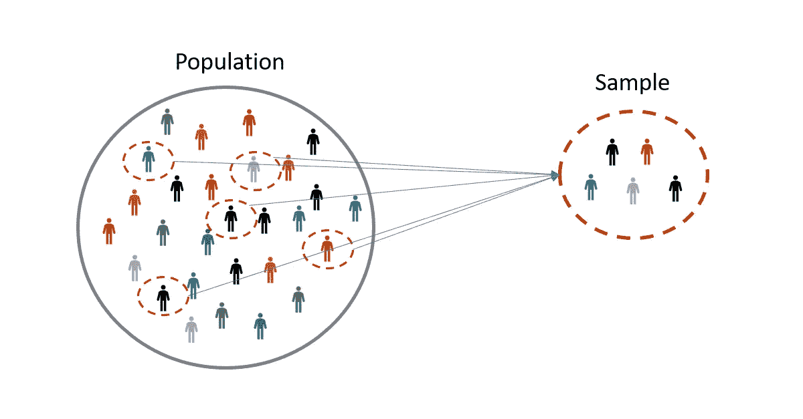
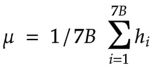
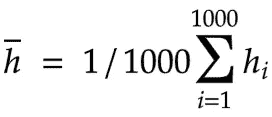

# 概率与统计

> 原文：<https://medium.com/analytics-vidhya/statistics-population-and-sample-993a488572ac?source=collection_archive---------19----------------------->

## 人口和样本

为了理解人口和样本，让我们以人类的平均身高为例。写这篇文章的时候，我在谷歌上搜索了世界人口，上面说，截至 2020 年 3 月，世界人口估计已经达到 78 亿。就当 70 亿左右吧。与此同时，我在谷歌上搜索人类的平均身高，我知道“男人”是“1.7 米”，“女人”是“1.6 米”。

你知道如何求平均值吗？

这么简单，就是把所有的数字加起来，然后除以数字的个数，也就是所谓的“平均数”。

**关于人类的平均身高，你认为我们可以通过将世界上所有人的身高相加，然后除以总人口数(大约 70 亿)来计算人类的平均身高吗？有可能获得 70 亿人的身高吗？**

这就是概率派上用场的地方。总体和样本的概念有助于用简单的步骤解决这个问题。

**那么什么是统计学中的总体和样本呢？**

**总体**:总体包括一组数据中的所有元素。在上面的例子中，它是世界上所有人的身高

**样本**:样本基本上是随机抽取的总体子集。这种随机选取的样本称为随机样本。在上述情况下，高度的一个小样本将被随机抽取相等的比例。在这种情况下，相等的比例是在随机选择身高时，应该选择来自不同国家的人，他们应该是相等的比例。



```
import numpy as np
lis=[int(i) for i in range(1,1001)]
res=[]
j=99

for i in range(10):
	l = np.random.choice(lis[(j-99):j],10,replace=False)
	res.extend(l)
	j+=100
print("mean of sample:",np.mean(res))
print("mean of sample:",np.mean(lis))mean of sample: 501.48
mean of sample: 500.5
```

为了估计人的平均身高，我们必须找到十亿人身高的平均值。这可以通过以下等式来实现:



这里 mu 是总人口的平均值

样本总体的平均值可以通过下式获得



这里 h-bar 是样本的平均身高，hi 是样本中人的身高。

为了便于理解，我创建了一个简单的脚本，使用人口和样本概念计算 1000 个数字的平均值。人口包含从 1 到 1000 的数字。我把 1000 个数字分成 10 类，每类 100 个数字。现在我从这 10 个类别中随机抽取 10 个数字，使它们比例相等。现在，当我们计算总体和样本的平均值时，我们可以看到样本的平均值更接近总体

```
import numpy as np
lis=[int(i) for i in range(1,1001)]
res=[]
j=99

for i in range(10):
	l = np.random.choice(lis[(j-99):j],10,replace=False)
	res.extend(l)
	j+=100
print("mean of sample:",np.mean(res))
print("mean of poplation:",np.mean(lis))mean of sample: 498.81
mean of poplation: 500.5
```

利用这一概念，我们可以很容易地计算人类的平均身高，只需从世界不同地区随机抽取相同比例的样本身高，从而获得更接近于人口平均身高的数值。

这种选择样品中元素数量的方法不受限制。我们可以为一个样本选择任意数量的元素。随着样本中元素数量的增加，样本均值向总体均值靠拢

```
import numpy as np
lis=[int(i) for i in range(1,1001)]
res=[]
j=199

for i in range(5):
	l = np.random.choice(lis[(j-199):j],10,replace=False)
	res.extend(l)
	j+=200
print("mean of sample:",np.mean(res))
print("mean of poplation:",np.mean(lis))mean of sample: 499.36
mean of poplation: 500.5
```

在从不同国家的不同特征中取样时，需要考虑的一件重要事情是，从每个国家收集的元素数量应该是相等的比例。这种拆分样本的过程称为采样。

统计学中有两种抽样技术。他们是

*   简单随机抽样
*   分层抽样

## a)简单随机抽样:

在这种技术中，样本中的每个数据点/记录都是随机选取的。每个数据点/记录都有均等的机会被选中。在样本中选择一个数据点不会影响对总体中任何其他数据点的选择。

## b)分层抽样:

在这种抽样技术中，如果我们在总体中有不同的群体，那么样本的选择将使样本中每一群体的数量与总体中这些群体的数量成比例。

我可以用示例问题陈述来解释这两种技术:我们必须估计 1000 名学生在机器学习考试中的平均分数。(注:在大学里，ML 是一门学科，不同流的学生可以选修这门学科)

1000 个学生中，400 个是工科出身，300 个是统计学出身，200 个是药学出身(药学领域也用数据科学)，100 个是商科出身。

这里人口=参加 ML 考试的学生总数= 1000 让我们从 250 名学生中挑选一个样本。所以样本量是 250

a)在简单随机抽样中，样本可能包含来自工程背景的所有 250 名学生，或来自统计背景的所有 250 名学生，或工程和药学背景的组合，或每个背景的更小子集，或仅来自工程和统计的学生，等等。可能是任何可能的组合。它也可能包含相同比例的总体。比例不当的样本称为有偏样本，使用这种有偏样本会导致有偏估计。

b)在分层抽样技术中，抽样的方式是样本中所有类别的大小与总体的大小成比例。

在 1000 人的总人口中，工程— 400 人(1000 人的 40%)统计— 300 人(1000 人的 30%)制药— 200 人(1000 人的 20%)商业— 100 人(1000 人的 10%)

因此，在分层抽样中，250 名成员的样本选择如下。工程—100(250 中的 40%)统计—75(250 中的 30%)制药—50(250 中的 20%)商业—25(250 中的 10%)

分层抽样中选取的样本是无偏样本。使用无偏的样本可以得到准确的估计。

## 注意:

1.  如果人口中没有亚群体，那么最好进行简单的随机抽样，因为样本不可能有偏差。只有当群体中存在亚群体时，简单随机抽样中的样本才会有偏差。
2.  如果人口中存在亚群体，建议进行分层抽样，因为样本需要无偏。

## 希望你觉得这篇文章很有趣。谢谢您，祝您机器学习之旅愉快。