# 统计学:有意义数据的灵魂第一部分

> 原文：<https://medium.com/analytics-vidhya/statistics-soul-of-meaningful-data-part-i-fb9a48079b73?source=collection_archive---------24----------------------->

## 对统计的所有核心概念有深刻的理解

> 什么是统计学？

这是一门收集、组织和解释数据的科学，因此我们可以收集一些数据的见解，然后我们可以总结并做出决定。

> 统计学是如何工作的，一个基本的了解？

## 场景一:

让我们假设你是一名学生，正在给别人看你的分数。如果你在下面显示给定的分数，他们会告诉你花更多的时间准备物理，因为你的物理分数比化学分数低。

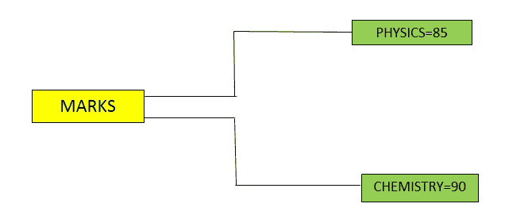

## 情景二:

现在我们将看到统计如何改变整个认知；

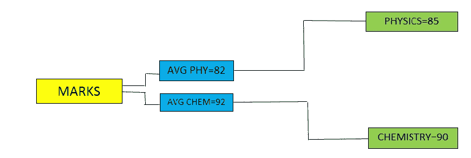

现在，借助于描述性统计(平均值),如果我们看到上面的数字，我们会发现学生的物理分数高于平均分数，而化学分数低于平均分数，如果你把这些分数给别人看，他们会告诉你提高化学而不是物理。因此，通过参考数据，我们可以从统计学中得出结论，因此统计学提供了对数据集及其结果的深刻见解。

> 统计类型；

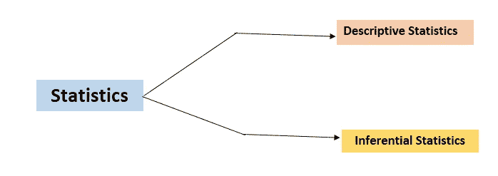

> 描述性统计；

借助图表、数学描述(平均值、中值、众数、IQR、百分位数等)，以信息方式给出数据描述。上面解释的例子是一个描述性统计。

> 推理统计学；

它用于在样本的基础上确定总体。例如:-电子媒体的投票后调查；

他们从每个选区收集 1000-2000 人(样本)的数据，并根据他们的意见描述给定选区的结果(人口)(哪个政党可能赢得选举)。这就是在推断统计学中借助样本来确定总体的方法。

> 统计学中的变量；

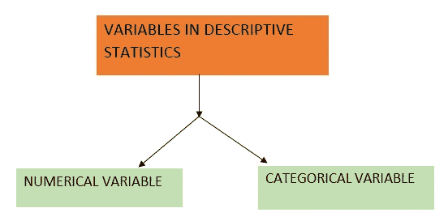

> I >数值变量；

它代表数据的数值变量。例如:人的年龄:30 岁，考试成绩:498 分

> ii >分类变量；

它将整个数据集或结果分类。例如:-亚马逊产品评论，考试成绩。

让我们以亚马逊产品评论为例，客户根据他们的体验对购买的产品进行评论，这些可以分别分为 1、2、3、4、5 星。这些值代表满意度的类别。1 星表示客户不满意，5 星表示客户完全满意。

> 基于测量水平的变量；

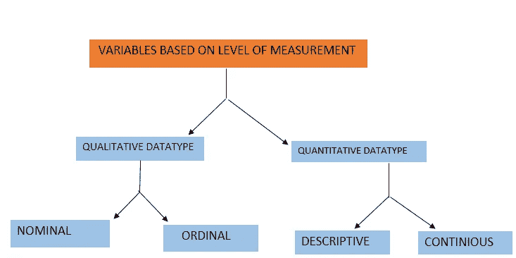

> I >定性数据类型；

它定义了群体的质量(更常见的是指整个数据集)。它有两种类型；

a >名义上:-数据集的质量可以在名称的基础上定义，例如:-天气数据集，大陆数据集

b >序数:-数据集的质量可以在次序的基础上定义，例如:-基于薪水的 100 人的安排将是序数数据集。

> ii >数量数据类型；

它定义了人口数量(给定数据集)。这也是两种类型。离散的:-它定义了人口的绝对数量，例如:-12，500，100

连续的:它不代表人口的绝对数量。173.89，239.1234 等

> 统计学的均值、中位数和众数基本概念；

1 >平均值:-它是给定数据集的平均值。最突出的两种平均数计算用于统计学。>样本均值。

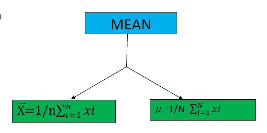

注:-此处 x bar 和 mu 分别为样本均值和总体均值。

2.> Median:表示给定数据集中数据点的中间值。

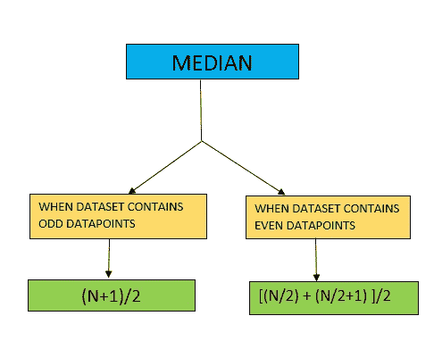

3.>模式:-给出出现频率最高的输出数据。

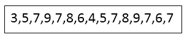

在上面给定的数据集中，值 7 出现的次数最多，因此上面给定数据集的模式将= 7。

> 差异

它在统计学习中起着关键的作用，尤其是当我们处理正态分布的数据集时。它定义了给定数据集中的波动。

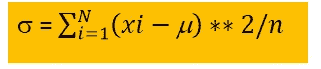

> 标准偏差

它被定义为数据点相对于平均值的波动。最重要的是，它定义了数据点相对于平均值的精确变化。它在 68–95–99.7 规则中也起着关键作用。

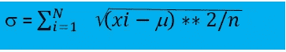

> 概率密度函数

假设我们有一个函数 f(x)。那么对于值 a ≤ x ≤ b，f(x)≥0。对于任何给定的值范围，如果函数 f(x)将大于等于零并覆盖单位面积，则称为概率密度函数。它可以表示为:

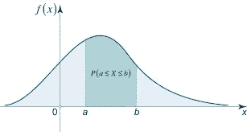

来源:- [math.24](https://www.google.com/search?q=Probability+density+function+of+unity+area&sxsrf=ALeKk00rmW-0SRXBcGWe6pDstX69tIyHXQ:1600520749213&source=lnms&tbm=isch&sa=X&ved=2ahUKEwiSkNm1pPXrAhVfzIsBHU0dDkkQ_AUoAXoECA0QAw&biw=1366&bih=625#imgrc=XkS052UjhrgIOM)

> 正态分布

它也被称为高斯分布。这里，数据平均分布在其平均值上。它通常被称为钟形曲线。高斯分布的数学表示定义为:

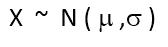

其中 X 是一个随机变量，它遵循均值μ和标准差σ的正态分布。

为什么我们需要钟形曲线？

正态分布最适合机器学习建模，因为它具有相等的数据分布。如果数据不是正态分布，那么通过使用归一化和标准化，我们将把数据集转换成高斯分布，并将执行统计和 M.L 操作。

[维基共享资源](https://www.google.com/search?q=normal+distribution&sxsrf=ALeKk013uv5OgK090FdiIU56s7EJfb4t6Q:1600521100739&source=lnms&tbm=isch&sa=X&ved=2ahUKEwim0qjdpfXrAhUNrZQKHU9zCHwQ_AUoAXoECBYQAw&biw=1366&bih=576#imgrc=5A6guUHFR_JDgM&imgdii=5jb7PXr6kgP08M)

高斯分布曲线的概率分布公式:

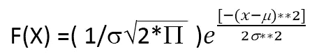

> 68–95–99.7 规则

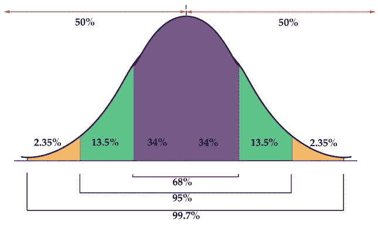

[流明学习](https://www.google.com/search?q=68+percent+rule&sxsrf=ALeKk037RlR8C1Re81DNZoHTCXOX3YvYEA:1600761029620&source=lnms&tbm=isch&sa=X&ved=2ahUKEwi1ranEo_zrAhWCx4sBHblvBwsQ_AUoAnoECB0QBA&biw=1366&bih=625#imgrc=b0HauCkuBHOZpM)

在 1sigma 和-1 sigma 之间，存在 68%的值。95%的值包含在 2 sigma 到-2 sigma 之间。99.7%的值存在于-3 sigma 到 3 sigma 之间。从概念上讲，所有的价值都在-3 sigma 到 3 sigma 之间。

参考文献；

[伊努龙](https://ineuron.ai/)