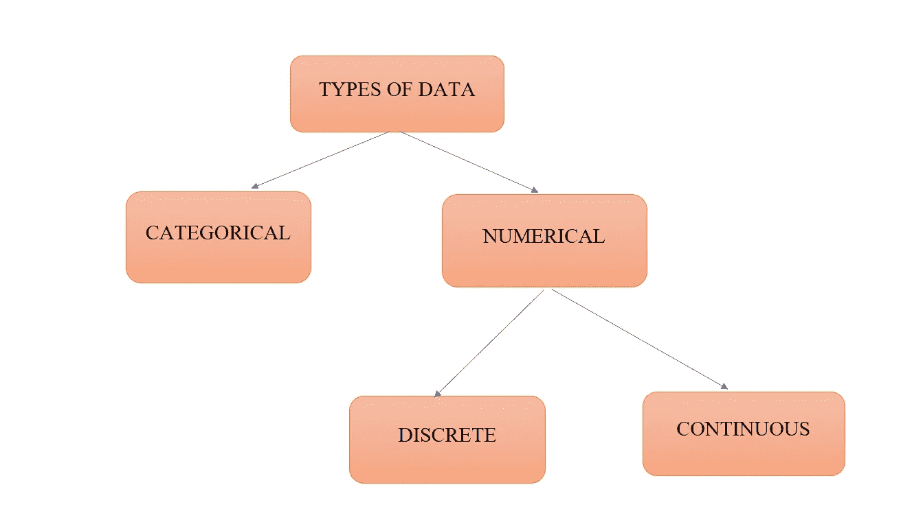
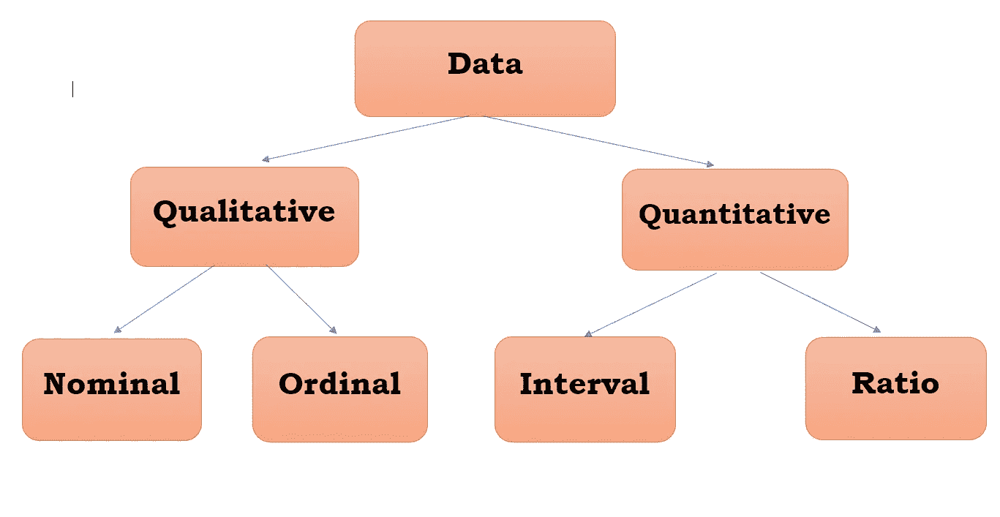
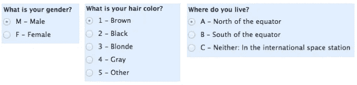
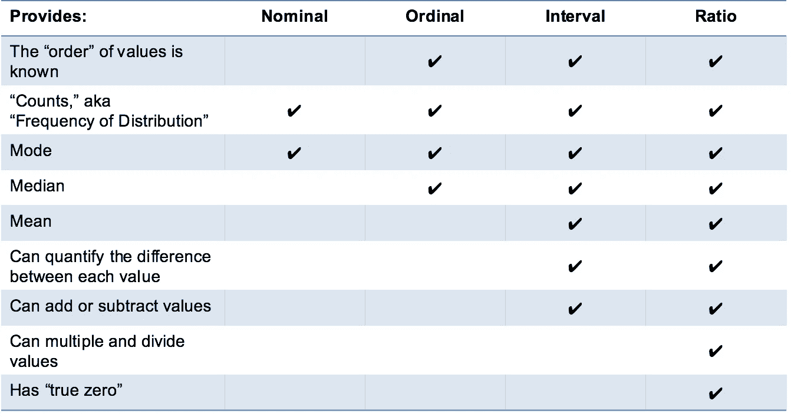
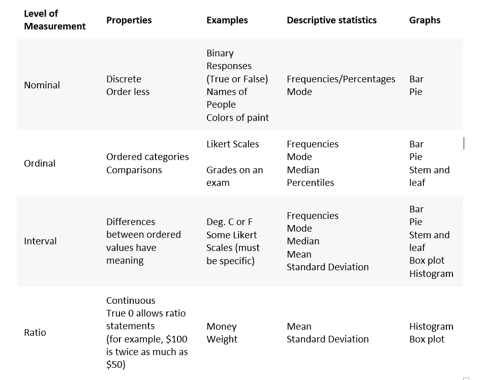

# 统计-我们可以使用的数据类型。

> 原文：<https://medium.com/analytics-vidhya/statistics-types-of-data-we-can-work-with-64c87425596c?source=collection_archive---------12----------------------->

> 主要来说，我们可以通过两种主要方式对数据进行分类，最好是根据其**类型**和**度量。**

1.  **数据类型**

数据类型

分类:

分类数据描述类别或组，如汽车品牌(宝马，奥迪…).也像是或否的范畴。在这些问题中，有两类回答是和不是。

数值型:
顾名思义，数据是数值型的。我们用数字的形式来表示数据。我们可以进一步分为两种形式。离散 2。连续的

离散形式:离散数据以有限的方式计数。例如:你有多少个孩子。

连续形式:连续数据是无限的，无法计算。
例:人体重量

> 让我们深入这些:假设你的体重 40 公斤，一旦你计算出来。在一些锻炼/跑步之后，由于出汗，体重减轻了。(每一滴汗都减轻你的体重)。体重的变化是有规律的，实际上这取决于活动。但是人体的重量并不是每次都不变的。它可以随十进制值而变化，但它是变化的。

离散的示例—等级、物体数量、金钱等
连续的示例—高度、时间、面积、距离等

上面的例子可以无限变化——变化可以是十进制的。时钟上的时间是离散的，但一般时间是连续的。(比如 1.22222222 分钟)

2.**测量数据等级**

测量的数据水平

有四种测量尺度:名义的、顺序的、间隔的和比率的。这些是对不同类型的数据变量进行分类的简单方法，帮助我们选择正确的统计测试、可视化技术，并指导我们进行**数据**分析。

**定性数据**

一个变量不能假定为数值，但可以分为两个或两个以上的非数值类别，称为定性或分类变量。在这样一个变量上收集的数据称为定性数据。

**名义上的**

标称刻度用于**标注变量**，没有任何*量化*值。
“名义上的”尺度可以称为“标签”。

名义上的

在这个级别的数据中，我们无法执行任何定量的数学运算，例如加法或除法。这些没有任何意义。

然而，我们可以使用 pandas **value_counts** 方法进行基本的**计数**。

因为我们能够在名义水平上进行统计，所以我们可以使用条形图、饼状图等图表..

**序数**

序数量表通常是衡量非数字概念的标准，如满意、快乐、不舒服等..

“Ordinal”很容易记住，因为它听起来像“order ”,这是记住“ordinal scales”的关键——重要的是*顺序*,但这是你真正从这些中得到的全部。

*高级注释*:确定一组有序数据上 [*集中趋势*](https://en.wikipedia.org/wiki/Central_tendency) 的最佳方法是使用**模式**或**中位数**；一个纯粹主义者会告诉你，平均数不能由一个序数集合来定义。

序数

我们可以像处理名义数据一样进行基本计数。同样，对于顺序数据，我们可以有**比较**和**排序**。

出于这个原因，我们可以在这个层次上使用新的图表。我们可以像在名义水平上一样使用条形图和饼图，但是因为我们现在有了排序和比较，*我们可以计算* ***中位数*** *和* ***百分位数*** 。

**使用中位数和百分位数，*茎-叶图*，以及*箱线图*都是可能的。**

## 数据

可以用数字测量的变量称为数量变量。在定量变量上收集的数据称为定量数据。

有两种类型的数量变量。

1.  **区间**

区间标度是数值标度，其中我们知道值之间的顺序和精确差值。

也有负测量组合的变量，如温度。温度可以是负的。

"没有真正的零点。"
一头雾水以上线？我来解释一下。如果给定的温度是零，并不意味着零，0 也是一个温度。这种价值并不是几乎什么都没有，它在自己的类别中有一定的价值。例:温度为 0 摄氏度(这是冰点)

在幕间休息时，我们能感觉到不同。它不能衡量完全的缺席。

零有意义。

你不能用两次或三次，就像 100 摄氏度是 50 摄氏度的两倍。

> 有了将数值相加的能力，我们可以引入两个熟悉的概念，算术平均值和标准偏差。
> 
> 从这个级别开始，最常用的图表是**直方图**。该图类似于条形图，直观地显示了各种数量，并显示了这些数量出现的频率。
> 
> 在间隔级别有两列或更多列数据的一个很大的优点是，它让我们可以使用**散点图**，在散点图中我们可以在我们的轴上绘制两列数据，并将数据点可视化为图上的文字点。
> 
> 像其他人一样，你可以很容易地记住“音程音阶”的要点。“区间”本身意味着“中间的空间”，这是要记住的重要事情——区间尺度不仅告诉我们顺序，还告诉我们每个项目之间的值。
> 
> 问题:区间标度的问题是:它们没有“真零点”。例如，没有“没有温度”这回事，至少没有摄氏温度。在区间刻度的情况下，零并不意味着没有值，而是实际上是刻度上使用的另一个数字，如 0 摄氏度。负数也有意义。
> 
> 没有真正的零点，就不可能计算比率。 ***对于区间数据，我们可以加减，但不能乘或除*** 。
> 
> 迷茫？好，考虑一下这个:10 度+ 10 度= 20 度。没问题。20 摄氏度没有 10 摄氏度热两倍。当转换到华氏温度时，很明显:10C=50F，20C=68F，这显然不是两倍的热。我希望这有意义。

2.**比率**

比率变量的好例子包括身高和体重。

在进行统计分析时，比例尺度提供了大量的可能性。这些变量可以有意义地加、减、乘、除(比率)。

—集中趋势可以通过众数、中位数或平均值来衡量；离差的度量，如标准偏差和变异系数，也可以通过比率标度来计算。

这里是真零点。

— — — — — — — — — — — — — — — — — — — — — — — — — — — — — —

