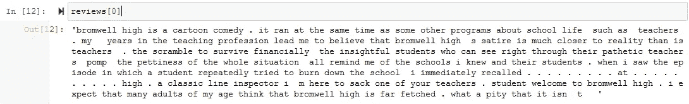
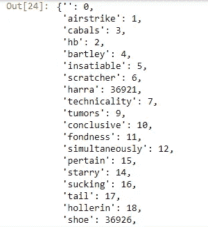

# 一步一步从头开始构建神经网络

> 原文：<https://medium.com/analytics-vidhya/step-by-step-building-a-neural-network-from-scratch-using-numpy-only-build-a-sentiment-b76393417291?source=collection_archive---------6----------------------->

## 关于如何用 python 实现一个神经网络的完整指南，只使用 NumPy。


乔希·里默尔在 [Unsplash](https://unsplash.com?utm_source=medium&utm_medium=referral) 上的照片

我在 *Udacity 深度学习基金会 Nanodegree* 中学到了这个教程，并想与你分享我在这个情感分类项目中的经验，并给出如何实现它的完整指导。

您可以从 github 上的这个链接获得源代码和数据集。

> [https://github . com/uda city/deep-learning/tree/master/情操网](https://github.com/udacity/deep-learning/tree/master/sentiment-network)

我们将从零开始建立一个神经网络模型，而不使用`Tensorflow`或`py-torch`或任何机器学习平台。我们将使用`python`从头开始构建一切，这样我们就可以看到神经网络如何工作的幕后场景。

在这个项目中，我们将实现一个多层感知器模型来将一个给定的文本分类为积极或消极。


## 神经网络的组成部分:

首先，让我们确定神经网络模型的组件:

*   第 1 层→输入层
*   第 2 层→隐藏层
*   第 3 层→输出层
*   激活函数(我们将选择一个 sigmoid 函数)
*   学习率
*   数据集(评论文本)

## 要实现的功能:

*   预处理数据。
*   标签转换为二进制(将输出标签正转换为“1”，负转换为“0”)。
*   乙状结肠函数。
*   Sigmoid 导数函数。
*   火车。
*   测试。
*   快跑。

## 我们将经历的步骤:

1.  读取数据集
2.  导入 Numpy 库和计数器函数
3.  情感分类类
4.  创建预处理数据功能
5.  初始化网络功能
6.  标签到二进制
7.  Sigmoid 函数及其导数
8.  实施培训功能(向前传递)
9.  偶数道次
10.  运行和测试
11.  让我们运行这个网络

让我们开始吧。

## 步骤 1:读取数据集

使用`Open`功能读取文本文件，然后使用`map`映射整个文件，将其转换为评论列表，然后对标签文本文件重复上述操作。

```
File = open('reviews.txt','r') # What we know!
reviews = list(map(lambda x:x[:-1],File.readlines()))
g.close()File2 = open('labels.txt','r') # What we WANT to know!
labels = list(map(lambda x:x[:-1].upper(),File2.readlines()))
g.close()
```

这是列表中第一个评论的样子。



## 步骤 2:导入 Numpy 库和计数器函数

我们将在我们的项目中使用一个名为 counter 的函数，我们稍后会用到它，但首先让我们导入它。

```
import numpy as np
from collections import Counter
```

## 步骤 3:情感分类类

创建一个类，用我们将要使用的函数来保存整个网络，我们把它命名为“情感网络”。

让我们用这 4 个参数初始化它(评论数据，标签，隐藏节点，学习率)。

接下来调用我们将在下一步实现的预处理数据函数，并调用初始化整个网络的 init network 函数，我们将在步骤 5 中实现该函数。

```
class SentimentNetwork:
    def __init__(self, reviews,labels,hidden_nodes=10,learning_rate = 0.1):self.pre_process_data(reviews, labels)

                self.init_network(len(self.review_vocab),hidden_nodes, 1, learning_rate)
```

> 注意:我们实现的函数的所有后续步骤都将在这些类下。

## 步骤 4:创建预处理数据函数

这个函数的目的是获取数据集中每个单词的 Id，这个 Id 将是数据集中每个单词的索引。

预处理数据函数有两个参数:评论和标签，我们将创建一个`review_word`集合来存储评论中出现的所有单词，然后将这个集合转换成一个列表，以便于访问。

这个 for 循环将遍历所有评论，对于每个评论，它将遍历其中的每个单词，并将其添加到一个集合中。使用`split(" ")`功能，每个评论将在每个空格后中断，以获得单个单词。

```
class SentimentNetwork:
    def pre_process_data(self, reviews, labels):
        review_vocab = set()
        **for** review **in** reviews:
            **for** word **in** review.split(" "):
                review_vocab.add(word)
self.review_vocab = list(review_vocab)
```

将对标签做同样的事情，但是这里我们不使用 split 函数，因为我们每行只有一个单词(积极的或消极的)。

```
class SentimentNetwork:
    def pre_process_data(self, reviews, labels):
        review_word = set()
        for review in reviews:
            for word in review.split(" "):
                review_word.add(word)
        self.review_word = list(review_word)

        label_vocab = set()
        **for** label **in** labels:
            label_vocab.add(label) self.label_vocab = list(label_vocab)
```


复习单词表

然后创建一个保存每个单词及其在列表中的位置的字典，这个循环将遍历每个单词，并使用它在列表中的索引将其转换为数字。

```
self.word2index = {}
        **for** i, word **in** enumerate(self.review_vocab):
            self.word2index[word] = i
```

这就是`word_dictionary`的样子，一个单词和它的 id。



对标签做同样的事情。

```
self.label2index = {}
        **for** i, label **in** enumerate(self.label_vocab):
            self.label2index[label] = i
```

这是类中函数的最终代码。

```
def pre_process_data(self, reviews, labels):
        review_vocab = set()
        **for** review **in** reviews:
            **for** word **in** review.split(" "):
                review_vocab.add(word)

        self.review_vocab = list(review_vocab)

        label_vocab = set()
        **for** label **in** labels:
            label_vocab.add(label)

        self.label_vocab = list(label_vocab)

        self.word2index = {}
        **for** i, word **in** enumerate(self.review_vocab):
            self.word2index[word] = i

        self.label2index = {}
        **for** i, label **in** enumerate(self.label_vocab):
            self.label2index[label] = i
```

## 步骤 5:初始化网络功能

创建一个初始化网络中所有东西的函数，包括(输入节点、隐藏节点、输出节点、学习速率、第一层和权重)。

下面我们初始化了输入、输出、隐藏节点和学习率，它们将被传递给类对象。

```
def init_network(self, input_nodes, hidden_nodes, output_nodes, learning_rate):

        self.input_nodes = input_nodes
        self.hidden_nodes = hidden_nodes
        self.output_nodes = output_nodes

        self.learning_rate = learning_rate
```

用 0 初始化输入和隐藏`self.weights_0_1`之间的权重，用随机值初始化隐藏和输出`self.weights_0_2`之间的权重。

```
self.weights_0_1 = np.zeros((self.input_nodes,self.hidden_nodes))self.weights_1_2 = np.random.normal(0.0, self.output_nodes**-0.5, 
                                                (self.hidden_nodes, self.output_nodes))
```

用零初始化连接到隐藏层的第一层。

```
self.layer_1 = np.zeros((1,hidden_nodes))
```

这是初始化函数的完整代码。

```
def init_network(self, input_nodes, hidden_nodes, output_nodes, learning_rate):

        self.input_nodes = input_nodes
        self.hidden_nodes = hidden_nodes
        self.output_nodes = output_nodes

        self.learning_rate = learning_rate

        self.weights_0_1 = np.zeros((self.input_nodes,self.hidden_nodes))self.weights_1_2 = np.random.normal(0.0, self.output_nodes**-0.5, 
                                                (self.hidden_nodes, self.output_nodes))

        self.layer_1 = np.zeros((1,hidden_nodes))
```

## 步骤 6:标记为二进制

一个小函数，它将正负标号转换成二进制数。正输出为 1，负输出为 0。

```
def get_target_for_label(self,label):
    if(label == 'POSITIVE'):
        return 1
    else:
        return 0
```

## 步骤 7: Sigmoid 函数及其导数

在输出层，我们将使用一个 sigmoid 函数，我们可以使用下面的函数进行计算，我们还需要使用 sigmoid 计算导出输出的导数。

```
def sigmoid(self,x):
    return 1 / (1 + np.exp(-x))def sigmoid_output_2_derivative(self,output):
        return output * (1 - output)
```

## 步骤 8:实现培训功能(向前传递)

这是主函数，它将遍历所有数据集来更新权重和学习。

当训练神经网络时，我们应该对数据进行两次传递(前向和后向传递),第一次传递是获得每个输入的输出，而后向传递是获得输出的误差，我们将使用该误差来更新权重。

在这一步中，我们将向前传递，因此首先让我们定义函数并定义它的参数(训练数据检查和标签)。

```
def train(self, training_reviews_raw, training_labels):
```

现在，让我们为第一个列表创建一个列表列表，它将保存所有评论，在每个列表中，它将保存单个评论的所有单词。

```
training_reviews = list()
    for review in training_reviews_raw:
        indices = set()
        for word in review.split(" "):
            if(word in self.word_dictionary.keys()):
                indices.add(self.word_dictionary[word])
        training_reviews.append(list(indices))
```

初始化`correct_so_far = 0`以跟踪有多少输出是正确的，将在每次正确迭代后递增。

现在，让我们循环查看所有训练数据，更新所有层的权重，并计算误差。

```
for i in range(len(training_reviews)):
    review = training_reviews[i]
    label = training_labels[i]

    self.layer_1 *= 0
    for index in review:
       self.layer_1 += self.weights_0_1[index] layer_2 = self.sigmoid(self.layer_1.dot(self.weights_1_2))
```

让我解释一下上面的代码中发生了什么:

*   我们用零重置第一层节点。

`self.layer_1 *= 0`

*   现在，我们循环查看并获取每个单词的索引，这是它的 id，并用这些索引的权重更新第 1 层，这些权重来自第 0 层和隐藏层之间的权重，我们在第 4 步中初始化了这些权重。

```
for index in review:
 self.layer_1 += self.weights_0_1[index]
```

*   现在，对于第 2 层的输出，我们使用 sigmoid 函数来计算它，我们在上面的步骤 6 中通过打点第 1 层和隐藏层与输出层之间的权重来实现该函数。

`layer_2 = self.sigmoid(self.layer_1.dot(self.weights_1_2))`

向前传球到此为止。

## 第九步:向后传球

在后向过程中，我们计算输出的误差，并更新*输入和隐藏层* `weights_0_1`之间的权重以及*隐藏和输出层* `weights_1_2`之间的权重。

*   首先:计算输出误差

—输出错误是第 2 层的错误，我们通过从上一步`layer 2`得到的输出中减去输出的实际值(正或负)来计算，但我们不能用文本减去数值(正或负)，因此我们将使用我们在第 5 步中实现的函数，该函数将标签文本转换为二进制数。

`layer_2_error = layer_2 — self.get_target_for_label(label)`

现在将这些误差乘以层 2 的 sigmoid 的导数。

`layer_2_delta = layer_2_error*self.sigmoid_output_2_derivative(layer_2)`

*   其次:计算隐含层误差

—对于隐藏层，我们将使用从上一步获得的第 2 层增量，并将其与隐藏层和输出层之间的权重相乘。

`layer_1_error = layer_2_delta.dot(self.weights_1_2.T)`

因为我们没有在隐藏层中使用任何激活函数，所以层 1 增量将与错误相同。

`layer_1_delta = layer_1_error`

*   最后，让我们更新权重:

—更新权重 _0_1:

由于第 0 层对评论中的每个单词都有许多输入，因此我们将更新每个输入和隐藏神经元之间的权重。

所以让我们循环遍历每个单词，得到它的索引，用它来更新权重，然后乘以学习率。

```
for index in review:
 self.weights_0_1[index] -= layer_1_delta[0] * self.learning_rate
```

—更新权重 _1_2:

```
self.weights_1_2 -= self.layer_1.T.dot(layer_2_delta) * self.learning_rate
```

—跟踪正确的输出:

```
**if**(layer_2 >= 0.5 **and** label == 'POSITIVE'):
                correct_so_far += 1
            **elif**(layer_2 < 0.5 **and** label == 'NEGATIVE'):
                correct_so_far += 1
```

现在我们已经在每次迭代后更新了权重，训练在这里完成了。

## 步骤 10:运行和测试

现在让我们实现一个函数`Run`，它接受输入`Review`并计算输出(在第 2 层)。

正如我们在训练函数中所做的那样，我们获取评论并将其分成单词，然后获取每个单词的索引，并使用这些索引在第一层和隐藏层之间的权重中搜索其权重，以更新第一层。

```
**def** run(self, review):
self.layer_1 *= 0
        unique_indices = set()
        for word in review.lower().split(" "):
            if word in self.word_index.keys():
                unique_indices.add(self.word_index[word])
        for index in unique_indices:
            self.layer_1 += self.weights_0_1[index]
```

现在，对于输出层，我们用隐藏层和输出层的权重点第 1 层，并将输出传递给 sigmoid 函数，我们得到输出。

```
layer_2 = self.sigmoid(self.layer_1.dot(self.weights_1_2))
```

第二层应该根据类给我们 1 或 0，但肯定会有从 0 到 1 的误差，所以让我们说任何低于 0.5 的都是“0”，任何高于 0.5 的都是“1”。

```
if(layer_2[0] >= 0.5):
     return "POSITIVE"
else:
     return "NEGATIVE"
```

对于测试函数

## 步骤 11:让我们运行这个网络

我们将从这个类创建一个对象，并传递这些参数(评论和标签、隐藏神经元的数量、学习速率)。

并调用训练函数开始训练，通过点评和标签。

```
mlp = SentimentNetwork(reviews[:-1000],labels[:-1000],10,learning_rate=0.01)
mlp.train(reviews[:-1000],labels[:-1000])
```

*我希望这篇博客能帮助你建立这个网络，并很好地理解神经网络是如何在幕后工作的。*

*让我知道你的反馈。感谢阅读！*