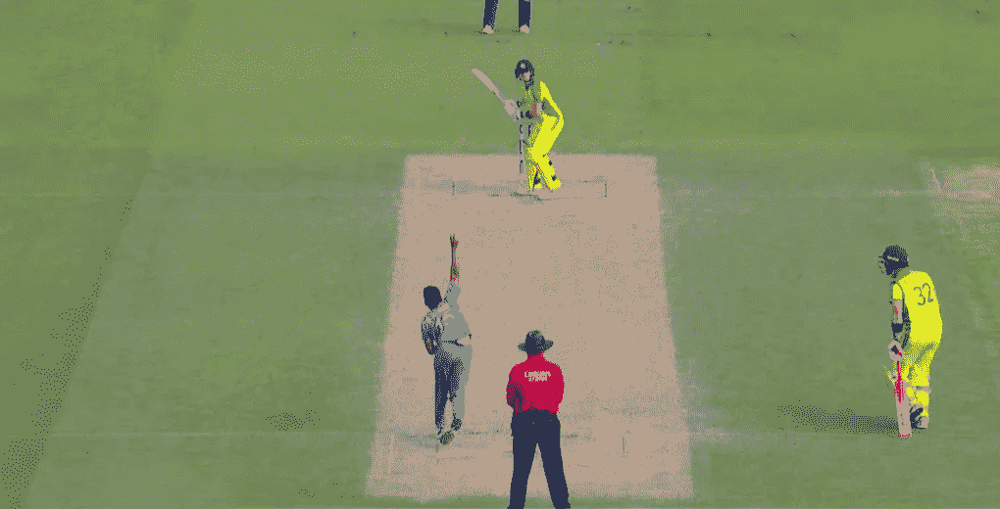
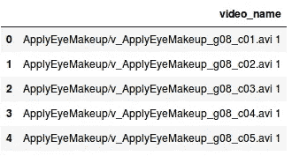
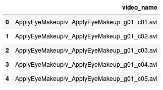
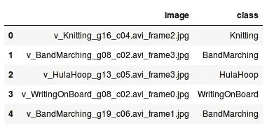
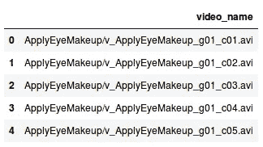

# 一步一步的深度学习教程，构建自己的视频分类模型

> 原文：<https://medium.com/analytics-vidhya/step-by-step-deep-learning-tutorial-to-build-your-own-video-classification-model-2a7b3a85610b?source=collection_archive---------6----------------------->

我已经写了大量关于如何使用图像数据构建计算机视觉模型的文章和指南。检测图像中的对象，对这些对象进行分类，从电影海报中生成标签——使用计算机视觉和深度学习，我们可以做很多事情。

这一次，我决定将我的注意力转向计算机视觉不太为人所知的方面——视频！我们正以前所未有的速度消费视频内容。我觉得计算机视觉的这个领域对数据科学家来说有很大的潜力。

我对将同样的计算机视觉算法应用于视频数据感到好奇。我用来建立图像分类模型的方法——可推广吗？



机器处理视频可能会很棘手。与图像的静态性质相反，它们的动态性质会使数据科学家构建这些模型变得复杂。

但是不要担心，这与处理图像数据没有什么不同。在本文中，我们将使用 Python 构建我们自己的视频分类模型。这是一个非常实用的教程，所以启动你的 Jupyter 笔记本吧——这将是一次非常有趣的旅程。

*如果你是深度学习和计算机视觉领域的新手，我们有完美的课程供你开始你的旅程:*

# 视频分类概述

当你真正分解它时，你会如何定义视频？

> *我们可以说视频是按照特定顺序排列的一组图像的集合。这些图像集也称为帧。*

这就是为什么视频分类问题与图像分类问题没有什么不同。对于图像分类任务，我们获取图像，使用特征提取器(如卷积神经网络或 CNN)从图像中提取特征，然后基于这些提取的特征对图像进行分类。*视频分类只需要一个额外的步骤。*

我们首先从给定的视频中提取帧。然后，我们可以遵循与图像分类任务相同的步骤。这是处理视频数据最简单的方法。

实际上，还有多种其他方法来处理视频，甚至还有一个视频分析的利基领域。我强烈推荐阅读下面的文章，以了解如何在 Python 中处理视频和提取帧:

此外，我们将使用 CNN 从视频帧中提取特征。如果您需要快速复习 CNN 是什么以及它们是如何工作的，您应该从这里开始:

# 建立视频分类模型的步骤

为建立一个能够将视频分类到各自类别的模型而兴奋吗？我们将致力于[ucf 101——动作识别数据集](https://www.crcv.ucf.edu/data/UCF101.php)，它由属于 101 个不同类别的 13，320 个不同的视频剪辑组成。

让我总结一下构建视频分类模型的步骤:

1.  浏览数据集并创建定型和验证集。我们将使用训练集来训练模型，使用验证集来评估训练好的模型
2.  从训练和验证集中的所有视频中提取帧
3.  预处理这些帧，然后使用训练集中的帧训练模型。使用验证集中的框架评估模型
4.  一旦我们对验证集的性能感到满意，就可以使用训练好的模型对新视频进行分类

让我们现在开始探索数据吧！

# 探索视频分类数据集

你可以从[官方 UCF101 网站](https://www.crcv.ucf.edu/data/UCF101.php)下载数据集。数据集在一个*中。rar* 格式，所以我们首先要从中提取视频。创建一个新文件夹，假设是“Videos”(您也可以选择任何其他名称)，然后使用以下命令提取所有下载的视频:

```
unrar e UCF101.rar Videos/
```

UCF101 的官方文档声明:

> **"** 在训练和测试中，将属于同一组的视频分开是非常重要的。因为组中的视频是从单个长视频中获得的，所以在训练和测试集中共享来自同一组的视频将会提供高性能。”

因此，我们将按照官方文档中的建议，将数据集分为训练集和测试集。你可以从这里下载训练/测试分割[。*请记住，由于我们正在处理一个大型数据集，您可能需要很高的计算能力。*](https://www.crcv.ucf.edu/data/UCF101/UCF101TrainTestSplits-RecognitionTask.zip)

我们现在将视频放在一个文件夹中，将训练/测试分割文件放在另一个文件夹中。接下来，我们将创建数据集。打开你的 Jupyter 笔记本，按照下面的代码块。我们将首先导入所需的库:

```
import cv2     # for capturing videos
import math   # for mathematical operations
import matplotlib.pyplot as plt    # for plotting the images
%matplotlib inline
import pandas as pd
from keras.preprocessing import image   # for preprocessing the images
import numpy as np    # for mathematical operations
from keras.utils import np_utils
from skimage.transform import resize   # for resizing images
from sklearn.model_selection import train_test_split
from glob import glob
from tqdm import tqdm
```

我们现在将视频名称存储在数据帧中:

```
# open the .txt file which have names of training videos
f = open("trainlist01.txt", "r")
temp = f.read()
videos = temp.split('\n')

# creating a dataframe having video names
train = pd.DataFrame()
train['video_name'] = videos
train = train[:-1]
train.head()
```



这就是*中给出的视频名称。txt* 文件。它没有正确对齐，我们需要对它进行预处理。在此之前，我们也为测试视频创建一个类似的数据框架:

```
# open the .txt file which have names of test videos
f = open("testlist01.txt", "r")
temp = f.read()
videos = temp.split('\n')

# creating a dataframe having video names
test = pd.DataFrame()
test['video_name'] = videos
test = test[:-1]
test.head()
```



接下来，我们将添加每个视频的标签(针对训练集和测试集)。有没有注意到视频名称中“/”之前的整个部分都代表了视频的标签？因此，我们将在“/”上拆分整个字符串，并为所有视频选择标签:

```
# creating tags for training videos
train_video_tag = []
for i in range(train.shape[0]):
    train_video_tag.append(train['video_name'][i].split('/')[0])

train['tag'] = train_video_tag

# creating tags for test videos
test_video_tag = []
for i in range(test.shape[0]):
    test_video_tag.append(test['video_name'][i].split('/')[0])

test['tag'] = test_video_tag
```

那么下一步是什么？现在，我们将从用于训练模型的训练视频中提取帧。我会将所有帧存储在名为 train_1 的文件夹中。

所以， ***首先新建一个文件夹，重命名为‘train _ 1’***然后按照下面给出的代码提取帧:

```
# storing the frames from training videos
for i in tqdm(range(train.shape[0])):
    count = 0
    videoFile = train['video_name'][i]
    cap = cv2.VideoCapture('UCF/'+videoFile.split(' ')[0].split('/')[1])   # capturing the video from the given path
    frameRate = cap.get(5) #frame rate
    x=1
    while(cap.isOpened()):
        frameId = cap.get(1) #current frame number
        ret, frame = cap.read()
        if (ret != True):
            break
        if (frameId % math.floor(frameRate) == 0):
            # storing the frames in a new folder named train_1
            filename ='train_1/' + videoFile.split('/')[1].split(' ')[0] +"_frame%d.jpg" % count;count+=1
            cv2.imwrite(filename, frame)
    cap.release()
```

这将需要一些时间，因为训练集中有超过 9，500 个视频。一旦帧被提取出来，我们将把这些帧的名称和它们相应的标签保存在一个*中。csv* 文件。创建此文件将帮助我们读取我们将在下一节看到的帧:

```
# getting the names of all the images
images = glob("train_1/*.jpg")
train_image = []
train_class = []
for i in tqdm(range(len(images))):
    # creating the image name
    train_image.append(images[i].split('/')[1])
    # creating the class of image
    train_class.append(images[i].split('/')[1].split('_')[1])

# storing the images and their class in a dataframe
train_data = pd.DataFrame()
train_data['image'] = train_image
train_data['class'] = train_class

# converting the dataframe into csv file 
train_data.to_csv('UCF/train_new.csv',header=True, index=False)
```

到目前为止，我们已经从所有的训练视频中提取了帧并保存在一个*中。csv* 文件及其相应的标签。现在是时候训练我们的模型了，我们将使用它来预测测试集中视频的标签。

# 训练视频分类模型

终于到了训练我们视频分类模型的时候了！我相信这是教程中最令人期待的部分。为了便于理解，我将这个步骤分成了几个子步骤:

1.  阅读我们之前为训练图像提取的所有帧
2.  创建一个验证集，这将有助于我们检查我们的模型在看不见的数据上的表现
3.  定义我们模型的架构
4.  最后，训练模型并保存其权重

# 读取所有视频帧

所以，让我们开始第一步，我们将提取帧。我们将首先导入库:

```
import keras
from keras.models import Sequential
from keras.applications.vgg16 import VGG16
from keras.layers import Dense, InputLayer, Dropout, Flatten
from keras.layers import Conv2D, MaxPooling2D, GlobalMaxPooling2D
from keras.preprocessing import image
import numpy as np
import pandas as pd
import matplotlib.pyplot as plt
from tqdm import tqdm
from sklearn.model_selection import train_test_split
```

记住，我们创造了一个*。csv* 文件，包含每个帧的名称和它们对应的标签？让我们也来读一读:

```
train = pd.read_csv('UCF/train_new.csv')
train.head()
```



这是前五行的样子。我们对每一帧都有相应的类或标签。现在，用这个*。csv* 文件，我们将读取之前提取的帧，然后将这些帧存储为 NumPy 数组:

```
# creating an empty list
train_image = []

# for loop to read and store frames
for i in tqdm(range(train.shape[0])):
    # loading the image and keeping the target size as (224,224,3)
    img = image.load_img('train_1/'+train['image'][i], target_size=(224,224,3))
    # converting it to array
    img = image.img_to_array(img)
    # normalizing the pixel value
    img = img/255
    # appending the image to the train_image list
    train_image.append(img)

# converting the list to numpy array
X = np.array(train_image)

# shape of the array
X.shape
```

**输出:(73844，224，224，3)**

我们有 73，844 张大小为(224，224，3)的图片。接下来，我们将创建验证集。

# 创建验证集

为了创建验证集，我们需要确保每个类在训练集和验证集中的分布是相似的。我们可以使用分层参数来做到这一点:

```
# separating the target
y = train['class']

# creating the training and validation set
X_train, X_test, y_train, y_test = train_test_split(X, y, random_state=42, test_size=0.2, stratify = y)
```

这里，*分层= y* (即每帧的类别或标签)在训练和验证集中保持了类似的类别分布。

记住——一个视频可以分为 101 个类别。因此，我们必须在目标中创建 101 个不同的列，每个类别一个。为此，我们将使用 *get_dummies()* 函数:

```
# creating dummies of target variable for train and validation set
y_train = pd.get_dummies(y_train)
y_test = pd.get_dummies(y_test)
```

下一步—定义我们的视频分类模型的架构。

# 定义视频分类模型的架构

由于我们没有非常大的数据集，从头开始创建模型可能效果不好。因此，我们将使用一个预先训练好的模型，并利用它的学习来解决我们的问题。

对于这个特定的数据集，我们将使用 VGG-16 预训练模型。让我们创建一个预训练模型的基础模型:

```
# creating the base model of pre-trained VGG16 model
base_model = VGG16(weights='imagenet', include_top=False)
```

该模型在具有 1000 个类的数据集上进行训练。我们将按照我们的要求微调这个模型。 *include_top = False* 将移除该模型的最后一层，以便我们可以根据需要对其进行调整。

现在，我们将从这个预训练模型中提取特征，用于我们的训练和验证图像:

```
# extracting features for training frames
X_train = base_model.predict(X_train)
X_train.shape
```

**输出:(59075，7，7，512)**

我们在训练集中有 59，075 个图像，形状已经更改为(7，7，512)，因为我们已经通过 VGG16 体系结构传递了这些图像。类似地，我们将提取验证框架的特征:

```
# extracting features for validation frames
X_test = base_model.predict(X_test)
X_test.shape
```

**输出:(14769，7，7，512)**

验证集中有 14，769 幅图像，这些图像的形状也变成了(7，7，512)。我们现在将使用完全连接的网络来微调模型。这个完全连接的网络接受一维输入。因此，我们将重塑图像到一个单一的维度:

```
# reshaping the training as well as validation frames in single dimension
X_train = X_train.reshape(59075, 7*7*512)
X_test = X_test.reshape(14769, 7*7*512)
```

建议始终将像素值标准化，即保持像素值在 0 和 1 之间。这有助于模型更快地收敛。

```
# normalizing the pixel values
max = X_train.max()
X_train = X_train/max
X_test = X_test/max
```

接下来，我们将创建模型的架构。我们必须为此定义输入形状。所以，让我们检查一下图像的形状:

```
# shape of images
X_train.shape
```

**输出:(59075，25088)**

输入形状将是 25，088。现在让我们创建架构:

```
#defining the model architecture
model = Sequential()
model.add(Dense(1024, activation='relu', input_shape=(25088,)))
model.add(Dropout(0.5))
model.add(Dense(512, activation='relu'))
model.add(Dropout(0.5))
model.add(Dense(256, activation='relu'))
model.add(Dropout(0.5))
model.add(Dense(128, activation='relu'))
model.add(Dropout(0.5))
model.add(Dense(101, activation='softmax'))
```

> *我们有多个完全连接的密集层。我也添加了脱落层，这样模型就不会过拟合。最后一层的神经元数量等于我们拥有的类的数量，因此这里的神经元数量是 101。*

# 训练视频分类模型

现在，我们将使用训练框架来训练我们的模型，并使用验证框架来验证模型。我们将保存模型的权重，这样我们就不必一次又一次地重新训练模型。

所以，让我们定义一个函数来保存模型的权重:

```
# defining a function to save the weights of best model
from keras.callbacks import ModelCheckpoint
mcp_save = ModelCheckpoint('weight.hdf5', save_best_only=True, monitor='val_loss', mode='min')
```

我们将根据验证损失来决定最佳模型。请注意，权重将保存为 *weights.hdf5* 。如果愿意，您可以重命名该文件。在训练模型之前，我们必须编译它:

```
# compiling the model
model.compile(loss='categorical_crossentropy',optimizer='Adam',metrics=['accuracy'])
```

我们使用*分类交叉熵*作为[损失函数](https://www.analyticsvidhya.com/blog/2019/08/detailed-guide-7-loss-functions-machine-learning-python-code/)，优化器是 Adam。让我们训练模型:

```
# training the model
model.fit(X_train, y_train, epochs=200, validation_data=(X_test, y_test), callbacks=[mcp_save], batch_size=128)
```

我已经训练这个模型 200 个纪元了。要下载我训练模型后得到的权重，可以使用 [***这个链接***](https://drive.google.com/file/d/1vo2TBWFlA-yish_h8CgxIrSHnqCHxUUM/view?usp=sharing) 。

我们现在有了权重，我们将用它来预测新的视频。因此，在下一节中，我们将看到这个模型在视频分类任务中的表现如何！

# 评估我们的视频分类模型

让我们打开一个新的 Jupyter 笔记本来评估模型。评估部分也可以分成多个步骤，以便更清楚地理解流程:

1.  定义模型架构并加载权重
2.  创建测试数据
3.  对测试视频进行预测
4.  最后，评估模型

# 定义模型架构和加载权重

您将熟悉第一步—导入所需的库:

```
from keras.models import Sequential
from keras.layers import Dense, Dropout, Flatten
from keras.layers import Conv2D, MaxPooling2D
from keras.preprocessing import image
import numpy as np
import pandas as pd
from tqdm import tqdm
from keras.applications.vgg16 import VGG16
import cv2
import math
import os
from glob import glob
from scipy import stats as s
```

接下来，我们将定义模型架构，该架构将类似于我们在训练模型时的架构:

```
base_model = VGG16(weights='imagenet', include_top=False)
```

这是预训练模型，我们接下来将对其进行微调:

```
#defining the model architecture
model = Sequential()
model.add(Dense(1024, activation='relu', input_shape=(25088,)))
model.add(Dropout(0.5))
model.add(Dense(512, activation='relu'))
model.add(Dropout(0.5))
model.add(Dense(256, activation='relu'))
model.add(Dropout(0.5))
model.add(Dense(128, activation='relu'))
model.add(Dropout(0.5))
model.add(Dense(101, activation='softmax'))
```

现在，由于我们已经定义了架构，我们现在将加载我们存储为 *weights.hdf5* 的训练权重:

```
# loading the trained weights
model.load_weights("weights.hdf5")
```

也编译模型:

```
# compiling the model
model.compile(loss='categorical_crossentropy',optimizer='Adam',metrics=['accuracy'])
```

确保损失函数、优化器和指标与我们在训练模型时使用的相同。

# 创建测试数据

您应该已经按照 UCF101 数据集的官方文档下载了训练/测试分割文件。如果没有，从这里下载[。在下载的文件夹中，有一个名为“ *testlist01.txt* 的文件，其中包含了测试视频的列表。我们将利用它来创建测试数据:](https://www.crcv.ucf.edu/data/UCF101/UCF101TrainTestSplits-RecognitionTask.zip)

```
# getting the test list
f = open("testlist01.txt", "r")
temp = f.read()
videos = temp.split('\n')# creating the dataframe
test = pd.DataFrame()
test['video_name'] = videos
test = test[:-1]
test_videos = test['video_name']
test.head()
```



我们现在有了存储在数据帧中的所有视频的列表。为了将预测类别映射到实际类别，我们将使用 *train_new.csv* 文件:

```
# creating the tags
train = pd.read_csv('UCF/train_new.csv')
y = train['class']
y = pd.get_dummies(y)
```

现在，我们将对测试集中的视频进行预测。

# 为测试视频生成预测

在查看代码之前，让我总结一下我们将在这一步做什么。以下步骤将帮助您理解预测部分:

1.  首先，我们将创建两个空列表——一个存储预测，另一个存储实际的标签
2.  然后，我们将从测试集中取出每个视频，提取该视频的帧并将其存储在一个文件夹中(在当前目录中创建一个名为 ***temp*** 的文件夹来存储帧)。我们将在每次迭代中从这个文件夹中移除所有其他文件
3.  接下来，我们将从 ***temp*** 文件夹中读取所有帧，使用预先训练的模型提取这些帧的特征，预测标签，然后采用该模式为该特定视频分配标签并将其附加到列表中
4.  我们将在第二个列表中为每个视频添加实际的标签

让我们对这些步骤进行编码并生成预测:

```
# creating two lists to store predicted and actual tags
predict = []
actual = []# for loop to extract frames from each test video
for i in tqdm(range(test_videos.shape[0])):
    count = 0
    videoFile = test_videos[i]
    cap = cv2.VideoCapture('UCF/'+videoFile.split(' ')[0].split('/')[1])   # capturing the video from the given path
    frameRate = cap.get(5) #frame rate
    x=1
    # removing all other files from the temp folder
    files = glob('temp/*')
    for f in files:
        os.remove(f)
    while(cap.isOpened()):
        frameId = cap.get(1) #current frame number
        ret, frame = cap.read()
        if (ret != True):
            break
        if (frameId % math.floor(frameRate) == 0):
            # storing the frames of this particular video in temp folder
            filename ='temp/' + "_frame%d.jpg" % count;count+=1
            cv2.imwrite(filename, frame)
    cap.release()

    # reading all the frames from temp folder
    images = glob("temp/*.jpg")

    prediction_images = []
    for i in range(len(images)):
        img = image.load_img(images[i], target_size=(224,224,3))
        img = image.img_to_array(img)
        img = img/255
        prediction_images.append(img)

    # converting all the frames for a test video into numpy array
    prediction_images = np.array(prediction_images)
    # extracting features using pre-trained model
    prediction_images = base_model.predict(prediction_images)
    # converting features in one dimensional array
    prediction_images = prediction_images.reshape(prediction_images.shape[0], 7*7*512)
    # predicting tags for each array
    prediction = model.predict_classes(prediction_images)
    # appending the mode of predictions in predict list to assign the tag to the video
    predict.append(y.columns.values[s.mode(prediction)[0][0]])
    # appending the actual tag of the video
    actual.append(videoFile.split('/')[1].split('_')[1])
```

**这一步需要一些时间，因为测试集中大约有 3，800 个视频。**一旦我们有了预测，我们将计算模型的性能。

# 评估模型

是时候评估我们的模型了，看看到底是怎么回事。

我们有实际的标签，也有模型预测的标签。我们将利用这些来获得准确度分数。*在 UCF101 的官方文档页面上，目前准确率为 43.90%。*我们的模型能打败它吗？让我们检查一下！

```
# checking the accuracy of the predicted tags
from sklearn.metrics import accuracy_score
accuracy_score(predict, actual)*100
```

**产量:44.8416337**

太好了！我们的模型的 44.8%的准确性与官方文档所陈述的(43.9%)相当。

你可能想知道为什么我们对低于 50%的准确率感到满意。这种低准确性背后的原因主要是由于缺乏数据。我们只有大约 13，000 个视频，即使这些视频的持续时间也很短。

# 结束注释

在本文中，我们讨论了计算机视觉最有趣的应用之一——视频分类。我们首先了解如何处理视频，然后我们提取帧，训练视频分类模型，最终在测试视频上获得了 44.8%的可比准确率。

我们现在可以尝试不同的方法，旨在提高模型的性能。我能想到的一些方法是使用 3D 卷积，它可以直接处理视频。

由于视频是一系列的帧，我们也可以把它作为一个序列问题来解决。因此，可能有更多的解决方案，我建议你去探索它们。请随时与社区分享您的发现。

一如既往，如果你有任何与本文相关的建议或疑问，请在下面的评论区发表，我很乐意回答。正如我之前提到的，如果你是这个领域的新手，一定要去看看[的计算机视觉课程](https://courses.analyticsvidhya.com/courses/computer-vision-using-deep-learning-version2/?utm_source=blog&utm_medium=step-by-step-deep-learning-tutorial-video-classification-python)。

*原载于 2019 年 9 月 3 日*[*https://www.analyticsvidhya.com*](https://www.analyticsvidhya.com/blog/2019/09/step-by-step-deep-learning-tutorial-video-classification-python/)*。*