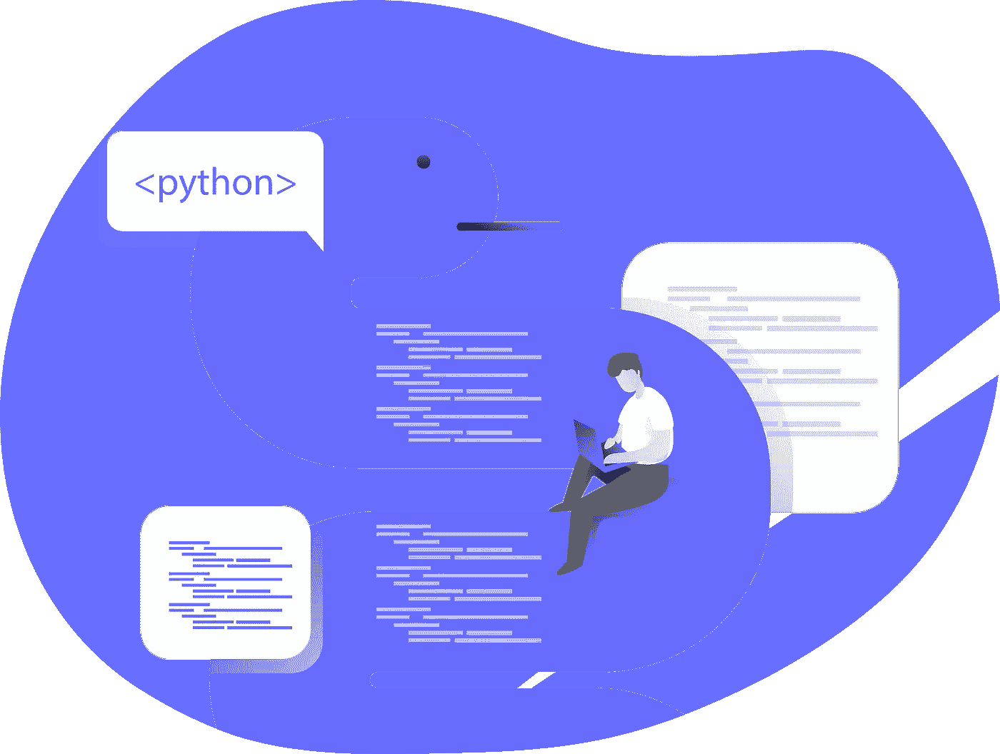

# 在 macOS 上安装或升级 Python 环境的分步指南

> 原文：<https://medium.com/analytics-vidhya/step-by-step-guide-for-installing-or-upgrading-python-environment-on-macos-3f54d856c8f8?source=collection_archive---------18----------------------->

> 在 Mac OS 上安装或升级 Python 时要遵循的 18 个步骤

# Python 是什么？

Python 是最常用的通用编程语言之一，通常用于各种各样的应用。Python 包括许多高级数据结构、动态类型、动态绑定等等…