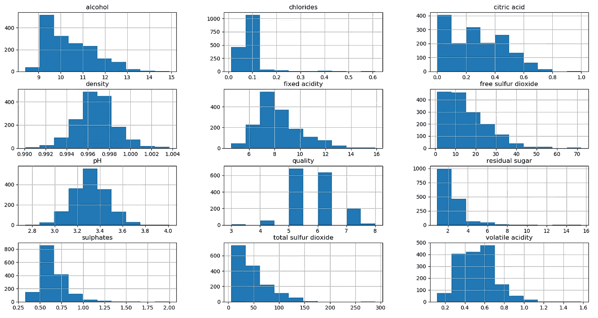
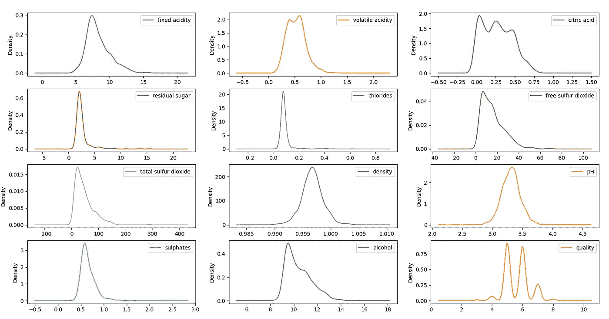
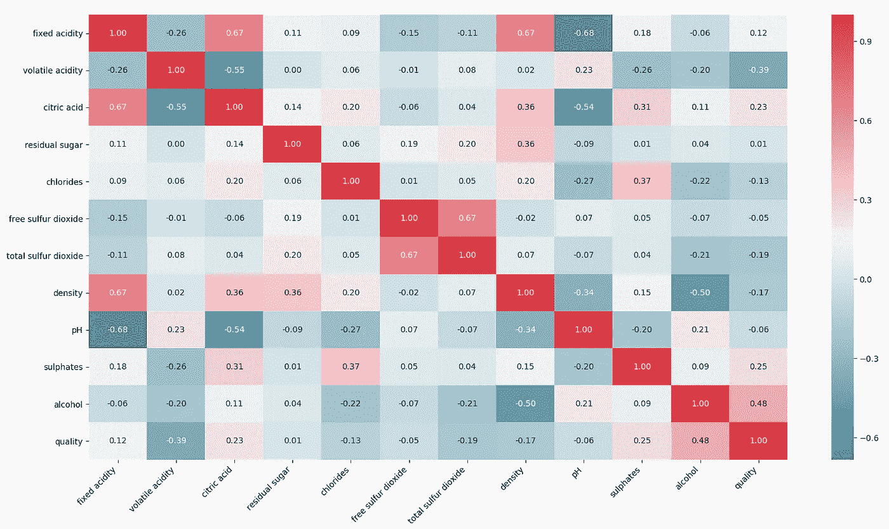
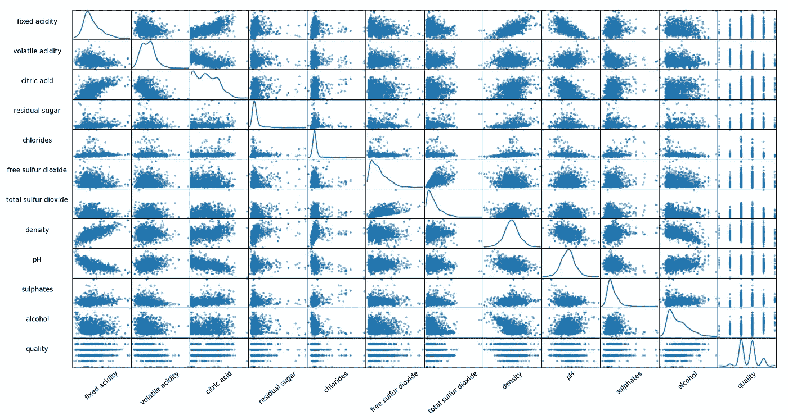
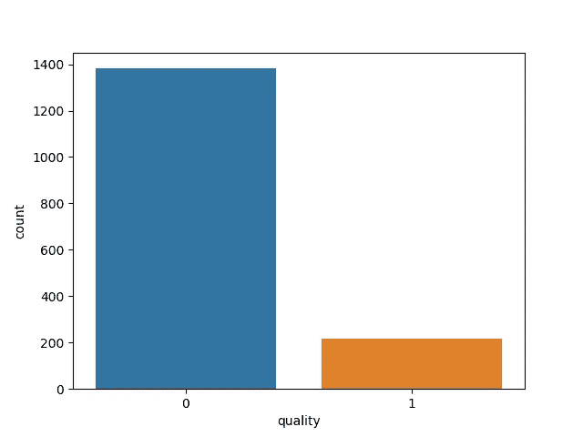
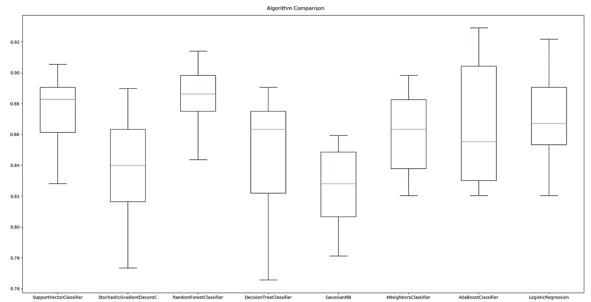
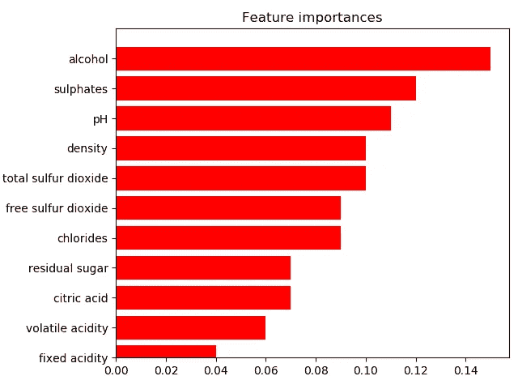

# 使用 Scikit-Learn 预测葡萄酒偏好的分步指南

> 原文：<https://medium.com/analytics-vidhya/step-by-step-guide-for-predicting-wine-quality-using-scikit-learn-de5869f8f91a?source=collection_archive---------1----------------------->


在这种情况下，你是机器学习的新手，写机器学习项目令人毛骨悚然，只要通过这篇博文深入数据科学管道。这篇博文一步一步地讲述了 Python 中基本的机器学习过程。

**数据科学管道的基本步骤:**

1.  把问题框起来，看大局。
2.  获取数据。
3.  探索数据以获得洞察力。
4.  准备数据以更好地将底层数据模式暴露给机器学习算法。
5.  探索许多不同的模型，并列出最佳模型。
6.  微调您的模型，并将它们组合成一个伟大的解决方案。
7.  提出你的解决方案。
8.  启动、监控和维护您的系统。

> 请随意根据您的需求调整此管道！

## 1.把问题框起来，看大局。

首先，我们需要从商业角度定义目标。因为我们的工作是预测人类对葡萄酒的口味偏好，这些偏好基于认证阶段容易获得的分析测试。我们希望获得 90%以上的准确率。预测值可用于设计新类型的葡萄酒，定义定价政策或支持咨询系统中的决策。

在问题框架期间，我们定义我们的系统将使用批量学习技术。如果我们收集更多的数据，并提供基于物理化学性质的葡萄酒排名控制研究，这将是一项昂贵且不必要的任务。

因此，该系统将被培训，然后投入生产和运行，无需再学习。它只会应用它所学到的东西。这通常需要时间和计算资源。

此外，我们可以尝试两种方法:

*   通过比较新数据点和已知数据点，构建基于实例的学习系统。
*   像科学家一样，通过检测训练数据中的模式来建立基于模型的学习系统，并建立预测模型。

> **让我们假设一下。**
> 
> 零假设( *H0* )是指*没有一个*质量排名中的方差是由理化性质解释的。另一个假设( *H1* )是物理化学性质对质量等级差异的贡献，使葡萄酒“好”或反之“坏”。

## 2.获取数据

我们将使用来自葡萄牙北部的红葡萄酒样本的真实数据集。该数据集可从 https://archive.ics.uci.edu/ml/datasets/wine+quality.[UCI 机器学习库](https://archive.ics.uci.edu/ml/datasets/wine+quality.) 获得。该数据集可被视为分类或回归任务。

***输入变量(基于理化试验):***
*1 固定酸度；
2 挥发性酸度；
3 柠檬酸；
4 残糖；
5 氯化物；
6 游离二氧化硫；
7 总二氧化硫；
8 密度；
9ph；
10 硫酸盐；
11 酒精。*

***输出变量(基于感官数据):*** *12 个质量(得分在 0 到 10 之间)。*

让我们获取数据，并将它们转换成数据框的格式，以便更容易操作。数据调查是一项有趣且令人上瘾的任务。看看你的数据，检查它们的维度和类型。

在[1]中:

```
# Load in the red wine data from the UCI ML website.
df = pd.read_csv('http://archive.ics.uci.edu/ml/machine-learning-databases/wine-quality/winequality-red.csv',sep=';')# Take a look
print(df.head(10))
# Data dimensionality (rows, colums)
print(df.shape)
# Data distributing
df.info()
```

Out [1]:

在数据调查之前，你应该已经完成了最重要的步骤之一是**数据分割。**数据被分成两组:训练集 *80%* ，测试集 *20%* 。训练集应该用于构建您的机器学习模型。测试集应该用于查看您的模型在看不见的数据上的表现。

在[2]中:

```
# Now seperate the dataset as response variable and feature variabes
X = df.drop('quality', axis=1)
y = df['quality']# Train and Test splitting of data
X_train, X_test, y_train, y_test = train_test_split(X, y, test_size=0.2, random_state=50)# Applying Standard scaling to get optimized result
sc = StandardScaler()
X_train = sc.fit_transform(X_train)
X_test = sc.fit_transform(X_test)
```

> 没有数据窥探！

## 3.探索数据以获得洞察力

到目前为止，我们只是快速浏览了一下数据，以便对我们正在处理的数据类型有一个大致的了解。现在我们将使用测试集来探索数据。

看看每个数字特征的基本统计特征会很有趣。count、mean、min 和 max 行是不言自明的。标准行显示标准偏差(测量值的分散程度)。25%、50%和 75%的行显示相应的百分位数。

在[3]中:

```
# Statistical characteristics of each numerical feature
print(df.describe())
```

Out [3]:

可视化数据对于识别模型中要利用的底层模式至关重要。当数据恰当地可视化时，就能清楚地看到趋势和模式，变量之间的相关性，因为我们的大脑非常善于在图片上发现模式。让我们尝试不同类型的数据可视化和参数，让模式脱颖而出。

使用下面的图，我们可以了解不同属性的数据分布；**例如，属性“酒精”的数据分布呈正态分布，而属性“*密度*”的数据呈正态分布。注意葡萄酒质量数据的分布。这是一个双峰分布，平均质量的葡萄酒比“好”或“差”质量的葡萄酒多。**

在[4]中:

```
# Histograms
df.hist(bins=10,figsize=(6, 5))
plt.show()# Density
df.plot(kind='density', subplots=True, layout=(4,3), sharex=False)
plt.show()
```

Out [4]:



柱状图



密度

探索数据的另一种方式是一个非常方便的工具数据透视表。数据透视表是数据的汇总，打包在一个图表中，使您可以根据信息报告和探索趋势。如果您有很长的行或列来保存您需要跟踪总和并容易相互比较的值，则数据透视表特别有用。因此，我们的数据透视表描述了每个质量分数的每个特性的中间值。现在，我们可以跟踪趋势，例如，“硫酸盐”的最高值往往是最高的“质量”分数。但是我们不能根据相关性得出结论。

> 相关性不会导致因果关系。

在[5]中:

```
# Create pivot_table
colum_names = ['fixed acidity', 'volatile acidity', 'citric acid', 'residual sugar', 'chlorides', 'free sulfur dioxide', 'total sulfur dioxide', 'density', 'pH', 'sulphates', 'alcohol']
df_pivot_table = df.pivot_table(colum_names,
               ['quality'], aggfunc='median')
print(df_pivot_table)
```

Out [5]:

为了了解每个属性与葡萄酒质量分数的相关程度，请计算每对属性之间的标准相关系数(也称为皮尔逊相关系数)。

在[6]中:

```
corr_matrix = df.corr()
print(corr_matrix["quality"].sort_values(ascending=False))
```

Out [5]:

相关系数范围从–1 到 1。当接近 1 时，说明有很强的正相关性；例如，**“质量”值往往会随着“酒精”的上升而上升**。当系数接近–1 时，说明有很强的负相关性；**你可以看到“挥发性酸度”和“质量”值**之间存在微小的负相关性。最后，系数接近零意味着没有线性相关性。

您可以使用关联矩阵查看有关数据关联的更多详细信息。相关矩阵为我们提供了两个变量如何相互作用的信息，包括方向和大小。

在[7]中:

```
colum_names = ['fixed acidity', 'volatile acidity', 'citric acid', 'residual sugar', 'chlorides', 'free sulfur dioxide', 'total sulfur dioxide', 'density', 'pH', 'sulphates', 'alcohol', 'quality']
# Correlation matrix
correlations = df.corr()
# Plot figsize
fig, ax = plt.subplots(figsize=(10, 10))
# Generate Color Map
colormap = sns.diverging_palette(220, 10, as_cmap=True)
# Generate Heat Map, allow annotations and place floats in map
sns.heatmap(correlations, cmap=colormap, annot=True, fmt=".2f")
ax.set_xticklabels(
    colum_names,
    rotation=45,
    horizontalalignment='right'
);
ax.set_yticklabels(colum_names);
plt.show()
```

Out [7]:



您可以将散点图矩阵可视化，以便更好地理解一对变量之间的关系。它将每个数字属性与其他属性相对照。

在[8]中:

```
# Scatterplot Matrix
sm = scatter_matrix(df, figsize=(6, 6), diagonal='kde')
#Change label rotation
[s.xaxis.label.set_rotation(40) for s in sm.reshape(-1)]
[s.yaxis.label.set_rotation(0) for s in sm.reshape(-1)]
#May need to offset label when rotating to prevent overlap of figure
[s.get_yaxis().set_label_coords(-0.6,0.5) for s in sm.reshape(-1)]
#Hide all ticks
[s.set_xticks(()) for s in sm.reshape(-1)]
[s.set_yticks(()) for s in sm.reshape(-1)]
plt.show()
```

Out[8]:



注意属性“固定酸度”和“密度”之间的相关性。它们的相关系数是 0.67(您可以在相关矩阵中找到值)，查看对应的散点图，我们可以看到属性之间的正线性相关。您还可以清楚地看到上升趋势，这些点在这些属性之间并不太分散。这样，您就可以分析其他属性。

> 在为机器学习算法实际准备数据之前，您可能想要做的最后一件事是尝试各种属性组合。

## 4.准备数据以更好地将底层数据模式暴露给机器学习算法

是时候为我们的机器学习算法准备数据了。在我们的数据集中，没有任何缺失值、异常值和对任务没有任何有用信息的属性。因此，我们可以得出结论，我们的数据集非常干净。因此，我们不会做任何艰苦的数据准备，但有些事情是需要做的。人类对葡萄酒的偏好得分从 3 到 8 不等，因此很容易将答案分为葡萄酒质量“差”或“好”。这允许我们在例如决策树算法上练习超参数调整。可视化每个类别的数值的图表，我们可以看到坏的答案远远多于好的答案。当然，机器学习算法操作数字值，所以我们为分类指定相应的离散值 0 或 1。

在[9]中:

```
# Dividing wine as good and bad by giving the limit for the quality
bins = (2, 6, 8)
group_names = ['bad', 'good']
df['quality'] = pd.cut(df['quality'], bins = bins, labels = group_names)# Now lets assign a labels to our quality variable
label_quality = LabelEncoder()
# Bad becomes 0 and good becomes 1
df['quality'] = label_quality.fit_transform(df['quality'])
print(df['quality'].value_counts())sns.countplot(df['quality'])
plt.show()
```

Out[9]:



## 5.探索许多不同的模式，并列出最好的

评估机器学习模型可能非常棘手。通常基于误差度量对性能进行建模评估。然而，这种方法并不十分可靠，因为一个测试集所获得的精度可能与另一个测试集所获得的精度相差很大。

在下面的例子中，比较了 8 种不同的算法:

1.  支持向量分类器
2.  随机梯度下降分类器
3.  随机森林分类器
4.  决策树分类器
5.  高斯朴素贝叶斯
6.  k 近邻分类器
7.  Ada Boost 分类器
8.  逻辑回归

公平比较机器学习算法的关键是确保每个算法在相同的数据上以相同的方式进行评估。 *K-fold 交叉验证(CV)* 通过将数据划分为多个折叠，并确保每个折叠在某个点被用作测试集，为这个问题提供了一个解决方案。

在[10]中:

```
# prepare configuration for cross validation test harness
seed = 7
# prepare models
models = []
models.append(('SupportVectorClassifier', SVC()))
models.append(('StochasticGradientDecentC', SGDClassifier()))
models.append(('RandomForestClassifier', RandomForestClassifier()))
models.append(('DecisionTreeClassifier', DecisionTreeClassifier()))
models.append(('GaussianNB', GaussianNB()))
models.append(('KNeighborsClassifier', KNeighborsClassifier()))
models.append(('AdaBoostClassifier', AdaBoostClassifier()))
models.append(('LogisticRegression', LogisticRegression()))# evaluate each model in turn
results = []
names = []
scoring = 'accuracy'
for name, model in models:
   kfold = model_selection.KFold(n_splits=10, random_state=seed)
   cv_results = model_selection.cross_val_score(model, X_train, y_train, cv=kfold, scoring=scoring)
   results.append(cv_results)
   names.append(name)
   msg = "%s: %f (%f)" % (name, cv_results.mean(), cv_results.std())
   print(msg)
# boxplot algorithm comparison
fig = plt.figure()
fig.suptitle('Algorithm Comparison')
ax = fig.add_subplot(111)
plt.boxplot(results)
ax.set_xticklabels(names)
plt.show()
```

Out[10]:



## 6.微调您的模型，并将它们组合成一个伟大的解决方案

有几个因素可以帮助您确定哪种算法执行得最好。其中一个因素是交叉验证集的性能，另一个因素是算法参数的选择。

我们来微调一些机器学习算法。我们训练和评估的第一个算法是支持向量分类器，模型预测的平均值等于 *0.873364* 。为您的模型选择超参数的最和谐方式是什么？它试图猜测或循环遍历参数，然后运行所有的参数组合？使用网格搜索 CV 还有一个更有利的方法。

在[11]中:

```
def svc_param_selection(X, y, nfolds):
    param = {
        'C': [0.1, 0.8, 0.9, 1, 1.1, 1.2, 1.3, 1.4],
        'kernel': ['linear', 'rbf'],
        'gamma': [0.1, 0.8, 0.9, 1, 1.1, 1.2, 1.3, 1.4]
    }
    grid_search = GridSearchCV(svc, param_grid=param, scoring='accuracy', cv=nfolds)
    grid_search.fit(X,  y)
    return grid_search.best_params_print(svc_param_selection(X_train, y_train,10))
```

Out[11]:

```
{'C': 1.3, 'gamma': 1.3, 'kernel': 'rbf'}
```

让我们用最佳参数再次运行 SVC。

在[12]中:

```
svc = SVC(C = 1.3, gamma =  1.3, kernel= 'rbf')
svc.fit(X_train, y_train)
pred_svc = svc.predict(X_test)
print('Confusion matrix')
print(confusion_matrix(y_test, pred_svc))print('Classification report')
print(classification_report(y_test, pred_svc2))
print('Accuracy score',accuracy_score(y_test, pred_svc2))
```

Out[12]:

因此，在为算法选择参数后，预测葡萄酒偏好的准确率为 93%。

现在让我们尝试微调另一个算法 AdaBoost，使用交叉验证，准确率达到 86%。

在[13]中:

```
ada_classifier = AdaBoostClassifier(n_estimators=100)
ada_classifier.fit(X_train, y_train)
pred_ada = ada_classifier.predict(X_test)

# Cross-validation
scores = cross_val_score(ada_classifier,X_test,y_test, cv=5)
print('Accuracy score',scores.mean())
```

Out[13]:

```
Accuracy score 0.903
```

我们可以分析的另一个吸引人的事情是机器学习算法的特征重要性。

```
importance=ada_classifier.feature_importances_

std = np.std([tree.feature_importances_ for tree in ada_classifier.estimators_],
             axis=0)
indices = np.argsort(importance)

# Plot the feature importances of the forest
plt.figure()
plt.title("Feature importances")
plt.barh(range(X.shape[1]), importance[indices],
       color="b",  align="center")

plt.yticks(range(X.shape[1]), colum_names)
plt.ylim([0, X.shape[1]])
plt.show()
```



## 7.展示您的解决方案

让我们根据已经完成的管道得出一些结论。我们的数据集非常干净，具有代表性。我们将目标值分为离散值，对应于葡萄酒的“好”或“坏”质量。

在数据集中，我们发现了“酒精”和“葡萄酒质量”、“固定酸度”和“密度”以及另一个特征之间有趣的相关性。在分析了机器学习算法的特征重要性后，我们可以得出结论，调整像“酒精”、“硫酸盐”和“pH”这样的特征可能会使葡萄酒的分数更高或更低。基于这一信息，改变你的调子，改变葡萄酒的物理化学特性，将是有益的。因为它会影响人类的偏好。

通过我们提供的对比分析，我们可以突出机器学习算法，如*支持向量分类器*和*随机森林分类器。*那些算法的精度分布的箱线图相当对称，没有异常值。相邻的盒图值靠得很近，这对应于高密度的准确度得分。

顺便说一下，如果不调整机器学习算法，我们就无法实现预测葡萄酒偏好的平均准确率超过 90 %。我们使用*网格搜索 CV* 对*支持向量分类器*进行了微调，达到了**93%的准确率。**目标已经达到。

## 8.启动、监控和维护您的系统

现在，您的解决方案可以投入生产了！该系统采用批量学习技术，不会对新数据进行训练。因此，随着时间的推移，数据不会“腐烂”。但是，如果您的模型定期使用新数据进行训练，您需要编写监控代码，定期检查系统的实时性能，并在性能下降时触发警报。在这种情况下，您不仅会遇到突然损坏，还会遇到性能下降。

> *一个完整的 Jupyter 笔记本的项目代码可以在* [*这里*](https://gist.github.com/NataliiaRastoropova/1d861775c47516d99e8dcb444eaa7049) *找到。*

> 感谢您的阅读！我希望这篇文章让您对数据科学管道有了基本的了解。如果你有任何问题或发现错误，随时评论或写信给我 shkarupa.nataliia@gmail.com。

*参考文献:*

[“用 Scikit-Learn 和 Tensorflow 实践机器学习](https://www.amazon.com/Hands-Machine-Learning-Scikit-Learn-TensorFlow/dp/1491962291/ref=sr_1_4)

[](https://www.kaggle.com/uciml/red-wine-quality-cortez-et-al-2009) [## 红酒质量

### 用于回归或分类建模的简单明了的实践数据集

www.kaggle.com](https://www.kaggle.com/uciml/red-wine-quality-cortez-et-al-2009) [](https://dictionary.cambridge.org/ru/%D1%81%D0%BB%D0%BE%D0%B2%D0%B0%D1%80%D1%8C/%D0%B0%D0%BD%D0%B3%D0%BB%D0%B8%D0%B9%D1%81%D0%BA%D0%B8%D0%B9/absorbing?topic=exciting-and-interesting) [## 吸收кембриджском的языка

### 吸收:吸收的东西非常有趣，可以吸引你的注意力。Узнать…

dictionary.cambridge.org](https://dictionary.cambridge.org/ru/%D1%81%D0%BB%D0%BE%D0%B2%D0%B0%D1%80%D1%8C/%D0%B0%D0%BD%D0%B3%D0%BB%D0%B8%D0%B9%D1%81%D0%BA%D0%B8%D0%B9/absorbing?topic=exciting-and-interesting) [](/datadriveninvestor/k-fold-cross-validation-6b8518070833) [## k 倍交叉验证

### 评估机器学习模型可能非常棘手。通常，我们将数据集分成训练集和测试集…

medium.com](/datadriveninvestor/k-fold-cross-validation-6b8518070833) [](https://machinelearningmastery.com/compare-machine-learning-algorithms-python-scikit-learn/) [## 如何比较 Python 中的机器学习算法和 scikit-learn

### 始终如一地比较多种不同机器学习算法的性能非常重要。在这篇文章中…

machinelearningmastery.com](https://machinelearningmastery.com/compare-machine-learning-algorithms-python-scikit-learn/)