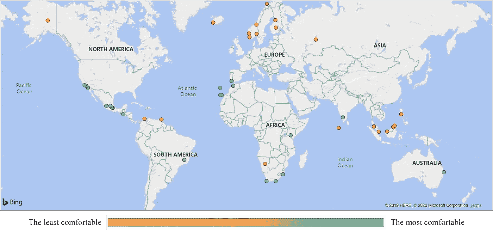

# 使用天气数据集的分步指南

> 原文：<https://medium.com/analytics-vidhya/step-by-step-guide-on-working-with-the-weather-dataset-9aa8c77e30a8?source=collection_archive---------21----------------------->

在我之前的文章中，我发表了过去 5 年(2015 年至 2020 年)全球 477 个城市的天气分析结果，可以在这里[访问](/@esimonova/the-quest-for-finding-the-best-weather-in-the-world-bd5f24f7da09)。今天，我将解释我的努力的技术背景，希望这对面临类似数据分析项目的其他人有用。

熊猫，Dask 还是 PySpark？您应该为数据集选择什么？(medium.com 张萌)

在我们开始处理数据之前，我们需要决定使用哪个库。上面你可以看到一个简单的决策树，它将帮助我们找出一个最佳的方法。在我的例子中，总数据库大小约为 900 兆字节，有 2100 万条观察数据，所以我选择了熊猫。从技术上讲，由于我是一次处理一个城市的数据，所以我使用了 chunksize 方法，因为我没有将整个数据库加载到内存中。

我们的第一步是评估数据的质量。我在 PostgreSQL 浏览器中手动检查了第一个城市的年度数据。我检查了数据集中是否有丢失的值，并发现了一些小时/天丢失或某些天的湿度/温度数据不可用方面的差距。然后，我检查数据是否一致，例如，datetime 观察是否在同一时间进行，理想情况下每小时取整一次，但实际情况并非如此。下一步是识别数据中的异常值。我检查了我将用于这个项目的数据列是否没有极端的异常值。例如，相对湿度应该只在 0 到 100 之间变化，因此看到高于 100 的值意味着数据集中有问题。使用 SQL 代码，我检查了数据没有负值或超过 100 的值。

我已经开始使用一种类似的基本方法来检测温度值中的异常值。我查看了维基百科上的温度记录，大多数国家的记录都在 50 摄氏度左右。然而，在我的数据集中，有 135 个值超过了这个值。这些温度可能是由温度计的错误造成的。我用 Python 写了一行，将每一行与下一行进行比较，以检查两次观察之间的温度变化是否小于 5 度。但首先我想检查一下每小时最频繁的变化是什么。所以我计算了整个数据集各行之间的差异。正如所料，最频繁的变化是零。考虑到数据中有一些丢失的小时，我决定位于平均值的三个标准偏差(99.7%的数据)内的一切都是每小时的正常温度变化。但是，其余的(0.3 %的数据)应该排除在外。所以我找出了 99.85 和 0.15 个百分点，分别是 5 和-5，我用它们来排除数据，这些数据可能是由于测量错误而出现的

之后，我安装了连接 PostgreSQL 和进行数据分析所需的所有软件包，分别是 SQLAlchemy (1.3.12)、pandas (0.25.3)、psycopg2 (2.8.4)和 psycopg2-binary (2.8.4)。然后我连接到 PostgreSQL 来获取数据，并通过 SQL 查询创建了一个熊猫表。

还以更严格的统计方式检查了数据中是否存在异常值。在一个单独的脚本中，在建立了到数据库的连接之后，从 SQL 查询中创建了 pandas 表。然后，创建了函数 find_outliers。该函数用于 heat_index 列和相对湿度列。然后，下面的函数会将异常值添加到列表中。对于相对湿度数据，低于 8%的湿度被标记为异常值。然而，相对湿度是从温度和露点计算出来的，如果露点极低而温度很高，它给出的相对湿度值低于 8%，所以我没有从分析中排除这些值。

然后我继续清理数据。首先，我删除了所有不必要的列，它们是观测 id(“id”)、完成观测的时间“end_time”(该列与 start_time 相同，因此我保留 start_time 以获得 datetime 对象)、日期标识符(“day_ind”)，它显示观测是在白天(D)还是在晚上(N)、进行观测的机场位置(“airport_four_letter_code”)、“dew_point”、天气“type”(“wx _ icon”)、大气压力(“pressure”)、“visibility”——这些列没有包含在我的分析中选择要移除的柱子是非常主观的，因为风寒会降低感知温度，这在温暖的天气会产生积极的影响，在寒冷的天气会产生消极的影响。很难客观地测量包括风参数在内的天气，因此在本文中不包括它。然后我删除了重复项和所有温度为空的行。对于相对湿度缺失的数据，我使用了 pandas 方法 fillna (method='fflil ')，因为湿度在几个小时或几天内变化不大(我允许自己这样做，因为没有很多缺失值)。

我的分析还依赖于为雨天提供惩罚，然而不幸的是，我的数据集中的*降水量*列的值不正确，更好的值是免费提供的。然而，数据集包含一个更准确的列，名为*wx _ phrase*——对当时天气状况的简短描述——小雨、雪、晴天、云等。由于我的天气质量公式只依赖于温度、湿度和降雨的存在，我能够根据降雨的存在将所有的天气条件绘制成一个真/假列。例如，*is _ deposition*在“阳光明媚”的时候是假的，但在“小雨”的时候是真的。

另一个挑战是价值观缺失。一些气象站每隔几小时才更新一次天气。其他人甚至在整个数据集中到处都有几天不见了。因此，我需要推断数据框架中缺失的天数和小时数。对于每个城市和年份的组合，我得出的逻辑如下:

1.  检查一年的第一天是否存在。如果没有，就抓住前一年的最后一天
2.  按时间顺序走过一年中的每一天，直到我们找到缺失的一天
3.  对于每个缺少的日子，将前一天的值复制到其中
4.  重复，直到我们到达年底

因此，如果我的数据集错过了 6 月 1 日，我会将 5 月 31 日的值复制到其中。对于我的分析来说，这似乎是可以接受的，因为天气通常在一天内变化很小。后来，我需要解决一天中缺少时间的问题:

1.  将所有时间戳值四舍五入到最接近的小时
2.  删除舍入过程中可能出现的任何重复项(例如，1:50 和 1:55 都将舍入到 2:00)
3.  检查一年中第一天的第一个小时是否存在。如果没有，那就抓住去年最后一个小时
4.  按照时间顺序遍历一年中每一个可能的小时，直到我们找到一个丢失的小时(例如，从 1 月 1 日 00:00 开始，然后继续到 01:00，等等)
5.  与天数逻辑类似，复制前一个可用小时来代替丢失的小时
6.  继续，直到所有缺少的小时数都已填满

体验过 Pandas 的读者可能会注意到[这是一个低效的算法](https://stackoverflow.com/questions/16476924/how-to-iterate-over-rows-in-a-dataframe-in-pandas/55557758)，因为我被迫遍历数据帧，而不是使用一个本地外推函数或 lambda 函数。不幸的是，当时我找不到更好的解决方案，但如果你能在评论中解释一下，我会很高兴。不过好的一面是这个操作只需要完成一次，因为天气得分的计算与缺失值的外推是分开进行的。因此，在我的数据分析中，我只使用了一次低效的 pandas 操作。

接下来，我使用一个简单的 lambda 函数计算天气得分，并将干净的数据加载回 PostgreSQL。

用于分析的完整版本代码可以在[这里](https://github.com/kate-simonova/py-weather-analytics)找到。我希望你喜欢阅读！