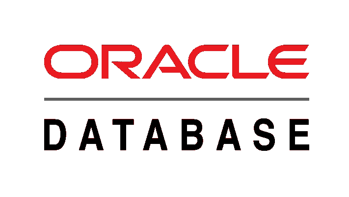

# 在 Oracle 11g 快速版中连接您的人力资源帐户的分步指南

> 原文：<https://medium.com/analytics-vidhya/step-by-step-guide-to-connect-your-hr-account-in-oracle-11g-express-edition-dc139afa43bb?source=collection_archive---------4----------------------->

> 连接您的人力资源帐户的 8 个步骤

# Oracle 中的 HR 用户账户是什么？

HR 是一个示例用户帐户，它允许用户查看 SQL 查询是如何执行的，以及表是如何相互连接的。在人力资源数据库中，所有的表都是在完成标准化后创建的(即…