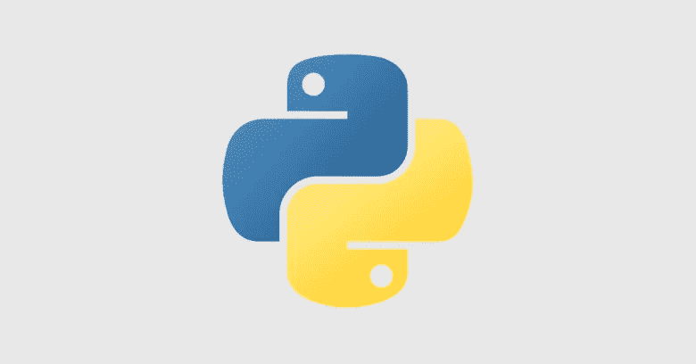

# 在 Ubuntu 上安装 Python 环境的分步指南

> 原文：<https://medium.com/analytics-vidhya/step-by-step-guide-to-install-python-environment-on-ubuntu-337d8dbdd05d?source=collection_archive---------15----------------------->

> 在 Ubuntu 上安装 Python 环境的 6 个步骤

# 如何在 Ubuntu 上安装或升级 Python 环境？

要将 python 编码到您的计算机中，您需要下载并安装 python 脚本。在这篇博客中，我将提供一个下载和安装的详细过程…