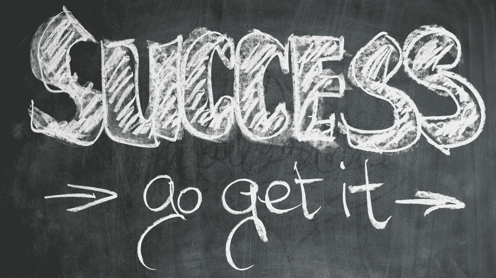

# 学习机器学习的循序渐进指南

> 原文：<https://medium.com/analytics-vidhya/step-by-step-guide-to-learn-machine-learning-5d8a043a424a?source=collection_archive---------16----------------------->

## 机器学习

## 🧐从 scratch🧠那里掌握了这项技能

技术已经完全改变了人们生活和体验生活的方式。如今，几乎所有在线内容都是由机器学习来运行的。

机器学习是对通过其经验自动改进的**计算机算法**的学习。

学习机器学习的一步一步指南，照片由 [Gerd Altmann](https://www.pexels.com/@geralt?utm_content=attributionCopyText&utm_medium=referral&utm_source=pexels) 从 [Pexels](https://www.pexels.com/photo/marketing-school-business-idea-21696/?utm_content=attributionCopyText&utm_medium=referral&utm_source=pexels)

在这个科技时代，机器学习被用于每一个软件、网络平台、搜索引擎、应用程序和设备中。

由于它的高级用途，公司对机器学习专家的需求很大。

科技公司 80%以上的员工都在研究机器学习算法及其在各种领域的应用，从而处理大规模的动态数据。

# 机器学习的一般观点

机器学习是一种自动建立分析模型的**数据分析**方法。掌握这项技能是一个要求很高的过程，但它是值得的。根据 *SpringBoard* 的数据，在美国，一个普通的机器学习专家每年可以赚到**700 万卢比。从 2015 年到 2019 年，它也是**职位数量增长最快的**，增长率为**344****。****

**对机器学习的总体看法，GIF 来自 [Giphy](https://gph.is/2RKrx7z)**

**学习机器学习(ML)的资源数不胜数。随着技术的高速发展，这些能源正在慢慢老化。掌握机器学习的概念和基础需要对主题有集中的决心。学习机器学习的利大于弊。凭借巨大的回报和工作保障，毫无疑问，机器学习是简历中的一项优秀技能。**

# **详细的学习计划**

**学习如何掌握高级机器学习(ML)需要严格的原则意识。它被认为是世界上最先进和最熟练的课程之一。由于机器学习是一个宽泛的学科，涉及到学习几种**编程语言**、**数据工程方法**，以及更多的课题。这意味着**需要适时掌握几个组件**。在进一步学习机器学习课程之前，您必须复习各种学习内容。**

# **积木**

****心态培养:**参加 ML 课程前的第一步是做好心理准备。这一步是为那些在学习机器学习时犹豫不决的学生准备的，这是一门具有挑战性的课程。**

**为了避免迷失在机器学习中，每个学生都需要确保他们可以通过坚持自己的计划来应对压力。如果他们有正确的热情、决心，并专注于学习这项技能，只有这样他们才能更进一步。**

****温习基础知识:**由于研究领域的先进性，需要学习大量的基础知识来理解它们在 ML 中的用途。**

****监督和非监督学习:**使用标记和非标记数据检测模式**

****监督和非监督学习:**使用标记和非标记数据检测模式，GIF 来自 [Giphy](https://giphy.com/gifs/l46Cy1rHbQ92uuLXa)**

****数据预处理:**数据挖掘中必不可少的一部分。**

****集成学习:**使用**学习算法**提高预测性能**

****模型评估:**使用**指标**建立模型和数据之间的质量关系。**

****分割和抽样:**将数据集分成不同的类别进行测试**

# **技能发展**

**在理解了 ML 的各种基础知识和它们的用途之后，下一步是学习可以在 ML 项目中使用的简便技巧。由于机器学习是基于算法和数据的结构化，所以你必须具备这些技能来理解和跟进机器学习的下一步。**

****Python 编程:** Python 是一种广泛应用于 ML 项目的编程语言。重点学习语言、**数据结构**、**库**，以及 Python 的应用。**

**学习 Python 编程及其用途可以在家里通过认证的在线课程来完成。本课程可在 30–45 天内完成。**

**要开始学习 Python，请访问 Youtube 上的 Python 教程**

****R 编程:** R 编程广泛应用于处理大数据集的 ML 应用中。它与 Python 在 ML 中同样重要，因为这两种语言被用来设计 ML 项目的**代码**。**

****计算思维:**这是一项最被低估的技能，但对每一个有抱负的人工智能专业人士来说却非常重要。计算思维包括推导公式化问题的解决方案，并将其表达出来，以便计算机能够有效地执行**。****

# ****统计分析****

****这个旅程的下一步是学习统计分析和数学方程。ML 应用是一套利用数据增长的算法。没有统计学和数学知识的数据分析的应用实际上是不可能的。****

****要处理大量数据，先要有概率论的概念知识。****

****由于 ML 项目涉及用定量术语总结和描述大量数据，您需要熟悉**描述性统计。******

********

****为了处理大量的数据，概率论和线性代数的概念知识是一个先决条件****

****对于估计推导和背景假设检验，习惯于**推断统计也是至关重要的。******

****ML 应用需要基于导数的计算。为了能够进行这些计算，精通微积分是必须的。****

# ****数据准备****

****准备数据意味着使用数据分析来执行功能，生成可视化的图表和直方图。这意味着需要描述数据的**属性**以及这些变量之间的关系。****

******数据选择:**选择正确的数据，就是考虑可用的数据，并进一步分析，推断出哪些信息是缺失的，哪些是不可用的。不可用的数据应该总是被删除。****

********

******数据选择:**选择正确的数据意味着考虑可用的数据并对其进行进一步的分析以推断，来自 [Pixabay](https://pixabay.com/?utm_source=link-attribution&utm_medium=referral&utm_campaign=image&utm_content=5187243) 的 [Joseph Mucira](https://pixabay.com/users/jmexclusives-10518280/?utm_source=link-attribution&utm_medium=referral&utm_campaign=image&utm_content=5187243) 的图像****

******数据预处理**:在这一步中，需要对最终确定的数据进行清理和重新组织，以便进行准确的计算和进一步的判断。****

******数据转换**:使用**缩放和属性聚合/分解**，可以将处理过的数据转换成不同格式，供机器学习使用。****

# ****数据清理****

****机器学习专家将始终确保原始数据经过过滤，并经过数据清洗。执行此过程是为了给数据添加结构。****

****数据清理的第一步是通过进行**单变量**和**多变量分析来识别数据中的**变量**。******

****应对数据进行缺失值处理**，以确保分析结果不会因缺失数据项而被**误导**。缺失数据会给数据的准确分类带来风险。**

****

****对数据进行缺失值处理**，照片由[亚历山大·奈特](https://www.pexels.com/@agk42?utm_content=attributionCopyText&utm_medium=referral&utm_source=pexels)从[像素](https://www.pexels.com/photo/high-angle-photo-of-robot-2599244/?utm_content=attributionCopyText&utm_medium=referral&utm_source=pexels)中提取**

**在一组广泛的数据中，对变量进行平均是为了简化和分类。然而，一些**变量**与其余数据遵循的模式完全不同。这些变量被称为**异常值。**异常值的**处理**对于理解数据的真实平均值和模式至关重要。**

**完成上述步骤后，关键是执行**变量转换**和**变量/特征创建**来创建派生变量。这两种方法结合起来称为**特征工程。****

# **数据建模**

**数据建模处理分析数据集群中各种字段之间的模式。这些模式然后在 ML 中用于预测和基于**概率的**计算。**

**要学习数据建模，你首先需要学习**结构化查询语言(SQL)。**学习 SQL 对数据库管理很有用**。**它有助于检索数据或与地区数据库进行交互。**

**数据建模的两个主要组件是**实体关系(E-R)模型**和**统一建模语言。****

**数据建模就像建筑师的施工计划。它由数据项之间的**概念模型**和**关系**构成。**

# **算法开发**

**最大似然算法是机器学习课程的核心内容。它处理 ML 的基本原理，即通过使用来自数据的模式自动学习和进步。**

**有三种机器学习(ML)算法:**

**第一种算法是**监督学习算法。**这些算法用于学习**映射函数**，将输入变量(x)转化为输出变量(Y)。通俗地说，它解决了以下等式:**

***Y =f(X)***

****

**最大似然算法是机器学习课程的核心内容。照片由[苏西·黑兹尔伍德](https://www.pexels.com/@suzyhazelwood?utm_content=attributionCopyText&utm_medium=referral&utm_source=pexels)从[派克斯](https://www.pexels.com/photo/rewrite-edit-text-on-a-typewriter-3631711/?utm_content=attributionCopyText&utm_medium=referral&utm_source=pexels)拍摄**

**当没有可用的输出值时，下一种类型的 ML 算法开始发挥作用。**无监督学习算法**使用未标记的数据来执行类似于**关联、聚类和维度缩减**的步骤，以向数据模型添加结构。**

**第三种机器学习算法是**强化学习算法。在这种算法的帮助下，用户或代理可以根据当前的行为模式预测下一个最佳的可能步骤。****

# **应用机器学习:系统设计**

**让我们假设您在研究和试验了 ML 算法之后，已经创建了它。现在，对于没有媒介的人来说，原始的 ML 算法实际上是不可用的，这允许他们在实际生活中使用算法。没有经过设计的系统，一行行的编码算法对最终消费者来说是胡言乱语。**

**解决问题:这一步包括决定你的 ML 将为它的用户解决的主要问题。这个系统必须是用户业务的**增值**。**

****数据:**致力于实时**数据存储系统**提供持续高性能的 ML 模型，如 **Hadoop/Hive** 。**

****建模:**一个 ML 系统需要被建模成一种**用户可解释的格式**。**

****

****造型，**照片由[克里斯·利维拉尼](https://unsplash.com/@chrisliverani?utm_source=medium&utm_medium=referral)在 [Unsplash](https://unsplash.com?utm_source=medium&utm_medium=referral) 上拍摄**

****评估:**通过引入新的独立数据集来评估系统的性能。该评估的主要目标是检查 ML 在不同情况下做出的**准确未来预测**的成功率。**

****关键特性:**为系统添加关键特性，以调整整体性能。这将提高系统的可用性，并改善代理的用户界面。**

**测试:随机应变系统的所有特性。评估可能的风险，评估可能出错的地方。它将帮助你解决系统中的弱点，从而产生一个万无一失的设计。**

# **机器学习项目**

**学习所有关于机器学习的知识而不测试你所拥有的知识有什么意义？机器学习项目是检验你 ML 能力的最好方式。**

**互联网上有几个 ML 项目可供你选择。这些项目所需的数据也可以在网上获得。所有机器学习项目详情可以参考 [Kaggle](http://www.kaggle.com) 。**

**使用在线可用的前一年数据集预测**沃尔玛的未来销售额。****

**使用位置、脉搏和其他可用数据识别人类活动的类型。**

**机器学习项目是检验你在 ML、GIF 方面能力的最好方式**

**基于用户以前的活动推荐电影和音乐。**

**根据可用的个人数据将汽车分类为**各自的品牌和型号**。**

**葡萄酒质量预测。**

**使用分析工具和趋势分析预测股票的未来价格。**

**如果你可以完成这些项目，并使用你的 ML 算法产生**精确的结果**，你就被认为是机器学习领域的中级水平。**

# **集中实验**

**参与项目后，你可能已经有了大量的实践。不断提高你的最大似然算法的标准是必要的。可以通过有针对性的练习来实现。**

****常规流程检查**:从数据挖掘/收集到系统设计和评估，不断练习机器学习流程。**

****

**参与项目后，你可能已经有了大量的实践。，照片由 [Pixabay](https://www.pexels.com/@pixabay?utm_content=attributionCopyText&utm_medium=referral&utm_source=pexels) 从 [Pexels](https://www.pexels.com/photo/accomplishment-ceremony-education-graduation-267885/?utm_content=attributionCopyText&utm_medium=referral&utm_source=pexels)**

****实用性**:不拘泥于虚拟数据。使用实时数据来确保您的系统为工作中可能面临的任何挑战做好准备。**

****为大项目做准备:**继续开发**聚类算法**来处理更大规模的复杂数据集，以确保您为下一步工作做好准备。**

# **关于数据集的决策**

**在处理数据集时，有许多情况下，您将做出必要的决定来微观管理您的系统并解决各种问题。因此，有必要使用不同的数据集。**

**首先，最常见的数据集是 **UCI 机器库**。**

**使用不同的集合进行**回归、分类和聚类**。**

**研究不同数据集的自动预处理。**

**决定您是否应该选择一个样本或分割数据用于其**统计分析。****

****

**在处理数据集时，会有很多情况，照片来自 [Pexels](https://www.pexels.com/photo/computer-earphone-figurine-furniture-463684/?utm_content=attributionCopyText&utm_medium=referral&utm_source=pexels)**

**考虑单个器械包所需的**性能指标**。**

**考虑**合奏**产生更好的效果。**

**决定哪些功能可以提供更高的准确性。**降维或特征选择**？**

# **什么是数据科学？**

**这是人们在搜索数据科学时想到的最常见的问题之一。**

**数据科学是一个跨学科领域，从结构化和非结构化数据中获取知识和简化的信息。这种简化的信息便于阅读和保存。**

**数据科学专指**给一组数据赋予意义**的过程。**

** [## 数据科学初学者指南

### 🤯让我们从零开始学习数据科学吧！

towardsdatascience.com](https://towardsdatascience.com/a-beginners-guide-to-data-scientist-67bbc7fc32c9) 

数据科学家使用**云计算工具**创建虚拟开发环境。数理统计、大数据和机器学习是该过程中使用的一些标准方法。

大型企业以创造性的方式使用数据科学策略。这也增加了他们在商界的竞争优势。

数据科学流程包括商业分析、商业智能、数据挖掘、预测分析、数据分析和数据可视化。** 

# **数据科学在网飞的应用**

**为了开始他们的分析，网飞收集原始的联邦直辖部落地区，并计划利用数据科学算法从中提取丰富的信息。这些算法的组合将简单的数字转化为详细的推荐计划。用户每滚动 5 分钟，网飞就能预测超过 40%的相对选择模式。网飞有几个收集、捕获和存储数据的领域。**

****时间:**首要步骤是了解并存储用户流式传输内容的时间和日期。这有助于他们了解你周日晚上的恐怖电影计划或你下午的惊悚片偏好。**

****搜索:**自动存储所有搜索标题，以便针对这些搜索重新定向进一步的推荐。比方说你搜索“*疾速追杀*”，看电影，关网飞。下一次你再次打开应用程序时，你无疑会发现更多的动作片或更多的山谬·里维启动程序。**

** [## 数据科学和机器学习在网飞的应用

### 🤯你想知道网飞的推荐如何完全符合你的喜好吗？

medium.com](/towards-artificial-intelligence/applications-of-data-science-and-machine-learning-in-netflix-dcdf6abbb194) 

**浏览和滚动行为:**网飞还使用先进的分析程序来识别你决定停下来阅读的电影/电视节目。这有助于他们展示更多相似的内容来抓住你的眼球，让你再次感兴趣。

**暂停/快进:利用数据科学**，网飞捕捉到用户在流媒体播放时开始暂停或快进的确切时长。这有助于它识别哪种场景比其他场景更受欢迎。如果你跳过一部动作电影的情感场景，它会开发算法，在未来的推荐中避免激情电影。但是如果你重新观看一个情感场景，它会相应地适应。

**使用的设备:**如果你使用单独的机制来传输不同的内容，这种**差异**会被永久保存。例如，尽管使用相同的帐户，但在家庭电视上观看卡通的儿童不会被推荐他们的父母在 iPad 上观看的电影。** 

# **结论**

**机器学习是各个领域都要研究的广泛课题。获得成为机器学习专家所需的知识需要大量的时间和精力。一旦你到达这个阶段，没有人能阻止你征服人生的高峰。ML 专家是当今世界上最受欢迎和尊敬的职业之一。**

> **我总是把生活看作是从一次经历到另一次经历的旅程。到目前为止，这是一条充满有趣事件和人的道路。通过 [LinkedIn](https://www.linkedin.com/in/iamsivab) ，[insta gram](https://www.instagram.com/storieswithsiva)&[Youtube](https://youtube.com/c/storieswithsiva)加入我的旅程**

**要成为这个领域的专家，你需要先成为十几个小领域的专家。如果你打算成为一名机器学习专家，已经有几家公司在等着你加入他们。如果你从今天开始，你将朝着光明和安全的未来开始你的生活。**

** [## 西瓦苏布拉马尼亚语 B —中等

### 阅读 Sivasubramanian B 的作品。创意说书人、品牌战略家、商业智能分析师

medium.com](/@storieswithsiva) 

有了手头的所有信息，你就有希望在未来成为一名成功的数据科学家。希望这对你有所帮助，并祝你未来一切顺利！*感谢您阅读本文！如果你有任何问题，请在下面留言。***