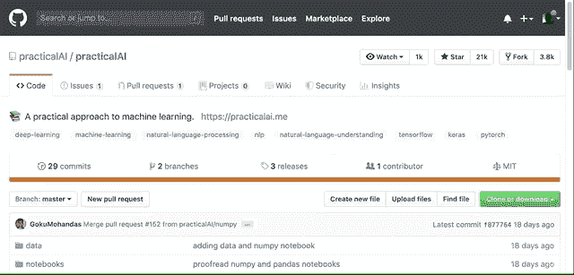
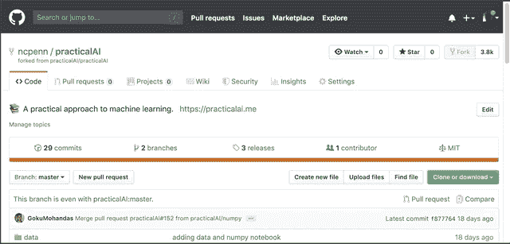
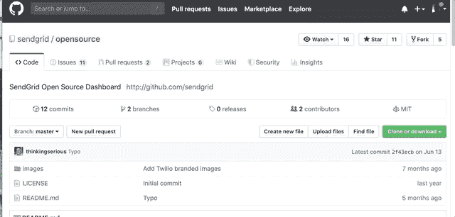
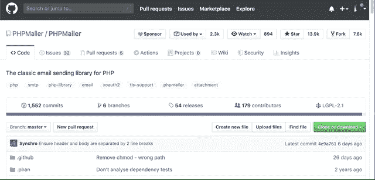

# 你第一次成功的开源贡献的逐步指南

> 原文：<https://medium.com/analytics-vidhya/step-by-step-guide-to-your-first-successful-open-source-contribution-51ed4606cfdb?source=collection_archive---------23----------------------->

## 如果你从未参与过开源(也不知道如何开始)，这里有一个循序渐进的指南。

佩里·格罗内在 [Unsplash](https://unsplash.com?utm_source=medium&utm_medium=referral) 上的照片

# 以下是我们将要讲述的内容:

1.  消除阻碍因素对你的实际贡献
2.  选择一个适合你的项目
3.  如何准备你的首次投稿
4.  如何在有真实问题的真实项目中实践——无风险
5.  执行拉取请求
6.  处理批评
7.  下一步——使用开源获得新工作

## 入门指南

你听说过为开源做贡献对你的职业生涯大有裨益。

确实如此。

你可以让你的 GitHub 账户成为你成功的证明:

*   你有专业技能
*   你有人际交往能力

除此之外，感觉棒极了。

但是(问题就在这里)很难上手。开源有自己的外语。同样，如果你不熟悉 git 版本控制，那就更糟了。

如果您不知道如何使用 git 命令行，现在就修复它。不难。这里有两个你需要的资源:

*   本 [GitHub 词汇表](https://help.github.com/en/github/getting-started-with-github/github-glossary)中解释的术语
*   快速入门 [git 指南](https://rogerdudler.github.io/git-guide/)(太棒了！).

开源需要你，在某种程度上，你也需要开源。我已经提到过了，但满足感并不是全部。坚持下去。这样做可以建立真正的工作保障，因为你建立了声誉。这就是活动提交历史的力量。

## 消除阻碍因素对你的实际贡献

不知道从哪里开始不是你的错，我们现在就帮你摆脱困境。

这些听起来耳熟吗？

1.  我如何或从哪里开始？
2.  我没有看到很多初学者的问题。
3.  许多项目看起来太吓人或太复杂。
4.  如果我承诺修复一个 bug，但却做不到，该怎么办？
5.  捐献的一步一步的过程实际上是什么？

让我们逐一解决。

**我如何或从哪里开始？**
保持阅读。我一步一步地解决这个问题。

**我没看到多少初学者的问题。**
你可以忽略这个顾虑。这不是真的。如果你需要的话，暂停你的怀疑，但是当你按照我下面列出的计划去做的时候，这并不重要。

许多项目看起来太吓人或太复杂。
千真万确。有些问题超出了你的能力范围。然而，大多数都不是。它们看起来只是因为你没有深入研究过这个项目，没有运行过代码，也没有了解过它是如何工作的。继续读下去，我也要解决这个问题。

如果我承诺修复一个 bug，但却做不到，该怎么办？你联系项目维护者，告诉他们你将不再致力于那个 bug 修复。项目维护者会心存感激。你没有消失，他们现在可以让别人来看这个问题。没问题。

**捐款的具体步骤是什么？**
现在，为那一步一步的指示…

## 选择一个适合你的项目

我相信你已经听过标准的建议，“在你已经使用的开源项目上工作。”不是最有用的建议。

相反，在谷歌上搜索“[语言或框架]顶级开源项目”。不要过多考虑用什么语言。跟着你最了解的走。

看看更大的项目，这些项目都有清晰的文档说明如何参与和合作。如果项目维护人员不积极，不对初学者开放，那么它就不适合你。

如果你选择了一个缺乏贡献文档的项目，继续前进。选择不同的项目。

## 如何准备你的首次投稿

如果您还没有设置开发环境，请进行设置。(获取从事 DotNet 项目的 Visual Studio 用 Eclipse 开发 Java 等等。)

接下来，将回购转到你的 GitHub 账户。

然后将其克隆到您的开发机器上。

接下来，查看 Contributing.md 文件并找到入门文档。

如果找不到呢？

仔细检查，但是如果你没有找到，你已经找到了你的第一次投稿机会。你应该为这个项目做一个“开始”文档。旁注:大多数项目在某种程度上都需要文档方面的帮助。

首先，询问维护者他或她是否想要您想要添加的文档。最好的办法是开一期，声明没有入门文档。

如果贡献者同意这是有价值的东西，嘣！深入研究代码，对其进行调试，记录您所做的工作，并提交一个带有文档的 pull 请求。

但是我想得太多了。

所以，你已经得到了密码。现在你知道如何使用它了。你感觉如何？

感觉自信吗？跳进来，去找一个公开的问题。开始和维护人员聊拿它，开始编码。

但是如果你还没有准备好呢？

## 如何在有真实问题的真实项目中实践——无风险

如果你还没有完全准备好，不要担心。以下是如何立刻提升你的自信。

查看您选择的项目中已关闭的问题。

然后，在修复签入之前提交代码。为此:

1.  单击修复错误的提交的链接。
2.  复制提交 SHA 的前 6 个字母
3.  转到所有提交列表
4.  在列表中找到提交，并在修复 bug 之前复制提交的 SHA
5.  用那个 shaw 执行 git checkout 命令。现在，您已经修复了代码错误，并准备好进行自己的修复。(见下面的视频)

自己根据问题重新报告 bug。(如果不能，请选择另一个已关闭的问题。)

然后，练习修复 bug。

没有压力。你在练习。即使你最终过了头(可能性不大)，也没关系。如果愿意，您可以查看解决方案，以了解修复提交者是如何编写修复的。(提交给修复问题的主分支。)

此外，你可以尽可能多地进行这种练习。

现在，你准备好了。

## 执行拉取请求

步骤同上。

1.  将回购分支到您的 GitHub 帐户(因为您没有权限在他们的 GitHub 帐户上创建分支)
2.  将回购克隆到您的机器上
3.  接受一个开放的问题或开放一个新的问题(如果你贡献的东西不是 bug 修复)
4.  为你的工作做一个分支
5.  与此同时，你正在和项目维护者就你正在做的工作来回聊天。
6.  提交拉取请求。要浏览截图，请看这里:[发出拉取请求的机制](https://css-tricks.com/how-to-contribute-to-an-open-source-project/)

当贡献者接受你的请求时，恭喜你！你是开源社区的一员！

## 处理批评

在 OSS 的世界里，并不是一切都是完美的。你面对的是正常的志愿者。

会有批评。通过提出拉取请求，你邀请公众检查。不是每个人都会喜欢你的作品。好消息是，一些反馈是有用的，你将成长为一名程序员。然而，有些是有毒的，你需要提前做好准备并理解这一点。

同样，您的拉取请求可能永远不会得到响应。这在一个成熟的、由社区维护的项目中是不太可能的。这就是为什么我把你引向上面的大项目。

但是消极的已经够多了。让我们从大处着眼。

## 下一步——使用开源获得新工作

想建立声誉吗？

只做一份贡献，仅此而已是不好的。

非常零星的贡献也不会为你工作。

取而代之的是专注于一个技术堆栈，并积极为该堆栈做出贡献。

你甚至可能想开始你自己的开源项目。

这里的关键很简单。保持一致。坚持住。不断提出拉取请求。与项目维护者发展更深层次的关系。就这么简单。

当你这样做时，你会开始注意到两件事:

第一，招聘人员会联系你。那里没有什么新东西。招聘人员一直在联系开发人员。但这次会是因为你的 GitHub 个人资料(而不是因为你的 LinkedIn 账号)。这使得这些是更高质量的连接，因为他们已经可以看到你能做什么。

第二，如果你去找新工作，你可以指向你的 GitHub 账户。你的简介会证明你工作努力。这将证明你了解你的东西，你是一个团队成员(因为所有的拉动请求都被接受了)。嘣！**金钱**。