# 用于文本分类任务的 BERT 的分步实现

> 原文：<https://medium.com/analytics-vidhya/step-by-step-implementation-of-bert-for-text-categorization-task-aba80417bd84?source=collection_archive---------5----------------------->

在过去的 3 年中，大型 NLP 实验室已经开发了强大的新神经网络框架，有助于学习数据的良好表示，这些表示将在一系列任务中表现良好。这些框架是计算密集型的，可以根据语言建模目标进行预训练，并根据特定任务进行微调。

其中之一是谷歌开发的名为 BERT(变压器的双向编码器表示)的工具。BERT 是一种深度双向、无监督的语言表示，仅使用纯文本语料库进行预训练。我们可以使用 BERT 来获得文档/文本的向量表示。这些矢量表示可用作模型中的预测特征。

在本文中，我们将尝试通过使用 BERT 进行文本分类任务来实现它，并更好地理解如何使用 BERT。此外，我们还对 BERT 执行分类任务的效果进行了度量分析。

假设我们得到一个由非英语母语作者创作的英语文本数据集。我们的任务是预测每个作者的母语。

训练数据集 lang_id_train.csv 具有大约 6000 行和 2 列，即本地语言和文本。测试数据集 lang_id_test.csv 大约有 2000 条记录。Lang_id_eval.csv 是用于评估指标的文件。现在，让我们通过在训练数据上构建文本分类模型来尝试在测试数据中识别作者的母语。

数据集的链接如下所示:

lang _ id _ train . CSV-[https://docs.google.com/spreadsheets/d/14e0Lq-ya 6 ytxcolqfg 2 JB 7 tqei 1 z 8 qf _ U1 _ 6 vdaeia/编辑？usp =共享](https://docs.google.com/spreadsheets/d/14e0Lq--YA6YtxcOlQFg2jB7TqeI1z8qf_U1_6VdaEIA/edit?usp=sharing)

lang _ id _ test . CSV-h[ttps://docs . Google . com/spreadsheets/d/1 w0 P1 gjq 1 _ zo 21 vjmvmusmfbkgnkawxrrbtrt 5 ka 3 B4 g/edit？usp =共享](https://docs.google.com/spreadsheets/d/1W0p1gJq1_zo21VjmvmusmfbkGnKAWXRRbTrT5Ka3b4g/edit?usp=sharing)

lang _ id _ eval . CSV-h[ttps://docs . Google . com/spreadsheets/d/1 vpyca 7 ftlnw 2 eqlprgqcobs 0 hffu _ mobhtppplpw 46 q/edit？usp =分享](https://docs.google.com/spreadsheets/d/1VPYca7fTLnw2ceqLprGqCobs0hFFu_mOBHTPpLpW46Q/edit?usp=sharing)

**第一节。使用 BERT 进行文本分类的步骤**

***第一步:从 git*** 获取 BERT 存储库

将维护人员的 BERT 存储库克隆到名为“bert-master”的计算机上的本地目录中。您可以运行命令:git clone[https://github.com/google-research/bert.git](https://github.com/google-research/bert.git)

***第二步:获取预先训练好的 BERT 模型***

我们将使用这个预训练的 BERT 模型来生成特征，因为即使使用预训练的模型，这项任务也很耗时。在 CPU 中生成文档向量大约需要 40 分钟。

因此，我们下载了一个预先训练好的 BERT 模型 [BERT-Base，Uncased](https://storage.googleapis.com/bert_models/2018_10_18/uncased_L-12_H-768_A-12.zip) ，并将其解压缩到一个我们称之为“模型”的本地目录中。

***第三步:格式化输入文件，供 BERT 处理并产生输出***

ORIGINAL _ DATA _ DIR-包含三个输入 csv 文件的文件夹，我们使用这些文件进行各种操作

BERT_FEATURE_DIR- folder 是保存 BERT 输出的 json 文件的文件夹

BERT_DATA_DIR 文件夹也包含原始的输入 csv 文件。此文件夹中的文件将不会被编辑或用于任何操作或更改。

这三个输入文件被复制到新文件夹 bert_input_data 中。使用 jupyter 笔记本在 os.path.join 中更新了 bert_input_data 和 bert_output_data 路径，如下所示。

以编程方式重新格式化输入文件，以便可以由 BASE_DATA_DIR 文件夹中的 BERT extract_features.py 脚本进行处理。这个脚本要求每个输入文件在一行中包含每个文本，没有其他信息。

为此，我们分别删除了标题为“text”的第一行和包含每个输入文件的 native_language 属性值的第一列。例如，我们通过以下代码对 lang_id_train.csv 文件执行此操作。

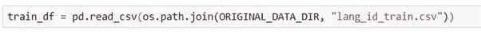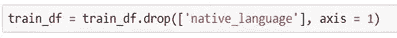

我们将数据帧转换成 csv 格式。

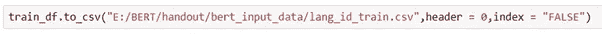

注意，我们为每个输入文件 train 和 train_df 创建 2 个数据帧，其中 train 用于存储原始输入文件，train_df 用于格式化输入文件以提取 BERT 特征。

现在，train_df 是使用 BERT 获取文档向量所需的格式。类似地，我们以必要的格式获得 test_df 和 eval_df。

***第四步:编辑并运行 run_bert_fv.sh 脚本。***

输入文件格式化后，我们使用 run_bert_fv.sh 脚本通过 BERT 运行格式化的 csv 文件中的文本，以生成代表每个文本的特征向量。这会产生 3 个 jsonlines 文件，大约 7.67 GB 的数据。

Unix 脚本 run_Bert_fv.sh 代码如下:

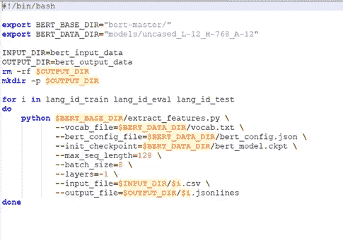

为了让 run_bert_fv.sh 脚本处理输入文件并生成输出，我们需要在脚本中指向输入文件文件夹和输入文件的名称。

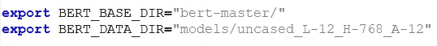

这里克隆的 BERT 储存库指向 BERT_BASE_DIR，预训练的 BERT 模型指向 BERT_DATA_DIR。

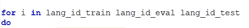

for 循环中指出了 3 个输入文件名。

***第五步:从 json 文件中获取 BERT 矢量***

我们执行 run_bert_fv.sh 脚本。生成 3 个 jsonlines 文件大约需要一个小时。这些文件在前面步骤中指出的 BERT_FEATURE_DIR 文件夹中生成。

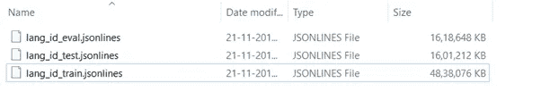

下一步是读取 BERT 向量，并在 sklearn 模型中使用它们。为了做到这一点，我们通过使用 notebook 中的以下代码将 jsonlines 文件转换为 BERT 矢量。

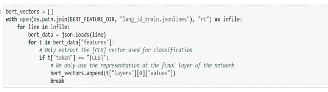

请注意，我们首先将 lang_id_train.jsonlines 转换为 BERT 向量，以便获得用于开发模型的训练数据的向量。总共生成了 6000 个向量。每个文件对应于输入 csv 文件的每一行。

***步骤六:训练模型***

使用从 BERT 派生的功能来训练逻辑回归模型，以便预测所提供数据的 native_language 属性。

模型 X_train 的输入来自步骤 5 中训练数据的 bert_vectors。我们把它转换成一个 Numpy 数组，这样我们就可以用 X_train 来拟合一个模型。

y_train 使用我们在步骤 3 中定义的训练数据帧来获取训练输入文件中每个文本的 native_language 值。

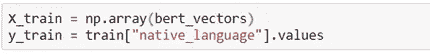

LogisticRegression 模型定义如下，遵循 l2 范数正则化，c =1.0，这意味着我们用 l2 罚函数强烈约束该模型。我们将训练数据及其对应的 y 值拟合到模型中。

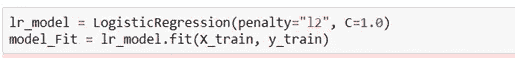

***第七步:使用模型拟合进行预测***

我们使用训练好的模型 model_Fit 对测试数据(lang_id_test.csv)进行预测。为此，我们再次从 lang_id_test.csv json 文件生成 BERT_vectors。

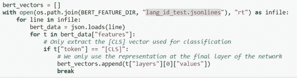

这将产生 2000 个伯特矢量。我们把它转换成一个 np 数组，作为 x_test 存储。

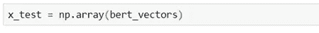

现在，我们使用预测函数来预测 y 值，即 lang_id_test.csv 文件中 2000 个文本的每一个的 native_language 值。

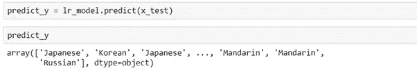

**第 2 部分—评估结果**

此部分包括评估结果的摘要，总体包括性能、按类别划分的指标以及类别之间的错误频率。

为此，我们使用 lang_id_eval.csv 输入文件。我们从这个文件中获取 native_language 值。y 的实际值定义如下。

# 使用精确度测量模型性能:

我们首先使用准确性作为度量标准来衡量测试集的整体性能。准确度被定义为正确预测的分数=正确预测/预测总数

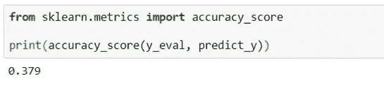

我们得到了 38%的准确率(大约。)在我们的模型中。尽管准确性给出了模型的整体性能，但它本身不足以衡量模型的性能，尤其是在数据有偏差的情况下。评估模型的其他重要指标是精确度、召回率和 f1 值，即使数据有偏差，这些指标也能准确衡量模型的性能。

以下指标将给出更好地评估模型的值。

**使用分类报告按类划分指标。**

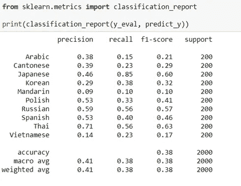

***精度=*** 精度是 tp / (tp + fp)的比值，其中 tp 是真阳性的数量，fp 是假阳性的数量。精确度直观上是分类器不将阴性样品标记为阳性的能力。

***召回*** =召回率是 tp / (tp + fn)的比值，其中 tp 是真阳性的数量，fn 是假阴性的数量。召回直观上是分类器找到所有肯定样本的能力。

***F1 得分***= F1 得分可以解释为精确度和召回率的加权平均值，其中 F1 得分在 1 时达到其最佳值，在 0 时达到其最差得分。

***支持***= y _ true 中每个标签出现的次数。

**分析:**

从上面的分类报告中，我们发现模型对泰语的准确预测数量最多，其次是日语和俄语，因为它们的 f1 分数在 10 个类别中最高。

泰语的精度是所有类中最高的

日语的回忆是所有类别中最高的，因此日语的 f1 分数也很高，尽管精确度较低。

即使越南语和粤语的错误频率相同，越南语的 f1 分数也远低于粤语。所以汉语，越南语，阿拉伯语的预测最少。

**使用混淆矩阵的类间错误频率**

使用混淆矩阵可以获得每一类的预测数与实际数的计数。我们给出实际 y 值 y_eval 和从模型 predict_y 获得的预测值作为输入。

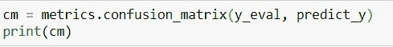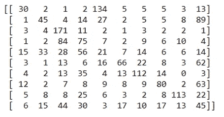

cm 的图示如下所示

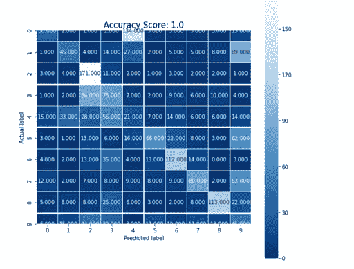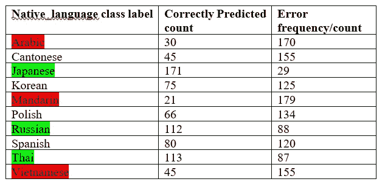

**分析:**

使用从混淆矩阵获得的值，如上计算每个类别的错误频率。我们发现，日本人、泰国人和俄罗斯人的模型预测正确率最高。对于普通话、越南语和阿拉伯语获得最不正确预测。

**结论:**

以 38%的准确度完成了用于找到作者的母语的逻辑斯蒂模型和伯特向量的实现。来自混淆矩阵的 f1 分数和错误频率都表明，与其他母语相比，日语、泰语和俄语被很好地预测。