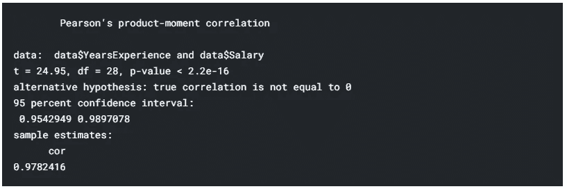

# 一步一步的程序来执行简单的线性回归与统计分析在 R

> 原文：<https://medium.com/analytics-vidhya/step-by-step-procedure-to-perform-simple-linear-regression-with-statistical-analysis-in-r-340ef0a392d6?source=collection_archive---------14----------------------->


**形象由** [**educba**](https://www.educba.com/)

1.  **简介**

你好，这是我第一篇关于媒介的文章。在本文中，我将向您展示简单线性回归是如何应用于解决现实生活问题的，简单线性回归是机器学习中经常使用的一种非常基本的线性回归算法。为此，我将使用一个数据集，其中—“我必须根据一个解释变量经验年数来预测个人(比如说一个人)的工资。”我将使用 **Kaggle R-Notebook** 来完成上述任务。您可以在 PC 中使用 R-studio 脱机工作。

**2。加载数据集**

链接下载数据集离线使用—[**https://www . ka ggle . com/rohankayan/years-of-experience-and-salary-dataset/下载**](https://www.kaggle.com/rohankayan/years-of-experience-and-salary-dataset/download)

运行以下命令创建一个包含整个数据集的 R 对象-

```
**# Loading Data**
data = read.csv("../input/years-of-experience-and-salary-dataset/Salary_Data.csv" , header = T)
```

现在，数据将成功加载到当前会话中，并存储在对象“Data”中。

**3。加载所需的库**

```
library(tidyverse)
library(caret)
library(MASS)
library(lmtest)
library(olsrr)
library(broom)
```

**4。探索数据集**

```
**#Random Inspection of Dataset** sample_n(data,5)**# See the following output**
```


**输出-1**

在给定的数据集中，目标“工资”和预测值“工作年限”都是定量变量。因此，我们可以对给定的数据集应用回归。现在，

问题是:我们必须应用哪种类型的回归(线性或非线性)？

我的建议是:首先尝试线性回归，因为它比非线性回归简单。如果它不适合，那么去非线性回归。

**下一个问题:**线性回归有很多种类型。对于给定的数据集，哪一个更好？

**回答:**由于我只有一个预测值，因此可能是拟合一个变量的简单线性回归或多项式(通常是正交多项式，以避免多重共线性)回归。

**问题:**以上两种线性回归哪个表现更好？

**答案:**绘制预测器(X 轴上)和目标(Y 轴上)之间的散点图。这将给出一个最好的主意。

让我们这样做吧-

```
**# Scatter Plot** plot(data$YearsExperience,data$Salary)
```


**输出-2**

> *上图显示了预测值和目标值之间的线性关系。所以简单的线性回归会表现得更好。*

此外，如果您认为多项式模型可能比简单线性回归执行得更好，请拟合多项式模型，因为如果多项式模型不是给定数据集的最佳模型，高阶项将自动变得不重要，这反过来表明给定数据集的最佳模型是简单线性回归。(后期还会见到你一样。)

SLR 基于某些假设，如下所示-

1.  **线性:**预测值和目标值之间必须是线性关系。
2.  **正态:**误差必须正态分布。
3.  **同方差:**误差必须有恒定的方差。
4.  **自相关:**误差必须是不相关的。(错误必须是独立的)
5.  误差的平均值必须为零。

上述假设必须得到满足，因为如果上述假设中的任何一个不满足，那么我们就不能确定所获得结果的有效性和可靠性。在这种情况下，要么尝试满足假设，要么采用任何其他回归方法来获得可靠的结果。

这些假设中的一些在拟合模型之前被检查，一些在拟合之后被检查，视情况而定。在接下来的步骤中，这一点会更加清楚。

**5。通过**检查线性假设

1.  **可视化**:预测器和目标之间的散点图帮助我们。(已经在上面标绘并发现线性。)
2.  **统计检验**:皮尔森——相关性检验有帮助。使用**“校正测试()”**功能。

让我们试一试。

```
**# Correlation Test**
cor.test(data$YearsExperience , data$Salary)
```



**输出-3**

> *既然，* ***p 值小于 0.05*** *与样本相关性为****0.9782416****。因此，高度显著的相关性(高度线性相关)存在于人群中。*

Rest 假设将在拟合模型后进行检查。

**6。装配模型**

在拟合之前，将给定的数据集分成**训练和测试数据**，**拟合模型**，**获得模型**的总结如下-

```
**# Randomly Split the data into training and test set**set.seed(123)
training.samples <- data$Salary %>%
  createDataPartition(p = 0.6, list = FALSE)
train.data  <- data[training.samples, ]
test.data <- data[-training.samples, ]**# Fit model**model <- lm(Salary ~ YearsExperience , data = train.data)summary(model)
```


**输出-4**

上面的输出显示-

1.  这两个系数都具有统计显著性，因为 p 值< 0.05
2.  The model is also statistically significant since p-value: 2.098e-13 < 0.05
3.  Adjusted R-squared: 0.9504 , This shows that 95.04% of the variation available in the given data set (in Salary) is explained by this Simple Linear Regression Model. **其余 5%的工资变化是由于一些其他预测因素(如职位、个人年龄)或随机原因**。

**7。检查其余假设**

**正态性假设由-**

1.  可视化 : Q-Q 残差图帮助我们。
2.  **统计检验**:夏皮罗-威尔克残差检验帮助了我们。使用 **"shapiro.test()"** 函数。

让我们试一试。

```
**# Visualization** qqnorm(model$residuals)
qqline(model$residuals , col = "steelblue", lwd = 2)**# Statistical Test** shapiro.test(model$residuals)
```


**输出-5**

> *由于 p 值(0.1123) > 0.05，因此，接受零假设，即误差呈正态分布。*

**同方差假设由-**

1.  **可视化**:残差与拟合值图帮助我们。
2.  **统计检验**:布鲁赫异教徒检验帮助我们。使用 **bptest()** 函数。

让我们开始吧。

```
**# Visualization** plot(model$fitted.values , model$residuals)**# Statistical Test** bptest(model)
```


**输出-6**

> *由于 p 值(0.0633) > 0.05，因此，接受零假设，即误差具有恒定方差。*

**自相关假设由-**

1.  **可视化**:残差与观察顺序。
2.  统计检验:德宾-沃森检验有帮助。使用 **durbinWatsonTest()** 函数。

让我们试一试。

```
**# Visualization** plot(1:20 , model$residuals)**# Statistical Test** dwtest(model,  alternative = c("two.sided"))
```


**输出-7**

> *自 p 值(0.1349)>0.05；因此，接受零假设，即误差不相关。*

**误差均值假设-**

```
**# Calculating mean of errors** mean(model$residuals)
```


**输出-8**

> *上面的输出显示误差的平均值大约为零。*

现在，简单线性回归的所有假设都已满足。

还有一个任务是检测给定数据集中是否有任何**影响点**。因为如果存在影响点，那么上面得到的结果将变得不可靠。因此，需要检测影响点。

**影响点检测通过-**

1.  **可视化**:库克的距离图帮助了我们。
2.  **统计测量**:库克的距离有帮助。

运行以下命令。

```
**# Visualization (Cook's distance plot)** plot(model , 4)**# Statistical Measure** model_dm <- augment(model)**# Checking Highest Cook's distance** max(model_dm$.cooksd)
```


**输出-9**

> ***最大烹饪距离*** *是****0.186480962574431***
> 
> *由于，对于训练数据集中的任何观察，库克距离不大于 0.5，因此，在给定的数据集中没有影响点。*

**8。做出预测**

现在，简单的线性回归模型已经准备好了。将其应用于测试数据集，以检查其在未知数据集上的性能，即确定该模型在未知数据上的性能。

这将再次通过两种方法完成-

1.  **可视化**:测试数据集的预测薪资与实际薪资图有帮助。
2.  统计测量:R，RMSE，梅帮助。

```
**# Making prediction** prediction <- model %>% predict(test.data)**# Visualization** plot(test.data$Salary , prediction)
abline(lm(prediction ~ Salary, data = test.data), col = "blue")**# Statistical Measure** data.frame( R2 = R2(prediction, test.data$Salary),
            RMSE = RMSE(prediction, test.data$Salary),
            MAE = MAE(prediction, test.data$Salary))
```


**输出-10**

> 我们得到:R = 0.9701604，这表示最佳拟合。

因为，这个结果仅仅基于一个测试数据集。因此，我们不能确定该模型对所有未知数据都有更好的表现。为了在这方面更加自信，我们将使用 K-fold 交叉验证的方法在不同的测试数据集上测试模型的性能。

这将按如下方式进行

```
**# Define training control** set.seed(123)
train.control <- trainControl(method = "repeatedcv", 
                              number = 4, repeats = 3) **# Train the model** model_cv <- train(Salary ~ YearsExperience , data = data, method="lm",
                  trControl = train.control)**# Summarize the results** print(model_cv)
```


**输出-11**

**伟大的结果！**

> ***平均而言，这个简单的线性回归模型捕获了目标(薪金)中 97.29 %的可变性。也就是说，97.29 %的工资变动是由于预测因素“工作经验”。休息可变性是由于一些其他原因(如个人的职位/年龄等。)或由于随机原因。***

现在，准备一个多项式模型，正如我之前所说的，如下-

```
**# Fitting Orthogonal polynomial model**model_poly <- lm(Salary ~ poly(YearsExperience,2) , data = train.data )**# Summarizing model** summary(model_poly)
```


**输出-12**

> *以上输出表明* ***第二阶预测值不具有统计学意义*** *自 p 值(0.531)>0.05；因此，不要拟合多项式模型，只进行简单的线性回归。*

**想看我的 Kaggle R-Notebook :** 点击 [**这里**](https://www.kaggle.com/pranjalpandey12/salary-vs-yearsexperience-slr-model)

# 感谢阅读我的第一篇文章。

如果你发现任何错误或你有任何建议，请让我知道，你总是受欢迎的。