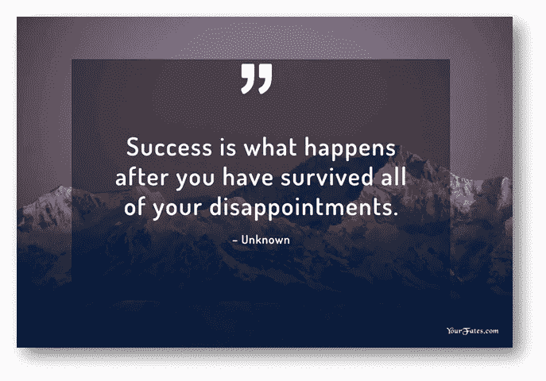
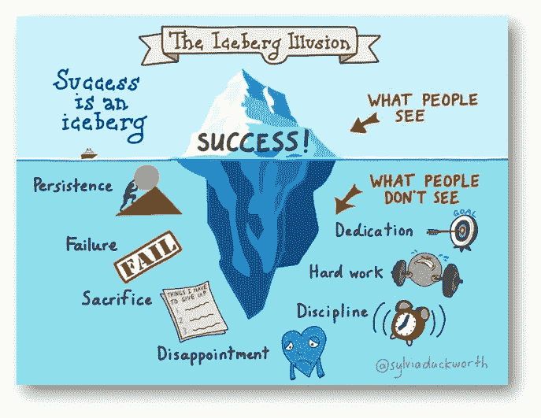
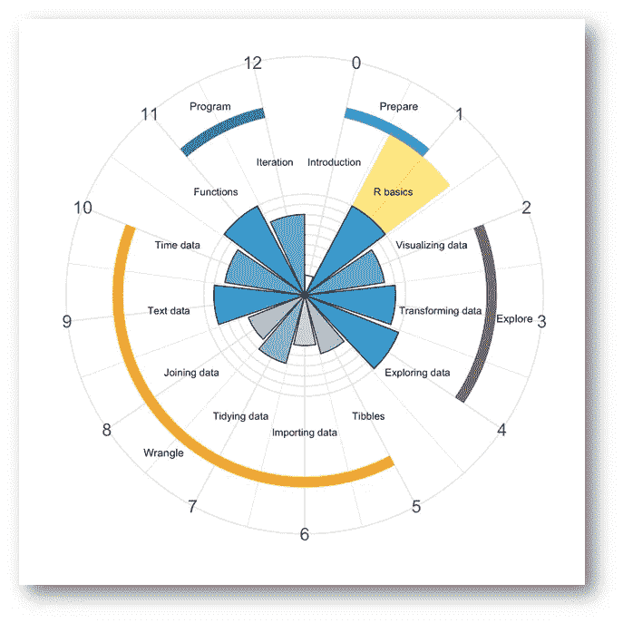
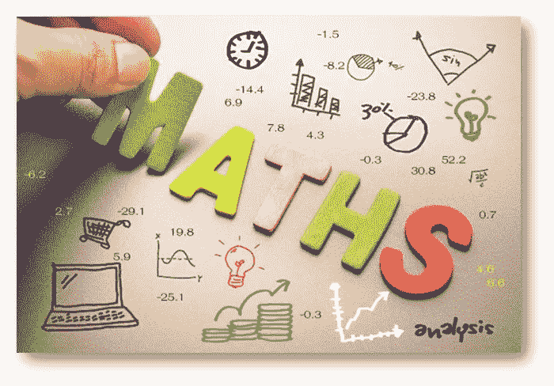
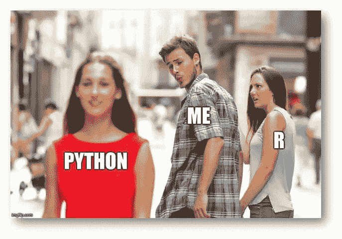
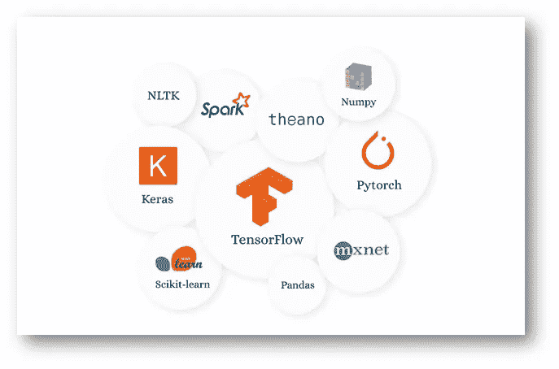
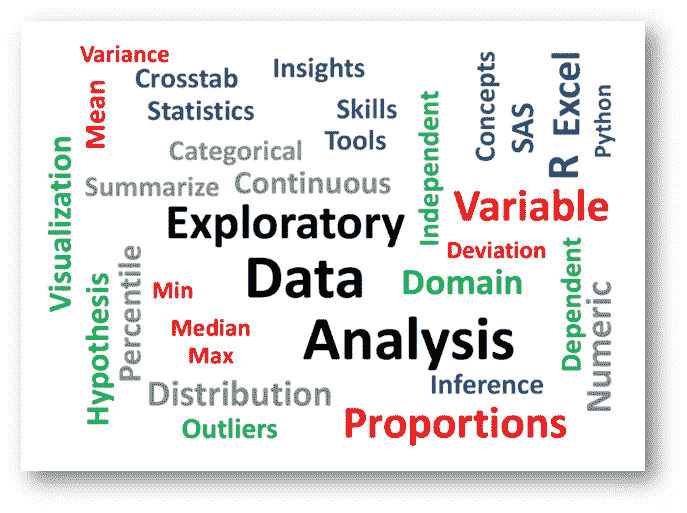
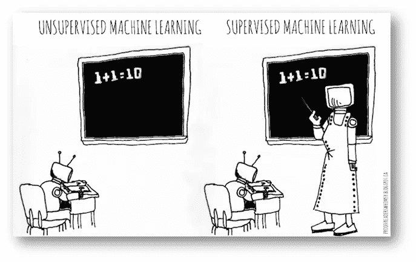
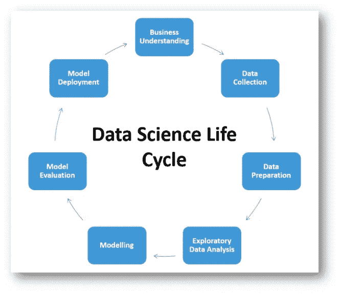

# 我如何学习机器学习的循序渐进的过程

> 原文：<https://medium.com/analytics-vidhya/step-by-step-process-of-how-i-can-learn-machine-learning-38bc31218bd2?source=collection_archive---------21----------------------->

# **仅供阅读:**

你好(西班牙语大家好😊)，我叫尼维特。这是我在 medium 上发表的第六篇博客。在这篇博客中，我将全面解释我如何在 3-4 个月内学习机器学习的方法。所以让我们准备好开始 ML 的旅程吧。

我花了三到四个月的时间把那种生活抛在脑后，开始觉得自己属于一个专属的世界，这个世界里的人可以分辨出他们的中位数和他们在附近酒吧的 x-bar，并且知道如何教机器他们需要学习的东西。

转变过程并不容易，需要努力工作、大量时间和奉献精神，并且在过程中需要大量的帮助。它还包括数百个小时的不同形式的“学习”,以及等量的时间练习和应用所学的知识。无论在我的学习道路上发生了什么，我都没有停止我的学习，总是不断尝试把自己推向目标点的边缘。

**这是通往成功的道路**

这篇文章的目的是帮助你，如果你正在寻找一个类似的转变，但不知道从哪里开始，以及如何进行下一步。如果你有兴趣找到答案，请继续阅读，了解你需要涵盖的主题，并了解你在学习过程的每个阶段需要达到的专业水平。

# 了解基础知识

花几天时间增强你在数据科学和机器学习领域的“常识”。

**开始旅行前你需要得到的所有基本东西。**

你可能已经对这个领域有了想法和某种理解，但是如果你想成为一名专家，你需要了解更好的细节，以便你可以用简单的术语向任何人解释。

**我建议的题目:**

*   **什么是数据科学？**
*   **什么是机器学习？**
*   **什么是人工智能？**
*   **什么是大数据？**
*   **什么是深度学习？**
*   **什么是数据分析？**
*   **以上领域有何不同，又有何关联？**
*   以上所有领域在现实世界中是如何应用的？

**注意:**在这里我会提到我的导师和 YouTube 上的一些频道，当我开始学习机器学习和所有这些东西时，它们真的很有帮助。

**https://www.youtube.com/user/krishnaik06 克里斯纳伊克**

**科里斯查费:**https://www.youtube.com/user/schafer5 T2

【https://www.youtube.com/channel/UCb1GdqUqArXMQ3RS86lqqOw】伊努龙:

我认为这两个渠道足以学习所有那些机器学习和机器学习基础知识。

# 学点统计学

我要坦白一件事。尽管我感觉自己像一个机器学习专家，但我并不认为自己在统计学方面有任何水平的专业知识。对于像我一样纠结于统计学概念的人来说，这应该是个好消息，因为它证明了即使不是统计学家，你也可以成为一名数据科学家。

**均值、中值、众数和方差**

**高斯分布**

**标准正态分布**

**概率密度函数**

**累积分布函数**

**偏斜度**

**对数正态分布**

**百分位数**

**中心极限定理**

注意:这里我会提到足够多的统计学概念，一旦你完成了这些，你就会对数据科学和机器学习背后的统计学有更清晰的概念。

https://www.youtube.com/user/krishnaik06

**stat quest:**https://www.youtube.com/user/joshstarmer

**伊努龙:**https://www.youtube.com/channel/UCb1GdqUqArXMQ3RS86lqqOw

# 学点数学

当你在谷歌上搜索数据科学的数学要求时，不断出现的三个主题是微积分、线性代数和统计学。

好消息是，对于大多数数据科学职位来说，你唯一需要熟悉的数学是统计学。你不需要学习所有的这三个概念，只需要掌握这三个概念的基础，并知道如何将这些概念应用到编程中，以解决现实世界中的用例。

**线性代数**

**微积分**

**概率与统计**

这里我以更全面的方式划分了数学。你可以一步一步地学习这些主题

数学——机器学习

数学——深度学习

算法和几何直觉中的数学

深入理解 ML 和 DL 中的数学

**克里斯·纳伊克:**https://www.youtube.com/user/krishnaik06

【https://www.youtube.com/user/joshstarmer】stat quest:T6

**伊努龙:**[https://www.youtube.com/channel/UCb1GdqUqArXMQ3RS86lqqOw](https://www.youtube.com/channel/UCb1GdqUqArXMQ3RS86lqqOw)

# 学习 Python

编程变得比我想象的更容易学，更有趣，更有回报。虽然掌握编程语言可能是一个永恒的追求，但在这个阶段，你需要熟悉学习语言的过程，这并不太难。

**我爱 Python 比爱 R😊😊😊**

我只学过 Python，也许我有将来学 R 的想法。您可以了解到 Python 和 R 都非常流行，掌握其中一种可以使学习另一种变得非常容易。

在这里，我提出了一些 Python 主题，在深入研究数据科学和机器学习之前，您需要理解这些内容。

**变量**

**操作员**

**数据类型**

**功能**

**控制语句**

**控制结构**

**异常处理**

哎哟

https://www.youtube.com/user/krishnaik06

**科里斯查费:**https://www.youtube.com/user/schafer5

**代码基础知识:**[https://www.youtube.com/channel/UCh9nVJoWXmFb7sLApWGcLPQ](https://www.youtube.com/channel/UCh9nVJoWXmFb7sLApWGcLPQ)

**伊努龙:**https://www.youtube.com/channel/UCb1GdqUqArXMQ3RS86lqqOw

# **图书馆那是要紧的！**

在掌握了所有 python 基础知识之后，你需要集中你的 python 库技能，当你学习数据科学和机器学习以及从事一些数据科学项目时，这很容易使你的工作变得容易。

**足以深入数据科学**

掌握了所有 python 基础知识后，你需要集中你的 python 库技能，这在你学习数据科学和机器学习以及从事一些数据科学项目时很容易做到

在这里，我提出了一些重要的 Python 库，在你深入研究数据科学和机器学习之前，你需要理解这些东西。

**Numpy**

**熊猫**

**Scipy**

**Scikit-learn**

**Seaborn**

**Matplotlib**

# 完成探索性数据分析

探索性数据分析(EDA):探索性数据分析是对推理统计学的补充，推理统计学倾向于使用相当严格的规则和公式。在高级水平上，EDA 涉及从不同角度观察和描述数据集，然后对其进行总结。

**EDA**

我们将探索一个数据集，并执行探索性数据分析。涉及的主要议题如下:

**处理缺失值**

**删除重复**

**异常值处理**

**归一化和缩放(数值变量)**

**编码分类变量(虚拟变量)**

**双变量分析**

**https://www.youtube.com/user/krishnaik06 克里斯纳伊克**

**伊努龙:**https://www.youtube.com/channel/UCb1GdqUqArXMQ3RS86lqqOw

# 创建监督和非监督模型

**有人监管与无人监管**

**涵盖的主题:**

**被监督的**

*   **逻辑回归**
*   **分类树**
*   **集合模型，如 Bagging 和 Random Forest**
*   **监督向量机**

在完成以下工作之前，您还没有真正开始创建模型:

*   拿一个数据集，用你学过的所有算法创建模型。训练、测试和调整每个模型以提高性能。比较它们以确定哪一个是最好的模型，并记录下为什么你认为它是这样的

**无人监管**

这就是无监督机器学习算法的用武之地。现在不是用这些细节来烦你的时候，但好消息是，一旦你到达这个阶段，你已经进入了机器学习的世界，并且已经在精英公司中了。

涵盖的主题:

*   **聚类**
*   **关联规则**

里程碑练习:

*   在来自不同行业或兴趣领域的 3 个不同数据集上练习 K-means 聚类

**克里斯·纳伊克:**https://www.youtube.com/user/krishnaik06

【https://www.youtube.com/channel/UCb1GdqUqArXMQ3RS86lqqOw】伊努龙:

# 拿你自己的数据科学和 ML 项目来说

现在，你几乎已经准备好作为一名机器学习专家向世界展示自己，但你需要展示你所学到的一切，然后其他人才会愿意同意你。

**数据科学项目生命周期**

互联网为寻找这样的项目提供了极好的机会。如果你已经努力完成了前面的八个步骤，很可能你已经知道如何找到一个让你兴奋、对某人有用、并且有助于展示你的知识和技能的项目。

**涵盖的主题:**

*   **数据收集、质量检查、清洁和准备**
*   **探索性数据分析**
*   **模型创建和选择**
*   **项目报告**
*   **正在部署。**

**https://www.youtube.com/user/krishnaik06 克里斯纳伊克**

**伊努龙:**https://www.youtube.com/channel/UCb1GdqUqArXMQ3RS86lqqOw

# **最美好的祝愿:**

机器学习和人工智能是现在和未来的一套技能。这也是一个学习永远不会停止的领域，就掌握最受欢迎的技能而言，你可能经常不得不不停地奔跑以保持在同一个地方。

然而，如果你的旅程开始得好，你将能够理解如何在你的学习道路上迈出下一步。正如你现在所知道的，良好的开端本身就是一项相当具有挑战性的工作。如果你选择开始阅读，我希望这篇文章会对你有所帮助，并祝你一切顺利。

我希望你们都喜欢这个博客。如果你想在这个博客里说更多，请联系我。这篇博客归功于克里希·纳伊克、苏汉舒·库马尔和蕾娜·AICE。

**姓名:尼维特**

**手机号码:9994268967**

**电邮:nivitusfdo007@gmail.com**

你可以用这些联系我

[**领英**](https://www.linkedin.com/in/nivitus-fernandez-999a6815b/)

[Github](https://github.com/Nivitus)