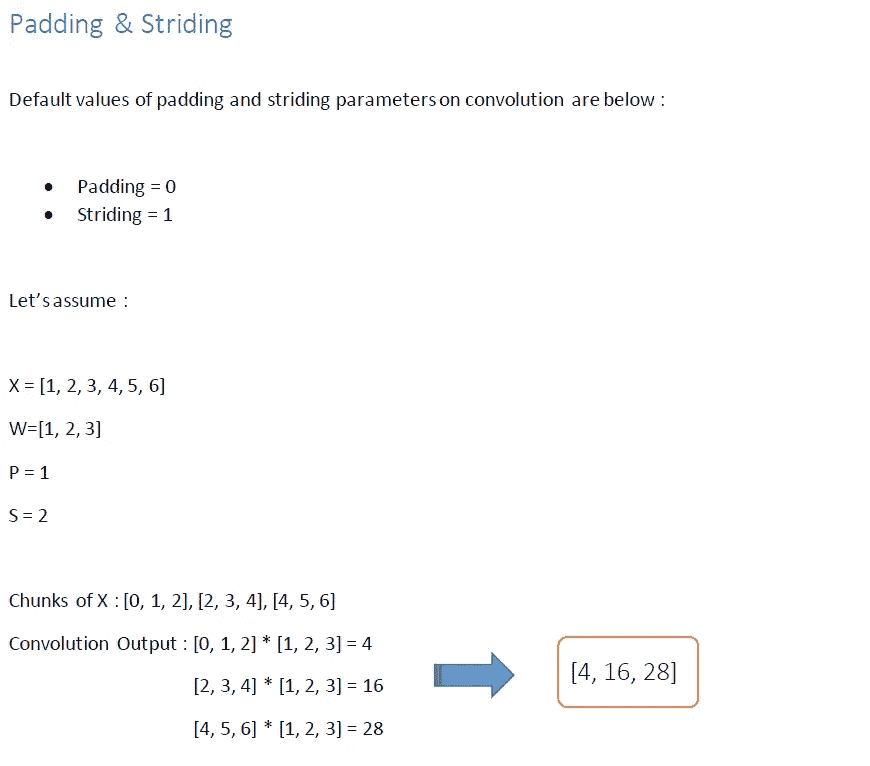
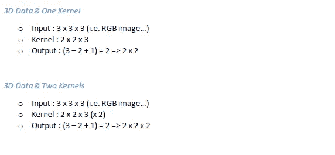

# 逐步张量流/ Keras

> 原文：<https://medium.com/analytics-vidhya/step-by-step-tensorflow-keras-295ed1647620?source=collection_archive---------41----------------------->

第 2 部分:CNN /数学背景

在用 Keras 实现卷积神经网络模型之前，我的目的是从卷积的数学背景开始。


**算法**
*1)使用位置—内核窗口的反转…
2)根据内核大小分割数据…
3)计算数据块和反转内核窗口之间的点积…
4)计算输出的大小…*


```
***Size of Convolution:***Size of X : 𝑆𝑥
Size of W : 𝑆𝑤
Size of Output : 𝑆𝑥–𝑆𝑤+1𝑆𝑥–𝑆𝑤 +1 => 5–3+1 = 3
```

**卷积的功能**
*1)填充:用零增加元素…
2)跨越:内核窗口移位…*


```
***Size of Padding:***Size of X : 𝑆𝑥
Size of W : 𝑆𝑤
Padding = P
Size of Ouput : 𝑆𝑥+2P–𝑆𝑤+1P = 1 => 𝑆𝑥 + 2P – 𝑆𝑤 + 1 = 5 + 2 – 3 + 1 = 5
```


```
***Size of Striding:***Size of X : 𝑆𝑥
Size of W : 𝑆𝑤
Stride : S
Size of Output : ((𝑆𝑥−𝑆𝑤)/𝑆)+1𝑆𝑥 = 5, 𝑆𝑤 = 3, S = 2 => Size of Output = 2
```



```
***Size of Padding & Striding:***Size of X : 𝑆𝑥
Size of W : 𝑆𝑤
Padding : P
Stride : S
Size of Output : ((𝑆𝑥+2𝑃−𝑆𝑤)/𝑆)+1𝑆𝑥 = 6, 𝑆𝑤 = 3, P = 1, S = 2 => Size of Output = 3
```


```
X = [1, 2, 3, 4, 5, 6]
Pooling Size = 3***On Algorithm :***1) Pooling Size = 3 => Striding = 3
2) Chunks of X => [1, 2, 3], [4, 5, 6]
3) [1, 2, 3] => 3; [4, 5, 6] => 6
4) Pooling Output = [3, 6]***On Algorithm :***1) Pooling Size = 3 => Striding = 2
2) Chunks of X => [1, 2, 3], [3, 4, 5]
3) [1, 2, 3] => 3; [4, 5, 6] => 5
4) Pooling Output = [3, 5]***Size of :***Size of X : 𝑆𝑥
Size of W : 𝑆𝑤
Pooling : P
Stride : S (S ≤ P)
Size of Output : 𝑆𝑥 / P
𝑆𝑥 = 6, 𝑆𝑤 = 3, Pool = 3, S = 3 => Size of Output = 2
𝑆𝑥 = 6, 𝑆𝑤 = 3, Pool = 3, S = 2 => Size of Output = 2
```


```
***Variants of Pooling***1) Chunks and Maximum
2) Padding, Chunks and Average
3) Padding, Chunks and Average without padding elementsSamples of “Chunks and Maximum” are above…
```



**通道**
这个关键字是这个问题的答案:“你的数据(一般是图像数据)有多少个通道？”
如果您的数据具有体积维度(通道维度，如 RGB)，您的内核窗口应该具有第三个(通道)维度…
此外，如果我们将使用两个或更多过滤器，那么，我们必须向输出添加一个维度…
过滤器的数量和通道的数量是完全不同的参数…


```
***Formula***Input : X
Kernel : W
Bias : b
Activation Function : f
Output : 𝑃𝑜𝑜𝑙(𝑓(𝑋∗𝑊+𝑏))
```


# CNN 的应用

图像分类
图像识别
物体检测
视频分类
NLP
时域异常检测
药物发现

# 然后

我会在 TensorFlow / Keras 上设计一个卷积神经网络。

# 参考

> *deeplearning.ai 专业化讲义，Coursera*
> 
> *tensor flow in practice specialty 讲义，Coursera*
> 
> *IBM AI 工程专业化讲义，Coursera*
> 
> *Deniz Yuret 深度学习介绍讲义，Koc 大学*