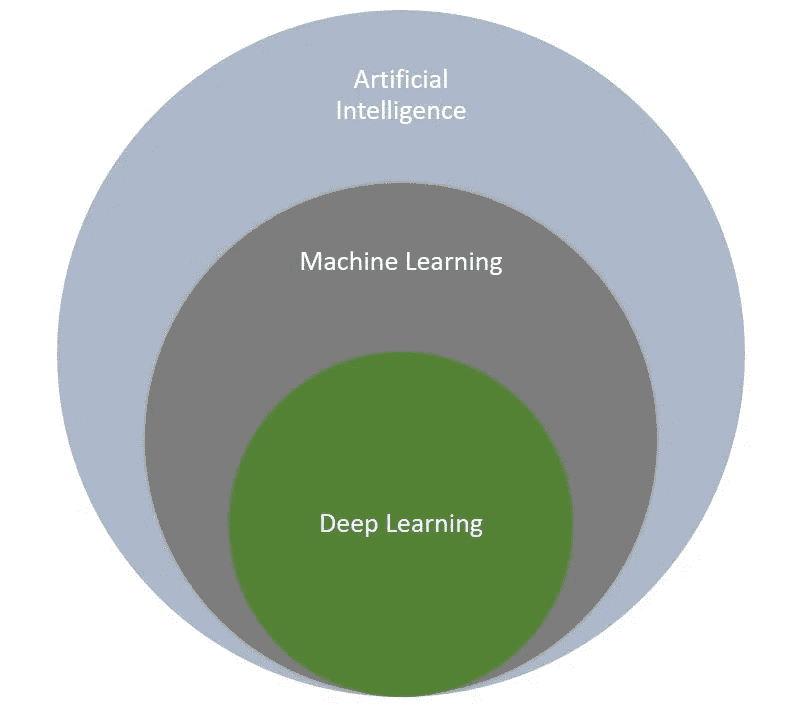
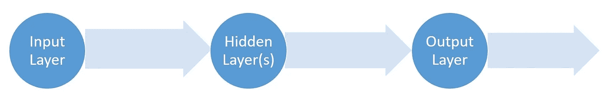
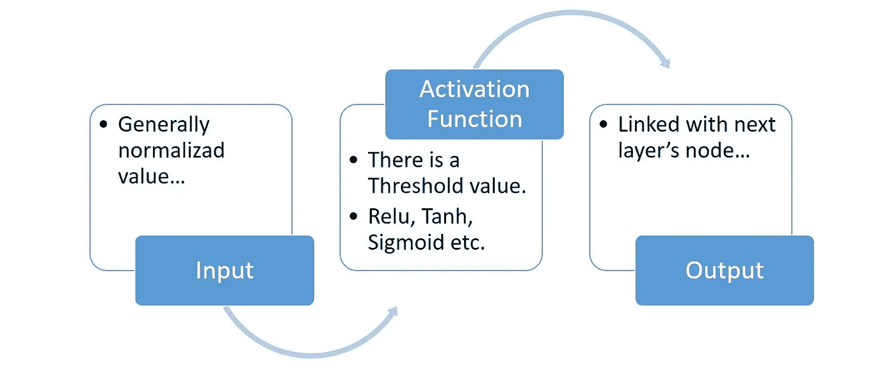
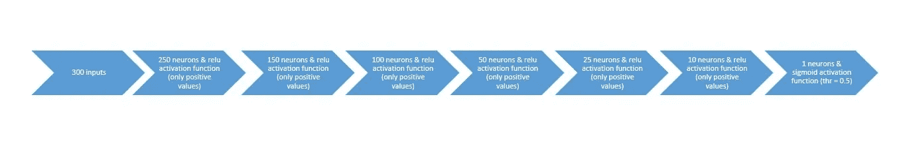
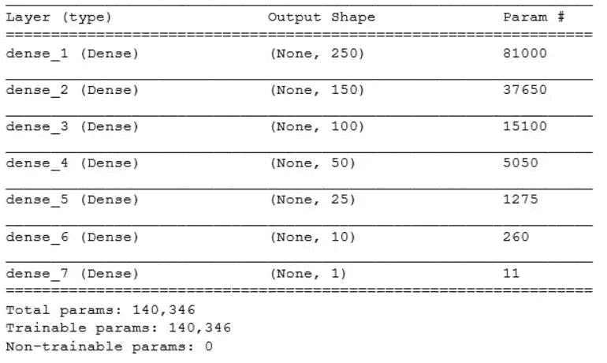
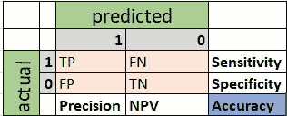
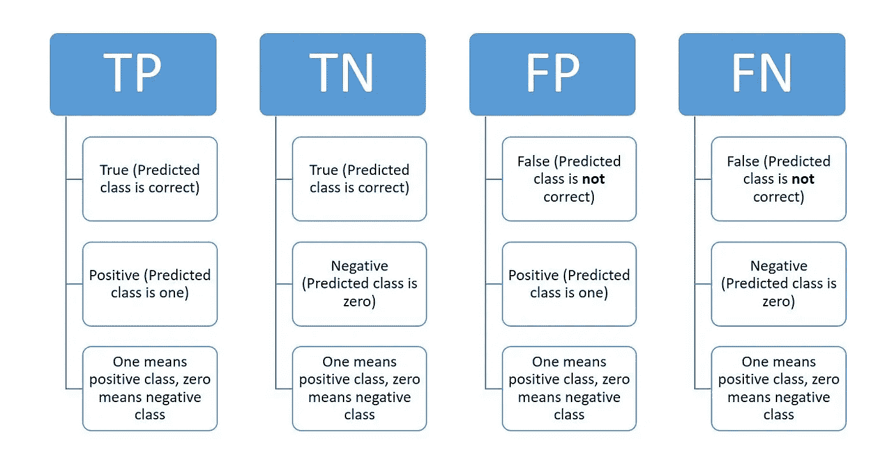
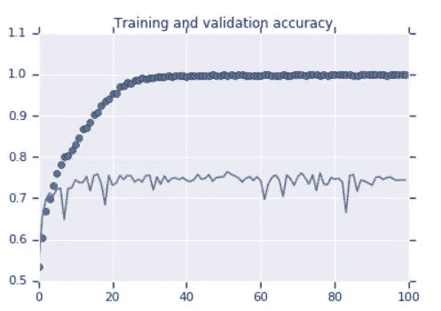

# 逐步张量流/ Keras

> 原文：<https://medium.com/analytics-vidhya/step-by-step-tensorflow-keras-38fa7fdbec38?source=collection_archive---------10----------------------->

第 1 部分:深度神经网络

Tensorflow 是深度学习最流行的框架之一。


[TensorFlow.org](https://www.tensorflow.org)

深度学习是机器学习的一部分。并且，如果我们恰当地使用它，它比机器学习更强。



深度学习

通常，深度学习结构具有输入层、输出层和隐藏层。所以，基本的例子是人工神经网络。如果这种结构只有一个隐含层，则称为浅层神经网络。如果隐含层的数目大于 1，则称为深度神经网络。对于基本的神经网络来说，如果这个数字非常非常高，就没有用了。



深度神经网络流程

人工神经网络有许多节点，就像大脑结构一样。这个节点叫做神经元。神经元需要一个输入、一个输出和一个用于决策的激活函数(因为决策阈值)。



神经元的进展

在介绍了主题之后，我们可以设计一个学习网络。首先，我们将从单个神经元开始…对于这种体验，我们可以使用 Tensorflow 的 Keras API，如下所示。

```
# TensorFlow framework & version                       
import **tensorflow** as tf                       
print(tf.__version__)
                                                                       # keras API                       
from tensorflow import **keras** 
                                                                    # model                       
model = keras.**Sequential**([keras.layers.**Dense**(units=1, 
                                             input_shape=[1])])                       
model.compile(optimizer='sgd', loss='mean_squared_error')                       model.fit(X_train, y_train,  epochs=100)                       model.predict(X_test)
```

这是一个起点。所以，你可以用你的想象来改善它…

让我们设计更广泛的人工神经网络，称为深度神经网络。

```
# TensorFlow framework & version
import tensorflow as tf
print(tf.__version__)# keras API
from tensorflow import keras# model
model = tf.keras.Sequential([
keras.layers.Dense(units=250, input_shape=[300], 
                   activation=tf.nn.relu),
keras.layers.Dense(units=150, 
                   activation=tf.nn.relu), # activation='relu'
keras.layers.Dense(units=100, activation=tf.nn.relu),
keras.layers.Dense(units=50, activation=tf.nn.relu),
keras.layers.Dense(units=25, activation=tf.nn.relu),
keras.layers.Dense(units=10, activation=tf.nn.relu),
keras.layers.Dense(units=1)
])model.compile(optimizer='**sgd**', loss='**mean_squared_error**')
model.fit(X_train, y_train, epochs=100)
model.predict(X_test)
```

模型流程如下…



DNN 流

上面设计的模型是一个回归模型示例。因此，如果我们想显示模型摘要(输入和输出大小，层参数大小等。)我们可以用 summary()方法…

```
model.summary()
```



模型摘要

现在，我们正在改变问题类型，设计一个多类分类模型…

```
# TensorFlow framework & version
import tensorflow as tf
print(tf.__version__)# keras API
from tensorflow import keras# model
model = tf.keras.Sequential([
keras.layers.Dense(units=250, input_shape=[300],
                   activation=tf.nn.relu),
keras.layers.Dense(units=100, 
                   activation=tf.nn.relu), # activation='relu'
keras.layers.Dense(units=50, activation=tf.nn.relu), 
keras.layers.Dense(units=10, activation='**softmax**')
])model.compile(
optimizer='**adam**',
loss='**sparse_categorical_crossentropy**',
metrics=['**accuracy**']
)history = model.fit(X_train, y_train, epochs=100)
```

该模型的度量是准确性，损失函数是分类交叉熵(由于多类模型)。

如果你决定设计一个二进制分类模型，你可以改变最后一层和模型编译参数如下…

```
…
# model
model = tf.keras.Sequential([
keras.layers.Dense(units=250, input_shape=[300], 
                   activation=tf.nn.relu),
keras.layers.Dense(units=100, 
                   activation=tf.nn.relu), # activation='relu'
keras.layers.Dense(units=50, activation=tf.nn.relu),
keras.layers.Dense(units=1, activation='**sigmoid**')
])model.compile(
loss='**binary_crossentropy**',
optimizer=**RMSprop**(lr=0.001),
metrics=['**accuracy**']
)history = model.fit(X_train, y_train, epochs=100)
```

该模型的度量是准确性，其定义如下，用于二元分类…



混淆矩阵



```
**Accuracy** = (TP + TN) / (TP + TN + FP + FN)**Sensitivity** = TP / (TP + FN)
**Recall** = TP / (TP + FN)
**Specificity** = TN / (TN + FP)**Precision** = TP / (TP + FP)
**Negative Predictive Value** = TN / (TN + FN)**F1 Score** = 2 x (Precision x Recall) / (Precision + Recall)
```

在模型代码的末尾，我们将模型赋给了一个名为 history 的变量。为什么？

模型对象包含一些元素。经过模型训练，我们可以发现它们。因此，如果将训练好的模型分配给一个变量，这将非常有用。例如，让我们根据训练集和验证集绘制准确度图…

```
# plotting framework
import matplotlib.pyplot as plt# accuracy values & number of epoch
acc = history.**history['accuracy']**
val_acc = history.**history['val_accuracy']**
epochs = range(len(acc))# creating a graph
plt.plot(epochs, acc, 'bo', label='Training accuracy')
plt.plot(epochs, val_acc, 'b', label='Validation accuracy')
plt.title('Training and validation accuracy')plt.figure()
plt.legend()
plt.show()
```



准确(性)

如果我们想要访问损失值，我们可以使用历史。**历史【损失】**和历史。**历史['瓦尔 _ 洛斯']** …

我们应该避免过度拟合问题。在人工神经网络结构中，我们使用了一个预防层。这叫辍学…

```
...
# model
model = tf.keras.Sequential([
keras.layers.Dense(units=250, input_shape=[300], 
                   activation=tf.nn.relu),
keras.layers.Dense(units=150, 
                   activation=tf.nn.relu), # activation='relu'
keras.layers.Dense(units=100, activation=tf.nn.relu),
keras.layers.**Dropout**(0.2),
keras.layers.Dense(units=50, activation=tf.nn.relu),
keras.layers.Dense(units=25, activation=tf.nn.relu),
keras.layers.**Dropout**(0.2),
keras.layers.Dense(units=10, activation=tf.nn.relu),
keras.layers.Dense(units=1)
])
...
```

差值介于 0 和 1 之间。例如，如果我们使用 0.2，这意味着模型层将会忘记其输入数据的%20。换句话说，这一层有 20%的神经元会随机关闭…

# 然后

我将解释 1D，2D 和三维数据的卷积过程。另外，我们将在 TensorFlow / Keras 上设计一个卷积神经网络。最后，我们将计算输出大小和参数数量…

# 参考

> deeplearning.ai 专业化讲义，Coursera
> 
> 实践专业化讲义，Coursera
> 
> IBM 人工智能工程专业讲义，Coursera
> 
> Deniz Yuret 的深度学习介绍讲义，Koc 大学