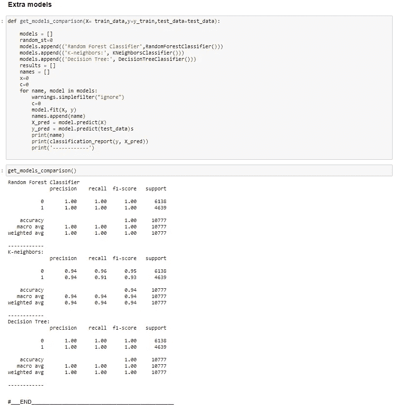

# 使用 NLTK 的逐步文本分析和情感分析

> 原文：<https://medium.com/analytics-vidhya/step-by-step-text-analysis-and-sentiment-analysis-using-nltk-c971bf755df6?source=collection_archive---------15----------------------->

**问题陈述**:假设你在一家公司担任合规数据科学分析师。你的任务之一是监控内部沟通，以便更好地了解员工的情绪，评估任何潜在的风险。您可以利用情绪分析技术来识别和解决监管风险问题、合规问题和潜在欺诈。情绪分析技术已经成为一种风险管理形式，并且正在成为各种企业的一种有用的风险控制工具。

# 数据预处理

让我们来看看数据集:

数据预览

在删除空值、缺失值和带有未使用列(ID)的重复行之后，我们继续进行文本分析。

一些导致数据是关于什么的

停用词(是，到，和，的..)非常频繁，在文档中大量出现，因此在继续之前，让我们看看它们在我们的数据集中相对于正数据和负数据(分别为标签 1 和标签 0)是如何分布的

齐夫分布:
齐夫分布(也称为泽塔分布)是一种满足齐夫定律的连续概率分布:一个项目的出现频率与其在频率表中的排名成反比

# 特征工程

1.  “词频”是指一个标记在正标签数据中出现的次数
2.  “负频率”是指标记在负标签数据中出现的次数
3.  pos rate' = (pos 频率)/ (pos 频率+ neg 频率)；同样，我们可以计算“负利率”
4.  pos_freq_pct' = (pos 频率)/(总 pos 频率)；同样，我们可以计算“负频率百分比”
5.  harmonic_pos_freq_pct:每个令牌的 pos 频率和 pos_freq_perc 之间的谐波平均值
6.  harmonic_neg_freq_pct:每个令牌的 neg 频率和 neg_freq_perc 之间的谐波平均值
7.  norm _ cdf _ pos _ rate:pos rate 的正态分布 CDF 值(mu=0.sig=1)
8.  norm_cdf_neg_rate:负利率的正态分布 cdf 值(mu=0.sig=1)
9.  norm_cdf_pos_freq_pct:正态分布频率百分比的 cdf 值(mu=0.sig=1)
10.  norm_cdf_neg_freq_pct:负频率百分比的正态分布 cdf 值(mu=0.sig=1)
11.  harmonic_pos_cdf:每个令牌的 norm_cdf_pos_rate 和 norm_cdf_pos_freq_pct 之间的调和平均值
12.  harmonic_neg_cdf:每个令牌的 norm_cdf_neg_rate 和 norm_cdf_neg_freq_pct 之间的调和平均值

进行特征工程后的数据预览

上面剩下的数据集。

# 更多数据文章:

> 1.[不使用数据的 5 个理由(以及为什么大多数都是谎言)](https://amitb0007.medium.com/5-reasons-not-to-use-data-and-why-most-are-bs-92cf5e369011)
> 
> 2. [Begineer 的数据策略指南](https://amitb0007.medium.com/beginners-guide-to-data-strategy-625d65dc23da?source=your_stories_page----------------------------------------)
> 
> 3.[推荐网飞电影的聊天机器人](https://chatbotslife.com/simple-chat-bot-for-recommending-netflix-movies-and-tv-shows-bd411f7827eb?source=your_stories_page----------------------------------------)
> 
> 4.[电子商务网站的产品相似性和购物篮分析](https://amitb0007.medium.com/product-affinity-and-basket-analysis-for-an-ecommerce-website-4a388fc48dd0?source=your_stories_page----------------------------------------)

# 相关分析

对于正数据中使用的单词和负数据中使用的单词之间的相关性，我们需要做几个相关性分析。

正频率与负频率

(pos rate 和 pos_freq_pct 之间的调和平均值)neg rate 和 neg_freq_pct 之间的调和平均值)

(pos rate 的正态分布 cdf 和 pos_freq_pct 的正态分布 cdf 之间的调和平均值)neg rate 的正态分布 cdf 和 neg_freq_pct 的正态分布 cdf 之间的调和平均值)

## 上面三个图中哪一个能更好地解释 neg 和 pos 行中单词之间的关系。为什么？

就这三张图而言，第三张图最能解释否定和肯定行中单词之间的关系。原因如下:

1.  当正态分布时，两个负数据集中的单词非常不同，并且单词的频率在两个标签中负相关。此外，我们可以看到在中间有一个轻微的凸起，这告诉我们一些高频词，如“我”、“感觉”、“和”等，在两个标签中出现的数量几乎相同。
2.  它还处理了除停用词之外的高频词，并告诉我们在正面和负面数据中使用不同种类的词的正确情况

## 假设我们想要建立一个机器学习模型来预测给定的句子是否有积极或消极的情绪。整个管道突出了相同的各种步骤和算法。

看完数据为新鲜，让我们为 ML 模型做准备。

删除标点、空格、特殊字符和重复字符

删除停用词、标记化和词条化

既然数据已经清理和准备好了，那么让我们为了训练和测试的目的来分割数据集。

标准训练/测试分割

ML 模型需要数字形式的训练数据，因此使用 TF-IDF 矢量器进行 BOW 的转换和创建。(一袋文字)

使用 TF-IDF 对 BOW 进行训练测试转换

根据班级数量和班级类型选择模型。在我们的例子中，它是名义上的，有两个类别(0 & 1)

基线模型选择:逻辑回归

在列车上拟合模型后，我们需要检验模型的准确性。在我们的案例召回中，精确度、f-score 和 ROC-AUC 曲线是多个参数，基于这些参数应该对模型进行评估。

基线模型的评估指标

让我们用一些原始/看不见的数据来测试数据，因为它不应该过度拟合。

请随意查看完整的代码:)

谢谢！