# 使用不同模型的逐步文本分类并比较它们。

> 原文：<https://medium.com/analytics-vidhya/step-by-step-text-classification-using-different-models-and-compare-them-8a34204c34f8?source=collection_archive---------7----------------------->


索引:

1.  **数据集信息**
2.  **探索性数据分析**
3.  **特色工程**
4.  **机器学习模型**
5.  **使用 LSTM 和 CONV1D 进行文本分类**
6.  **伯特详细介绍**
7.  **未来工作**
8.  **参考**

**数据集信息**

该数据集包含由网络聚合器在 2014 年 3 月 10 日至 2014 年 8 月 10 日期间收集的 422，937 条新闻故事的标题、URL 和类别。

该数据集中包含的新闻类别包括商业；科学技术；娱乐；和健康。涉及同一新闻条目的不同新闻文章(例如，关于最近发布的就业统计的几篇文章)也被分类在一起。

422937 个新闻页面，分为:

152746 商业类新闻
108465 科技类新闻
115920 商业类新闻
45615 健康类新闻

你可以在这里从[下载数据集。](https://archive.ics.uci.edu/ml/datasets/News+Aggregator)

# 什么是文本分类

简单地说，文本分类是根据内容对原始文本进行分类或标记的过程。文本分类几乎可以用在任何事情上，从新闻话题标注到用户评论的情感分析。

例如:

“电话太可怕了。超级慢。有一些严重的膨胀软件和弹出广告不像其他人。我不会向任何人推荐这款手机”

从上面的文字中，我们的分类模型可以决定与我们的需求相关的特定类别或标签，在这种情况下，就是负面评论。

**基于机器学习的文本分类**

随着机器学习的发展，现在使用机器学习创建模型、向模型提供数据并等待模型完成变得更加容易。有了机器学习模型，从输入文本中进行分类就容易得多，也快得多。使用机器学习的一个重要步骤是特征提取。我们用向量的形式将文本转换为数字表示，一种方法是使用单词包，或者基本上，我们统计文本中的每个单词，或者使用 tfidf(术语频率逆文档频率)等。

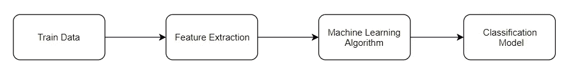

上图是使用机器学习进行文本分类的简单流程。在第一阶段，我们使用文本输入作为训练数据。然后我们需要做特征提取，把文本转换成数字表示，因为大部分机器学习算法只理解数字特征。在获得我们想要的特征后，我们将这些特征与预定义的标签/类别一起输入机器学习算法。当它完成训练后，我们就有了我们的分类模型。

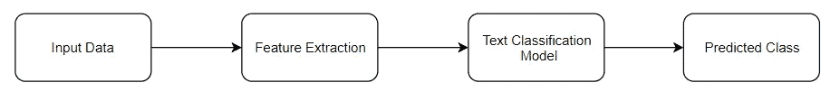

有了分类模型后，我们可以输入想要预测的数据，使用相同的流程，进行特征提取，然后将其输入到我们的模型中。当它完成时，我们将得到我们预测的类。

使用机器学习使文本分类变得更容易、更快，准确率也更高。

**任务**

根据标题对新闻进行分类

**第一步:“将 csv 数据加载到我们的数据框架中”**

> *导入熊猫为 PD
> df = PD . read _ CSV(' UCI-news-aggregator . CSV ')
> df . head()*

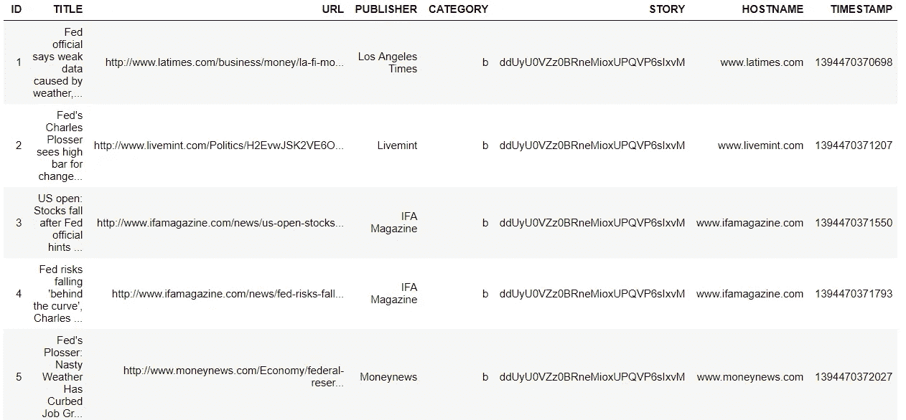

“标题”是输入,“类别”是我们想要预测的类别输出

**第二步:探索性数据分析。(EDA)**

有时候甚至我们肉眼看到的东西也不是“赤裸裸”的真相。追寻真相需要时间、信念和确定性。EDA——探索性数据分析——为机器学习爱好者做这件事。这是一种可视化、总结和解释隐藏在行列格式中的信息的方式。EDA 是数据科学中至关重要的一步，它使我们能够获得对业务连续性、股东和数据科学家至关重要的某些见解和统计方法。它执行定义和细化我们的重要特征变量选择，这将在我们的模型中使用。

对于我们的数据集，下面是我为数据集做的 EDA。EDA 有 100 多种技术，这取决于我们选择哪种技术。最常见的是条形图、字云、散点图等。

**月分析。**

我们有 2014 年 3 月 10 日至 2014 年 8 月 28 日的数据，从 3 月到 8 月大约 6 个月。

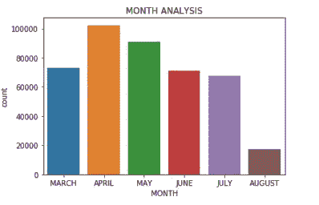

月份分析

**类别分析**

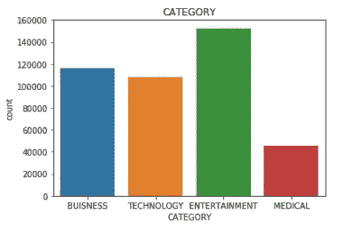

类别分析

**字云**

一个**字云**(也称为**标签云**或文字**云**)是**字**频率和值的直观表示。它用于突出显示特定术语或类别在数据源中出现的频率。一个关键词在数据集中出现的次数越多，这个关键词就显得越大越粗。


**不同类别的词云**

**第三步:数据清理和数据预处理**

将数据转换成计算机可以理解的东西的过程被称为**预处理。**预处理的主要形式之一是过滤掉无用的数据。在自然语言处理中，无用的词(数据)被称为停用词。

**停用词:**停用词是搜索引擎已经被编程忽略的常用词(例如“the”、“A”、“an”、“in”)，无论是在索引用于搜索的条目时还是在作为搜索查询的结果检索它们时。

**特色工程:**

[特征工程](https://en.wikipedia.org/wiki/Feature_engineering)，也称为特征创建，是从现有数据中构建新特征来训练机器学习模型的过程。这一步可能比实际使用的模型更重要，因为机器学习算法只从我们给它的数据中学习，创建与任务相关的特征绝对至关重要(参见优秀论文[“关于机器学习要知道的一些有用的事情”](https://homes.cs.washington.edu/~pedrod/papers/cacm12.pdf))。

在大多数情况下，特征工程帮助我们获得比简单模型更高的精度。

如你所知，通过阅读帖子的上半部分，我们的数据是文本格式的，所以我在下面添加了这个功能。

**位置标记**

词性标注的主要目标是识别给定单词的语法组。无论是名词、代词、形容词、动词、副词等。根据上下文。词性标注寻找句子中的关系，并为单词分配相应的标签。

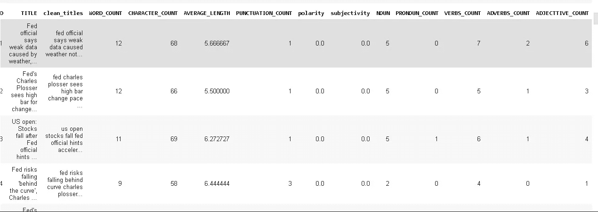

当你的数据是文本时，你可以从[这里](https://www.datacamp.com/community/tutorials/text-analytics-beginners-nltk)找到如何添加更多的特性。

让我们去分类脸。

**第四步:分类:**

机器学习模型不能直接处理原始文本！这个问题现在提出了另一个难题——我们如何将文本转换成有意义的数字或向量，以便它们对 ML 管道有用？简单地将原始文本转换成例如二进制、十进制或十六进制表示，肯定不会给我们单词的函数表示，因为这些值不能捕获关于单词(例如“国王”和“王后”或“猫”和“狗”)之间的含义、上下文和相关性的信息。应用将一组文档表示为公共向量空间中的向量的模型可以解决这个问题。

有多种方法可以将 word 转换成 vector，但我在这里使用了以下方法。

1.  一袋单词
2.  TFIDF
3.  AVG w2v
4.  TFIDF w2v

你可以在这里学习如何将文本转换成矢量[。](https://towardsdatascience.com/different-techniques-to-represent-words-as-vectors-word-embeddings-3e4b9ab7ceb4)

**机器学习模型:**

1.  朴素贝叶斯
2.  逻辑回归

**为什么是朴素贝叶斯？**

1.  用于大数据集分类的最好和最古老的方法之一。
2.  更少的培训时间
3.  可解释性

alpha 是朴素贝叶斯中的超参数，因此我们必须使用 GridSearchCV 找到最佳超参数。

**什么是网格搜索？**

网格搜索是执行超参数调整的过程，以确定给定模型的最佳值。这一点非常重要，因为整个模型的性能取决于指定的超参数值

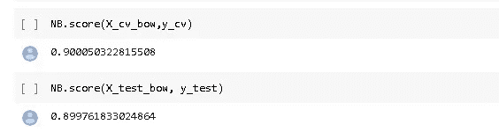

拟合模型后，我绘制混淆矩阵并计算精度。

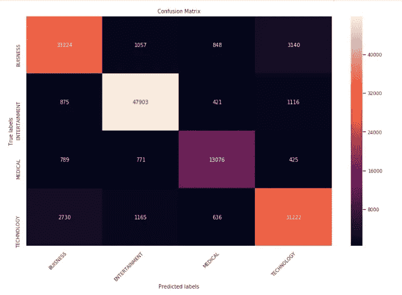

从上面的图片你可以看到我的大部分分类标签都是正确的。

正如我上面提到的，使用朴素贝叶斯是因为特征的可解释性

让我们打印重要的特征。

我们可以使用 sklearn 的 MultinomialNB 函数中的 feature_log_prob 通过[来实现这一点。](https://scikit-learn.org/stable/modules/generated/sklearn.naive_bayes.MultinomialNB.html)

argsort()将以 log-prob 的升序提供索引，因此对于最高 imp 特性，我们必须以逆序获取特性名称。

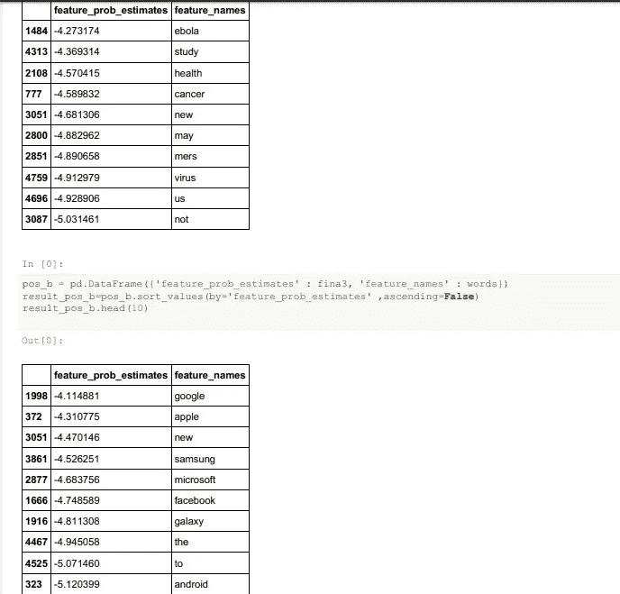

参见健康新闻分类，我的前 10 个词是埃博拉、研究、健康等，同样，对于技术，我的前 10 个词是谷歌、苹果、新闻、三星等。

# 逻辑回归:

就其本身而言，逻辑回归只是二元分类器，这意味着它们不能处理超过两个类别的目标向量。然而，有一些逻辑回归的巧妙扩展可以做到这一点。在一对其余的逻辑回归(OVR)中，为每个类别训练一个单独的模型，预测一个观察值是否是该类别(因此使其成为一个二元分类问题)。它假设每个分类问题(例如 0 类或不 0 类)是独立的。您可以通过设置 multiclass = 'ovr '来实现这一点，这意味着 one vs rest。

应用网格搜索后，我们可以检查哪个参数最适合我们的模型

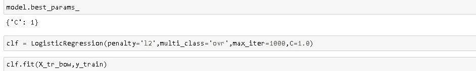

当我们得到模型的最佳参数时，我们训练模型并测试它。

训练后，让我们检查模型的性能和绘图混淆矩阵。

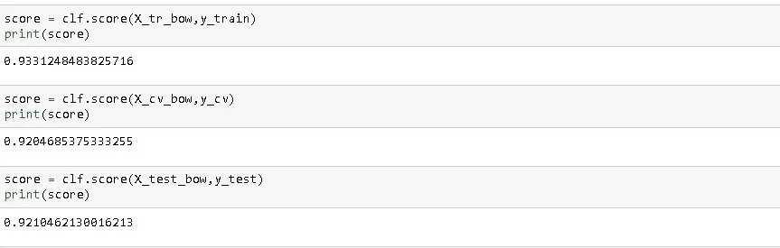

**混淆矩阵**

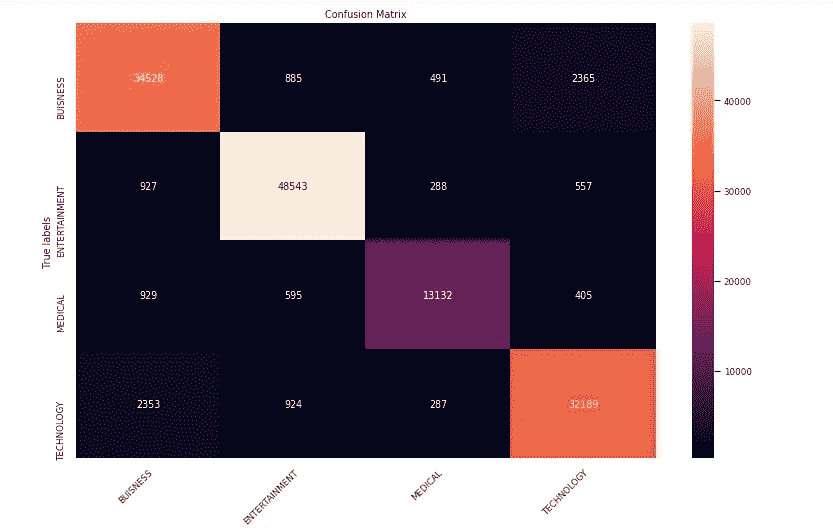

## 功能重要性:

**业务:**

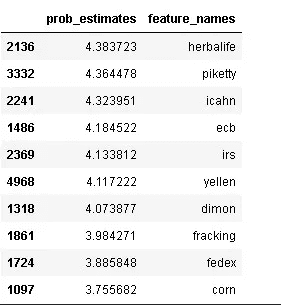

**娱乐:**

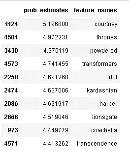

**医疗:**

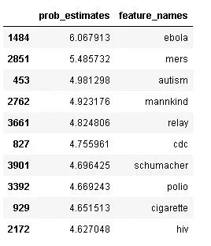

**技术:**

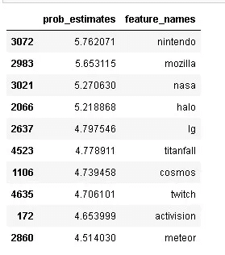

我在逻辑回归中使用 coef 属性来绘制特征重要性。

决策函数中特征的系数。

我们可以使用深度学习模型来提高准确性，所以我也使用了谷歌伯特和 LSTM 进行分类。

# LSTM:

为了了解 LSTM，你应该有 RNN 的基本知识，你可以从[这里](https://towardsdatascience.com/understanding-rnn-and-lstm-f7cdf6dfc14e)阅读。

我们的文本预处理将包括以下步骤:

*   将所有文本转换为小写。
*   在文本中用空格替换 REPLACE_BY_SPACE_RE 符号。
*   从文本中删除 BAD_SYMBOLS_RE 中的符号。
*   删除文本中的“x”。
*   删除停用词。

# LSTM 造型

*   通过将每个文本转换成整数序列或向量，对标题文本进行矢量化。
*   将数据集限制在 50000 字以内。
*   将每个投诉的最大字数设置为 250。

找到 47422 个唯一令牌。

*   截断并填充输入序列，使它们在建模时长度相同。

```
X = tokenizer.texts_to_sequences(data['clean_titles'].values)X = pad_sequences(X, maxlen=MAX_SEQUENCE_LENGTH)print('Shape of data tensor:', X.shape)
```

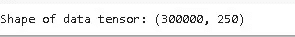

*   将分类标签转换为数字。你可以认为这是标签编码器分配给每个类别的唯一编号。

```
Y = pd.get_dummies(df['Product']).values
print('Shape of label tensor:', Y.shape)
```

*   列车测试分离。

*   第一层是嵌入层，使用 100 个长度向量来表示每个单词。
*   下一层是具有 100 个存储单元的 LSTM 层。
*   输出层必须创建 4 个输出值，每个类一个。
*   激活功能是 softmax 用于多类分类。
*   因为这是一个多类分类问题，所以使用 categorical _ crossentropy 作为损失函数。

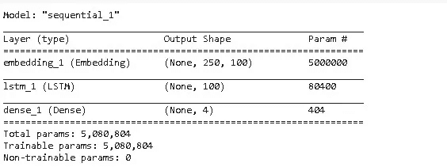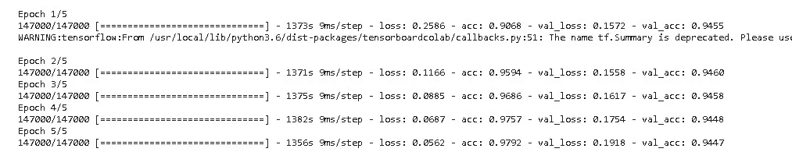

训练了 5 个时代

训练后让我们绘制损失和准确度图。

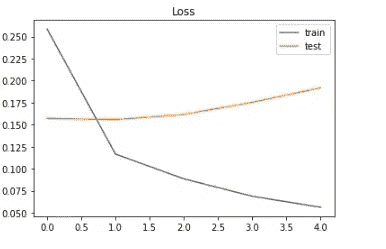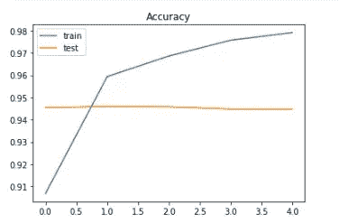

LSTM 给出了更高的准确性和可解释性，但训练时间高于朴素贝叶斯和逻辑回归。

让我们测试我们的模型。

上述函数预测传递给该函数的任何标题的类别。

```
title=['Private hospitals threaten to stop CGHS, ECHS cashless services']check(title)
```

**输出:**

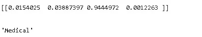

## CONV1D:

CONV1D 如何用于文本分类[这里](https://stackoverflow.com/questions/52352522/how-does-keras-1d-convolution-layer-work-with-word-embeddings-text-classificat)是最好的解释。

在这个模型中，我使用了预训练手套。

首先加载手套文件

将给定单词的向量保存在矩阵中。

训练完模型后，我的图形看起来像这样。

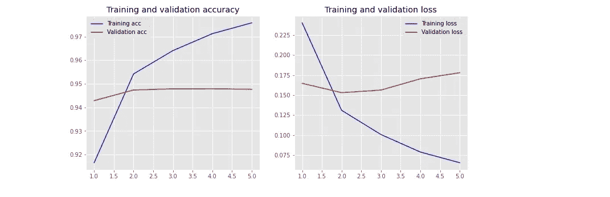

# **BERT(** 变压器的双向编码器表示) **:**

如果你在过去的一年里一直关注自然语言处理，你可能听说过 BERT:Transformers 的双向编码器表示。这是一个由谷歌研究人员设计的神经网络架构，它完全改变了 NLP 任务的艺术状态，如文本分类，翻译，摘要和问题回答。

既然 BERT 已经作为可加载模块添加到了 [TF Hub](https://www.tensorflow.org/hub) 中，那么添加到现有的 Tensorflow 文本管道中就很容易了。在现有的管道中，BERT 可以取代像 ELMO 和 GloVE 这样的文本嵌入层。或者，[微调](http://wiki.fast.ai/index.php/Fine_tuning) BERT 在许多情况下可以提高精确度和缩短训练时间。

在这里，我们将在 Tensorflow 和 tf hub 中使用 BERT 训练一个模型来预测新闻的类别。一些代码改编自这个 [colab](/huggingface/multi-label-text-classification-using-bert-the-mighty-transformer-69714fa3fb3d) 笔记本。我们开始吧！

**数据预处理**

BERT 模型仅接受特定类型的输入，数据集通常具有以下四个特征:

-> guid:代表观察的唯一 id。

-> text_a:我们需要分类到给定类别的文本

-> text_b:它在我们训练模型以理解句子之间的
关系时使用，它不适用于分类问题。

->标签:它由给定文本所属的标签或类或类别组成。

*   >在我们的数据集中，有 text_a 和 label。下面的代码块将使用 BERT 库中提供的 InputExample 类为我们数据集中的所有记录
    的上述每个特性创建对象。

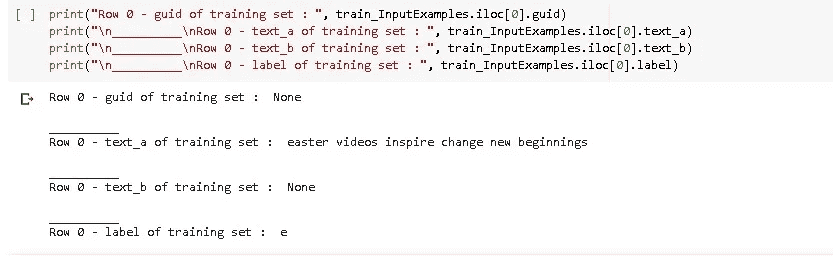

我们现在要开始讨论训练前的伯特。在这个例子中，我们将使用 bert_uncased_L-12_H-768_A-12/1 模型。点击[查看所有可用版本。](https://tfhub.dev/s?network-architecture=transformer&publisher=google)

我们将在模型中使用 vocab.txt 文件来将数据集中的单词映射到索引。此外，加载的 BERT 模型是在未大写/小写数据上训练的，因此我们输入来训练模型的数据也应该是小写的。(所以我们提前对数据进行预处理)。

现在我们有了 BERT 模型的适当格式，可以开始预处理数据了。

我们将执行以下操作:

*   通过将所有空白字符转换为空格并根据所使用的模型类型(大写或小写)区分字母大小写来规范化文本。
*   对文本进行分词或将句子拆分成单词，并将所有标点符号从文本中拆分出来。
*   添加 CLS 和 SEP 标记来区分句子的开头和结尾。
*   根据相似性将单词拆分成单词块(即“呼叫”-> [“呼叫”、" ##ing"])
*   使用保存在 BERT 的 vocab.txt 文件中的 BERT 自己的词汇将文本中的单词映射到索引。

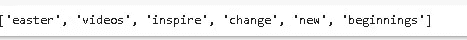

我们将把 InputExample 转换成 BERT 能够理解的特性。该特征将由类 InputFeatures 表示。

*   input_ids:标记文本的数字 id 列表
*   input_mask:对于实数标记将被设置为 1，对于填充标记将被设置为 0
*   segment_ids:在我们的例子中，这将被设置为一个列表
*   label_ids:文本的一次性编码标签。

我们使用准确性作为衡量标准。

> #为训练创建一个输入函数。对于使用 TPU，drop_remainder = True。
> 
> train _ input _ fn = Bert . run _ classifier . input _ fn _ builder(
> 
> 特征=训练 _ 特征，
> 
> 序列长度=最大 seq 长度，
> 
> is_training=True，
> 
> drop_remainder=False)
> 
> #创建用于验证的输入函数。对于使用 TPU，drop_remainder = True。
> 
> val _ input _ fn = run _ classifier . input _ fn _ builder(
> 
> 功能=val_features，
> 
> 序列长度=最大 seq 长度，
> 
> is_training=False，
> 
> drop_remainder=False)

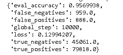

**训练结束后，我们开始预测**

```
“””Entertainment: e
Medical : m
Buisness: b
Technology: t”””
```

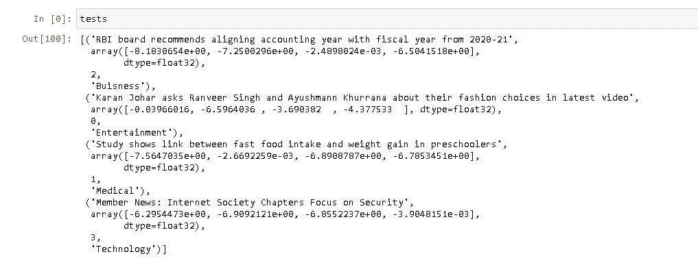

比较所有型号:

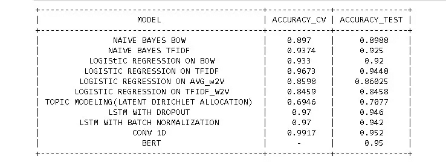

## 未来工作:

对于深度学习模型，可以通过超参数调整来提高精度，对于深度学习模型的超参数调整也是如此。

会尝试装袋和助推技术。

## 谢谢

GIthub 回购[这里](https://github.com/amanv1906/News-Classification-using-Bert-and-other-techniques)

## 参考:

[应用人工智能](https://www.appliedaicourse.com/course/11/Applied-Machine-learning-course)

[分析 Vidhya](https://www.analyticsvidhya.com/myfeed/?utm-source=blog&utm-medium=top-icon/)

[伯特研究论文](https://arxiv.org/abs/1810.04805)

[机器学习掌握度](https://machinelearningmastery.com/)

[](https://www.linkedin.com/in/aman-varyani-885725181/) [## aman varyani -作家-分析 Vidhya | LinkedIn

### 我学东西很快，总是想找到一种方法去做一些有创意的事情。我寻找机会建立一个…

www.linkedin.com](https://www.linkedin.com/in/aman-varyani-885725181/)