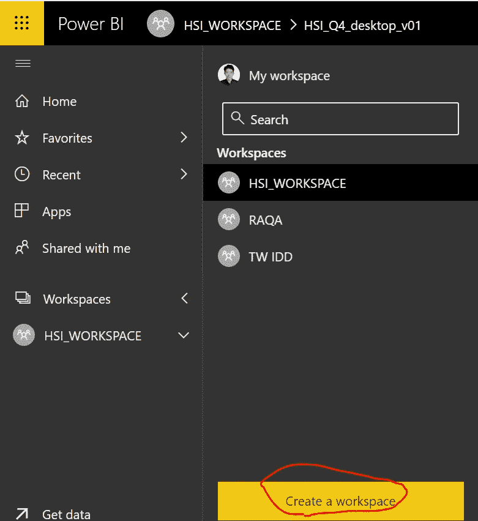
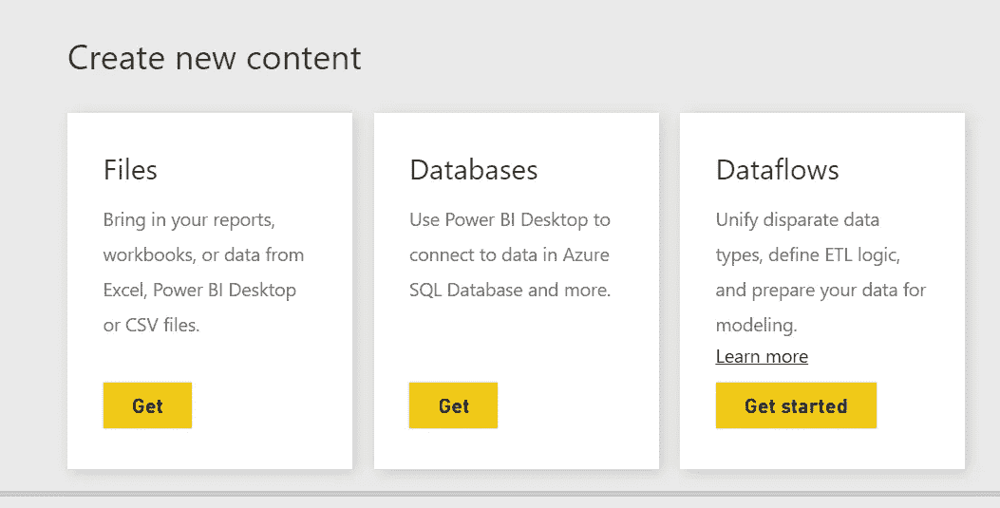
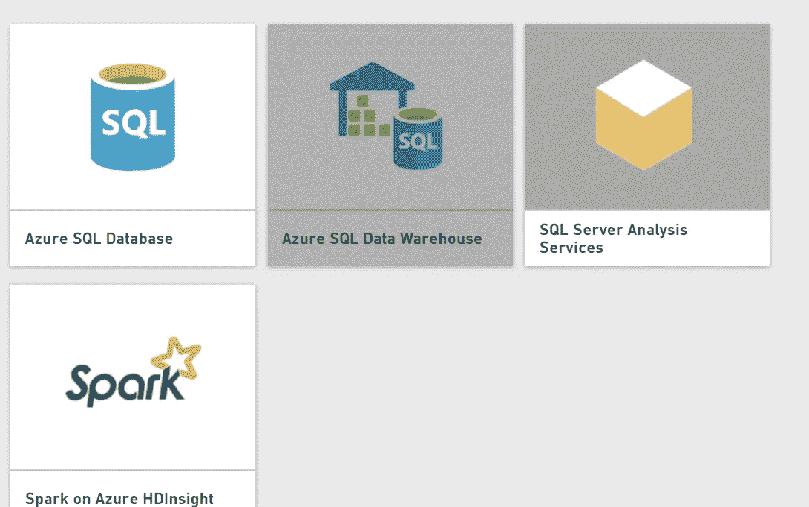
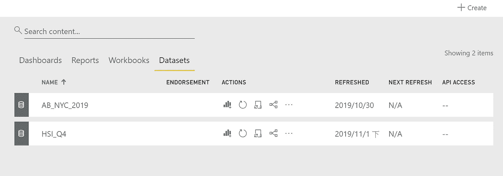
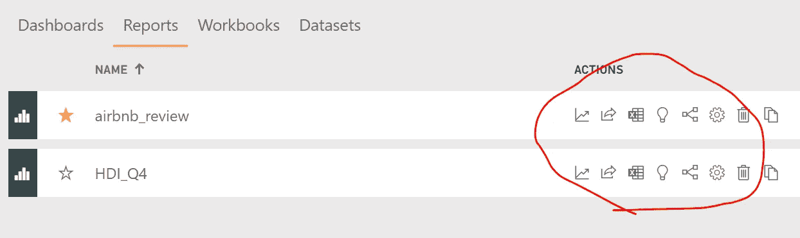
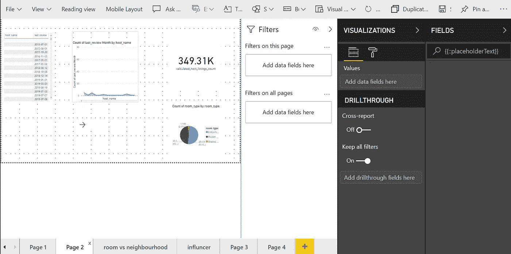

# 逐步在 Power BI 上创建您的第一个仪表板

> 原文：<https://medium.com/analytics-vidhya/step-by-step-to-create-your-first-dashboard-on-power-bi-6b84f103b5bc?source=collection_archive---------29----------------------->

我在之前的[文章](/@wedodo/power-bi-introduction-basic-information-48ac93c643cd)中有一个关于 Power BI 的简介，现在你可以一步一步地学习如何在 Power BI 上创建一个仪表板。

## 工具栏和主屏幕

主屏幕和工具栏

像许多其他工具一样，对于 Power BI web，功能列表位于屏幕的一侧，您可以在工具栏上找到您的工作区、包应用程序和历史记录。对于一个全新的仪表板，您必须创建一个工作区来收集数据集、构建报告和完成您的仪表板。

## 用数据连接

Power BI 支持文件、数据库或过程连接作为数据集

对于 DB 类型，它支持 Azure SQL 仓库或 SQL server

创建工作空间后，您可以在此工作空间中进行以下设置。现在，尝试导入您的数据。无论是本地主机还是基于云的，您都可以连接到您组织中的数据库。Power BI 还支持常见文件，如。csv，。xlsm，。xml，。json。选择您的数据源并设置连接，请注意必须固定根，否则您将需要在 Power BI desktop 上修改根，您不能在 web 版本上进行任何更改。

## 检查数据集和报告设置

数据集的设置面板

报告的设置面板

在这一步中，您可以转到工作区中的设置面板。您可以针对特定数据集、报表或仪表板配置或激活和操作。通常情况下。我们经常对一个实体使用复制、共享和总览功能。

## 创建您的报告

创建和编辑您的报告

单击设置面板中的报告标签，您将被引导至该屏幕。在右边，您可以在这里找到原始数据的所有列。在字段区域旁边，有一个可视化区域，您可以选择要在报告中使用的图表，并配置有关标题、格式、颜色等属性。过滤器区域在可视化区域的旁边，您可以根据不同的列在这里设置过滤器的条件。

移动到底部，您可以为不同目的的报告创建许多页面(就像在 excel 中一样)。Power BI 支持跨选项卡复制和粘贴对象，这减少了创建报告的时间。

最上面是操作功能，你可以在这里找到保存和编辑按钮。它还为强调移动性的人提供了复制功能和移动布局预览。

遵循创建工作空间、确定数据集、构建报表以及在报表中调整这些属性的步骤。您可以在 Power BI 网站上轻松拥有或维护报告。