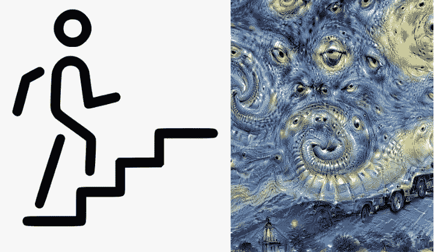

# 使用张量流(CNN)逐步训练模型

> 原文：<https://medium.com/analytics-vidhya/step-by-step-train-model-using-tensorflow-cnn-2f243b847c8?source=collection_archive---------3----------------------->

使用 Tensorflow 逐步训练您自己的图像数据集以进行深度学习



事实上，有一个最简单的方法来训练你自己的形象。可以用 [Firebase 机器学习](https://firebase.google.com/docs/ml)。你只需要上传你的图片和定义标签。但是如果你仍然想亲手训练一个模特，你可以继续阅读这个博客。

无论如何..你可以在这里找到完整的 ***源代码*** *和数据集*[](https://github.com/adesueb/nurhadiml)

# *准备数据集*

*准备尽可能多的样本图像。按照分类/标签将它们放入每个文件夹。*

*为此我将从[这个故事](/@ade.sueb/simple-tflite-running-on-android-phone-2b03ab4c2e2e)中使用[矿](https://github.com/adesueb/nurhadiml/tree/master/dataset)。为此，您可以使用`cat and dog`或`mnist`数据集。*

# *加载数据集*

## *创建特征(X)和标签(Y)变量*

*创建变量`X_TRAIN`和`Y_TRAIN`。两个人都成了阵的。*

*创建名为`labels`的变量数组，其中包含模型的标签或分类名称。*

*将变量`labels`的索引保存到变量`Y_TRAIN`中。我们隐式地将标签编码成数字。这样我们就可以把它传给模特。*

*加载图像文件夹。一个接一个地迭代文件，并将标签名称的索引添加到变量数组中。对于这个变量`X_TRAIN`。*

```
*DATADIR = "dataset"
TESTDIR = "test"
LABELS = ["indosiar", "indosiar_iklan", "sctv", "sctv_iklan"]X_TRAIN = []
Y_TRAIN = []*
```

## *如果需要，增加数据(可选)*

*当你没有足够的数据集时，这是需要的。您可以翻转或调整图像大小。这样你就可以添加多个数据。*

## *确保输入形状正确*

*你必须知道你的数据形变量是什么`X_TRAIN`。因为该形状必须与输入层相同。*

```
*for label in LABELS:
        path = os.path.join(DATADIR, label)
        class_num = LABELS.index(label)
        for img in os.listdir(path):
            try:
                img_array = cv.imread(os.path.join(path, img))
                new_array = cv.resize(img_array, (IMG_SIZE, IMG_SIZE))
                X_TRAIN.append(new_array)
                Y_TRAIN.append(class_num)
            except Exception as e:
                pass*
```

*我们还需要重塑`X_TRAIN`。*

```
*X_TRAIN = np.array(X_TRAIN).reshape(-1, IMG_SIZE, IMG_SIZE,3)*
```

*第一个参数是确定你有多少功能，我们把-1，这样我们就可以使用我们想要的功能。最后一个参数是数据集是 RGB 还是灰度。1 用于灰色，3 用于 RGB。*

# *构建模型(顺序)*

## *输入层*

*我们可以使用我们想要的图层，并指定输入参数。我们把变量`X_TRAIN`的形状作为输入参数。*

```
*model.add(Conv2D(32, (5,5), input_shape = X_TRAIN.shape[1:]))*
```

## *隐蔽层*

*因为我们要用 CNN 来训练，所以我们用 Conv2D 层来做这个。*

*我们需要多少隐藏层？取决于培训结果。我们不止一次训练。我们可以做很多次，直到我们有正确的组成(隐藏层的数量和参数，我们使用的层)的最佳结果。*

```
*model.add(Conv2D(32, (5,5)))
model.add(Activation("relu"))
model.add(MaxPooling2D(pool_size=(2,2)))model.add(Conv2D(32, (5,5)))
model.add(Activation("relu"))
model.add(MaxPooling2D(pool_size=(2,2)))*
```

## *输出或最终层*

*对于输出，我们使用密集层。因为我们要将多维数组转换成 1D 数组，所以我们在密集层之前使用展平。*

```
*model.add(Flatten())
model.add(Dense(4))*
```

## *还要选择正确的激活方式*

*因为我们的标签是 4，所以我们最好使用 Softmax 作为激活函数。*

```
*model.add(Activation("softmax"))*
```

# *编译模型*

## *损失函数*

*因为我们的标签是分类的(多于 2 个标签)并且我们的最终激活函数是 Softmax，那么右边的损失函数是`categorical_crossentropy`。*

## *【计算机】优化程序*

*对于优化器，我们使用了`adam`而不是`SGD`。`adam`比`SGD`快，尽管`SGD`比`adam`更准确。*

## *韵律学*

*对于 log，我们选择`accuracy`。*

```
*model.compile(optimizer='adam', loss='sparse_categorical_crossentropy', metrics=['accuracy'])*
```

# *火车模型*

## *经过 X 和 Y 列车*

*只是在第一个和第二个参数处将 X_TRAIN 和 Y_TRAIN 传递给 model.fit。*

## *一批*

*对于批量，我们可以使用 32 或 10 或任何你想要的。这种批处理使训练过程更快，特别是如果你使用 [GPU 进行训练](/swlh/use-gpu-for-programming-on-linux-case-tensorflow-b79e15f25351)。这个批在一个历元内同时处理多少个数据，这个数量影响到计算的准确性和丢失百分比。*

## *纪元*

*每一个时代都是一个训练过程。并且在 1 次训练之后，通常会用损失函数和优化器来计算。这样训练后的模型越来越好。但是如果我们有太多的纪元，那么就会造成过度拟合。*

## *验证数据*

*不一定要有验证数据。您可以通过指定`validation`参数从训练数据集中分离出来。*

```
*model.fit(X_TRAIN,Y_TRAIN, epochs=10, validation_split=0.1)*
```

# *试验模型*

*使用不包含在训练数据集中的图像。并为此使用预测函数。*

```
*for img in os.listdir(TESTDIR):
    try:
        img_array = cv.imread(os.path.join(path, img))
        new_img = cv.resize(img_array, (IMG_SIZE, IMG_SIZE))
        new_shape = new_img.reshape(-1, IMG_SIZE, IMG_SIZE, 3)
        predictions = model.predict(new_shape)
        plt.imshow(new_img)
        print(predictions)
        print(LABELS[np.argmax(predictions)])
    except Exception as e:
        pass*
```

# *完整源代码*