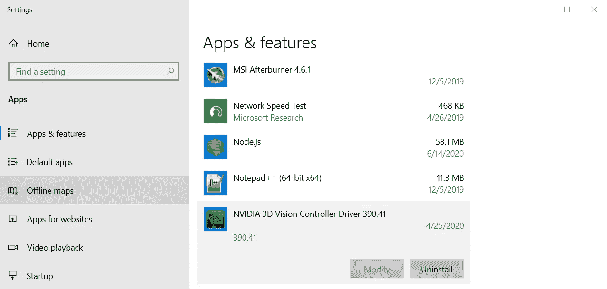
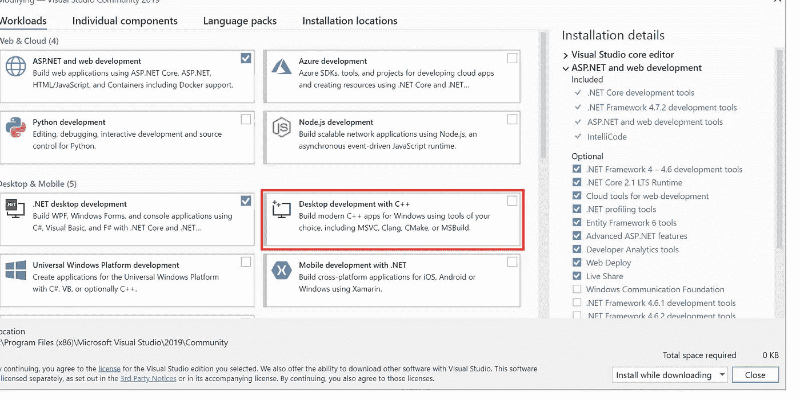
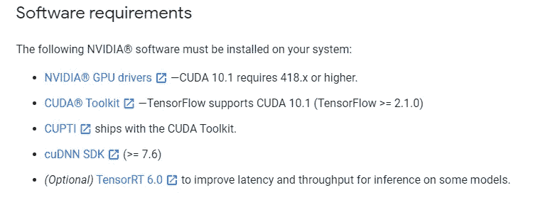
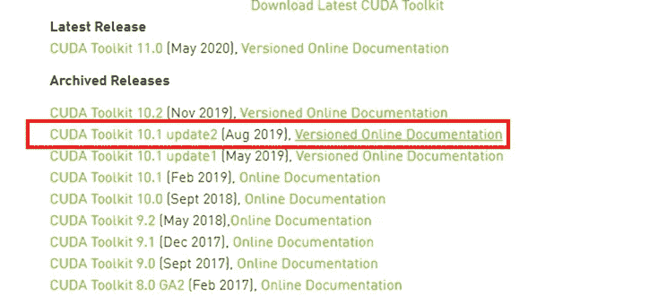
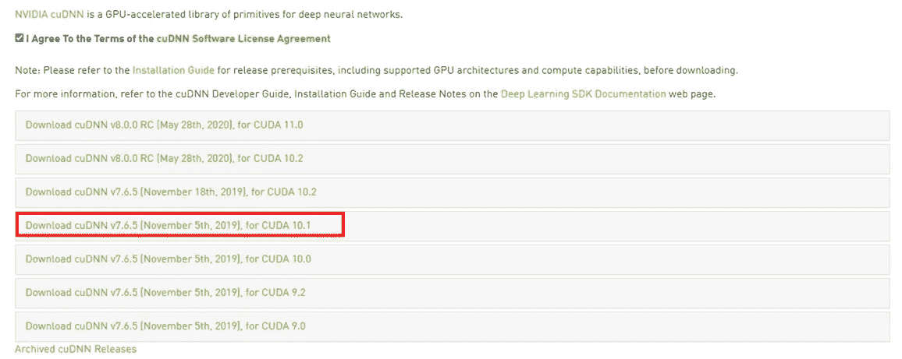

# 在 Windows 10 中使用 Nvidia 的 GPU 和 CUDA 逐步将 Tensorflow 1.x 升级到 Tensorflow 2.2

> 原文：<https://medium.com/analytics-vidhya/step-by-step-upgrade-of-tensorflow-1-x-to-tensorflow-2-2-with-nvidias-gpu-and-cuda-in-windows-10-a9c0d04739e4?source=collection_archive---------13----------------------->


图片来源:[https://www.tensorflow.org/](https://www.tensorflow.org/)

由于我最近需要在一台运行 Windows 10 的机器上将 Tensorflow 1.x 升级到 2.2，我发现有很多文章在谈论如何从头开始安装必要的包/软件。但是，关于如何使用以前安装的软件包/软件，尤其是 Tensorflow 2.2 和 CUDA 10.1 来完成此操作的资源非常有限。我写这篇文章来分享详细的步骤，同时保持一个干净的系统环境。

**第一步。**通过 Windows 搜索栏，转到应用程序&功能。然后，卸载所有与 Nvidia 相关的应用。(您不需要担心图形驱动程序，我们很快会重新安装)。某些应用程序可能需要重新启动计算机。



卸载 Nvidia 应用程序的位置示例

**第二步。**删除 C:\Program Files 和 C:\Program Files (x86)中名称中含有“Nvidia”的文件夹。此外，从搜索栏转到“编辑系统环境变量”。然后，转到“环境变量”并删除包含“Nvidia”的用户和系统变量中定义的“路径”。

**第三步。**使用您喜欢的任何方法卸载当前的 Tensorflow 和 Keras，例如 *pip* 和 *conda* 。作为参考，在 Tensorflow 2.x 中，您不需要导入 Keras，而是使用 tensorflow.keras。例如:

```
pip uninstall tensorflow
pip uninstall tensorflow-gpu
pip uninstall keras
```

**第四步。**从[官网](https://visualstudio.microsoft.com/downloads/)安装 Visual Studio 社区 2019。【重要】请安装工作负载“用 C++进行桌面开发”。如果您已经有了 Visual Studio，但没有上述配置，您需要卸载现有的 Visual Studio，然后安装软件，或者将此工作负载添加到您当前的 Visual Studio 中。



[注意]从下一步开始，我们的程序需要遵循 [Tensorflow GPU 支持网站](https://www.tensorflow.org/install/gpu)中的指导。软件包的版本将来可能会有所不同。本教程基于截至 2020 年 6 月 20 日提供的版本。



具有指定版本的需求包

**步骤五。**从 [Nvidia 驱动程序下载网站](https://www.nvidia.com/download/index.aspx?lang=en-us)根据你的 GPU 规格安装 Nvidia 驱动程序。

**第六步。**从[官网](https://developer.nvidia.com/cuda-toolkit-archive)安装 Nvidia CUDA 工具包。请注意，我们需要使用上面提到的版本(10.1)，即使 CUDA 工具包 11.0 也是可用的。具体来说，我使用下面这个没有任何问题。



CUDA 工具包

**第七步。**从[官网](https://developer.nvidia.com/cudnn)安装 cuDNN SDK。如果你从来没有下载 cuDNN，你需要创建一个帐户。请下载与我们安装的 CUDA 工具包版本相关的版本。



然后我们需要将这些源代码“合并”到 CUDA 工具包中。我没有找到关于这方面的详细/全面的介绍。这里我就来详细介绍一下。我们实际上有两种方法可以做到这一点。

备选方案 1。解压缩 cuDNN SDK 并执行以下复制粘贴操作:a)。将文件 bin/cudnn64_7.dll 复制到 C/program files/NVIDIA GPU 计算工具包/CUDA/v 10.1/bin/cud nn 64 _ 7 . dll；b)。将文件 include/cudnn.h 复制到 C/program files/NVIDIA GPU 计算工具包/CUDA/v 10.1/include/cud nn . h；c)。将 lib/x64/cudnn.lib 中的文件复制到 C/program files/NVIDIA GPU 计算工具包/CUDA/v10.1/lib/x64/cudnn.lib 中。

选项 2。解压缩 cuDNN SDK 并将其保存到系统驱动器，即您的 c 盘。为了一致性，假设我们将文件夹保存为 C:\ cud nn-10.1-windows 10-x64-v 7 . 6 . 5 . 32，如果我们选择这个选项的话。

**第八步。**将带有 cuDNN 的 CUDA 工具包添加到环境中。再次从搜索栏转到“编辑系统环境变量”。然后，转到“环境变量”，接着是“用户变量”，并编辑“路径”。由于 step 7 中有两个选项，我们这里的操作会略有不同。

如果我们使用 step 7 选项 1，在“路径”中添加以下两个路径:a)C:\ Program Files \ NVIDIA GPU Computing Toolkit \ CUDA \ v 10.1 \ libnvvp；b) C:\Program Files\NVIDIA GPU 计算工具包\CUDA\v10.1\bin。

如果我们使用 step 7 选项 2，在“路径”中添加以下一个路径:C:\ cud nn-10.1-windows 10-x64-v 7 . 6 . 5 . 32 \ cuda \ bin。

**第九步。**进入你的代码编译器或者 cmd.exe，然后安装 Tensorflow。例如:

```
pip install tensorflow
```

【注意】截至 2020 年 6 月 20 日，您将默认安装 Tensorflow 2.2。正如 Tensorflow 网站所述，Tensorflow 2.x 的版本(包括此版本)将能够在有或没有 GPU 支持的情况下运行，即您不需要像我们在安装 Tensorflow 1.x 时那样将属性指定为 tensorflow-gpu。

终于，我们完成了！我在这里提供一个非常简单的代码，用于检查你的 GPU 是否可用于 Tensorflow 2.2。

```
import tensorflow as tfprint(tf.__version__)if tf.test.gpu_device_name():
    print('Available GPU: {}'.format(tf.test.gpu_device_name()))
else:
    print("No GPU available")
```

如果在运行代码时出现任何问题，请检查日志记录信息，并在此基础上搜索解决方案。

【最后的注释 1】如果你大量使用 python 库，我强烈推荐用 Anaconda 这样的软件创建虚拟环境来进行包版本控制。有很多教程可用。

【最后注意 2】对于使用 Linux 或者 macOS 的人来说，做这个升级是非常容易的。只需跟随到 [Tensorflow GPU 支持网站](https://www.tensorflow.org/install/gpu)。

酷毙了。享受你的 Tensorflow 2 和快乐编码！