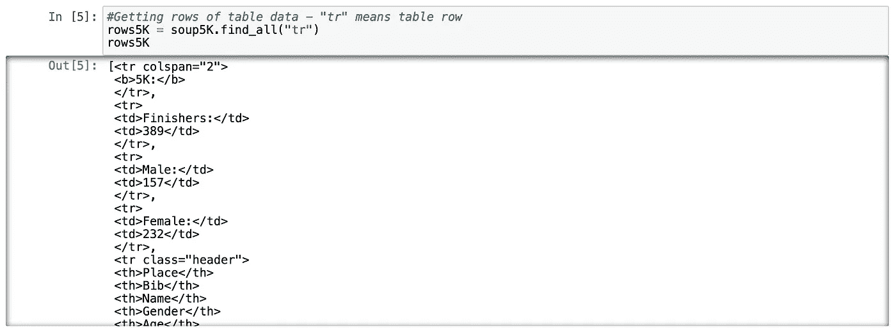

# 循序渐进:使用 Python BeautifulSoup 进行 Web 抓取

> 原文：<https://medium.com/analytics-vidhya/step-by-step-web-scraping-using-python-36ecb502f8e?source=collection_archive---------10----------------------->

在这篇文章中，你将学习什么是 web 抓取，以及如何通过一个示例场景从一个网站获取数据。

# 什么是网页抓取？

Web 抓取是一种从互联网上收集数据并将其解析成有意义的形式的技术。为什么我们需要网络抓取？

对数据的需求与日俱增。你需要的数据可以在网站上找到，也许没有直接的方法下载。无论你是数据科学家、工程师还是分析师，你都需要将数据提取成数据框等有意义的形式。从网上搜集数据的能力是一项有用的技能。

马库斯·斯皮斯克在 [Unsplash](https://unsplash.com?utm_source=medium&utm_medium=referral) 上的照片

在本教程中，我将使用；

*   **BeautifulSoup** 库，用于从网络上提取数据。
*   用于数据操作和清理的 Pandas 库。
*   用于数据可视化的 **Matplotlib** 和 **Seaborn** 。

# **第一步:查找数据集**

[**Huber Timing**](https://www.hubertiming.com) 是一个提供跑步成绩(距离、时间、年龄等)的网站。)从 2012 年开始。

Huber 时序结果部分

在这种情况下，我将使用 2019 年 5 月 5 日放置的“2019 Cinco de Mayo 5K，10K 半”。您可以在下面找到关于页面的详细信息:

 [## 2019 Cinco de Mayo 5K 10K 半程赛的比赛结果！

### 2019 年 Cinco de Mayo 5K 10K 半程赛在俄勒冈州波特兰市 Kliever 军械库举行的结果

www.hubertiming.com](https://www.hubertiming.com/results/2019Cinco5K) 

这篇文章的场景是分析跑步者的表现，并根据性别和年龄组找出平均完成时间(5K，10K 半)。

# **第二步:废网**

在本教程中，我将在 Anaconda 发行版上使用 Jupyter 笔记本。首先，我需要导入库；

然后，我发送了一个从网站获取数据并检查其状态的请求。返回的代码 200 告诉我们页面访问成功。

得到页面的 HTML 后，我从 HTML 中创建了一个漂亮的 Soup 对象。

我用**标题的**方法查看网页标题的美汤对象。

我可以用 **find** 或 **find_all** 方法访问对象。在这个阶段，如果你对 HTML 知之甚少，你可以很容易地访问你的对象。下图向我们展示了一个网页内容。我需要从红框显示的表格中获取数据。

对于表的详细信息，我单击光标指向表的右键并选择**检查元素**，然后我可以访问表的详细类别、id 等。

我的对象是“**表**，id 是“**个人结果**”。我使用 Beautiful Soup 的 **find** 方法从表中获取数据。

我使用“tr”参数用 **find_all** 方法打印出表格行。

上述命令的输出包括 HTML 标签。让我们使用正则表达式删除这些标签。下面的代码找到了标签中的所有字符，并用一个空字符串替换了表格中的每一行。最后，我将每个循环的结果添加到 result_list 中

# **第三步:数据操作**

现在，我有一个熊猫数据框，但这不是一个正确的形式。我需要将这个数据框转换成有意义的形式。首先，我使用**分割**方法将每一行分割成单元格

前 5 行不包含有意义的数据，所以我使用 **iloc** 方法将其从数据帧中删除

我使用表格标题设置列名。

我用**替换**的方法修复了字符错误

我检查了每一列的数据类型

我使用 **astype()** 将年龄列转换为整数，将芯片速度转换为浮点数

我创建了一个新的列来计算时间秒，并将芯片时间转换为新的秒

我将 RaceTimeSeconds 列转换为 datetime 格式的**小时:分钟:秒**，这样我就可以计算平均比赛时间

我创建了一个 Race 类型的列，并为所有行设置了 5K。然后，我只为需要的列总结了数据框架。

我将所有代码应用于 10K 页面

我将所有代码应用于半程马拉松页面

我将所有数据帧连接成 983 行×8 列的**最终结果**数据帧

# **第四步:数据分析和可视化**

检查数字列的简要信息

创建基于性别的各种比赛类型的芯片配速柱状图

创建基于性别的每种比赛类型的比赛时间分钟柱状图

为每个种族类型创建群集图

创建具有性别的竞赛类型的竞赛时间的群集图

# **结论**

因此，在现实世界中并不总是能够使用现成的数据。所以你要找的数据可能在网页上。作为一个处理数据的人，拥有找到和提取你要找的数据的基本技能是很重要的。

美汤只是你需要刮的工具之一。您可以使用不同的工具，例如 **Scrapy** 和 **Selenium**

如果你对 Python 笔记本代码感兴趣可以到我的 [**GitHub repo。**](https://github.com/yalinyener/WebScrapingBeautifulSoap)

感谢您阅读我的帖子。如果您有任何问题或想要分享您的意见，请随时联系我。