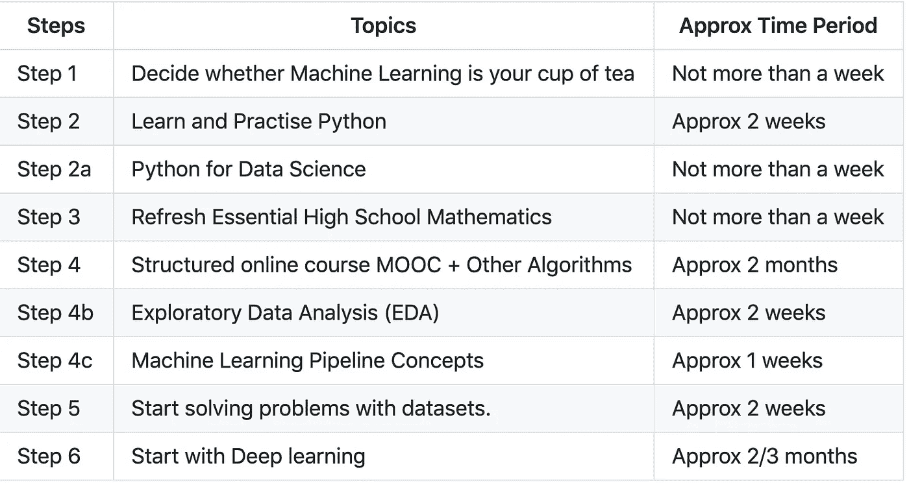

# 步入机器学习的世界🔥

> 原文：<https://medium.com/analytics-vidhya/step-into-the-world-of-machine-learning-eeb29652fcfd?source=collection_archive---------3----------------------->

从机器学习开始的简单学习路径。

Raj Eiamworakul 在 Unsplash 上拍摄的照片

这篇文章也可以标题为“**成为超级英雄的简单学习路径**”。是的，你没听错！我们人类擅长创造、学习和推理，而机器擅长计算和记忆。你在这里试图学习通过机器学习将两者结合起来的方法，从而创造出改善人类生活的无限可能。

让我们进入学习之路。我将这条学习路径设计得尽可能简单，因为许多人在开始机器学习时，会被他们在网上找到的大量资源淹没。我还附上了一个样本行动计划，以完成这条道路。

# 第一步:决定机器学习是否适合你！

分析以下！

*   什么是人工智能(AI)和机器学习(ML)？
*   AI/ML 在医疗保健、金融、农业等各个行业的影响和应用。以及它如何改善人类生活。
*   人工智能/人工智能所需的技能

> **注:**不要让我们身边正在发生的 AI 热潮让你从机器学习开始。如果你真的相信它的影响，如果你觉得它合你的胃口，那就去做吧。花好时间分析这些。如果是，转到下一步

# 第二步:学习和练习 Python

*   [为什么用 Python 进行机器学习？](https://towardsdatascience.com/8-reasons-why-python-is-good-for-artificial-intelligence-and-machine-learning-4a23f6bed2e6)
*   [推荐学习资源](https://forums.fast.ai/t/recommended-python-learning-resources/26888)
*   设置本地[环境](https://www.anaconda.com/distribution/)
*   实验在 J [upyter 笔记本](https://www.youtube.com/watch?v=2eCHD6f_phE&feature=push-u-sub&attr_tag=8UUQYNPGPspzbSqD-6)
*   像 atari games 一样用 python 构建一个简单的[项目](https://automatetheboringstuff.com/)
*   IDE: [PyCharm](https://www.jetbrains.com/pycharm/) 或 [VisualStudio](https://code.visualstudio.com/)

> 提示:试试 Jupyter 笔记本[扩展](https://towardsdatascience.com/jupyter-notebook-extensions-517fa69d2231)，它们很酷。

# 步骤 2a:用于数据科学的 Python

*   观看[面向数据科学的 Python 生态系统](https://www.youtube.com/watch?v=EBgUiuFXE3E)
*   阅读[用于数据科学的 Python 库](https://www.analyticsvidhya.com/blog/2019/07/dont-miss-out-24-amazing-python-libraries-data-science/)
*   [代码示例](https://www.kaggle.com/kanncaa1/data-sciencetutorial-for-beginners)

## 最常用的库

*   数据处理库:numpy，pandas
*   数据可视化库:matplotlib、seaborn、bokeh
*   机器学习库:scipy，scikit-learn
*   模型部署:Flask，Django

> **注意:**这些只是最常用的库，并不是全部

# 第三步:刷新高中数学基础

## 数学中的基本领域

*   统计数字
*   概率论
*   线性代数
*   结石

> 提示:不要按主题走，而是按主题走，这对机器学习更重要

## 统计数字

*   阅读[综合指南](https://www.analyticsvidhya.com/blog/2017/01/comprehensive-practical-guide-inferential-statistics-data-science/)
*   观看[可汗学院](https://www.youtube.com/watch?v=yTGEMoaWDCQ&index=18&list=PL1328115D3D8A2566)

## 概率论

*   阅读[综合指南](https://www.analyticsvidhya.com/blog/2017/02/basic-probability-data-science-with-examples/)
*   阅读[基本分配](https://www.analyticsvidhya.com/blog/2017/09/6-probability-distributions-data-science/)
*   观看[可汗学院](https://www.youtube.com/watch?v=yTGEMoaWDCQ&index=18&list=PL1328115D3D8A2566)

## 线性代数

*   阅读[综合指南](https://www.analyticsvidhya.com/blog/2017/05/comprehensive-guide-to-linear-algebra/)
*   观看[可汗学院](https://www.khanacademy.org/math/linear-algebra)
*   手表[3 蓝色 1 棕色](https://www.youtube.com/watch?v=kjBOesZCoqc&list=PLZHQObOWTQDPD3MizzM2xVFitgF8hE_ab)

## 结石

*   阅读[综合指南](https://ml-cheatsheet.readthedocs.io/en/latest/calculus.html)
*   观看[可汗学院](https://www.khanacademy.org/math/multivariable-calculus)
*   手表[3 蓝色 1 棕色](https://www.youtube.com/watch?v=WUvTyaaNkzM&list=PLZHQObOWTQDMsr9K-rj53DwVRMYO3t5Yr)

> 提示:可以跳过这一步，在任何你遇到的地方学习所需的数学概念。但我强烈建议你至少浏览一下基础知识(全面的指南和这个[播放列表](https://www.youtube.com/watch?v=yTGEMoaWDCQ&index=18&list=PL1328115D3D8A2566)中的可汗学院视频)，因为这将让你在浏览机器学习算法时感到舒服。

# 第四步:结构化在线课程——MOOC

## i) [Coursera AndrewNg 机器学习](https://www.coursera.org/learn/machine-learning)

## ii) [学习 MOOC 中没有涉及的算法](https://medium.com/machine-learning-101)

*   朴素贝叶斯
*   基于树的算法:决策树、RandomForest 这样的 Bagging 算法和 XGBoost、CatBoost、LightGBM 等 Boosting 算法。,
*   k 最近邻等。,

> **提示 1:用 python 做作业，不要用 MatLab 或 Octave**

*   [作业 1 的 Python 实现](https://github.com/dibgerge/ml-coursera-python-assignments)
*   [作业 2 的 Python 实现](https://github.com/JWarmenhoven/Coursera-Machine-Learning)
*   [线性回归和逻辑回归及解释](/analytics-vidhya/python-implementation-of-andrew-ngs-machine-learning-course-part-1-6b8dd1c73d80)

> **提示 2:无论何时学习一个算法，都要确保做到以下几点。**

1.  理解它如何工作的基本直觉(没有数学)
2.  然后试着理解潜在的数学(你已经获得的基本直觉会给你足够的信心去破解数学)
3.  用 python 从头实现算法(至少对于非常重要的概念，如线性回归、逻辑回归、梯度下降、神经网络等。,)
4.  通过下载相关数据集来解决简单的现实问题。你可以在这个阶段使用机器学习库

> **提示 3:在 Github 中记录和维护你的代码**

# 步骤 4a:探索性数据分析(EDA)

*   [综合指南](https://www.analyticsvidhya.com/blog/2016/01/guide-data-exploration/)
*   [Python 样本](https://www.kaggle.com/pmarcelino/comprehensive-data-exploration-with-python)

> **注意:** EDA 至关重要，因为您将在机器学习项目中花费大部分时间探索和可视化数据，这有助于您在调整算法时更好地进行特征工程(使您的数据更容易被算法理解)和更好地做出决策。

# 步骤 4b:机器学习管道

## [样品管道](https://www.kaggle.com/pouryaayria/a-complete-ml-pipeline-tutorial-acu-86)

## 评估指标

*   [回归度量](/usf-msds/choosing-the-right-metric-for-machine-learning-models-part-1-a99d7d7414e4)
*   [分类指标](/usf-msds/choosing-the-right-metric-for-evaluating-machine-learning-models-part-2-86d5649a5428)

## 超参数调谐

*   [网格搜索和随机搜索](https://www.datacamp.com/community/tutorials/parameter-optimization-machine-learning-models)
*   [贝叶斯优化](https://towardsdatascience.com/an-introductory-example-of-bayesian-optimization-in-python-with-hyperopt-aae40fff4ff0)
*   [代码示例](https://towardsdatascience.com/hyperparameter-tuning-the-random-forest-in-python-using-scikit-learn-28d2aa77dd74)

> **注意:**使用到目前为止学到的所有概念，建立一个简单的端到端机器学习管道。
> 
> **收集数据→探索和转换数据(EDA) →开发模型→评估模型→部署模型→维护**
> 
> **重要提示:一旦你在 MOOC 中完成了线性和逻辑回归算法，你必须从步骤 4a (EDA) →步骤 4b(机器学习管道)→步骤 5(用数据集解决问题)开始，同时学习剩余的算法**

# 第五步:开始用数据集解决问题。

*   作为 Github 或 Kaggle 内核的参考，浏览已解决的问题
*   K [聚集内核](https://www.kaggle.com/kernels)
*   例子:[泰坦尼克号](https://www.kaggle.com/ash316/eda-to-prediction-dietanic)
*   [寻找数据集的地方](https://github.com/mdnoorit/letslearnai/blob/master/ml_path_for_beginners.md#Data-Sources)
*   [竞赛平台](https://github.com/mdnoorit/letslearnai/blob/master/ml_path_for_beginners.md#Competitions-Platforms)

> **提示:**开始简单，迭代。不要试图一开始就建立一个完美的模型。从一个为给定输入提供输出的简单管道开始，然后尝试迭代地改进它。失败会帮助你更多地了解你的问题！

# 第六步:从深度学习开始

*   [deeplearning.ai](https://www.deeplearning.ai/deep-learning-specialization/)
*   [fast.ai](https://course.fast.ai/)

> **注:**做以上任意一门课程(详细学习路径在进行中)。

# 样本/建议行动计划

假设一周 8-10 小时，

样本/建议行动计划

> **提示:边做边学。根据你的需求制定个性化的计划。**

# 机器学习的其他资源

## 数据源

*   [UCI 机器学习知识库](https://archive.ics.uci.edu/ml/index.php)
*   [Kaggle 数据集](https://www.kaggle.com/datasets)
*   [其他](https://www.kdnuggets.com/2017/12/big-data-free-sources.html)

## 竞赛平台

*   [数据黑客](https://datahack.analyticsvidhya.com/)
*   [卡格尔](https://kaggle.com/)

> **提示:**你的第一个任务是为给定的问题建立一个简单的端到端管道，提交解决方案并在排行榜上看到你的名字。然后尝试迭代地改进你的解决方案，这将使你在排行榜上走得更高，实际的学习发生在迭代中。

## 最佳博客

*   [分析维迪亚](http://analyticsvidhya.com/)
*   [走向数据科学](https://towardsdatascience.com/)
*   机器学习掌握
*   [kdnuggets](https://www.kdnuggets.com/)
*   [中等](/)

## 最佳论坛

*   [数据科学中心](https://www.datasciencecentral.com/)
*   [kaggle 讨论](https://www.kaggle.com/discussion)
*   [数据学校](http://www.dataschool.io/)
*   [数据科学周刊](https://www.datascienceweekly.org/)

> **提示:**下载 [Feedly](https://play.google.com/store/apps/details?id=com.devhd.feedly&hl=en_IN) 应用，订阅所有这些博客、论坛和时事通讯。

## 学习资源

*   [初学者数据科学教程](https://www.kaggle.com/kanncaa1/data-sciencetutorial-for-beginners)
*   [python-graph-gallery](https://python-graph-gallery.com/)
*   [机器学习术语表](https://developers.google.com/machine-learning/glossary/)
*   [人类机器学习](https://medium.com/machine-learning-for-humans)
*   [机器学习-101](https://medium.com/machine-learning-101)

## 备忘单

*   [成为 human.ai](https://becominghuman.ai/cheat-sheets-for-ai-neural-networks-machine-learning-deep-learning-big-data-678c51b4b463)
*   [datacamp 备忘单](https://www.datacamp.com/community/data-science-cheatsheets)
*   [机器学习数据科学的 28 大秘籍](https://www.analyticsvidhya.com/blog/2017/02/top-28-cheat-sheets-for-machine-learning-data-science-probability-sql-big-data/)

## 最佳 Youtube 内容

*   [sirajraval](https://www.youtube.com/channel/UCWN3xxRkmTPmbKwht9FuE5A)
*   [统计任务](https://www.youtube.com/user/joshstarmer/playlists)
*   [两分钟论文](https://www.youtube.com/channel/UCbfYPyITQ-7l4upoX8nvctg)
*   [alphaopt](https://www.youtube.com/channel/UCkL2HNDjyhrT6hgWjikmQAg/videos)

## 加入人工智能社区

*   领英
*   [推特](https://www.cognilytica.com/2018/06/26/50-ai-twitter-influencers-to-follow-in-2018/)
*   Reddit

> **注意:**活跃在这些社区将有助于你保持积极性并了解最新的人工智能进展。
> 
> 提示:注册后，建立专业档案，关注活跃的社区成员和研究负责人。
> 
> **重要提示:**本文提到的主题和资源只是沧海一粟。请不要仅仅局限于这些资源。

## 最终注释:

如果你在任何地方遇到困难或困惑，请随时留言！您的评论将极大地改善这条学习之路。另外，如果你想补充什么，请在评论中告诉我。这里是这个学习路径的**[**Github**](https://github.com/mdnoorit/letslearnai/blob/master/ml_path_for_beginners.md)**版本**的链接，我将会经常改进和更新！一定要把它分享给对你有帮助的人！**

**学习！练习！犯错！从那些错误中吸取教训！重复！**

**祝一切顺利！快乐的机器学习👍✌️ !**

**感谢阅读，这里 **与我 [**连线！**](https://linkedin.com/in/mknoordeen)****