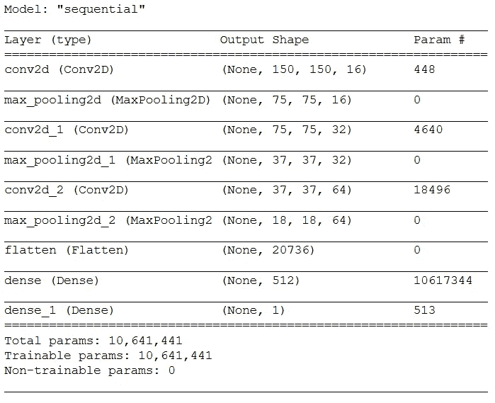
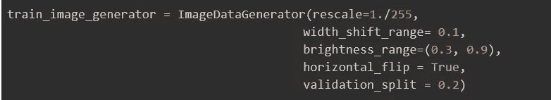
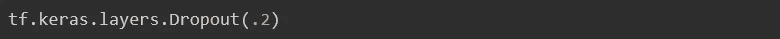
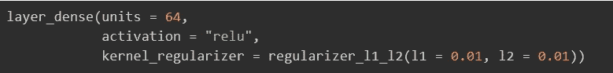
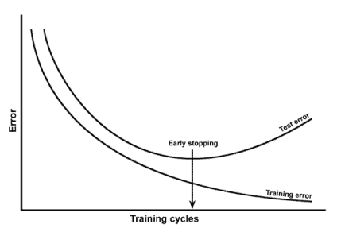

# 高精度训练图像分类器 CNN 的分步方法

> 原文：<https://medium.com/analytics-vidhya/step-wise-approach-to-increase-accuracy-in-image-classifier-cnn-d5fe7fabbff6?source=collection_archive---------30----------------------->

你那令人费解的神经网络[CNN]测试准确率极差？是不是过度拟合了你的训练数据？你的准确度随着每个时代而波动？如果有，这就是你要找的文章！

在这篇文章中，我将为您提供一个通用的过程，它将使您从许多不必要的麻烦中解脱出来，这些麻烦经常出现在训练用于图像分类的复杂的神经网络的过程中。

# **从小数据集开始**

你可能听说过，你提供的数据越多，模型就越好，我不打算提出相反的建议。然而，如果你从一个庞大的数据集开始，网络将花费大量的时间和资源来训练。

在我们计划优化网络架构和微调超参数的初始阶段，少量的训练时间就能产生巨大的影响。

从数量上来说，一个小的训练数据集包含大约 100-200 个图像。

# 使用基本代码

你可能会被从头开始的想法所诱惑。然而，这有许多缺点:

1.  大量语法错误
2.  没有性能提升
3.  浪费你宝贵的时间

如果这不是你第一次开发神经网络，我宁愿建议从你以前的项目中借用源代码，或者从你正在使用的框架的官方网站上借用样本代码，例如 [TensorFlow](https://www.tensorflow.org/tutorials/images/classification) 、 [PyTorch](https://pytorch.org/tutorials/beginner/blitz/cifar10_tutorial.html) 等。

假设您已经完全理解了您的代码是如何工作的，那么您现在可以避免愚蠢的语法错误并专注于改进您的模型。

然而，如果这是你第一次在 CNN 工作，那么从头开始编写程序的痛苦是值得的，你不应该走这条捷径。

# 从简单的架构开始

假设您遵循了我的建议，从一个小数据集开始，并且已经有了加载数据的示例代码，接下来的事情就是使用一个简单的架构。

从更专业的角度来说，我将一个简单的架构描述为:

1.  几个错综复杂的层(2 或 3)。
2.  没有辍学层。
3.  L1 和 L2 正则化的缺失。
4.  不会很深(1 或 2 个致密层)。
5.  批量大小为 1 或 2
6.  标准“Adam”优化器

一个简单的架构通常足以对不到 50 个类别进行分类。这也减少了过拟合的机会，降低了计算成本。

这里有一个很好的例子:

CNN 有 3 个回旋层和 1 个致密层

**亲提示:**

如果你找到一个已经被训练来预测你希望预测的相同/相似类别的分类器模型，我会强烈推荐迁移学习，因为它在时间和准确性方面非常有益。

# 现在我们随机应变

你试过在你的小数据集上运行我们简单的神经网络吗？最有可能的结果是你的模型过度拟合[在某个时期后，你的测试误差开始增加，但你的训练误差继续减少]。

不要担心这是意料之中的，因为我们从一个小数据集开始！但是，如果您的模型没有过度拟合，您也可以

1.  增加纪元的数量或
2.  增加网络的复杂性，直到出现过度拟合。

> 现在，下一步是将你所有的数据提供给你的神经网络。这将帮助它概括而不是过度拟合训练数据。

如果您的模型仍有过度拟合的迹象，请按上述顺序执行以下操作:

1.  **应用数据增强**【一个奇特的术语，用于应用旋转、裁剪、亮度改变等效果。]
2.  **使用脱落层**【它们通常非常有效】
3.  **使用 L1 或 L2 正则化**【就像在损失函数中加入一个惩罚项】
4.  **在测试误差开始增加的时期停止**

根据您使用的框架，应用前三种解决方案的确切语法略有不同。在本文中，我将使用 Keras 和 TensorFlow 来实现上述方法。

## 数据扩充

Keras 已经配备了一个名为“ImageDataGenerator()”的函数，它有几个参数来更改您的输入图像。例如:

a)此处的重新缩放有助于转换 0 到 1 范围内的所有像素。

b) Brightness_range 帮助改变图像的原始亮度。

c)水平翻转有助于沿垂直轴镜像图像。

还有很多，但我在这里的目标是给你提供方法和见解，而不是用细节来烦扰你。如果你想探索其他的(我强烈推荐你去)，你可以在这里找到它们。

## 脱落层

是的，就是这样。只需将这段代码添加到您想要设置 dropout 的图层之后，就大功告成了。

这里的 0.2 指的是在特定时间点将被去激活的神经元的百分比。还有一些很少使用的其他参数。尽管如此，你可以在这里读到它们[。](https://keras.io/api/layers/regularization_layers/dropout/)

## L1 和 L2 正规化

我将把 L1 和 L2 正则化的数学描述留给以后的博客。然而，如果你真的很想知道它们，你可以在这里查阅。

关注实施 Keras 再次拯救了我们。你所需要做的就是给你的层增加一个参数，指定 l1 和 l2 的值。

## **提前停止**

这更像是最后一招，应该在上述三种技术都经过测试和应用后实施。

图片提供:stats.stackexchange.com

如上图所示，如果我们在测试误差开始增加的时期停止，我们可以防止模型在训练数据上过度拟合。

# 事情还是不行怎么办！

一般来说，在正确执行了前面讨论的所有步骤之后，神经网络确实表现出可接受的准确度。

> 但是有时我们亲爱的朋友——神经网络……拒绝学习【而且很遗憾他们不告诉我们背后的原因！]

因此，现在我们执行超参数调整:*，这基本上意味着我们试图改变我们能做的一切，看看是否有帮助*。

因此，根据你所面临的问题类型，这里列出了你应该做的事情:

## 如果模型的训练和测试精度较差:

1.  增加层数
2.  增加密集层中神经元的数量
3.  增加卷积层中的滤镜数量

## 如果模型过度拟合数据:

1.  减少层数
2.  减少密集层中的神经元
3.  添加更多脱落层

## 在上述任何一种情况下，您都可以:

1.  更改池层的跨度
2.  改变激活功能
3.  更改优化器功能

我知道，为了让你的神经网络获得完美或接近完美的结果，你需要进行大量的调整，这让你大吃一惊。但是在你沮丧和放弃之前，我为你看到了一丝希望。

> 世界上有许多研究人员尝试了许多网络架构，有时甚至发明了新的架构。他们进行了大量的超参数微调，并取得了惊人的成果。幸运的是，这些模型已经提供给普通大众，也就是你和我！

所以为了图像分类的目的，可以使用:

1.  AlexNet
2.  VGG-16
3.  VGG-19
4.  谷歌网

我按照复杂程度的顺序把它们列出来了。如果你的分类问题在数据和分类类别方面很小，AlexNet 和 VGG-16 可能是你最好的选择！

然而，如果你要处理大量的数据和分类，VGG-19 和谷歌网可能会帮你减少很多努力！

> 如果这篇文章以任何方式帮助了你，你可以在下面留下掌声让我知道！