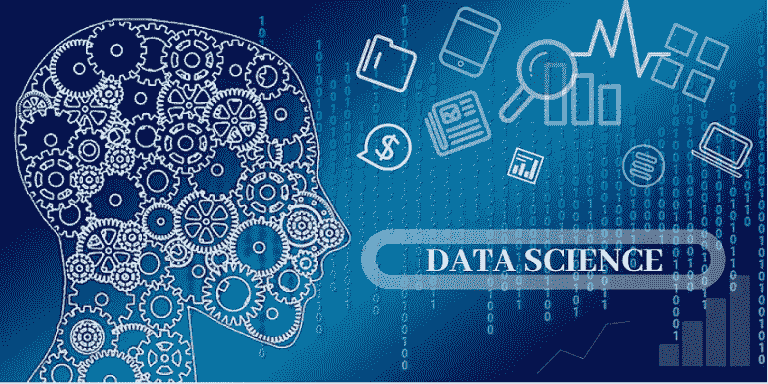
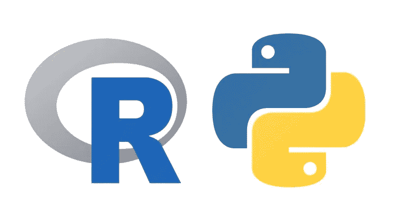
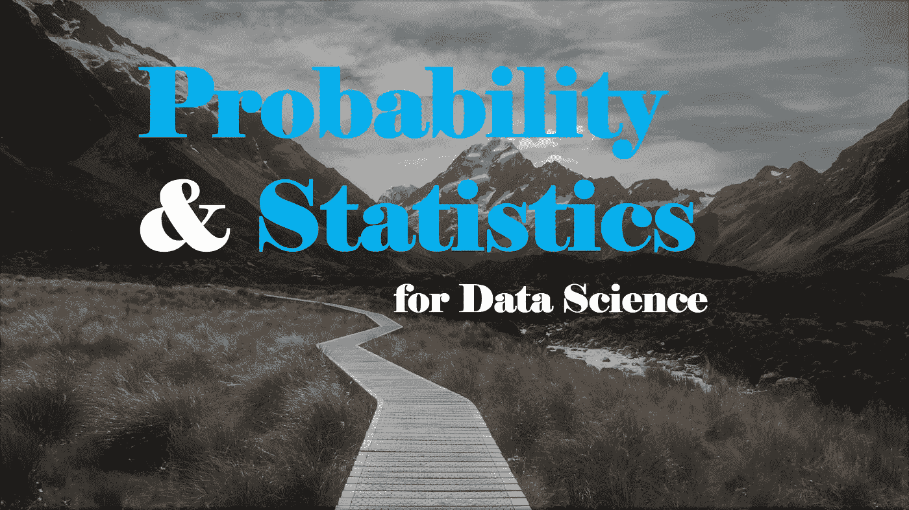
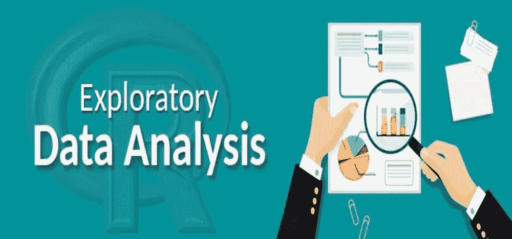
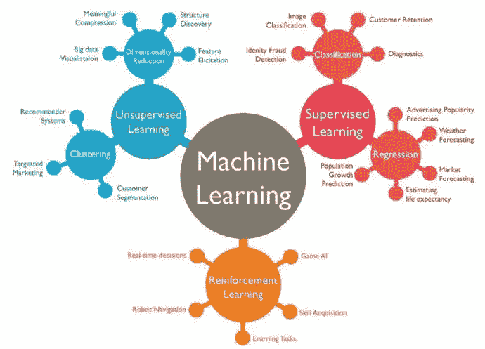
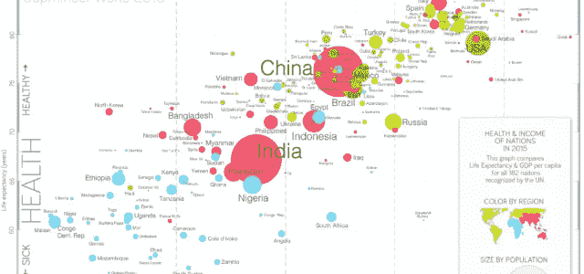

# 步入数据科学|新手完全指南

> 原文：<https://medium.com/analytics-vidhya/stepping-in-to-data-science-complete-guide-for-newbies-f79a0e3c6e4a?source=collection_archive---------17----------------------->

## 成为数据科学家的一步一步指南，详细讨论了所有免费资源。

我成为数据科学家的指南是免费的。这里讨论的所有资源(书籍和课程)都是**免费提供的**

来源:www.mitosistech.com/data-science/

这个问题的**答案****需要一些解释**所以请不要惊慌，我将解释成为数据科学家的每个方面，并将谈论主要的数据科学资源(带链接)**所以让我们开始:**

**据《Python 数据科学手册》作者介绍，数据科学是:**

> ***数据科学包含三个截然不同且相互重叠的领域:*******统计学家的技能*** *他们知道如何建模和总结数据集(数据集越来越大)；* ***计算机科学家*** *能够设计和使用算法高效存储、处理和可视化这些数据的技能；* ***和领域专业知识****——我们可能会认为是某个主题中的“经典”培训——既需要制定正确的问题，也需要将答案放在上下文中。**

***→** [**数据科学高级概述**](https://cognitiveclass.ai/courses/data-science-101)**| IBM 课程***

# *步骤 01 编程*

****

*来源:谷歌图片*

*在数据科学中，最常用的两种语言是 **Python** 和 **R** 。在这两者中，python 是全世界使用最广泛的。*

# *你应该学哪一个？*

***Python** 一般是有一定技术背景或者之前接触过编程的人使用。*

***R** 就编程而言，用在没有或很少有技术背景的人身上。*

# *去哪里学 Python 和/或 R？*

*有很多资源可以学习这两种语言中的任何一种。*

*如果你对认证不感兴趣，只想学习语言，那么 **Udacity** 、 **Edx** 、 **Coursera** 是最好的选择。*

# *资源*

***Python:***

*   *[**【IBM Python for data science】免费认证**](https://cognitiveclass.ai/?s=python) (结合实践很好的解释)*
*   ***(带测验和期末专题)***
*   ***[**Edx**](https://www.edx.org/python-for-data-science)***
*   ***[**data camp python for data science**](https://www.datacamp.com/courses/intro-to-python-for-data-science)(带证书免费)***
*   ***[**Coursera**](https://www.coursera.org/learn/python)***

***可以在这里找到 python 课程认证的详细列表。***

*   ***[**认证 python 课程列表**](https://www.facebook.com/dspak135/posts/1428414263960775)***

*****R:*****

***同样，也有许多学习 R 的资源。免费和付费课程。可以考虑的一些最好的免费 R 课程有:***

***[data camp](https://www.datacamp.com/courses/free-introduction-to-r):R 简介(认证免费)***

***[IBM](https://cognitiveclass.ai/?s=R):IBM 认证的数据科学课程列表***

***[哈佛](https://www.edx.org/course/data-science-r-basics) (Edx):***

***现在如果你选择了 Python，你需要一个平台来练习你所学的东西***

***您可以使用以下选项:***

*   ***皮查姆***
*   ***Jupyter 笔记本和更多***

# ***步骤 02 统计和概率***

************

***来源:谷歌图片和媒体***

***因此，对于这一部分，你需要学习线性代数，概率和统计。线性代数对于一个数据科学家来说非常重要。你还需要覆盖微积分(包括多元微积分)。***

# ***资源:***

*   ***[统计 101 | IBM](https://cognitiveclass.ai/courses/statistics-101)***
*   ***[统计| Udacity](https://www.udacity.com/course/statistics--st095)***
*   ***[线性代数书](http://math.mit.edu/~gs/linearalgebra/) —麻省理工学院**数学教授写的*****
*   ***[德克萨斯大学&奥斯汀分校提供的线性代数视频课程](https://www.edx.org/course/linear-algebra-foundations-to-frontiers-2) — (Edx)***

***你可以选择许多其他的资源***

# ***步骤 03 探索性数据分析| EDA***

************

***资料来源:Statistika.co***

***既然您擅长编程，并且具备数据科学所需的数学基础知识，下一步就是开始处理数据。处理数据意味着分析数据，并为下一步做好准备。例如，如果您的数据中有一些不需要的东西，您可能需要将其删除。您可能还对探索数据感兴趣，以获得手头数据的概述。这种探索和分析在数据科学中通常被称为**探索性数据分析**。所以，你需要掌握 EDA。而且据说一个数据科学项目 80%的时间都被 EDA 占用了。说明 EDA 真的很重要！***

***你也需要学习 SQL！***

# ***资源***

*   ***[用 Python 实现数据可视化](https://cognitiveclass.ai/courses/data-visualization-with-python) | IBM***
*   ***[数据分析介绍| Udacity](https://www.udacity.com/course/intro-to-data-analysis--ud170)***
*   ***[数据分析:绝对初学者](https://www.edx.org/professional-certificate/microsoft-data-analysis-fundamentals)微软***
*   ***[用于数据分析的 SQL | uda city](https://www.udacity.com/course/sql-for-data-analysis--ud198)***
*   ***[使用 R | Udacity 进行数据分析](https://www.udacity.com/course/data-analysis-with-r--ud651)***

# ***机器学习***

************

***来源:数据科学中心***

***当您意识到数据已经按照要求进行了适当的探索和分析时，最终是时候进入数据科学的机器学习阶段了。应用合适的 ML 算法开始预测。***

***机器学习的初步结果可能令人满意，也可能不令人满意。这完全取决于需求。如果结果不达标，再次进行 EDA 并应用 ML。继续，直到你得到想要的结果。***

***资源***

*   ***[带 R 的机器学习](https://cognitiveclass.ai/courses/machine-learning-r)***
*   ***[机器学习简介 Python | Udacity](https://www.udacity.com/course/intro-to-machine-learning--ud120)***
*   ***[用 Python 进行机器学习](https://cognitiveclass.ai/courses/machine-learning-with-python)***

# ***步骤 05 数据可视化***

************

***来源:谷歌图片***

> ***一幅画胜过千言万语***

***数据可视化是获取信息(**数据**)并将其放入可视化环境中的行为，例如地图或图表。数据可视化使得大数据和小数据更容易被人脑理解，而**可视化**也使得检测数据组中的模式、趋势和异常值变得更容易***

# ***资源***

*   ***[带 R 的数据可视化](https://cognitiveclass.ai/courses/data-visualization-with-r)***
*   ***[使用 Python 实现数据可视化](https://cognitiveclass.ai/courses/data-visualization-with-python)***
*   ***[Tableau | uda city 中的数据可视化](https://www.udacity.com/course/data-visualization-in-tableau--ud1006)***
*   ***[数据分析和可视化| Udacity](https://www.udacity.com/course/data-analysis-and-visualization--ud404)***

# ***沟通技巧***

***在您从机器学习中获得预期结果并完成预测后，是时候向感兴趣的受众(例如，利益相关者、同事或高级管理层，可以是任何人)展示您的数据发现了。这意味着你必须以有效和有说服力的方式展示你的发现。如果你不能恰当地传达你的发现，你的分析对任何人都没有用。***

# ***最后一步——测试你的技能！***

***在您学习了成为数据科学家所需的所有知识之后，是时候通过做数据科学项目来实践您的技能了。***

***查找数据科学项目的位置:***

***[**卡格尔**](http://www.kaggle.com)***

***[**数据营**](https://www.datacamp.com/projects)***

# ***结论***

***因此，成为一名数据科学家需要大量的学习，因为这是一个多元化的领域，你必须保持更新，并随着新事物的发展而不断学习。***

***数据科学从数据收集开始，然后是数据分析、建模(机器学习)、可视化数据，最后是交流您的发现。***

***我希望现在您已经对如何成为一名数据科学家有了大致的了解。***

***谢谢你***