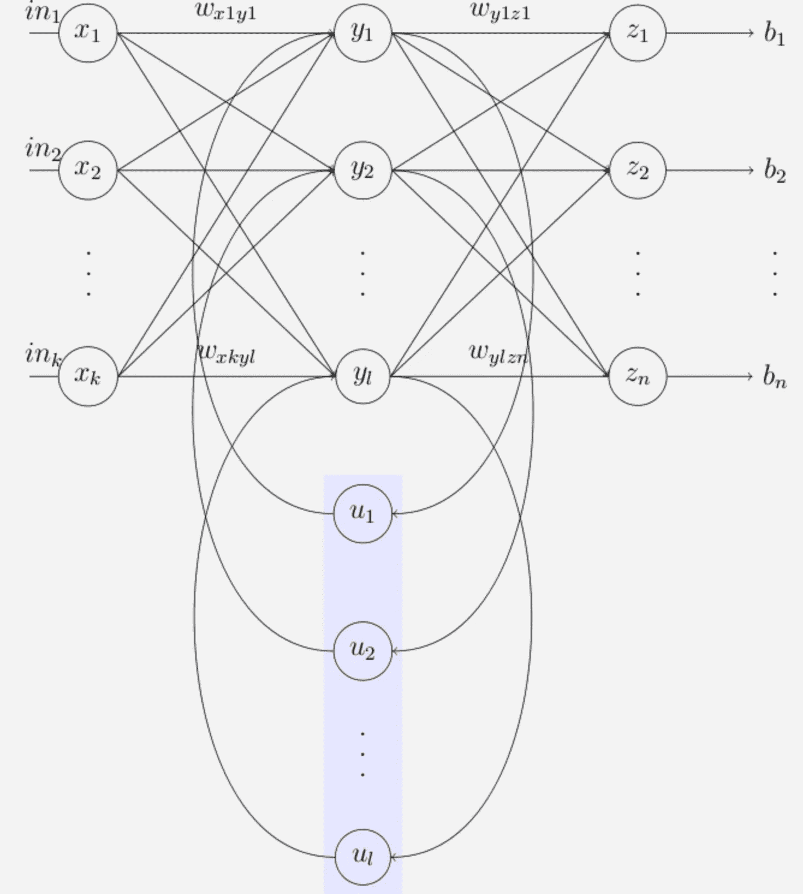
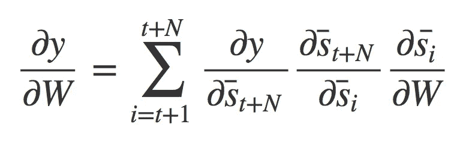
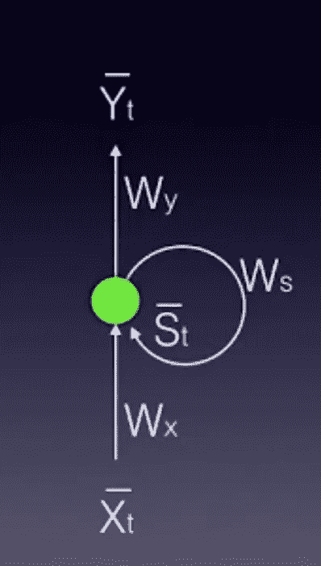
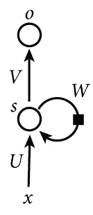
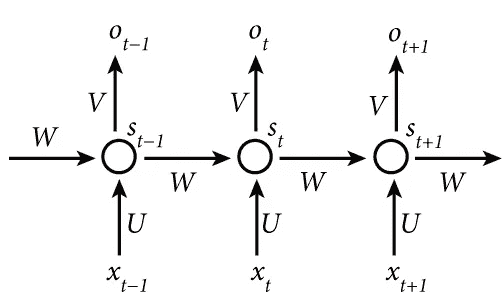

# 步入递归神经网络

> 原文：<https://medium.com/analytics-vidhya/stepping-into-recurrent-neural-networks-54b2a0190239?source=collection_archive---------34----------------------->

大家好！这是我在一个月内完成*深度学习纳米学位*的旅程中的第九篇文字！我已经完成了该学位总共六个模块中第四个模块的 33%。今天主要修改了*前馈*和*反向传播*。

## 第 14 天

因此，学位中的这个模块是关于 RNNs 的，为了开始，他们建议修改前馈和反向传播如何工作的概念。这正是我们今天要讨论的。

> CNN 擅长于在训练数据中寻找空间和可见模式的任务。



RNNs

来，我们现在复习一下基础。

> 神经网络本质上充当非线性函数激活。

## *NN* 应用

*   **分类**:例如，我们输入一只猫，模型告诉我们这是一只猫。
*   **回归**:例子可以是预测股票价格。我们输入过去 5 天的股票价格，然后模型预测未来 5 天的股票价格。

> 我们最终会找到产生最佳输出的最佳砝码组。

## 培训和评估流程

在训练阶段，我们获取数据集(也称为训练集)，它包括许多对输入和它们对应的目标(输出)。我们的目标是找到一组将输入映射到期望输出的最佳权重。在评估阶段，我们使用在培训阶段创建的网络，应用我们的新输入，并期望获得期望的输出。

再来说说 ***权重矩阵*** ，它会有等于隐藏层节点的列和等于输入层节点的行。我们通过将激活函数应用于输入向量和权重矩阵的乘积来获得输出。

## 误差函数

最常用的两个误差函数是**均方误差** (MSE)，通常用于回归问题，以及**交叉熵，**通常用于分类问题。

## 正向输送

基本上，前馈过程与我们对 CNN 或 MLP 所做的一样。我们通过模型的架构运行输入，然后计算误差。

```
y = F(x, w)
```

其中' *x* 为输入， *w* 为权重& ' *F* 为激活函数。在使用神经网络的情况下，我们有从输入到输出的静态映射。*使用静态*，因为模型没有记忆，它只取决于输入和权重。我们看到每个节点都乘以它的权重，我们加上 bias，然后再加到下一层节点。然后，激活函数作用于它，然后它传递到下一层。

## 反向传播

在这方面，我们的主要目标是找到一组权重，使我们在前向传递完成后计算的误差最小化。反向传播滚动到计算误差相对于所有权重的偏导数，然后相应地改变权重。

现在，RNNs 的反向传播有点不同。我们不仅得到该层的偏导数，而且还将前面节点的偏导数结果相加。

在通过时间 、 *BPTT* 的 ***反向传播中，我们在时间步长’*t*训练网络，并且考虑所有先前的时间步长。***



RNN 反向传播方程

> 反向传播实际上是链式法则下的随机梯度下降。

# 递归神经网络

这些网络为我们提供了一种将*记忆*整合到我们的神经网络中的方法，并将在分析序列数据中发挥关键作用。 *RNN 的*通常与文本处理和文本生成有关，因为句子是由一系列单词组成的！CNN 系统没有任何记忆元素。*rnn*通过在产生当前输出时使用*存储器*(即网络的过去输入)来解决这个非常基本且重要的问题。这些可以*叠加*依赖关系。*记忆*定义为隐含层神经元的输出，它将在下一个训练步骤中作为网络的附加输入。

> 系统将自我训练并学习如何优化权重矩阵来实现网络。
> 
> 我最喜欢的 RNN 用例之一是生成图纸。[素描 RNN](https://magenta.tensorflow.org/assets/sketch_rnn_demo/index.html) 是一个程序，一旦你给它一些东西(一条线或一个圆等)，它就学会完成一幅画。)要开始了！把画画想象成一个连续的行为很有趣，但事实的确如此！这个网络采用一条起始线或曲线，然后，在经过多种类型的草图训练后，根据你输入的曲线尽最大努力完成绘图。



RNNs

## 裂缝

rnn 有一个关键缺陷，因为捕捉跨越 8 或 10 步以上的关系实际上是不可能的。这个缺陷源于信息的贡献随时间几何衰减的“ ***消失梯度*** ”问题。您可能还记得，在训练我们的网络时，我们使用反向传播。在*反向传播*过程中，我们使用梯度来调整权重矩阵。在此过程中，*梯度*通过导数的连续乘法来计算。这些导数的值可能非常小，以至于这些连续的乘法可能导致梯度实际上“*消失*”。

*是克服 *RNNs* 中消失梯度问题的一个选项。
**长短期记忆细胞** (LSTMs)和**门控循环单元** (GRUs)通过帮助我们应用具有时间依赖性的网络，给出了消失梯度问题的解决方案。在以后的文章中会有更多的介绍。*

## *折叠模型*

*这是当我们有一个正常的前馈，但与连续层，我们有一个' S '层，考虑到内存。“s”是隐藏状态向量。
前馈时，一切完全相同，但我们只需将正常电流`weights * inputs`和先前的`weights * inputs`相加，然后将其传递给激活函数。*

**

*折叠模型*

## *展开模型*

*模型也可以“及时展开”。展开的模型通常是我们在使用 *RNNs* 时使用的。当我们训练 *RNNs* 时，我们也使用*反向传播*，但是在概念上有所改变。这个过程类似于前馈神经网络，除了我们需要考虑以前的时间步骤，因为系统有记忆。这个过程被称为*穿越时间的反向传播(BPTT)* 。*

**

*展开模型*

**

*项目 2*

*这就是我今天能做的。Ik 这似乎是不完整的，但我今天没有感觉，不得不取消它。无论如何，狗品种分类项目获得批准，该项目是可怕的。下一集再见！*