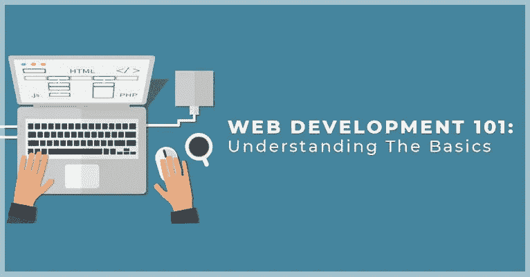

# 使用 Python 进行 Web 开发(Django)

> 原文：<https://medium.com/analytics-vidhya/stepping-into-web-development-with-python-django-a7af6d0e00f3?source=collection_archive---------12----------------------->



事实上，你是一个完全的初学者，不知道做什么，从哪里开始，你应该去哪里，哪个框架会给你最有利的方式来建立网站，这里有一个用 python 进行 web 开发的选择。Python 提供了 Django web 框架，这是一个真正的“少代码，多构建”类型的框架。在本教程中，我将向您展示如何构建一个简单的 web 应用程序，从下一个教程开始，我将尝试让您了解什么是 web 开发，以及我们基本上是如何完成这些工作的。

所以让我们重新开始。无论你是否熟悉 python，这都与本教程无关，你肯定能在这里学到任何东西。但是，是的，当你和大网站打交道时，这增加了额外的优势。我用的 python 版本是 3.5.2，Django 是 2.0.2。如果你的设备中没有任何设置，首先安装 [python](https://www.python.org/downloads/) 。安装 pip 并运行以下命令。

```
pip install django==2.0.2
```

一旦 django 安装到你的设备上，我们现在就可以开始了。您可以通过运行以下命令来检查您的 django 版本。

```
python -m django --version
```

它应该给出 2.0.2

现在让我们从创建一个项目开始。转到设备中要创建项目的目录，并运行以下命令。

```
django-admin startproject myproject
```

这是您的项目，您会发现在您运行命令的地方创建了一个目录。一个 django 项目可以包含多个应用程序。在 myproject 目录中，您可以检查文件，它们应该如下所示。

```
myproject
        __init__.py
        settings.py
        urls.py
        wsgi.py
manage.py
```

这完全是我们项目的基础，让我们为这个项目建立一个包含所有数据的数据库。Django 默认使用 sqlite3 数据库。您可以在 *myproject/settings.py* 文件中更改数据库格式。现在，让我们使用 sqlite3。运行以下命令创建数据库。

```
python manage.py migrate
```

每当数据库发生任何变化时，都应该运行这个命令。在这之后，文件应该是这样的。

```
myproject
db.sqlite3
manage.py
```

现在让我们创建这个项目中的第一个应用程序。

```
python manage.py startapp app
```

您应该会看到另一个名为“app”的目录，如下所示。

```
migrations
        __init__.py
__init__.py
admin.py
apps.py
models.py
tests.py
views.py
```

让我们了解这些文件的作用，但是在此之前，将这个新的应用程序注册到我们的项目中。进入 *myproject/settings.py* ，编辑如下。

```
#..... 
# Application definition

INSTALLED_APPS = [
    'app', ## ADD THIS
    'django.contrib.admin',
    'django.contrib.auth',
    'django.contrib.contenttypes',
    'django.contrib.sessions',
    'django.contrib.messages',
    'django.contrib.staticfiles',
]
#....
```

***models.py*** :创建数据库，在 models.py 中进行任何更改后，运行以下命令在数据库中进行更改。

```
python manage.py makemigrations
python manage.py migrate
```

***admin.py*** :这基本上是针对管理员用户的，它管理你作为管理员想要看到的内容。
***views . py***:这个文件包含了你项目的所有功能。
在 app 目录下创建另一个文件‘URLs . py’。应用程序目录应该是这样的。

```
migrations
        __init__.py
__init__.py
admin.py
apps.py
models.py
tests.py
views.py
urls.py
```

这个 urls.py 文件处理名为“app”的应用程序附带的 URL。要将它用作 url 文件，请转到 myproject/urls.py 文件，并像这样更改它。

```
from django.contrib import admin
from django.urls import path, include *## Import include to include url from another file*

urlpatterns = [
    path('admin/', admin.site.urls),
    path('app/', include('app.urls')), *## include 'app.urls'*
]
```

现在让我们创建一些视图显示在网站上。转到 app/views.py，编辑如下。

```
from django.shortcuts import render
from django.http import HttpResponse

def home(request):
 return HttpResponse("Welcome Home")
```

让我们为其分配一个 url，编辑 apps.urls，如下所示。

```
from django.urls import path
from . import views

urlpatterns = [
 path('home/', views.home, name='home'),
]
```

现在，在项目中运行以下命令来运行服务器。

```
python manage.py runserver
```

进入 **localhost:8000/app/home/，**你应该在页面上看到“欢迎回家”的文字。耶，你的第一个应用程序成功了！！