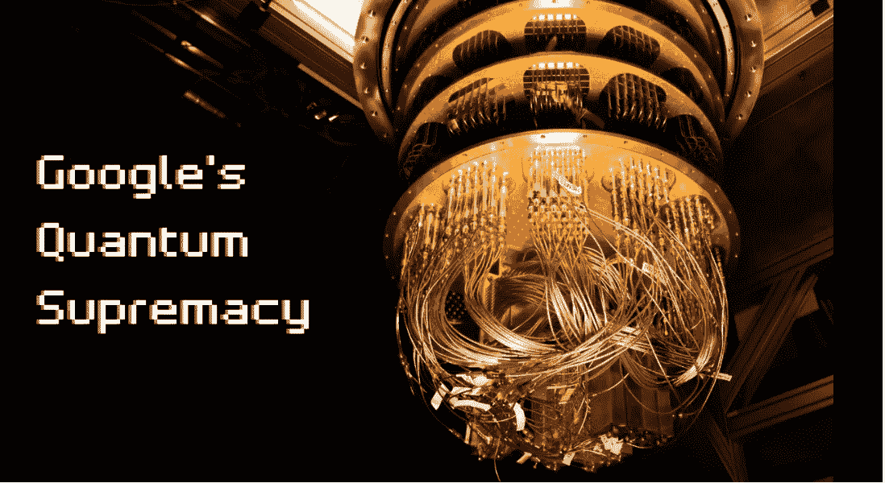
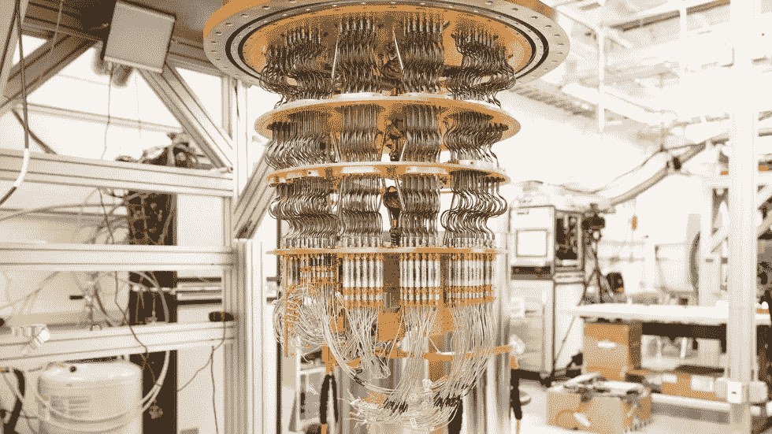
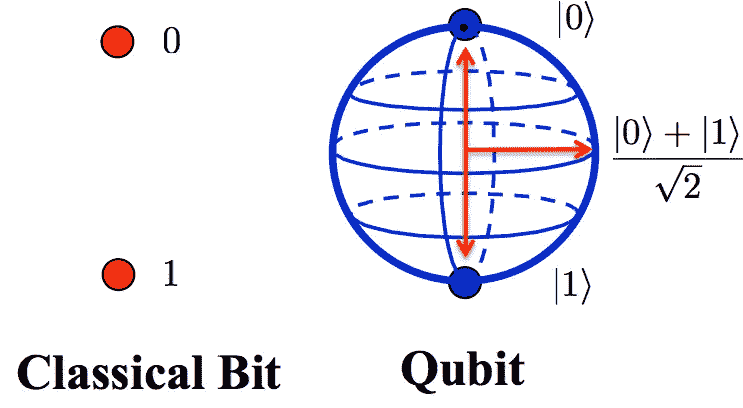
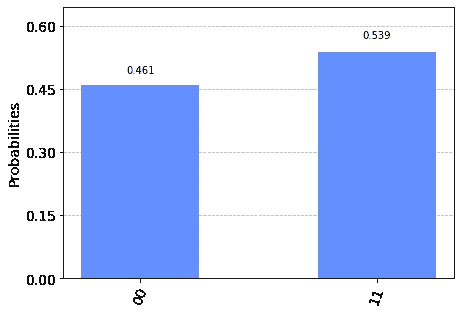
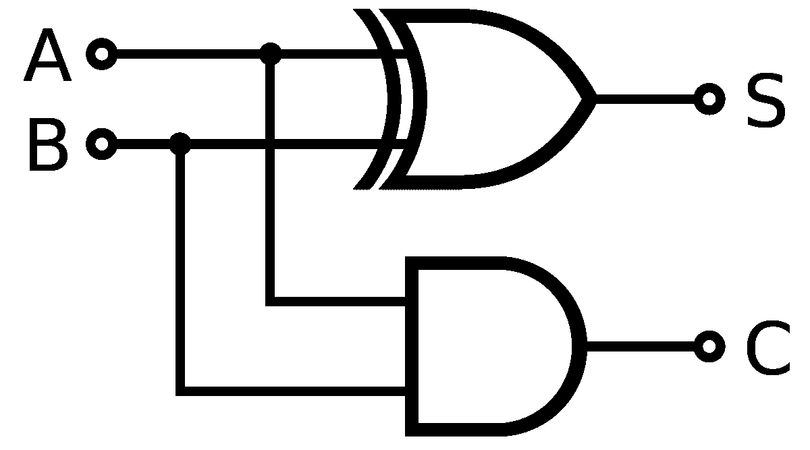
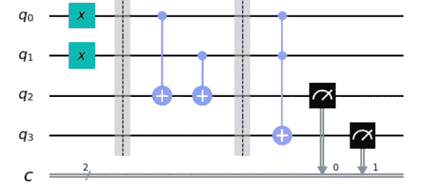
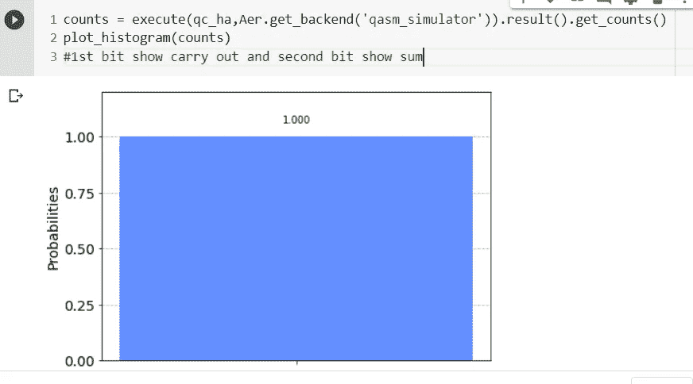

# 走进量子计算的世界:Qiskit 的质量控制基础

> 原文：<https://medium.com/analytics-vidhya/stepping-into-world-of-quantum-computing-qc-basics-with-qiskit-b101ebcef0bc?source=collection_archive---------15----------------------->

量子计算机不再是理论设备了。谷歌的[量子优势实验](https://ai.googleblog.com/2019/10/quantum-supremacy-using-programmable.html)使用 53 个*噪声*量子位进行。这项实验表明，量子计算机可以在 200 秒内完成一次计算，而使用现有算法，这在最大的经典计算机上需要 10，000 年。



[嘈杂的中尺度量子](https://quantum-journal.org/papers/q-2018-08-06-79/) (NISQ)计算时代从这里开始。在未来几年，拥有几十到几百个嘈杂量子位的量子器件有望成为现实。

在这篇文章中，我将涵盖一个踏入量子计算领域的新手所想到的所有基本问题。稍后，我们将使用 IBM 的 Qiskit 编写一些代码。

# 量子计算机的特别之处在哪里？

经典计算机使用只能拥有 1 或 0 值的经典位来存储信息，而不能同时拥有这两个值。量子魔法来了！在量子计算机中，信息是用量子位来表示的。



# 量子位

> 量子位是一个计算信息的单位，由一个原子或基本粒子(如[自旋](https://www.merriam-webster.com/dictionary/spin#h2))的状态表示，由于[量子力学](https://www.merriam-webster.com/dictionary/quantum%20mechanics)的原理，它可以一次存储多个值



经典位与量子位

## 叠加

> 量子位可以同时具有值 1 和 0，这种现象在量子计算的语言中被称为 ***叠加*** 。

关于量子力学的另一个有趣的事实表明，如果不破坏量子位的叠加态，就无法直接测量量子位。[寄存器](https://www.merriam-webster.com/dictionary/register#h1)表示 1 和 0 会随机坍缩成 1 或 0。

量子位可以用 ***bra-ket*** 符号来表示:|0⟩或|1⟩，分别读作‘ket 0’和‘ket 1’。

## 快速浏览一个物理量子位

光子和半透明反射镜的相互作用可以用来确定 1 和 0 的随机序列。光子不能一分为二，当我们通过反射镜发送光子时，它有 50/50 的机会反射或透射。如果光子被第一检测器反射并记录，则记下 1；如果它被第二检测器透射或记录，则记下 0。这样，我们就生成了一个随机数流或序列。

# Qiskit 入门

使用 Qiskit 的工作流程由三个高级步骤组成:

*   **构建:**设计一个量子电路，代表你正在考虑的问题。
*   **执行:**在不同的后端上运行实验(*包括系统和模拟器*)。
*   **分析**:计算汇总统计并可视化实验结果。

# 逐步工作流程

上面的程序可以分为六个步骤:

1.  导入包
2.  初始化变量
3.  添加门
4.  想象电路
5.  模拟实验
6.  将结果可视化

## 步骤 1:导入包

程序所需的基本元素导入如下:

```
**import** **numpy** **as** **np**
**from** **qiskit** **import**(
  QuantumCircuit,
  execute,
  Aer)
**from** **qiskit.visualization** **import** plot_histogram
```

更详细地说，进口是

*   `QuantumCircuit` 可以认为是量子系统的指令。它保存着你所有的量子运算。
*   `execute`:运行您的电路/实验。
*   `Aer`:处理模拟器后端。
*   `plot_histogram`:创建直方图。

## 步骤 2:初始化变量

考虑下一行代码

```
circuit = QuantumCircuit(**2**, **2**)
```

在这里，你用零态的 2 个量子比特初始化；其中 2 个经典比特被设置为零；而`circuit`就是量子电路。

语法:`QuantumCircuit(int, int)`

## 步骤 3:添加门

您可以添加门(操作)来操作电路的寄存器。考虑以下三行代码:

```
circuit.h(**0**)
circuit.cx(**0**, **1**)
circuit.measure([**0**,**1**], [**0**,**1**])
```

这些门一个接一个地加到电路中，形成钟形状态

|ψ⟩=(|00⟩+|11⟩)/2–√.|ψ⟩=(|00⟩+|11⟩)/2.

上面的代码应用了以下门:

*   `QuantumCircuit.h(0)`:量子位 0 上的阿达玛门 HH，使其进入**叠加态**。
*   `QuantumCircuit.cx(0, 1)`:对控制量子位 0 和目标量子位 1 的受控非操作(cxcxcx)，将量子位置于**纠缠态**。
*   `QuantumCircuit.measure([0,1], [0,1])`:如果将整个量子和经典寄存器传递给，测量第 I 个量子位的测量结果将存储在第 I 个经典位。

## 步骤 4:想象电路

您可以使用`QuantumCircuit.draw()`在许多教科书和研究文章中使用的[各种表格](https://qiskit.org/documentation/api/qiskit.circuit.QuantumCircuit.html#qiskit.circuit.QuantumCircuit.draw)中查看您设计的电路。

```
circuit.draw()┌───┐     ┌─┐   
q_0: ┤ H ├──■──┤M├───
     └───┘┌─┴─┐└╥┘┌─┐
q_1: ─────┤ X ├─╫─┤M├
          └───┘ ║ └╥┘
c_0: ═══════════╩══╬═
                   ║ 
c_1: ══════════════╩═
```

在这个电路中，量子位是有序的，量子位 0 在顶部，量子位 1 在底部。该电路从左向右读取，这意味着电路中较早应用的门显示在更靠左的位置。

`QuantumCircuit.draw()`或`qiskit.visualization.circuit_drawer()`的默认后台是文本后台。但是，根据您的本地环境，您可能希望将这些默认值更改为更适合您的用例的值。这是通过用户配置文件完成的。默认情况下，用户配置文件应该位于`~/.qiskit/settings.conf`中，并且是一个`.ini`文件。

例如，用于设置 Matplotlib 抽屉的`settings.conf`文件为:

```
[default]
circuit_drawer = mpl
```

您可以使用任何有效的电路抽屉后端作为此配置的值，包括 text、mpl、latex 和 latex_source。

## 第五步:模拟实验

Qiskit Aer 是一个用于量子电路的高性能模拟器框架。它提供了[几个后端](https://qiskit.org/documentation/apidoc/providers/aer/aer_backends.html)来实现不同的模拟目标。

如果您在安装 Aer 时遇到问题，您也可以通过用基本 Aer 替换 Aer 来使用基本 Aer 提供程序。Qiskit Terra 中包含基本 Aer。

```
import numpy as np
from qiskit import(
  QuantumCircuit,
  execute,
  BasicAer)
...
```

为了模拟这个电路，您将使用`qasm_simulator`。该电路的每次运行将产生位串 00 或 11。

```
simulator = Aer.get_backend('qasm_simulator')
job = execute(circuit, simulator, shots=**1000**)
result = job.result()
counts = result.get_counts(circuit)
print("**\n**Total count for 00 and 11 are:",counts)Total count for 00 and 11 are: {'00': 461, '11': 539}
```

正如所料，输出位串大约有 50%的时间是 00。电路运行的次数可以通过`execute`方法的`shots`参数指定。模拟的快照数设置为 1000(默认值为 1024)。

一旦有了一个`result`对象，就可以通过方法`get_counts(circuit)`访问计数。这给出了您运行的实验的总结果。

## 第六步:想象结果

Qiskit 提供了许多可视化功能，包括功能`plot_histogram`，用于查看您的结果。

```
plot_histogram(counts)
```



观察到的概率 Pr(00)Pr(00)和 Pr(11)Pr(11)是通过取各自的计数并除以总拍摄数来计算的。

# 半加法器电路

## 经典的

计算机使用二进制数 **0** 和 **1** 。加法电路使用这些二进制数并计算加法。使用 **X** [**或**](https://circuitdigest.com/electronic-circuits/xor-gate-circuit-diagram) 和 [**和**](https://circuitdigest.com/electronic-circuits/and-gate-circuit-working) 门可以制成一个**二进制加法器电路**。求和输出提供两个元素，第一个是**和**，第二个是**执行**。



## 量子

对于量子计算机，我们使用相同的基本思想，但是对于如何表示输入、输出和用于操作的符号，我们有不同的约定。这里是量子电路，代表与上述相同的过程。

电路图应该是这样的

