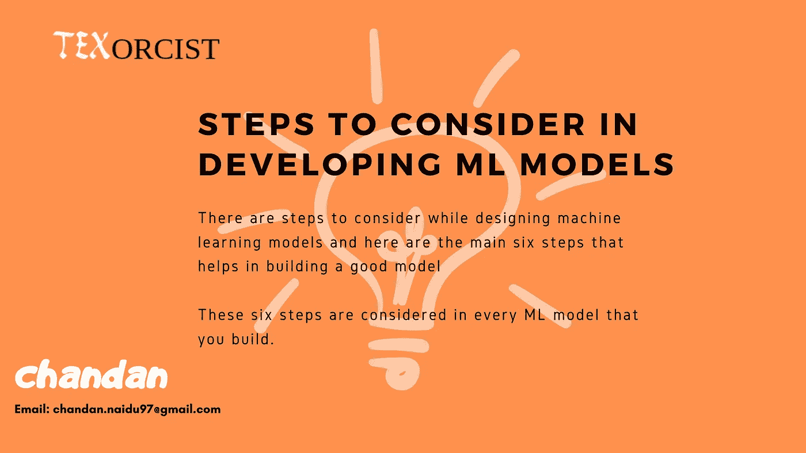
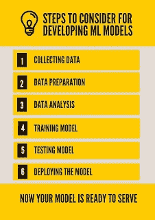

# 开发机器学习模型时要考虑的步骤

> 原文：<https://medium.com/analytics-vidhya/steps-to-consider-in-developing-machine-learning-models-68e389b71b7d?source=collection_archive---------7----------------------->

## 你建立的任何机器学习模型，都必须遵循这六个步骤

或者任何机器学习模型，在为服务部署它之前，有几个必要的步骤需要考虑。这一系列步骤类似于你开发的所有机器学习模型。现在让我们按顺序看看这些步骤。

1.**收集数据:**对于任何机器学习模型来说，数据都是需要考虑的主要资源，模型可能需要大量的数据。收集数据是困难的工作之一。如果需要，有免费服务和付费服务提供这样的数据，其中这些数据可能是 JSON 或 XML 或 CSV 形式的结构化数据..等等。但是，如果有人试图自己收集数据，那么他们需要考虑他们收集的数据可能是非结构化形式的。

2.**数据准备:**现在数据已经收集，但这些数据可能包含一些损坏的信息或丢失的值，也就是说，在数据收集的过程中，有人可能无意中更改了数据，这是人为错误，或者一些列可能是空的，这应该在此阶段解决。在统计学的帮助下，我们可以使用均值、中位数或众数等统计方法来解决这个问题。

3.**数据分析:**数据需要在这个阶段进行分析，即数据集中的特征之间是否存在隐藏关系。通过正确的具有领域知识的特征工程，我们可以解决 70%的问题。如果我们克服了数据分析阶段，那么工作就差不多完成了。根据调查，数据科学家 70%的时间花在数据分析和特性工程上。

4.**训练模型:**事后数据分析给定数据分为训练、测试和验证数据，其中:

**训练数据集:** 65%的数据用于训练算法。

**验证数据集:** 5% — 10%的数据用于算法的验证。在调整过程中使用验证过程。

**测试数据集:** 30%的数据用于测试算法性能。

然后，将训练数据集作为算法的输入进行学习。算法可能是任何人喜欢回归，分类，KNN..等等。

5.**测试模型:**一旦算法在训练数据集上表现良好。然后，我们在测试数据集上测试它，其中算法应该预测测试数据集的结果。如果在测试数据上表现良好，那么我们进入最后一步。

**6)部署模型:**在最后阶段，我们将模型部署到云上，在那里算法可以服务于它的目的，甚至模型可以用作 API。

以下是开发机器学习模型的 6 个步骤

电子邮件:chandan.naidu97@gmail.com

Linkedin: [chandannaidu](https://www.linkedin.com/)