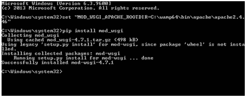
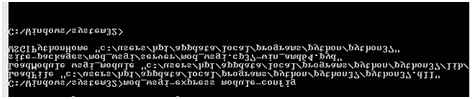
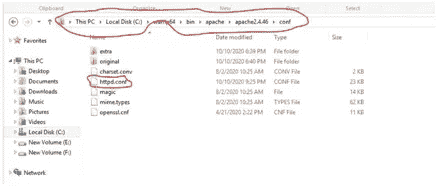
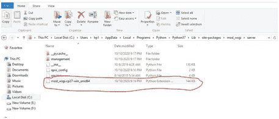
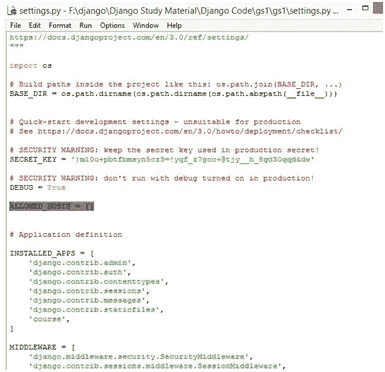
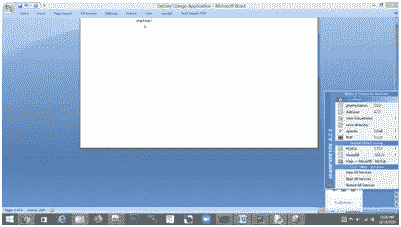

# 在 Windows Server 上部署 Python Django 应用程序的步骤

> 原文：<https://medium.com/analytics-vidhya/steps-to-deploy-python-django-application-on-windows-server-c6159aaff8ce?source=collection_archive---------4----------------------->

**1)**安装 Wamp

**2)** **安装 Visual Studio for C++**

[https://visual studio . Microsoft . com/thank-you-downloading-visual-studio/？sku =社区& rel=15#](https://visualstudio.microsoft.com/thank-you-downloading-visual-studio/?sku=Community&rel=15)

3) **按照以下步骤安装 mod_wsgi** :

a.以管理员身份打开命令行

b.写入以下命令

c.C:\ Windows \ system32 > set " MOD _ WSGI _ APACHE _ ROOTDIR = C:\ wamp 64 \ bin \ APACHE \ APACHE 2 . 4 . 46 "

d.在以上命令中，请根据您的计算机更新地址。

4)通过编写以下命令获取 mod_wsgi 路径。在 wsgi 文件中更新需要此路径。

a.mod_wsgi-express 模块配置

5) **更新 httpd.conf 文件**:

a.根据您的系统，转到以下路径:

I . C:\ wamp 64 \ bin \ Apache \ Apache 2 . 4 . 46 \ conf

二。打开 httpd.conf 文件

b)滚动到 httpd.conf 文件的底部，粘贴以下代码:

# Apache httpd.conf 设置

> **load module wsgi _ module**" C:/Users/hp1/AppData/Local/Programs/Python/Python 37/Lib/site-packages/mod _ wsgi/server/mod _ wsgi . cp36-win _ amd64 . pyd "
> 
> **WSGIScriptAlias**/" D:/SHARE/ui _ demo/ui _ demo/wsgi . py "
> 
> **wsgipython home**" c:/python 36 "
> 
> **WSGIPythonPath**“Django 应用程序的根目录”
> 
> alias/media/D:/SHARE/ui _ demo/media/
> 
> alias/static/D:/SHARE/ui _ demo/static/

1)**LoadModule wsgi _ module**:

**a .**请注意，在路径地址中使用正斜杠

b.根据您的计算机转到以下路径:

I . C:\ Users \ hp1 \ AppData \ Local \ Programs \ Python \ Python 37 \ Lib \ site-packages \ mod _ wsgi \ server

c. **WSGIScriptAlias** :该路径用于 django 应用程序 wsgi 文件

d. **WSGIPythonHome** :该路径用于 python 库

e.**WSGIPythonPath**:Django 应用的根目录

f.**Alias/media/D:/SHARE/ui _ demo/media/:**这些是 Django 应用程序中 javascript 文件夹和 image 文件夹等静态文件的路径

2)在 httpd.conf 文件的底部添加以下行，这些行用于授予静态文件夹对服务器的访问权限

> 要求全部授权
> 
> 要求全部授权
> 
> 要求全部授权

**6)** **在 Django 应用的 settings.py 文件中添加主机名**

a.在主机名中添加

> ALLOWED_HOSTS = ['localhost']

Django 设置. py 文件

**7)**运行 Wamp 服务器

**a.** 双击 Wamp 图标，以管理员身份运行(应该不会出现错误)

**b.** 双击 Wamp 服务器图标后，开始栏右下角会出现一个新的弹出窗口:

运行 Wamp 服务器

c.单击 Localhost 运行服务器。