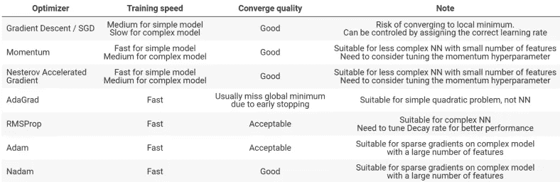

# 成功培训 MLP 应该遵循的步骤

> 原文：<https://medium.com/analytics-vidhya/steps-you-should-follow-to-successfully-train-mlp-40a98c3b5bb3?source=collection_archive---------5----------------------->

在 [Unsplash](https://unsplash.com?utm_source=medium&utm_medium=referral) 上由 [Franck V.](https://unsplash.com/@franckinjapan?utm_source=medium&utm_medium=referral) 拍摄的照片

训练多层感知器不是一件容易的事情，你必须遵循许多步骤来训练 MLP，并从中获得最大收益，如果你错过了其中的任何一步，那么一切都将化为乌有。所以请不要忘记在创建你的 MLP 模型之前做这些步骤。

所需步骤

1.  数据预处理
2.  权重初始化
3.  选择正确的激活功能
4.  批量标准化
5.  添加辍学者
6.  使用优化器
7.  超参数
8.  损失函数

# 1.数据预处理

数据预处理是任何机器学习或深度学习项目中最重要的步骤之一，如果你不打算使用数据预处理，那么你制作的任何模型都是无用的。

我们从现实世界中获得的数据是不完整的、不一致的、不准确的(包含错误或异常值)，并且通常缺少特定的属性值/趋势。所以这就是**数据预处理**来拯救的地方。在数据预处理中，我们基本上清理数据，填补丢失的值，找到并移除异常值。

**数据预处理步骤:**

1 **数据清洗:**我们得到的数据可能会有很多不相关和缺失的数据点，所以要处理这部分，就要进行数据清洗。它涉及丢失数据、噪声数据等的处理。这涉及到更多的步骤。

2 **特征缩放:**通过将所有数据值纳入指定范围(-1.0 至 1.0 或 0.0 至 1.0)，将不同比例的数据纳入同一比例。我们进行**数据标准化**来重新调整数据，使平均值为 0，标准差为 1(单位方差)。我们使用 ***归一化*** 将值重新调整到范围[0，1]

# 2.权重初始化

权重初始化用于防止激活层输出在通过深度神经网络的向前和向后传播的过程中出现爆炸梯度或消失梯度问题。

重量初始化主要取决于您使用的激活功能。如果你有 **Sigoid 或 tanh** 作为你的激活函数，那么最好使用 **Xavier 初始化**或 **Glorot 普通初始化器**和像 **ReLu** 这样的激活函数最好使用**普通**

# 3.选择正确的激活功能

当你没有一个密集连接的深 MLP，那么你基本上可以使用任何激活函数，如 **Sigmoid 或 tanh** ，但当你处理具有多个隐藏层的密集连接的 MLP 时，那么你不应该选择 Sigmoid 或 tanh，因为它们必须消除梯度问题，那么最好使用 **ReLu** 或其他不同的变化。

# 4.批量标准化

批处理规范化是一种用于提高神经网络的速度、性能和稳定性的技术。所以你必须使用批量标准化，尤其是在深度 MLPs 的情况下，并尝试对接近**输出层**的层使用批量标准化

**批量标准化**通过减去**批量**平均值并除以**批量**标准偏差来标准化先前激活层的输出。

# 5.添加辍学者

过拟合一个多层感知器是非常容易的，所以为了防止过拟合多层感知器，我们必须使用辍学。辍学是保护你的 MLP 免于过度劳累的最好方法。在这种情况下，我们决定我们的辍学率，并通过我们的模型随机选择神经元，一些神经元在训练过程中被忽略。他们是随机“辍学”的，因此得名**辍学**。

# 6.使用优化器

训练一个深度神经网络不是一件容易的事情，而且是一件非常耗时的事情，特别是对于复杂的问题。但是，我们可以通过选择正确的优化器来减少时间，而不是简单地使用常规梯度下降优化器，该优化器会缓慢地收敛到全局最小值，或者甚至会停留在局部最小值，从而导致更差的模型。因此，在选择正确的优化器时，您应该非常小心，因为它将节省您的时间，并提高您的模型的性能。

大多数时候，*自适应学习速率算法*如**亚当**或**那达慕**在速度上胜过**梯度下降算法** s 或它的不同变体如**随机梯度下降(SGD )** 和**小批量梯度下降**，特别是在深度神经网络中。然而， ***自适应学习率算法*** 并不能保证绝对收敛到全局最小值。

因此，如果您的模型不太复杂，并且具有较少的特征和数据点，那么建议使用**随机梯度下降(SGD )** 作为起点，然后我们可以稍后调整我们的参数，如学习率，稍后选择优化器函数。但是，当你处理大量数据点和具有大量特征的复杂模型时，你可以使用**亚当**或**那达慕**创建你的第一个模型，因为这些模型具有更快的收敛速度，并且不会陷入局部最小值。

这里列出了所有的优化器，有优点也有缺点，所以你可以相应地选择最适合你的

# 7.超参数

深度学习模型充满了超参数，选择正确的超参数并不是一件容易的事情。由于有大量的超参数需要调整，训练一个深度多层感知器变得非常困难。

超参数非常重要，因为它们直接控制训练算法的行为，对训练中的模型的性能有重要影响，因为超参数将决定模型的性能，因此您一定不能跳过这一步。

这里有一些您可以调整的超参数，这些都可以通过 **GridSearchCV 或 RandomSearch 来完成。**

*   学习率
*   时代数
*   隐藏层和隐藏单元
*   激活功能

**学习率:**如果我们的模型的学习率非常大，那么它将超过理想状态，并且算法可能不收敛(因为当局部最小值在中间时，它将保持从左向右跳跃)。当我们保持我们的学习率太低时，那么我们的模型可能需要几年才能收敛(将需要更多的纪元来达到理想状态)。所以我们一般选择自己的学习率为 **0.001。**我们还随着时期大小的增加不断改变我们的学习率，这是使我们的学习率随时间变化的最佳方式，因为它有助于我们的模型更快地收敛。

**时期数:**要为训练步骤选择正确的时期数，我们应该注意的指标是**验证误差**。直观的*手动*方法是，只要验证误差不断减小，就让模型训练尽可能多的迭代次数，然后会有一个点，从这个点开始，我们的模型性能不会改变太多，甚至可能会降低，然后我们停止，在图的帮助下，我们可以选择我们的最佳时期数。总是试着做一个既有训练错误又有测试错误的图，否则你会过度拟合你的模型。

**隐藏层:**涉及第一个隐藏层的另一个启发是，将隐藏单元的数量设置为大于输入的数量往往会在许多任务中实现更好的结果，这意味着如果你有 5 个输入层，那么在你的第一个隐藏层中的隐藏层中有 20 个神经元是好的。大多数情况下，3 层神经网络是理想的，它优于 2 个隐藏层，然后增加更多的神经网络通常不会有回报，直到你不使用卷积神经网络，它们越深，性能越好。

# 8.损失函数

我们通常处理 3 种类型的问题，即回归问题、二元分类问题和多类分类问题，它们中的每一个都有不同的损失函数，所以让我们寻找所有的问题。

**回归损失函数:**在回归问题中，我们预测我们的实数值。因此，在这种情况下，我们使用三种不同类型的损失函数，即

1.  均方误差损失
2.  均方对数误差损失
3.  平均绝对误差损失

**二进制分类损失函数:**在二进制分类问题中，我们只有两类:是或否、0 或 1。这里我们使用的损失函数是:

1.  二元交叉熵
2.  铰链损耗
3.  平方铰链损耗

**多类分类损失函数:**这里我们正在处理多种情况，如我们的 **MNIST 数据集 i** n，我们必须识别手写数字，甚至最流行的数据集，即我们的**虹膜数据集，也是一个多类问题。**因此，我们在这种情况下使用的损失函数是:

1.  多类交叉熵损失
2.  稀疏多类交叉熵损失
3.  Kullback Leibler 发散损失

# 结论:

所有上述步骤都非常重要，因此您必须遵循每一个步骤，以获得一个完全工作的模型。如果你错过了任何一步，那么你所有的其他步骤都将是徒劳的，你的模型将会有一个糟糕的表现。所以在创建你的模型之前，总是试着写下这些步骤，因为我们作为人类容易忘记事情，这将直接影响我们的模型。