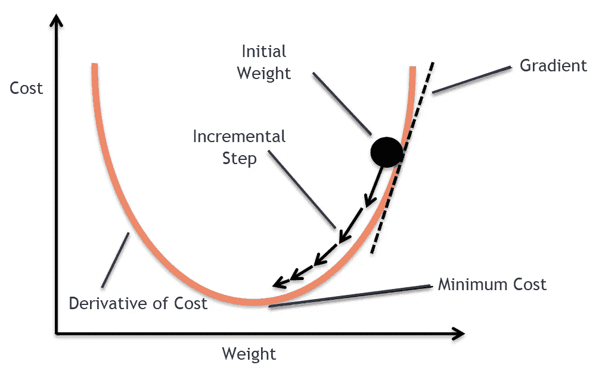

# 随机梯度下降

> 原文：<https://medium.com/analytics-vidhya/stochastic-gradient-descent-1ab661fabf89?source=collection_archive---------14----------------------->

有没有想过一个涉及大量数据的问题，你必须一个接一个地迭代，然后得出结论。这将是一个非常紧张的过程&几乎不可能。

为了解决上述问题，我们有一个工具/算法随机梯度下降。为了理解这一点，第一步是详细理解**梯度下降**算法。了解梯度下降的最佳文章/博客是:

 [## 关于机器学习和深度学习中的梯度下降！

### 想知道机器学习算法如何给我们最佳的结果，无论是预测、分类…

medium.com](/analytics-vidhya/all-about-gradient-descent-in-machine-learning-and-deep-learning-3dea4b269bf0) 

在你学习了梯度下降之后，现在我们可以朝着理解随机梯度下降的方向前进。我们继续吧。

## 随机梯度下降的解释

考虑一下，你被赋予一项任务，那就是计算生活在这个地球上的每个人的重量。你有可能完成那个任务吗(显然不可能！).

> 所以，一个可能的解决方案是，你可以假设 10000 个人的平均体重，并可以得出计算出的体重是生活在这个地球上的每个人的平均体重。

同样的方法在*随机梯度下降法中实施，*如果有非常大的数据集，那么随机梯度下降法将从中抽取一个随机样本，并为其计算适当的权重，然后这些计算出的权重也用于其余的数据。

> 这种方法非常有用，因为它减少了机器资源的消耗，并导致快速的结果。

该算法可作为预建的**优化器**在 **Keras** 深度学习库中获得。它可以通过下面给出的语法导入以用于深度学习:

> "从 keras.optimizers 导入 SGD "

**这就是对这种随机梯度下降的全部解释。我希望这篇博客能以最好的方式解释这个算法。**