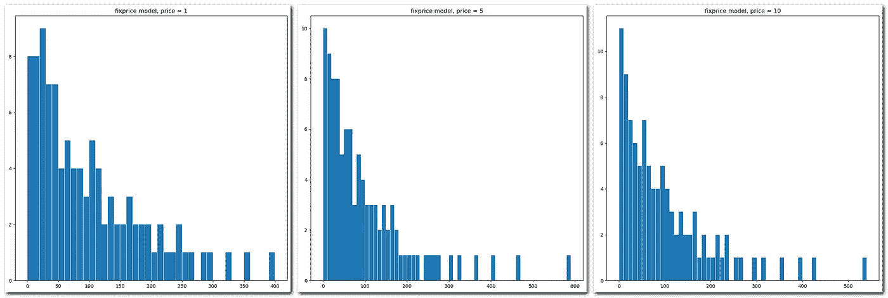
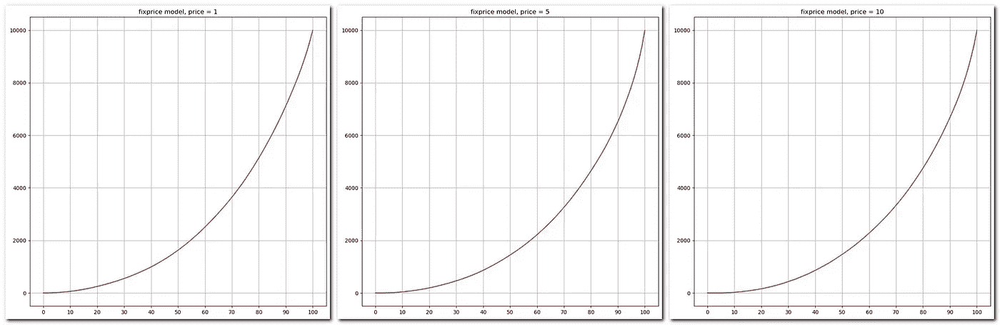
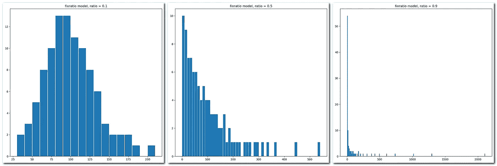
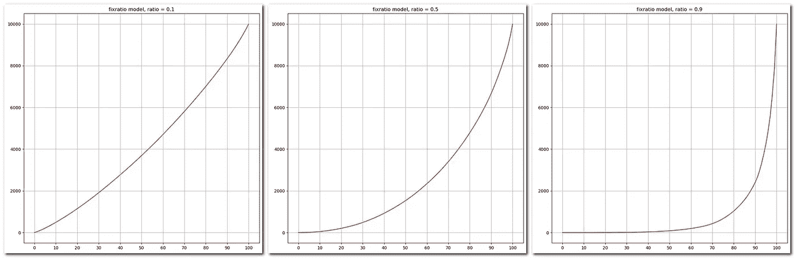
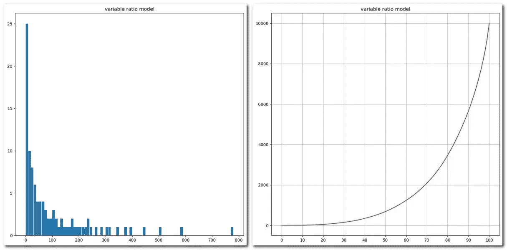

# 帕累托原理的随机根

> 原文：<https://medium.com/analytics-vidhya/stochastic-roots-of-pareto-principle-adbbcb1faab0?source=collection_archive---------16----------------------->

## 为什么不平等是不可避免的——这只是数学，与个人无关。

不久前，我在一篇现在找不到的文章中读到，财富分配的不平等可能是通过一开始拥有等量资金的代理人之间的一系列随机互动获得的。

> 帕累托原则是以意大利经济学家、工程师和哲学家维尔弗雷多·帕累托的名字命名的，他在研究意大利的财富分配时注意到大约 20%最富有的所有者拥有大约 80%的意大利土地。

所以，[有 Python — will 模型](https://en.wikipedia.org/wiki/Have_Space_Suit%E2%80%94Will_Travel)，海因莱茵说。

初始设置:有 100 个“人”,每个人有 100“钱”。他们随机互动，并在每次“交易”中互相转移一定数量的资金。在名为“固定价格”的第一个模型中，一个“人”给另一个人的钱是固定的。第二个模型是“固定比率”,给予者将其流动资本的固定部分给予另一个代理人。每种型号有 10 轮，每轮 100 万笔交易。每个模型的最终分布是 10 轮的平均结果。

结果以两种形式显示:直方图和洛伦兹曲线。直方图显示了在这一轮结束时有多少“人”有特定数量的“钱”。[洛伦茨曲线](https://en.wikipedia.org/wiki/Lorenz_curve)显示了人口的累积财富分布。

价格值分别等于 1、5 和 10 的固定价格模型直方图

固定价格模型洛伦茨曲线的价格值分别等于 1，5 和 10

如您所见，在固定价格模型中，价格值方面没有大的结果差异。最大的资本大约是 500，大约 10 个“人”破产，帕累托定律看起来更像 50/20 而不是 80/20——大约 55%最穷的“人”拥有大约 20%的财富，20%最富的“人”拥有大约一半的财富。

固定比率模型显示，就比率值而言，不平等发生了更大的变化。

价格价值的固定比率模型直方图分别等于给予者资本的 0.1、0.5 和 0.9

价格价值的固定比率模型洛伦茨曲线分别等于给予者资本的 0.1、0.5 和 0.9

在最后一个模型中，交易成本是给予者资本的随机部分。

可变比率模型

请注意，在任何提出的模型中，都没有从穷人那里拿钱给富人或其他方式的意图。这是一个纯粹的随机过程，唯一的规则是——你不能降到零度以下，所以如果给予者没有钱，就没有交易。

这些结果没有多少科学根据，但在我看来，这是一个很好的例证，说明了生活中的机遇的作用。我要说的是，这与诸如[生存偏差](https://en.wikipedia.org/wiki/Survivorship_bias)、[归因偏差](https://en.wikipedia.org/wiki/Attribution_bias)以及其他与成功及其原因相关的话题有很多交集。