# 使用 Python 进行股票市场分析(根据标准普尔 500 指数)

> 原文：<https://medium.com/analytics-vidhya/stock-market-analysis-by-s-p-500-index-using-python-264bffafd235?source=collection_archive---------19----------------------->

标准普尔 500 是一个股票市场指数，衡量在美国证券交易所上市的 500 家大公司的股票表现。一家公司的市场资本总额的计算方法是将当前股票价格乘以发行在外的股票。

***用于分析的数据——苹果、亚马逊、微软&谷歌***

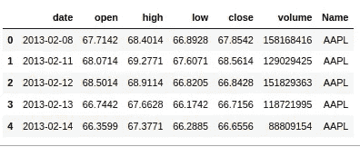

数据集中的特征概述

**分析股票收盘价&成交量交易**

我们需要将字符串转换为“日期”功能的日期格式。然后提取公司的所有唯一名称(有助于在绘图时循环迭代)。使用 matplotlib.pyplot 我们可以对它有一个直观的概述。

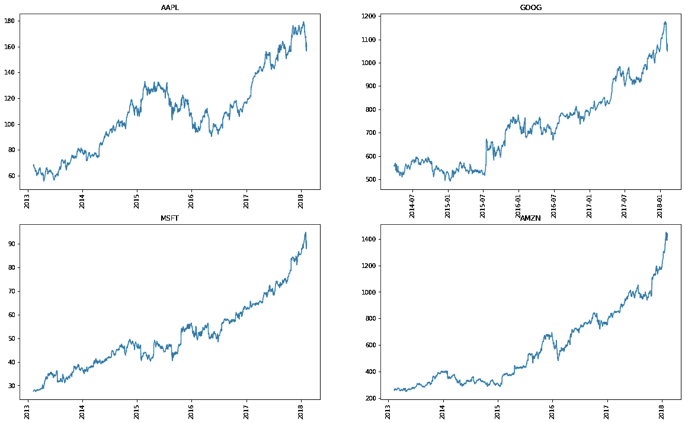

苹果、微软、谷歌和亚马逊的收盘价

从以上解读的数据中，我们可以得出结论，亚马逊在这四家公司中的收盘价最高。所以我们来看看每家公司的交易量。我们使用 plotly 来绘制这些视觉效果。

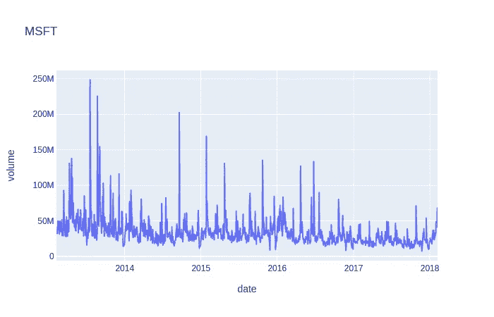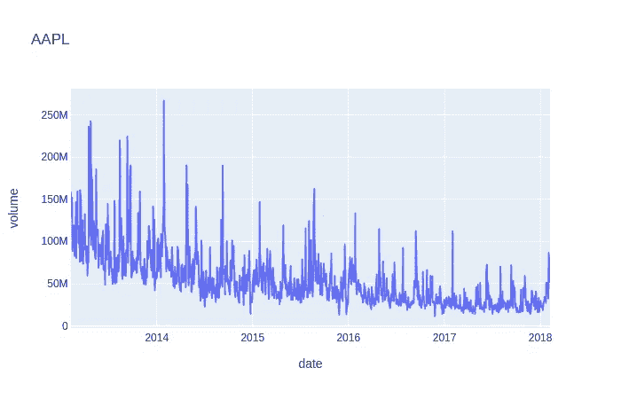

微软和苹果的交易量

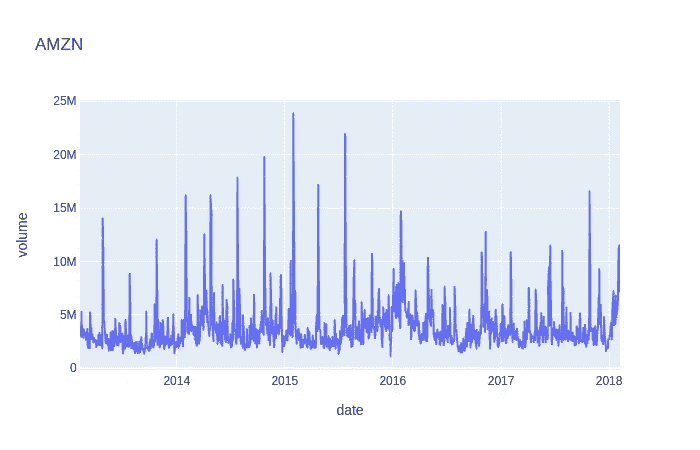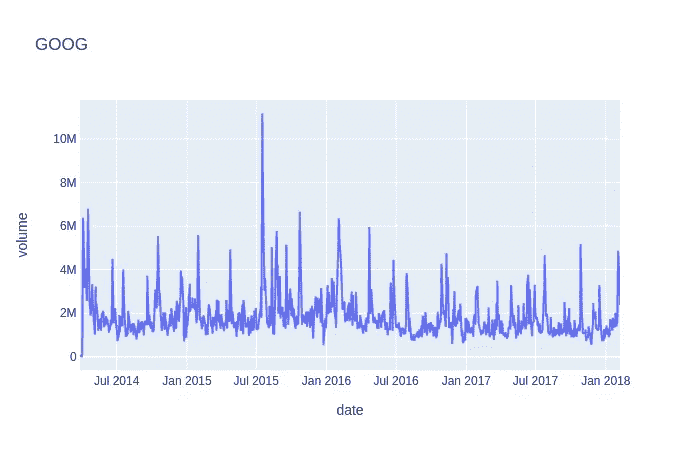

亚马逊和谷歌的交易量

从上面的图表中我们可以看出，苹果在 2014 年的最大交易量超过了 2.5 亿。

**分析每日回报**

首先我们需要通过减去开盘价和收盘价除以 100 来计算日收益率。在计算日收益后，我们需要绘制日收益图。这可以使用 plotly 来完成。

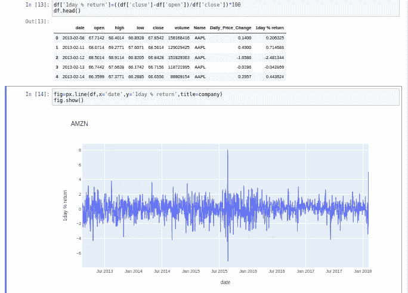

亚马逊每日收盘价

**执行多变量分析**

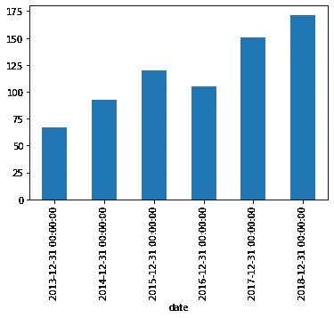

通过对要素进行重采样并寻找平均值来寻找要素的最大收盘价。

从这种视觉化我们可以得出结论，2018 年是前一年收盘价最高的一年。

..

现在我们要根据收盘价找出公司之间的关系。我们可以通过使用 *seaborn* 库并绘制 *pairplot* 或使用*热图*来描述关系。下图显示亚马逊和微软的收盘价几乎相同。

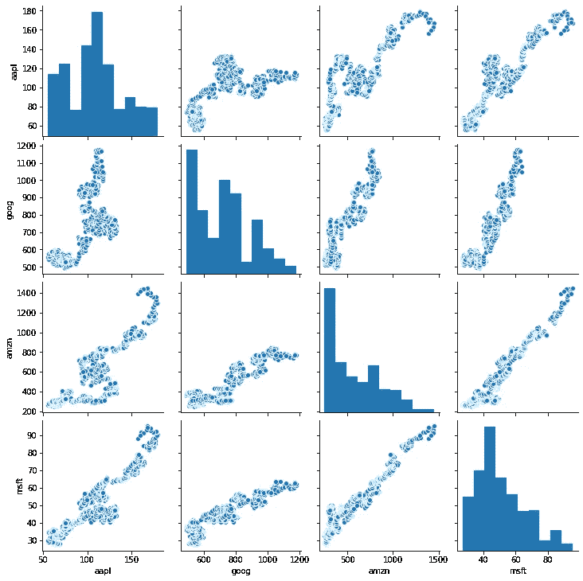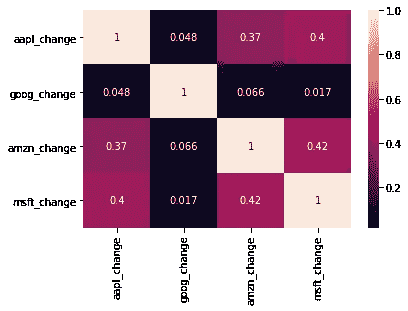

我们可以对每日收盘价做同样的事情。在这里，我向您展示了一张*热图*，您也可以用它来进行分析。同样，我们也可以申请收盘价。

**风险分析**

在跨资产类别或在**股票市场**做出投资决定时，第一个也是最重要的**步骤是检查**风险**承受能力**分析**和投资者的财务目标，然后做出明智的决定，做出适合投资者及其个性的投资。在这里，我们将通过解释哪个范围占用了最多的数据点来分析风险。**

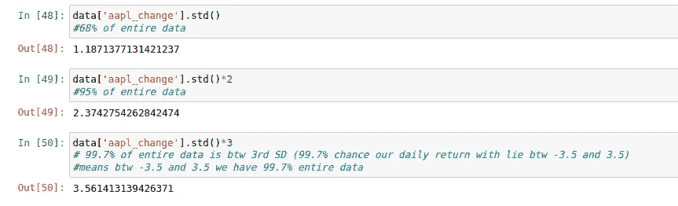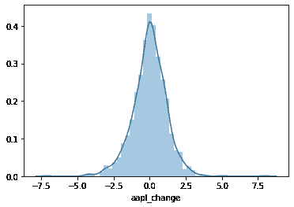

因此，从该图中，我们可以最终得出结论，整个数据的 99.7%在第三标准差之间，即在-3.5 和 3.5 之间。

通过以下方式与我联系:

 [## ammy20019 -概述

### 在 GitHub 上注册你自己的个人资料，这是托管代码、管理项目和构建软件的最佳地方…

github.com](https://github.com/ammy20019/)  [## 艾米特·库马尔 Sahu - Track Lead -开源社区:VIT-美联社| LinkedIn

### 查看艾米特·库马尔·萨胡在全球最大的职业社区 LinkedIn 上的个人资料。Amit 有 3 份工作列在他们的…

www.linkedin.com](https://www.linkedin.com/in/amit-kumar-sahu-7aab19169/)