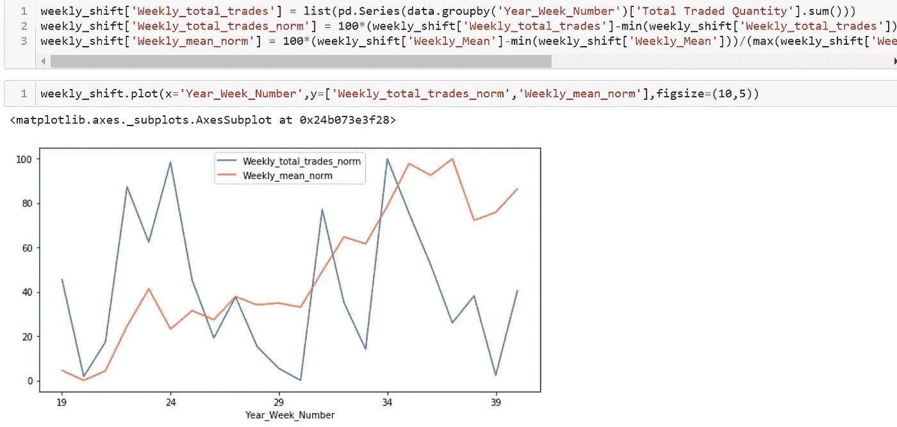

# 股票市场和 Python

> 原文：<https://medium.com/analytics-vidhya/stock-market-and-python-c3e66bf57819?source=collection_archive---------9----------------------->

青少年的迷恋，成年后的爱好。时代是 2013 年，一个陈词滥调的有抱负的工程男孩在《华尔街之狼》中扮演了迪卡普里奥的精彩角色。股票市场的起起落落总是让我着迷，现在是 2020 年(希望人们将来也会回到这里)，当我们看到印度市场空间的新用户数量突然激增(~ 500 万)时，我想为什么不在我感到舒适的少数几个领域之一(Python)中使用容易获得的市场数据。

在我们开始之前，请允许我提醒您，与 YahooFinancials 等 python 专用库支持通过 API 调用轻松下载数据的国际市场不同，它们在印度市场并不那么迅速，但尽管如此，我们确实可以利用本地 python 库“nse”来处理市场数据。在牢记最近的“为本地发声”议程的同时，我对汽车行业巨头“塔塔汽车”前 5 个月的市场数据进行了分析。

***通过 NSE 库加载数据:***

这里是我的代码片段，用于从 JSON 下载数据并转换成数据帧格式。

***数据分析和可视化:***

任何特定公司的历史数据都有 15 种不同的属性，可用于分析和预测目的。让我们来看看过去 5 个月每天的股票价格走势的表格数据和图表。

可以看到，每个日期的数据都非常精细，我认为这是一种更好的方法来研究每周的趋势、回报、销售和收盘价。如前所述，我的分析和预测将围绕股票的 EOD 收盘价变动。

首先，让我们看看过去 20 周股票平均价格的走势图。

***股票周走势分析:***

虽然这个图已经解释了很多关于股票价格的运动，让我们来看看任何投资的最重要的因素，即回报。如前所述，我研究了每周的回报率。为了计算回报率，我将每周的平均价格值移动一周到另一周，然后计算原始值和移动值之间的差异(上周的平均价格)。

当我开始阅读数据时，总交易量对我来说是一个非常有希望的价格分析因素。人们认为，一天交易的股票数量与 EOD 的收盘价一样多，就会受到影响。在继续分析之前，我试图将一周的总交易量和一周的平均价格标准化到相同的水平，这样比较看起来更符合逻辑。

因此，看起来这是一个有希望深入研究的因素，因为我们可以看到股票平均价格的直接变化。虽然这里显示的是每周级别的比较，但在后面的部分，我继续在每日级别的价格预测模型中使用这一点作为驱动因素。

***特征工程为***

除了上述驱动因素 total_traded_quantity_norm 之外，我认为，为了预测一天的收盘价，更有意义的做法是增加一些特征，如一天的股价高低值的百分比变化，并关注股票的前一天收盘价。为模型构建附着具有特征的片段。

***建模，拟合列车，测试模型:***

现在，让我们仔细看看模型的建立、训练测试分割、拟合训练数据以及根据测试数据预测收盘价。然而，我在这里使用的模型是一个**基线线性回归模型**，它总是可以被优化以给出关于股票收盘价预测的更精确的结果。

***绘制预测并与实际定价比较:***

既然我们现在已经有了所有的代码、数据和知识，那就让我们来看看真相吧。我们的模型表现得有多好，我们在模型中使用的驱动因素有多合理。让我们来看看我们的测试数据的实际价格和预测股价的比较。

看起来，对于我们所有的测试数据集，预测的收盘价与 EOD 的实际股票价格一致。因此，我们可以对我们在整个过程中所做的工作感到满意。

虽然这看起来是一个有趣的学习实践，但我们应该始终记住，市场在现实中是非常不稳定的，并受到许多因素的影响。如果你喜欢阅读，并获得了迷人的感觉，那么就进行评价，想鼓掌多少次就鼓掌多少次，并随时在评论中寻求改进和反馈。

**注:**所有观点和分析均为个人发现，仅供**学习**之用。在进行任何投资之前，请联系您的财务顾问。干杯！投资愉快！编码快乐！