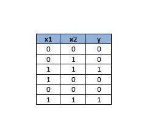

# 利用深度学习和 Python 进行股市预测

> 原文：<https://medium.com/analytics-vidhya/stock-market-prediction-using-python-article-4-the-next-recession-923185a2736f?source=collection_archive---------5----------------------->

## 第四条:预测印度经济下一次可能的衰退


**衰退**

著名电视剧《权力的游戏》的整个剧本围绕着冬天的到来展开。从第一季到第七季，那里的角色不断地为冬天做准备。最后，冬天在最后一季来临了，而且只持续了那一季的几集。这让包括我在内的很多 GOT 粉丝很失望。我们想在接下来的几个赛季中享受这种娱乐，因此希望有一个完整的冬季。然而，这是一场戏剧，但事实上，如果我们不得不面对它，我们也会祈祷最短的冬季。

维斯特洛的冬天给我们上了重要的一课，不管冬天有多短，但它总是毁灭性的。冬天让所有像夜王、疯皇后这样的怪物登场。临冬城被摧毁，君临被烧成灰烬，数百万人死去。然而，最终它带来了新的王国和新的希望。这部剧与经济世界有很多相似之处。

经济衰退正在向我们所有人袭来，这一次**是真的了。你是想坐以待毙，等待它的到来，还是做好准备迎接它的到来。决定权在你。是的，还剩下一些时间。**

在早期，只有经济学家和专家预测经济衰退。而我们这些普通人，是在它到来之后才知道它的。只有在失业和投资股票赔钱之后，我们才会相信它。我们听过一位印度储备银行前行长的故事，他在 2005 年写的论文中预测了 2008 年的经济衰退。我们还可以看到许多经济学家在互联网上吹嘘他们是第一个预测下一次衰退的人。恕我直言，他们的知识和能力，现在时代已经变了，我们普通人在机器学习算法的帮助下也可以预测下一次衰退！！我们现在就去看看！！

在前三篇文章中，我们尝试了各种回归技术和时间序列预测算法，如来自脸书的先知。然而，我们意识到股票市场问题太复杂了，无法用所有这些技术来解决。因此，在这篇文章中，我们正在探索神经网络，看看它是否可以做现实的预测。

神经网络是神经元的网络或回路，或者现代意义上的人工神经网络，由人工神经元或节点组成。因此，神经网络或者是由真实生物神经元组成的生物神经网络，或者是用于解决人工智能(AI)问题的人工神经网络。

与冯·诺依曼模型计算不同，人工神经网络没有将记忆和处理分开，而是通过网络连接的信号流进行操作，有点类似于生物网络。

这些人工网络可用于预测建模、自适应控制和可通过数据集训练的应用。从经验中产生的自我学习可以发生在网络中，网络可以从一组复杂且看似不相关的信息中得出结论。

让我们试着用一个逻辑与门来理解一个神经元、一个神经网络和一个神经网络计算算法。下图是一个逻辑神经元的表示。它有两个输入 x1 和 x2，接受二进制值，即 0 或 1。神经元有一个偏置节点+1。假设我们的目标函数是 y = x1 和 x2。


人工神经元

在这个只有一个神经元的神经网络中。我们的假设函数是 hɵ (x) = g ( w1 * 1+ w2 * x1 + w3 * x2)。这里 g(x)是一个 sigmoid 函数，如果 x 为正，则产生 1，如果 x 为负，则产生 0。在 C 语言中这可以写成“int g(x) { return (x > 0？1 : 0);}"

在计算开始时，我们需要准备好神经网络的设计，我们还需要一个预定义的假设函数，它通常是输入值和与之相关的权重的乘积的总和。最初，权重 w1、w2 和 w3 是未知数。

下一步，我们通过输入样本数据来训练神经网络。在我们的例子中，为了训练它像与门一样工作，我们将向它提供以下数据。



神经元样本数据

现在，神经网络计算算法的工作是找出权重 w1、w2 和 w3 的适当值，使得假设函数将产生期望的输出。在我们的例子中，它应该表现得像一个与门。分析输入数据后，算法可能得出 w1 = -3、w2 = 2 和 w3 = 2 的值。现在，假设函数变成了 hɵ (x) = g ( -3 + 2 * x1 + 2 * x2)。

现在，让我们看看这个小小的单神经元网络将计算什么。让我们看看 x1 和 x2 的四个可能的输入值，并看看假设在这种情况下会输出什么。如果 x1 和 x2 都等于 0，那么 hɵ (x) = g (-3 + 2 * 0 + 2 * 0) = g (-3)，g(-3)将产生 0。如果 x1 或 x2 中的任何一个等于 0，那么 hɵ (x) = g(-1)，g(-1)将产生 0。当 x1 和 x2 都等于 1 时，假设将是 hɵ (x) = g (-3 + 2 * 1 + 2 * 1) = g(1)，g(1)将产生 1。如果您查看下图中的输出 hɵ (x)列，您会发现这正是逻辑 AND 函数的行为。


这里，我们通过使用一个小的神经网络而不是使用一个实际的与门来构建计算机中的一个基本操作。神经网络也可以用来模拟所有其他的逻辑门。同一个神经元可以被训练得像逻辑“或”门一样。在这种情况下，计算的权重可以是 w1 = -1，w2 = 2，w3 = 2。假设将是 hɵ (x) = g ( -1 + 2 * x1 + 2 * x2)。如果你为这个新的假设函数写一个真值表，你会发现它就像一个逻辑或门。

现在，让我们回到我们的股市预测之谜。在本练习中，我们将探索一种叫做“LSTM”的神经网络算法。长短期记忆(LSTM)是一种用于深度学习领域的人工递归神经网络(RNN)架构。与标准的前馈神经网络不同，LSTM 有反馈连接，这使它成为一台“通用计算机”(也就是说，它可以计算图灵机可以计算的任何东西)。

普通的 LSTM 单元由一个单元、一个输入门、一个输出门和一个遗忘门组成。细胞在任意的时间间隔内记忆数值，三个门调节进出细胞的信息流。

LSTM 网络非常适合基于时间序列数据进行分类、处理和预测，因为时间序列中的重要事件之间可能存在未知持续时间的滞后。

与之前尝试的时间序列预测算法不同，我们将股票市场数据直接输入到算法中，在这种情况下，对于 LSTM，我们需要对股票市场数据进行一些预处理。输入数据集成为 LSTM 的预测边界。在进行预测时，它无法得出输入数据集之外的数字。例如，如果输入数据集中的最小值为 600 点，最大值为 39000 点，则未来预测值将仅在 600 到 39000 点的范围内。如果我们做未来十年的预测，那么这将永远不会发生，因为从长期来看，股票市场总是上涨的。因此，我们必须将股票市场数据转换为相对于之前收盘价的相对增减百分比的形式。通过这样做，我们消除了范围边界。因为我们现在在玩相关数据，实际上我们没有任何边界。现在，LSTM 可以使用相对百分比数据进行真正的预测。让我们借助下面的例子来理解这一点。

表 A 显示了股票市场数据集。表 B 是表 a 的转换版本。


样本股票市场数据集

对于第一个项目 1-1 月，由于我们没有任何以前的值进行比较，因此相对百分比变化为 0%。对于 1 月 2 日，当前收盘价为 102 点，之前的收盘价为 100 点，因此相对百分比变化为+2%。对于 1 月 4 日，当前收盘价为 103 点，先前收盘价为 105 点，因此相对百分比变化为-1.93%。同样，我们也计算了所有其他条目的值。

现在，让我们在真实数据上尝试这个神经网络解决方案。我们可以从 https://www.bseindia.com/indices/IndexArchiveData.html 下载。我已经下载了从 1989 年到现在的数据。下载的数据表共有五列；日期，开盘价，最高价，最低价和收盘价。为简单起见，我们从数据表中删除三列开盘价、最高价和最低价，只保留日期和收盘列。

以下是完整的 python 代码。代码被足够注释来解释这个问题的每一个方面。将它复制粘贴到 python IDE 上，并运行它以图形格式查看预测。

```
#importing required libraries
import numpy as np
import pandas as pd
from sklearn.model_selection import train_test_split
from keras.models import Sequential
from keras.layers import Dense, Dropout, LSTM
#to plot within notebook
import matplotlib.pyplot as plt

# function to calculate percentage difference considering baseValue as 100%
def percentageChange(baseValue, currentValue):
    return((float(currentValue)-baseValue) / abs(baseValue)) *100.00

# function to get the actual value using baseValue and percentage
def reversePercentageChange(baseValue, percentage):
    return float(baseValue) + float(baseValue * percentage / 100.00)

# function to transform a list of values into the list of percentages. For calculating percentages for each element in the list
# the base is always the previous element in the list.
def transformToPercentageChange(x):
    baseValue = x[0]
    x[0] = 0
    for i in range(1,len(x)):
        pChange = percentageChange(baseValue,x[i])
        baseValue = x[i]
        x[i] = pChange

# function to transform a list of percentages to the list of actual values. For calculating actual values for each element in the list
# the base is always the previous calculated element in the list.
def reverseTransformToPercentageChange(baseValue, x):
    x_transform = []
    for i in range(0,len(x)):
        value = reversePercentageChange(baseValue,x[i])
        baseValue = value
        x_transform.append(value)
    return x_transform

#read the data file
df = pd.read_csv('D:\\python3\\data\\SensexHistoricalData.csv')
# store the first element in the series as the base value for future use.
baseValue = df['Close'][0]

# create a new dataframe which is then transformed into relative percentages
data ​= df.sort_index(ascending=True, axis=0)
new_data = pd.DataFrame(index=range(0,len(df)),columns=['Date', 'Close'])
for i in range(0,len(data)):
    new_data['Date'][i] = data['Date'][i]
    new_data['Close'][i] = data['Close'][i]

# transform the 'Close' series into relative percentages
transformToPercentageChange(new_data['Close'])

# set Dat column as the index
new_data.index = new_data.Date
new_data.drop('Date', axis=1, inplace=True)

# create train and test sets
dataset = new_data.values
train, valid = train_test_split(dataset, train_size=0.99, test_size=0.01, shuffle=False)

# convert dataset into x_train and y_train.
# prediction_window_size is the size of days windows which will be considered for predicting a future value.
prediction_window_size = 60
x_train, y_train = [], []
for i in range(prediction_window_size,len(train)):
    x_train.append(dataset[i-prediction_window_size:i,0])
    y_train.append(dataset[i,0])
x_train, y_train = np.array(x_train), np.array(y_train)
x_train = np.reshape(x_train, (x_train.shape[0],x_train.shape[1],1))

##################################################################################################
# create and fit the LSTM network
# Initialising the RNN
model = Sequential()
# Adding the first LSTM layer and some Dropout regularisation
model.add(LSTM(units = 50, return_sequences = True, input_shape = (x_train.shape[1], 1)))
model.add(Dropout(0.2))

# Adding a second LSTM layer and some Dropout regularisation
model.add(LSTM(units = 50, return_sequences = True))
model.add(Dropout(0.2))

# Adding a third LSTM layer and some Dropout regularisation
model.add(LSTM(units = 50, return_sequences = True))
model.add(Dropout(0.2))

# Adding a fourth LSTM layer and some Dropout regularisation
model.add(LSTM(units = 50))
model.add(Dropout(0.2))

# Adding the output layer
model.add(Dense(units = 1))
# Compiling the RNN
model.compile(optimizer = 'adam', loss = 'mean_squared_error')

# Fitting the RNN to the Training set
model.fit(x_train, y_train, epochs = 100, batch_size = 32)

##################################################################################################

#predicting future values, using past 60 from the train data
# for next 10 yrs total_prediction_days is set to 3650 days
total_prediction_days = 3650
inputs = new_data[-total_prediction_days:].values
inputs = inputs.reshape(-1,1)

# create future predict list which is a two dimensional list of values.
# the first dimension is the total number of future days
# the second dimension is the list of values of prediction_window_size size
X_predict = []
for i in range(prediction_window_size,inputs.shape[0]):
    X_predict.append(inputs[i-prediction_window_size:i,0])
X_predict = np.array(X_predict)

# predict the future
X_predict = np.reshape(X_predict, (X_predict.shape[0],X_predict.shape[1],1))
future_closing_price = model.predict(X_predict)

train, valid = train_test_split(new_data, train_size=0.99, test_size=0.01, shuffle=False)
date_index = pd.to_datetime(train.index)

#converting dates into number of days as dates cannot be passed directly to any regression model
x_days = (date_index - pd.to_datetime('1970-01-01')).days

# we are doing prediction for next 5 years hence prediction_for_days is set to 1500 days.
prediction_for_days = 1500
future_closing_price = future_closing_price[:prediction_for_days]

# create a data index for future dates
x_predict_future_dates = np.asarray(pd.RangeIndex(start=x_days[-1] + 1, stop=x_days[-1] + 1 + (len(future_closing_price))))
future_date_index = pd.to_datetime(x_predict_future_dates, origin='1970-01-01', unit='D')

# transform a list of relative percentages to the actual values
train_transform = reverseTransformToPercentageChange(baseValue, train['Close'])

# for future dates the base value the the value of last element from the training set.
baseValue = train_transform[-1]
valid_transform = reverseTransformToPercentageChange(baseValue, valid['Close'])
future_closing_price_transform = reverseTransformToPercentageChange(baseValue, future_closing_price)

# recession peak date is the date on which the index is at the bottom most position.
recessionPeakDate =  future_date_index[future_closing_price_transform.index(min(future_closing_price_transform))]
minCloseInFuture = min(future_closing_price_transform);
print("The stock market will reach to its lowest bottom on", recessionPeakDate)
print("The lowest index the stock market will fall to is ", minCloseInFuture)

# plot the graphs
plt.figure(figsize=(16,8))
df_x = pd.to_datetime(new_data.index)
plt.plot(date_index,train_transform, label='Close Price History')
plt.plot(future_date_index,future_closing_price_transform, label='Predicted Close')

# set the title of the graph
plt.suptitle('Stock Market Predictions', fontsize=16)

# set the title of the graph window
fig = plt.gcf()
fig.canvas.set_window_title('Stock Market Predictions')

#display the legends
plt.legend()

#display the graph
plt.show()
```


衰退图

**如何解读上面的图像？**

图表的 x 轴显示了从 1989 年到 2025 年的日期，Y 轴显示了市场收盘价。

蓝色图表显示了从 1989 年到 2019 年的收盘价历史。橙色的图表代表从 2019 年到 2025 年的未来预测。

**有哪些预言？**

1.股市将跌至的最低指数是**17574**。

2.在 2020 年 12 月 18 日，股票市场将到达最低点。

3.从 2020 年第二季度开始，经济将陷入衰退。

4.股市还需要五年时间才能从衰退中复苏。

5.忘掉股票市场的回报吧，只需担心如何保护你的投资！！

**预测图分析:**

看了这些预测后，我现在既高兴又担心。我很高兴，因为我们可以找到一种使用最大似然算法来预测衰退的技术。我很担心，因为我们真的将不得不面对这种可怕的现象。

与早期使用各种回归技术进行的预测不同，使用 LSTM 算法进行的预测似乎是真实的。橙色的预测图与蓝色的真实生活图一样动态。现在，我们已经通过识别一个正确的算法破解了股票市场预测之谜中最困难的部分。下一个挑战是对其进行微调，以获得更准确的预测。

所有这些预测都是用时间这一维度来完成的。正如智者所说，时间能解答所有的疑问。在这里，我们用时间来预测下一次衰退的到来。但是让我们把哲学放在一边，回到现实中来。现实情况是，包括时间在内的许多因素影响着股市行为。我们绝不能忽视它们。上述预测可能不准确，日期可能不同，但底线不会改变。底线是衰退即将到来。

世界在 80 年代、90 年代和 21 世纪初创造了最多的财富，然后是我们这一代人，他们在 2010 年开始挣钱。我们都知道股票市场在过去十年中的暗淡表现，我们所有的预测都向我们展示了一幅暗淡的前景。我们这一代被诅咒了！！我们已经开始在长期经济周期的低谷中赚钱。让我们承认，我们现在不能利用股票市场创造财富。我们应该找到一些其他的方法。可能是闪亮的东西，闪光的东西可能会让我们变得富有。也许我们拥有的股票需要点石成金才能让我们变得富有。是的，点金术。但是记住点金术是对强大的迈达斯国王的诅咒。然而，它能成为我们的福音吗？让我们在下一篇文章《点金术》中找出那个诅咒。直到那时快乐的预言…..

**参考文献:**

https://en.wikipedia.org/wiki/Neural_network

【https://en.wikipedia.org/wiki/Long_short-term_memory 