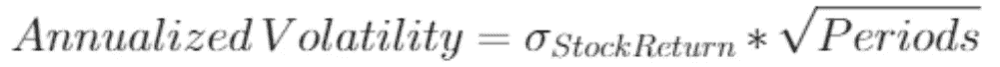
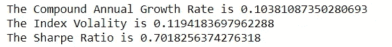

# 用 Python 实现股票投资组合自动化

> 原文：<https://medium.com/analytics-vidhya/stock-portfolio-automatization-with-python-b0aa5a3731ab?source=collection_archive---------3----------------------->

约书亚·阿拉贡在 [Unsplash](https://unsplash.com?utm_source=medium&utm_medium=referral) 上拍摄的照片

T 使用股票投资组合是分散风险的最佳方式之一，这是通过使用不同类型的股票来最大限度地降低投资单一行业或国家的潜在风险来实现的。同样，这需要不断审查投资组合中股票的回报和波动性，以获得比股票市场指数更好的回报。

这就是在自动化投资策略和回溯测试的环境中使用 Python 或 R 等编程语言非常有用的地方。为了验证前面的观点，我将使用 Python 测试一个简单的投资策略，并自动化一个高效的投资组合，其中包含的所有股票都是在股票市场指数中获得最佳回报的股票。

> **获得 DJI 指数上市公司**

首先，我们将对维基百科页面进行网络抓取，在那里可以找到道琼斯工业平均指数(DJI 指数)中所列公司的所有报价机，有了这些报价机列表，我们就可以下载股票价格的历史信息。

现在我们有了 DJI 指数中列出的 30 只股票，我们可以下载它们价格的历史信息。

> **创建功能以测试策略**

在继续应用一般策略之前，我们需要创建一些函数来分析该策略有多好。在这种情况下，我们将使用 4 种方法来帮助我们验证投资组合的表现。

**1。-波动函数**

因为我们不会考虑投资组合中股票的权重，我们会把波动率当作单只股票来考虑，但会考虑投资组合的表现。该函数将由下式给出:

**2。-年复合增长率(CAGR)**

复合年增长率允许我们看到一项资产或投资组合的年度表现，以从其初始价值获得其当前市场价值。CAGR 假设投资组合获得的收益在每年年底进行再投资，并允许不同策略之间的简单比较。该函数由下式给出:

其中 N 是自购买股票以来已经过去的年数。

**3。-夏普比率**

夏普比率允许我们分析投资组合中每个风险单位的回报。另一方面，无风险利率用于隔离与投资相关的回报。我们可以使用上面提到的两种方法来计算投资组合的表现和波动性。函数公式由下式给出:

> **获取历史价格数据**

既然我们已经从 DJI 指数中获得了必要的报价器，我们就可以开始下载指数中每家公司的历史信息，并计算它们的回报。该数据库将是从 2015 年 1 月 1 日到 2020 年 1 月 1 日的每周价格。

> **投资组合策略**

首先，我们需要考虑有多少 X 股票将构成投资组合，以及每周我们想从投资组合中移除多少 Y 股票。第二，我们将每周审查收益最高的 X 只最佳股票，我们将看到投资组合中 Y 只最差的股票，然后我们将从投资组合中剔除 Y 只股票，并用 DJI 指数中的 X 只最佳股票取而代之，这一过程将每周重复一次。

> **策略 vs DJI 指数**

现在我们有了投资组合的策略，我们将使用上面提到的函数来分析它的性能。值得一提的是，在无风险利率的情况下，我认为 3 个月期国库券利率约为 2%。

为了便于比较，我们将使用 DJI 指数的收益来观察它在同一时期的波动性和表现。

对投资组合策略和 DJI 指数进行测试的结果表明，尽管投资组合的波动性较高，但所用策略中的 CAGR 和夏普比率较高。最后，我们将绘制 DJI 指数的表现与投资组合表现的图表，以便更好地了解两者。

该图显示，虽然在第一个 100 周，两者的回报看起来很接近，但从长期来看，该投资策略设法获得比指数更好的回报。

> **结论**

*   投资策略，尽管不使用技术指标，但能让我们获得比基准指数更好的回报。
*   回溯测试可以证实策略的好处，并将其扩展为未来的投资策略。
*   我们可以使用每日回报和有效边界理论来扩展之前描述的策略，以找到投资组合中最大化夏普比率的每只股票的权重。