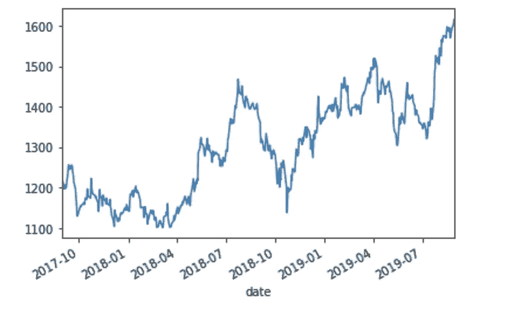
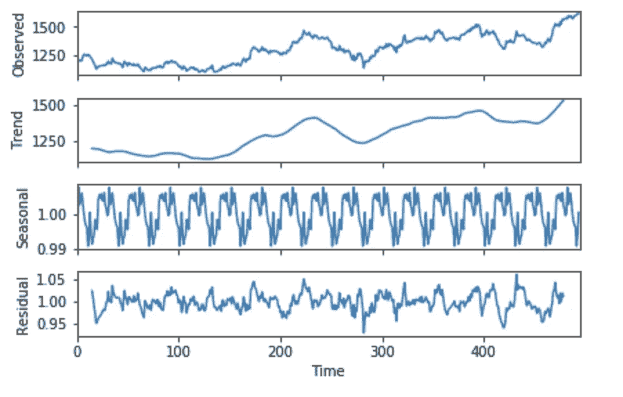
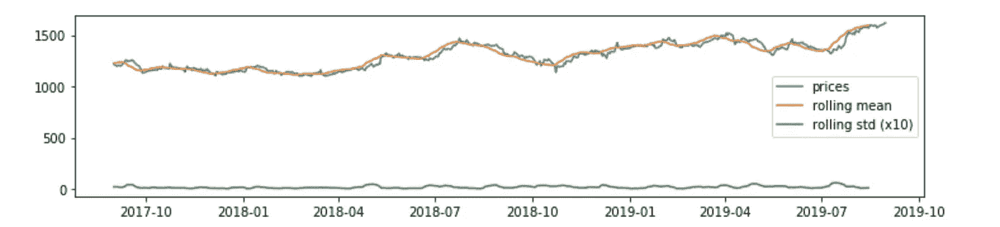
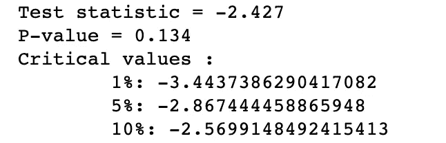
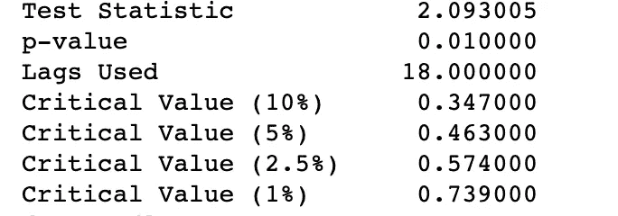
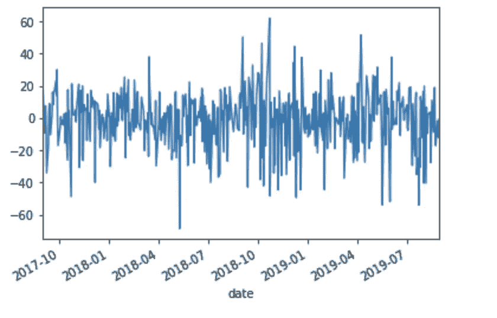
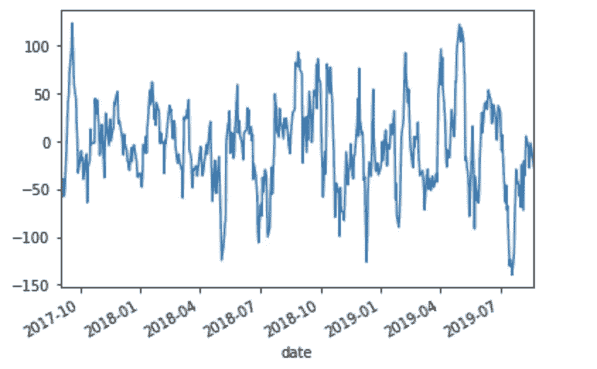
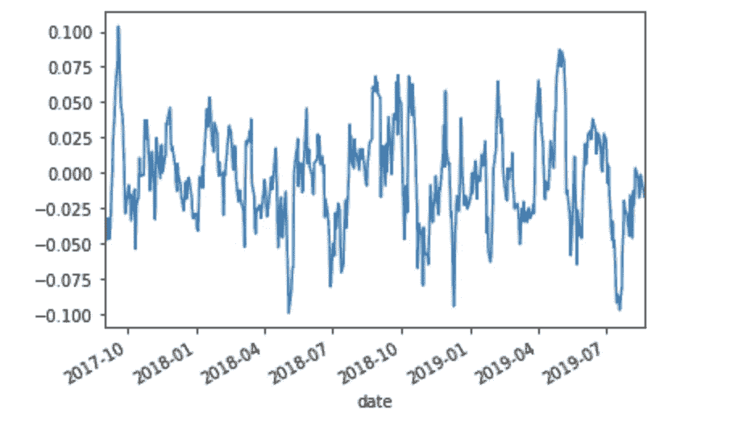

# 股票价格预测

> 原文：<https://medium.com/analytics-vidhya/stock-price-forecasting-i-analysing-time-series-e7157563cbce?source=collection_archive---------6----------------------->

## 第 1 部分—创建时间序列模型并进行分析

股票价格行为是随机模型的经典例子。虽然足够随机，但如果你幸运的话，你可以非常准确地预测股票价格——这就是市场的基本运作方式。

然而，在我们深入研究预测之前，我们首先需要了解给定股票的价格在现实中的表现，并尽可能多地找出它所依赖的因素。

下面是一个大约两年的股票价格时间序列的例子:

一、股价价值

绝对不是一个简单的曲线拟合的情节。让我们看看如何使它变得更容易。

任何时间序列都由以下部分组成:

*   **趋势**:随时间增加或减少的*系统性*成分。
*   **季节性**:随着时间重复的*系统性*成分。
*   **噪音**:数据中的*非系统性*成分。

我们可以将任何时间序列曲线建模为基于上述成分的加法或乘法模型。

加法模型→ y(t) =趋势+季节性+噪声

乘法模型→ y(t) =趋势*季节性*噪声

鉴于噪声存在于所有现实生活中的时间序列，让我们看看如何分解一个时间序列，以检查其他两个可选组件的存在。

## 但是，如何在加法模型和乘法模型之间做出决定呢？

*   当季节性模式随着数据值的增加或减少而增加或减少时，最好选择乘法模型。
*   当季节性模式随着数据值的增加或减少而大致保持不变时，加法模型更好。
*   然而，有时数据模式并不明显，我们尝试两者并选择更准确的一个。

下面是我用来将时间序列分解成其组成部分的代码片段:

*我们选择乘法分解，因为上图中序列的季节性随着时间的推移而增加。*

分解上述时间序列后

我们可以清楚地看到，该系列似乎受到了上升趋势的严重影响。除此之外，似乎没有适当的季节性，残差(代表噪声)似乎随着时间的增加而变化更多。

# 平稳性分析:

如果一个时间序列的统计量如均值、方差等是平稳的，则称之为平稳的。保持不变。对平稳序列进行预测很容易，因为您可以根据恒定的统计测量值对期望值制定更高的概率。

以下是平稳性检测的一些经典测试的结果:

*   **滚动平均值:**

这张图再次向我们暗示了上升的趋势，然而变化似乎在一个恒定的范围内。

*   **ADF 测试结果:**

增强的 Dicky Fuller 检验检查数列中单位根的存在。时间序列中的单位根意味着该序列的**均值**可能是*常数*，但其**方差**保持*变化，没有任何模式*——因此我们无法将曲线拟合到任何方程，或者换句话说，我们有一个很难预测的序列。

*   HO(零假设):*时间序列有单位根。*
*   H1(替代假说):*时间序列是平稳的。*

ADF 测试结果

作为测试统计值< critical value at all confidence intervals, we reject the null hypothesis that the series has a unit root.

*   **的 KPSS 测试结果**:

这

*   HO(零假设):*数据是平稳的。*
*   H1(替代假设):*数据不是平稳的。*

当检验统计量的值>所有置信区间的临界值时，我们拒绝序列是平稳的零假设。

**最终推断:**

*   ADF 测试:拒绝 H0，因此系列是固定的
*   KPSS 检验:拒绝 H0，因此数列不是平稳的
*   由于 KPSS 认为数列不是平稳的，而 ADF 则相反，我们可以应用 ***差分*** 使数列平稳。

## **通过应用差分使时间序列平稳:**

以下是对我们的时间序列数据应用不同差分策略后的结果

**第一个区别:**

**每周季节性差异:**

**日志季节差异:**

由于季节差异图和对数季节差异图没有太大差异，我们将在预测中使用每周季节差异。

对于预测，本教程的第 2 部分—请继续关注！