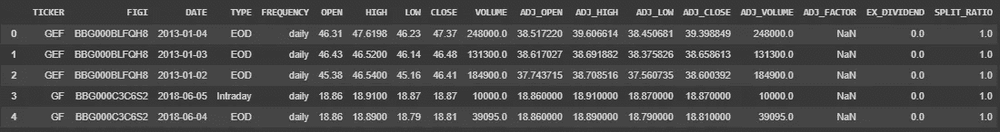
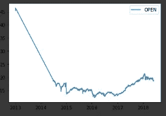
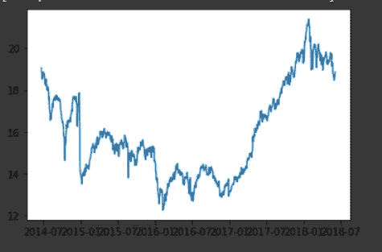
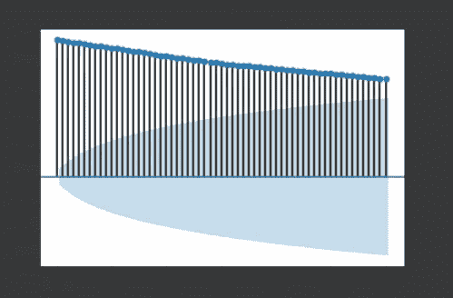
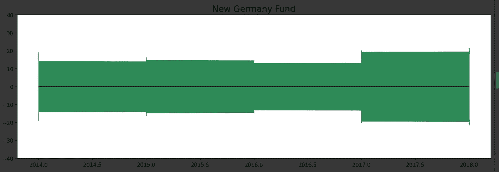
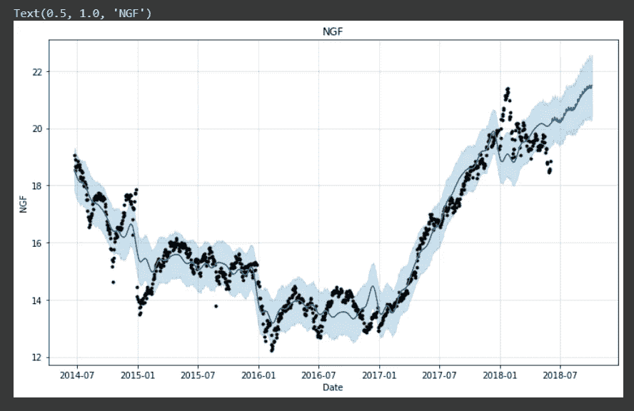
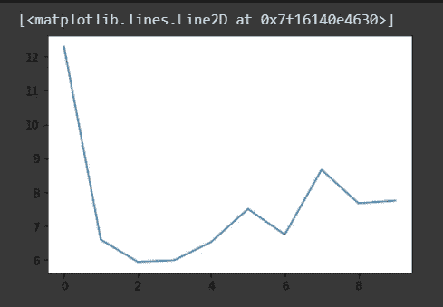

# 股票价格预测:脸书预言家

> 原文：<https://medium.com/analytics-vidhya/stock-price-prediction-facebook-prophet-34c385ff05a9?source=collection_archive---------17----------------------->

预测股票价格是一项困难的任务。几个因素会影响股票的价格，而这在模型中并不总是容易适应的。由于上述原因，目前世界上没有一个模型能够准确预测股票价格，也可能永远不会有。脸书给出了一个“最先进的模型”和“易于使用”和一个广泛的超参数调整选项，以给出较为准确的预测。


# 预处理

如上所述，我们有一个数据集，其中包含新德国基金从 2013 年到 2018 年的股票价格。现在，当我们导入数据并第一次看到它时，我们看到它没有按日期的升序排序，这是一个主要问题，因为预测值更可能取决于最近的条目，而不是之前的条目。



未排序的数据集。

```
stock_prices['DATE'] = pd.to_datetime(stock_prices["DATE"])
stock_prices = stock_prices.sort_values(by="DATE")
```

之后，我们按日期绘制开盘价的值。



图 1

正如你所看到的，从 2013 年到 2014 年，这个数值突然下降，这是非常不寻常的。一个可能的原因是 2013 年的值可能很少。我们使用下面的代码进行检查。

```
stock_prices = stock_prices[stock_prices.Year == 2013]
```

上面的代码产生了一个只有 3 个条目的数据集。我们移除这些值。

```
stock_prices = stock_prices[stock_prices.Year != 2013]
```

数据最终看起来是这样的:



图 2

我们还需要将数据集的索引设置为日期，但是我们不能访问日期，因为它现在是 Dataframe 索引。为了解决这个问题，我们将首先创建日期列的副本。

```
stock_prices[‘date’] = stock_prices[‘DATE’]
stock_prices.set_index("DATE", inplace = True)
```

# 探索性数据分析

自相关让我们了解模型的季节性。如果一定数量的滞后的相关值很高，则该滞后数就是季节性。

值 1 的滞后对应于一天，因为我们数据集中的时间步长是一天。

从下图可以明显看出，滞后接近 0 时，相关性很高。滞后值越大，自相关值似乎越小。这意味着我们的数据没有季节性。



自相关与滞后

我们进一步深入了解了数据的年增长率。2017 年的面积最大，因此增长最快。



增长与年份

# 拟合模型

我们在笔记本中导入脸书先知。

```
from fbprophet import Prophet
```

Prophet 有一个我们需要注意的特定输入格式。它将元数据作为重要列的特定名称的输入。例如，假设你正在预测股票的开盘价。要使用 Prophet，您需要将开盘价列的名称改为“y ”,日期改为“ds”。

```
stock_prices = stock_prices.rename(columns={‘date’: ‘ds’, ‘OPEN’: ‘y’})
```

一旦你完成了这些，你就可以输入数据集来适应模型。

```
m = Prophet()
m.fit(stock_prices)
```

# 预测未来值

对于预测，我们生成要预测其值的未来日期。这是通过以下代码完成的:

```
future = m.make_future_dataframe(periods=5)
```

现在，使用 model.predict()获得一个估计值。

```
forecast = m.predict(future)
```

我们的预测值显示为蓝色，实际值显示为黑色:



# 生成验证数据集

模型的超参数调整是提高模型精度的一个非常关键的步骤。但是要选择合适的超参数，我们需要验证数据。我们利用 Prophet 的内置验证数据集生成器。

```
from fbprophet.diagnostics import cross_validation
cv_results = cross_validation(m , horizon='30 days')
```

为了判断模型的性能，我们选择“平均绝对百分比误差”度量，它给出了模型与实际值的偏差的平均百分比。MAPE 越小，模型越好。MAPE 可以通过以下函数计算:

```
def mspe(y_true , y_pred):
return np.mean(np.abs((np.array(y_true)-np.array(y_pred))/np.array(y_true)))*100
```

# **超参数**

Prophet 可以通过适当调整其超参数来有效地实现，以描述我们的数据。

*   **增长**:快速浏览一下图 2，可以看到一个持续增长的趋势，没有真正的饱和洞察力。因此，*增长*参数被设置为*‘线性’*。如果这一趋势最终似乎饱和，增长将被设定为“逻辑增长”
*   **节假日:**我们认为，像新年、圣诞节这样的节假日对股价没有明显的影响。
*   **变点**:数据的突然变化称为变点。参数*变化点*可用于这些突然变化的日期事先已知的情况。因为我们不是领域专家，所以我们没有为这个参数设置值。
*   **change point _ prior _ scale**:*change point _ prior _ scale*的值越大，变点越倾向于符合数据。因此，较高的值可能会导致过度拟合。在浏览了几个博客后，我们将该值设置为 0.15。



**X 轴:**n _ 变点 **Y 轴:** MSPE

*   **n_changepoints** :该参数等于突然变化的次数，即*变点*出现在数据中。图 2 粗略地显示了数据中的 5 个这样的突变。然而，在从 1 到 10 的迭代中(在初始化常数*change point _ prior _ scale*之后)，值 2 作为 n_changepoints 产生最小的平均绝对误差。
*   **季节性:**由于缺乏股票价格如何波动的知识，我们通过分析图 __ 得出数据缺乏*季节性*

# 模型

设置上述超参数后，最终的模型调用如下所示:

```
df_prophet = fbprophet.Prophet(changepoint_prior_scale=0.15, n_changepoints=2)
```

# 结论

我们得到了 6.075 的最终 MAPE。

我们要感谢以下文章的作者:
1。[端到端时间序列和建模](https://towardsdatascience.com/end-to-end-time-series-analysis-and-modelling-8c34f09a3014)2。[实施脸书先知高效](https://towardsdatascience.com/implementing-facebook-prophet-efficiently-c241305405a3) ly

该博客由奈蒂克·汉德尔瓦尔和尼基塔·萨克塞纳撰写和编辑。Github 代码:[尼基塔](https://github.com/nikita-0209/stock_price_detection/blob/master/Prophet_Stock_Prediction.ipynb)，[奈蒂克](https://github.com/Naitik1502/Stock_Prediction_Using_Prophet/blob/master/Stock_prices.ipynb)